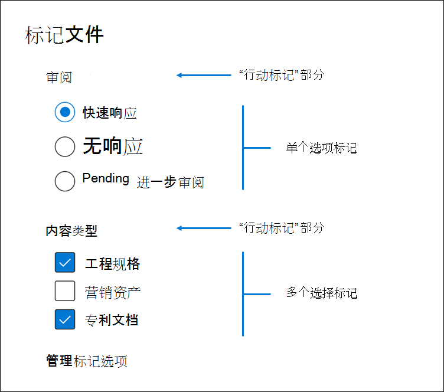
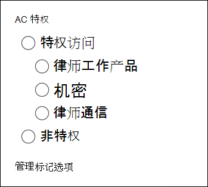

# 标记审阅集中的文档Tag documents in a review set

在查看集中组织内容对于在电子数据展示过程中完成各种工作流非常重要。Organizing content in a review set is important to complete various workflows in the eDiscovery process. 具体包括：This includes:

- 剔除不必要的内容Culling unnecessary content

- 标识相关内容Identifying relevant content
 
- 确定必须由专家或律师审阅的内容Identifying content that must be reviewed by an expert or an attorney

当专家、律师或其他用户查看审阅集中的内容时，可以使用标记来捕获与内容相关的观点。When experts, attorneys, or other users review content in a review set, their opinions related to the content can be captured by using tags. 例如，如果意图挑选不必要的内容，则用户可以使用标记（如 "无响应"）标记文档。For example, if the intent is to cull unnecessary content, a user can tag documents with a tag such as "non-responsive". 在审阅并标记内容之后，可以创建审阅集搜索，以排除任何标记为 "无响应" 的内容，这将消除电子数据展示工作流中的后续步骤中的内容。After content has been reviewed and tagged, a review set search can be created to exclude any content tagged as "non-responsive", which eliminates this content from the next steps in the eDiscovery workflow. 可以为每种情况自定义标签面板，以便标记可以支持预期的审阅工作流。The tag panel can be customized for every case so that the tags can support the intended review workflow.

## 标记类型Tag types

高级电子数据展示提供了两种类型的标记：Advanced eDiscovery provides two types of tags:

- **单个选择标记**-限制用户在组中选择一个标记。**Single choice tags** - Restricts users to select a single tag within a group. 这有助于确保用户不选择相互冲突的标记，如 "响应式" 和 "无响应"。This can be useful to ensure users don't select conflicting tags such as "responsive" and "non-responsive". 这些按钮将显示为单选按钮。These will appear as radio buttons.

- **多选项标记**-允许用户选择组中的多个标记。**Multiple choice tags** - Allow users to select multiple tags within a group. 这些将显示为复选框。These will appear as checkboxes.

## 标记结构Tag structure

除了标记类型之外，标记面板中的标记组织方式的结构可用于使标签文档更加直观。In addition to the tag types, the structure of how tags are organized in the tag panel can be used to make tagging documents more intuitive. 标记按节分组。Tags are grouped by sections. 查看 "设置搜索支持按标记和按标记搜索" 部分的功能。Review set search supports the ability to search by tag and by tag section. 这意味着您可以创建审阅集搜索，以检索标记为某一节中的任何标记的文档。This means you can create a review set search to retrieve documents tagged with any tag in a section.

可以通过在节中嵌套标记来进一步对标记进行组织。Tags can be further organized by nesting them within a section. 例如，如果目的是标识和标记特权内容，则可以使用嵌套来清楚地表明用户可以将文档标记为 "特权"，并通过检查适当的嵌套标记来选择特权类型。For example, if the intent is to identify and tag privileged content, nesting can be used to make it clear that a user can tag a document as "Privileged" and select the type of privilege by checking the appropriate nested tag.

## 应用标记Applying tags

有几种方法可将标记应用于内容。There are several ways to apply a tag to content.

### 为单个文档添加标签Tagging a single document

在审阅集中查看文档时，可以通过单击 **"添加标签" 面板**显示审阅可使用的标签。When viewing a document in a review set, you can display the tags that a review can use by clicking **Tagging panel**.

这将使您能够对显示在查看器中的文档应用标记。This will enable you to apply tags to the document displayed in the viewer.

### 批量标记Bulk tagging

可以通过在 "结果" 网格中选择多个文件，然后在 "**标记" 面板**中使用类似于单个文档的标记，来完成批量标记。Bulk tagging can be done by selecting multiple files in the results grid and then using the tags in the **Tagging panel** similar to tagging single documents. 可以通过选择两次标记来完成批量取消标记操作;第一次单击将应用标记，第二个选择将确保清除所有选定文件的标记。Bulk un-tagging can be done by selecting tags twice; the first click will apply the tag, and the second selection will ensure that tag is cleared for all selected files.

> [!NOTE]
> 批量标记时，加标签面板将显示为面板中的每个标记标记的文件数。When bulk tagging, the tagging panel will display a count of files that are tagged for each tag in the panel.

### 在其他审阅面板中进行标记Tagging in other review panels

审阅文档时，可以使用其他审阅面板查看 "结果" 网格中文档的其他特征。When reviewing documents, you can use the other review panels to review other characteristics of documents in the results grid. 这包括查看其他相关文档、电子邮件线索、临近重复项和哈希重复项。This includes reviewing other related documents, email threads, near duplicates, and hash duplicates. 例如，当您查看相关文档时（通过使用 "**文档系列**" 审阅面板），您可以通过批量标记相关文档显著减少审阅时间。For example, when you're reviewing related documents (by using the **Document family** review panel), you can significantly reduce review time by bulk tagging related documents. 例如，如果电子邮件中有多个附件，并且您希望确保整个系列的标签一致。For example, if an email message has several attachments and you want to ensure that the entire family is tagged consistently.

例如，下面介绍了如何在使用**文档系列**审阅面板时显示 "**标记" 面板**：For example, here's how to display the **Tagging panel** when using the **Document family** review panel:

1. 对所选文档打开 "审阅" 面板（例如，在 "**文档系列**" 审阅面板中显示相关内容列表时，请单击 "文档系列" 审阅面板下的 "**标记文档**"。With the review panel open for a selected document (for example, displaying the list of related content in the **Document family** review panel, click **Tag documents** under the document family review panel.

   "标记" 面板显示为弹出窗口。The tagging panel is displayed as a pop-up window.

2. 选择一个或多个标记以应用选定的文档。Choose one or more tags to apply the selected document. 

3. 若要标记所有文档，请在 "**文档系列**" 面板中选择 "所有文档"，单击 "**标记文档**"，然后选择要应用于整个文档系列的标记。To tag all documents, select all documents in the **Document family** panel, click **Tag documents**, and then choose the tags to apply to the entire family of documents.

