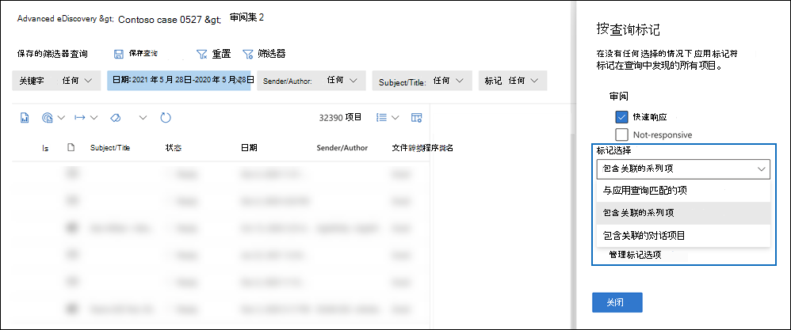

# 标记审阅集内的文档Advanced eDiscovery

组织审阅集内的内容对于完成电子数据展示过程中的各种工作流非常重要。 这包括：

- 剔除不必要的内容

- 确定相关内容

- 确定必须由专家或律师审阅的内容

当专家、律师或其他用户审阅审阅集内容时，可以使用标签来捕获他们有关内容的意见。 例如，如果意图是剔除不必要的内容，用户可以使用标记（如"无响应"）标记文档。 在审阅和标记内容后，可创建审阅集搜索以排除标记为"无响应"的任何内容。 此过程消除了电子数据展示工作流中下一步中无响应的内容。 审阅集内的标签面板可以针对每个案例进行自定义，以便标记支持针对该案例的预定审阅工作流。

> [!NOTE]
> 标记的范围是一个Advanced eDiscovery的情况。 这意味着一个案例只能有一组标记，审阅者可以使用这些标记标记审阅集文档。 不能设置一组不同的标记，以用于同一情况下的不同审阅集。

## 标记类型

Advanced eDiscovery两种类型的标记：

- **单个选项标记**：限制审阅者选择组内的单个标记。 这些类型的标记可用于确保审阅者不会选择冲突标记，如"响应式"和"无响应"。 单个选项标记显示为单选按钮。

- **多个选择标记**：允许审阅选择一个组内的多个标记。 这些类型的标记显示为复选框。

## 标记结构

除了标记类型之外，标记面板中标记组织方式的结构还可用于使标记文档更为直观。 标记按节分组。 审阅集搜索支持按标记和按标记部分搜索。 这意味着您可以创建审阅集搜索来检索用节中的任何标记标记的文档。

您可以通过在节中嵌套标记来进一步组织标记。 例如，如果目的是标识和标记特权内容，可以使用嵌套来明确审阅者可以将文档标记为"Privileged"，并检查相应的嵌套标记来选择特权类型。

## 创建标记

在将标记应用于审阅集内的文档之前，您需要创建一个标记结构。

1. 打开审阅集并导航到命令栏，然后选择"**按查询标记"。**

2. 在标记面板中，选择" **管理标记选项"**

3. 选择 **"添加标记"部分**。

4. 键入标记组标题和可选说明，然后单击"保存 **"。**

5. 选择标记组标题旁边的三点下拉菜单，然后单击添加 **复选框** 或 **添加选项按钮**。

6. 键入复选框或选项按钮的名称和说明。

7. 重复此过程以创建新的标记节、标记选项和复选框。

   

## 应用标记

标记结构就位后，审阅者可以将标记应用于审阅集内的文档。 有两种不同的应用标记的方法：

- 标记文件

- 按查询标记

### 标记文件

无论是选择审阅集的单个项目还是多个项目，都可以单击命令栏中的"标记文件"，将标记应用于其选择。 在标记面板中，可以选择一个标记，该标记将自动应用于所选文档。

> [!NOTE]
> 标记将仅应用于项目列表中的选定项目。

### 按查询标记

通过按查询标记，你可以将标记应用于由当前在审阅集应用的筛选器查询显示的所有项目。

1. 取消选择审阅集内的所有项目，然后转到命令栏，然后选择"**按查询标记"。**

2. 在标记面板中，选择要应用的标签。

3. 在 **"标记选择** "下拉列表下，有三个选项指示要应用标记的项。

   - **与已应用的查询匹配的项**：将标记应用于与筛选器查询条件匹配的特定项目。

   - **包含关联的系列项目**：将标记应用于与筛选器查询条件及其关联的系列项匹配的特定项。 *系列项* 是共享相同 FamilyId 元数据值的项。  

   - **包含关联的对话项目**：将标记应用于与筛选器查询条件匹配的项目及其关联的对话项目。 *会话项目* 是共享相同 ConversationId 元数据值的项。

   

4. 单击 **"开始标记作业** "以触发标记作业。

## 标记筛选器

使用审阅集的标记筛选器，根据项目的标记方法从查询结果中快速查找或排除项目。 

1. 选择 **"筛选器** "展开筛选器面板。

2. 选择并展开 **"项目属性"。**

3. 向下滚动以查找名为 Tag 的 **筛选器**，选中复选框，然后单击"完成 **"。**

4. 若要在查询中包括或排除具有特定标记的项目，请执行下列操作之一：

   - **包含项目**：选择标记值 **，然后选择下拉菜单** 中的"等于任意项"。

      或

   - **排除项目**：选择标记值，然后选择下拉菜单中的" **等于无** "。

     

> [!NOTE]
> 请务必刷新页面，以确保标记筛选器显示标记结构的最新更改。
