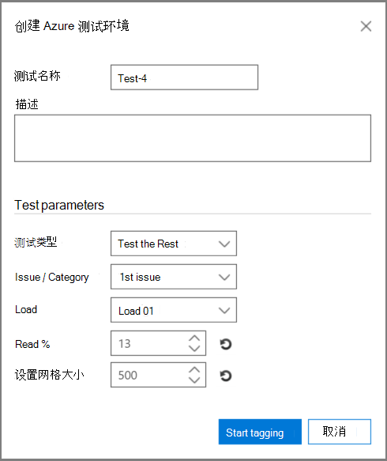

# 在高级电子数据展示和经典电子数据展示 (相关性) 

> [!NOTE]
> 若要使用高级电子数据展示，组织必须订阅随附高级合规性加载项的 Office 365 E3，或订阅 E5。如果没有此计划，但又要试用高级电子数据展示，可以[注册 Office 365 企业版 E5 试用版](https://go.microsoft.com/fwlink/p/?LinkID=698279)。 
  
高级电子数据展示中的"测试"选项卡使您能够测试、比较和验证处理的总体质量。 这些测试在批计算后执行。 通过标记集合中的文件，专家可以最终判断每个标记的文件是否实际与案例相关。 
  
在单一和多问题方案中，通常按问题执行测试。 每次测试后都可以查看结果，并且可以使用指定的示例测试文件对测试结果进行重新修改。
  
## 测试其余部分

例如，"测试 Rest"测试用于验证剔除决策，以便根据最终高级电子数据展示结果仅查看特定相关性截止分数之上的文件。 专家查看选定截止分数下的文件示例，以评估该集合中相关文件的数量。
  
此测试提供审阅集与"测试 Rest"总体之间的统计信息和比较。 审阅集的结果由"培训"期间的相关性计算得出的结果。 结果包括基于设置和输入参数的计算，例如：
  
- 测试示例和标识的相关文件中文件数的示例统计信息。 
    
- 审阅集的 Population 参数和 Rest 的表格比较，例如文件数、相关文件的估计数量、估计的丰富度以及查找其他相关文件的平均成本。 成本参数设置可以由管理员设置。
    
1. 打开 **"相关性测试 \> "** 选项卡。 
    
2. 在"**测试"** 选项卡中，单击 **"新建测试"。** 将显示 **"** 创建测试"对话框，如以下示例所示。 
    
    
  
3. 在 **"测试** 名称"和 **"说明**"中，键入名称和说明。
    
4. 在" **测试类型** "列表中， **选择"测试 Rest"**
    
5. 在 **"问题/类别** "列表中，选择问题名称。 
    
6. 在 **"加载** "列表中，选择负载。 
    
7. 在 **"读取百** 分比"中，接受默认值或选择截止相关性分数的值。 
    
8. 在 **"设置** 大小"中，或接受默认值。 请注意，还原图标将还原默认值。
    
9. 单击 **"开始"标记**。 将生成一个测试示例。
    
10. 查看并标记"相关性标记"选项卡中的 **\>** 每个文件，完成后，单击"**计算"。**
    
11. 在"测试"选项卡中，可以单击 **"查看结果** "以查看测试结果。 下图中显示了一个示例。 
    
    
  
在上图中，表的 **"示例** 参数"部分包含有关专家标记的示例中的文件数以及该示例中找到的相关文件数的详细信息。 
  
表的"填充参数"部分包含测试结果，包括分数低于选定截止时间的文件的审阅集总体和得分高于选定截止时间的文件的"Rest"总体。 对于每个总体，将显示以下结果： 
  
- 包含具有读取百分比 - 已说明的截止文件
    
- 文件总数 
    
- 相关文件的估计数量 
    
- 估计的丰富度 
    
- 查找其他相关文件的平均审阅成本
    
## 测试切片

"测试切片"测试执行的测试与"测试 Rest"测试类似，但与相关性读取 %指定的文件集的段类似。
  
1. 打开 **"相关性测试 \> "** 选项卡。 
    
2. 在"**测试"** 选项卡中，单击 **"新建测试"。** 将显示 **"创建** 测试"对话框。 
    
3. 在 **"测试** 名称和 **说明"中**，键入信息。
    
4. 在"**测试类型**"列表中，选择 **"测试切片"。**
    
5. 在 **"问题** "列表中，选择问题名称。 
    
6. 在 **"加载** "列表中，选择负载。 
    
7. 在 **"读取百分比"中**，接受默认的低范围和高范围值或选择截止相关性分数的值。 
    
8. 在 **"设置** 大小"中，选择一个值或接受默认值。
    
    还原图标将还原默认值。
    
9. 单击 **"开始"标记**。 将生成一个测试示例。
    
10. 查看并标记"相关性标记"选项卡中的 **\>** 每个文件，完成后，单击"**计算"。** 
    
11. 在"测试"选项卡中，可以单击 **"查看结果** "以查看测试结果。 
