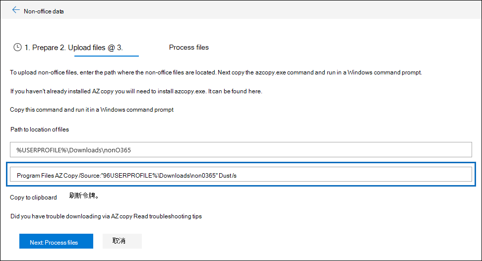

# AzCopy in Advanced eDiscovery

在 Advanced eDiscovery 中加载非 Microsoft 365 数据或文档进行错误修正时，用户界面会提供 Azure AzCopy 命令，该命令包含参数，其中包含要上载的文件的存储位置和文件将上载到的 Azure 存储位置的参数。 若要上载文档，请复制此命令，然后在本地计算机的命令提示符中运行它。  以下屏幕截图显示了 AzCopy 命令的示例：

通常，所提供的命令在运行时有效。 但是，在某些情况下，显示的命令可能无法成功运行。 以下是一些可能的原因。

## 本地计算机上未安装受支持的 AzCopy 版本

此时，必须使用 AzCopy v8.1 在 Advanced eDiscovery 中加载Microsoft 365数据。 如果未使用 AzCopy v8.1，则显示在上一屏幕截图中显示的 Upload 文件页上的 AzCopy 命令将返回错误。  若要安装此版本，请参阅使用[AzCopy v8.1](/previous-versions/azure/storage/storage-use-azcopy)传输Windows。

## AzCopy 未安装在本地计算机上，或者未安装在默认位置

如果未安装 AzCopy 或安装在默认安装位置 (（) ）的位置，则运行 AzCopy 命令时可能会收到以下 `%ProgramFiles(x86)%` 错误：

> 系统找不到指定的路径。

如果本地计算机上未安装 AzCopy，可以在使用[AzCopy v8.1](/previous-versions/azure/storage/storage-use-azcopy)传输数据中Windows。 请务必将其安装在默认位置。

如果安装了 AzCopy，但它安装在不同于默认位置的位置，您可以复制该命令，将其粘贴到文本文件，然后将路径更改为安装 AzCopy 的位置。 例如，如果 Azcopy 位于 中，您可以将命令的第一部分 `%ProgramFiles%` 从 更改为 `%ProgramFiles(x86)%\Microsoft SDKs\Azure\AzCopy.exe` `%ProgramFiles%\Microsoft SDKs\Azure\AzCopy` 。 进行此更改后，从文本文件复制它，然后运行命令提示符。

> [!TIP]
> 如果 AzCopy 安装在默认安装位置的其他位置，请考虑卸载它，然后在默认位置重新安装它。 这将帮助在将来避免此问题。