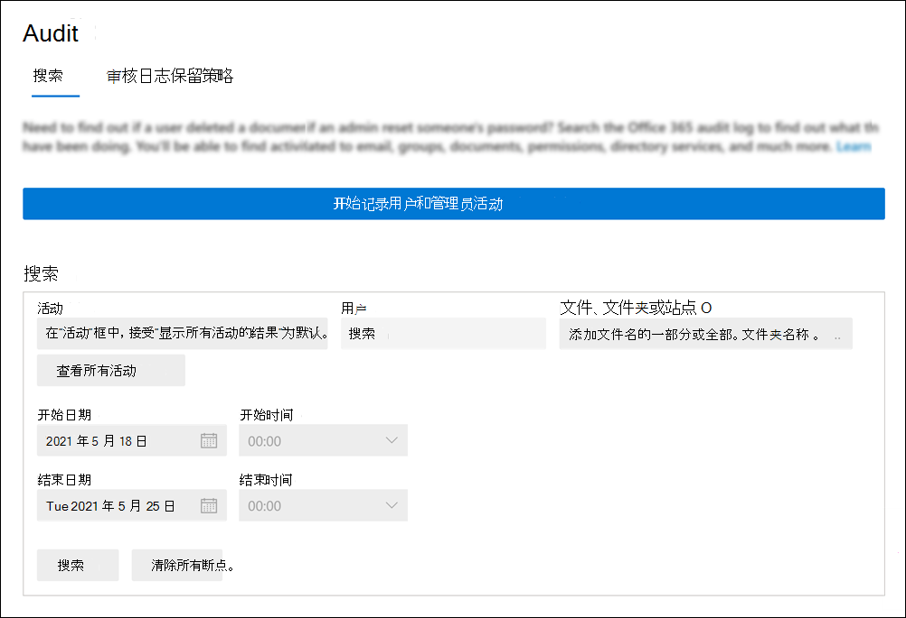

# <a name="turn-auditing-on-or-off"></a>打开或关闭审核

默认情况下，将为企业组织和企业组织启用Microsoft 365 Office 365日志记录。 但是，在组织Microsoft 365或Office 365时，应验证组织的审核状态。 有关说明，请参阅本文 [中的验证组织的](#verify-the-auditing-status-for-your-organization) 审核状态部分。 

启用 Microsoft 365 合规中心 中的审核时，组织的用户和管理员活动将记录在 审核日志 中，并保留 90 天，最多保留一年，具体取决于分配给用户的许可证。 但是，贵组织可能出于不希望记录并保留数据审核日志的原因。 在这种情况下，全局管理员可能会决定关闭审核Microsoft 365。

> [!IMPORTANT]
> 如果在组织中关闭Microsoft 365，则不能Office 365管理活动 API 或 Microsoft Sentinel 访问组织的审核数据。 按照本文中的步骤关闭审核意味着在使用 Microsoft 365 合规中心 审核日志 搜索 审核日志 或在 Exchange Online PowerShell 中运行 **Search-UnifiedAuditLog** cmdlet 时不会返回任何结果。 这也意味着审核日志无法通过 Office 365管理活动 API 或 Microsoft Sentinel 提供。
  
## <a name="before-you-turn-auditing-on-or-off"></a>打开或关闭审核之前

- 必须分配有审核日志角色Exchange Online在组织中启用或Microsoft 365审核。 默认情况下，此角色分配给管理中心中"权限"页上的"合规性管理"Exchange组。 Microsoft 365中的全局管理员是组织中组织管理角色Exchange Online。

    > [!NOTE]
    > 用户必须分配有权限Exchange Online才能启用或关闭审核。 如果在用户权限页上为用户分配"审核日志Microsoft 365 合规中心，则他们将无法打开或关闭审核。 这是因为基础 cmdlet 是一个Exchange Online PowerShell cmdlet。

- 有关搜索搜索列表的审核日志， [请参阅搜索](search-the-audit-log-in-security-and-compliance.md)审核日志。 有关管理活动 API Microsoft 365，请参阅 Microsoft 365[管理 API 入门](/office/office-365-management-api/get-started-with-office-365-management-apis)。

## <a name="verify-the-auditing-status-for-your-organization"></a>验证组织的审核状态

若要验证你的组织是否启用审核，可以在[PowerShell](/powershell/exchange/connect-to-exchange-online-powershell)中运行Exchange Online命令：

```powershell
Get-AdminAuditLogConfig | FL UnifiedAuditLogIngestionEnabled
```

`True` _UnifiedAuditLogIngestionEnabled_ 属性的值指示审核已打开。 值 `False` 表示未启用审核。

## <a name="turn-on-auditing"></a>启用审核

如果未为组织启用审核，可以在 Microsoft 365 合规中心或通过使用 PowerShell Exchange Online审核。 在打开审核后，可能需要几个小时才能在搜索查询时返回审核日志。
  
### <a name="use-the-compliance-center-to-turn-on-auditing"></a>使用合规中心启用审核

1. 转到 <https://compliance.microsoft.com> 并登录。

2. 在页面的左侧导航窗格中，Microsoft 365 合规中心审核 **"。**

   如果未为组织启用审核，则会显示横幅，提示你开始录制用户和管理员活动。

   

3. 单击" **开始录制用户和管理员活动"** 横幅。

   更改最多可能需要 60 分钟才能生效。

### <a name="use-powershell-to-turn-on-auditing"></a>使用 PowerShell 启用审核

1. [连接到 Exchange Online PowerShell](/powershell/exchange/connect-to-exchange-online-powershell)。

2. 运行以下 PowerShell 命令以启用审核。

    ```powershell
    Set-AdminAuditLogConfig -UnifiedAuditLogIngestionEnabled $true
    ```

    将显示一条消息，指出更改最多可能需要 60 分钟才能生效。
  
## <a name="turn-off-auditing"></a>关闭审核

您必须使用 Exchange Online PowerShell 来关闭审核。
  
1. [连接到 Exchange Online PowerShell](/powershell/exchange/connect-to-exchange-online-powershell)。

2. 运行以下 PowerShell 命令以关闭审核。

    ```powershell
    Set-AdminAuditLogConfig -UnifiedAuditLogIngestionEnabled $false
    ```

3. 一段时间后，验证审核是否处于关闭状态 (禁用) 。 可以通过两种方式来执行此操作：

    - 在 Exchange Online PowerShell 中，运行以下命令：

      ```powershell
      Get-AdminAuditLogConfig | FL UnifiedAuditLogIngestionEnabled
      ```

      `False` _UnifiedAuditLogIngestionEnabled_ 属性的值指示审核已关闭。

    - 转到 **"审核**"页面中Microsoft 365 合规中心。

      如果未为组织启用审核，则会显示横幅，提示你开始录制用户和管理员活动。

## <a name="audit-records-when-auditing-status-is-changed"></a>审核状态更改时审核记录

对组织中审核状态的更改本身会进行审核。 这意味着审核记录在启用或关闭审核时进行记录。 可以在管理员Exchange搜索审核日志审核记录。

若要搜索Exchange审核审核日志启用或关闭审核时生成的审核记录，请运行[PowerShell](/powershell/exchange/connect-to-exchange-online-powershell)中的以下Exchange Online命令：

```powershell
Search-AdminAuditLog -Cmdlets Set-AdminAuditLogConfig -Parameters UnifiedAuditLogIngestionEnabled
```

这些事件的审核记录包含有关何时更改审核状态、更改了审核状态的管理员以及用于进行更改的计算机的 IP 地址的信息。 以下屏幕截图显示了与更改组织中审核状态相对应的审核记录。

### <a name="audit-record-for-turning-on-auditing"></a>启用审核的审核记录


CmdletParameters 属性的值指示统一审核日志记录是在合规性中心中打开的，或者通过运行 `Confirm` **Set-AdminAuditLogConfig -UnifiedAuditLogIngestionEnabled $true** cmdlet打开的。

### <a name="audit-record-for-turning-off-auditing"></a>用于关闭审核的审核记录


的值 `Confirm` 不包含在 *CmdletParameters* 属性中。 这表示通过运行 **Set-AdminAuditLogConfig -UnifiedAuditLogIngestionEnabled** $false关闭统一审核日志记录。

有关搜索管理员帐户Exchange，审核日志[Search-AdminAuditLog](/powershell/module/exchange/search-adminauditlog)。
