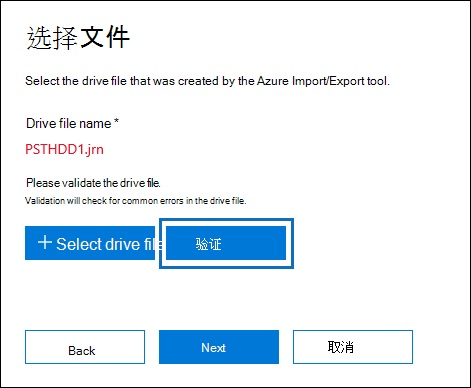
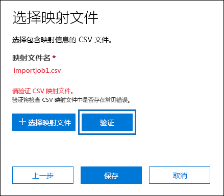
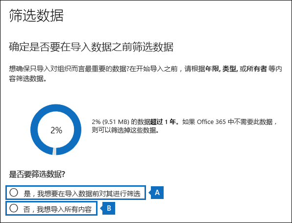
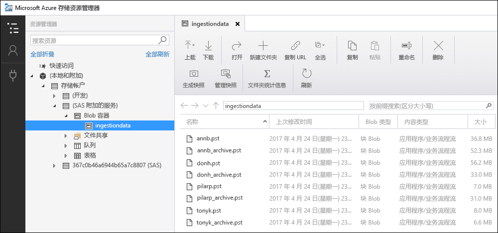

# <a name="use-drive-shipping-to-import-your-organizations-pst-files"></a>使用驱动器寄送导入组织的 PST 文件

**本文适用于管理员。您尝试将 PST 文件导入到您自己的邮箱吗？请参阅 [从 .pst 文件](https://go.microsoft.com/fwlink/p/?LinkID=785075)导入电子邮件Outlook联系人和日历**
   
使用 Office 365导入服务和驱动器寄送将 PST 文件批量导入到用户邮箱。 驱动器寄送意味着将 PST 文件复制到硬盘驱动器，然后按照实际方式将该驱动器寄到 Microsoft。 Microsoft 收到硬盘驱动器时，数据中心工作人员将数据从硬盘驱动器复制到 Microsoft 云中的存储区域。 然后，您有机会通过设置控制导入哪些数据的筛选器来修整导入到目标邮箱的 PST 数据。 启动导入作业后，导入服务将 PST 数据从存储区域导入到用户邮箱。 使用驱动器寄送将 PST 文件导入到用户邮箱是将组织的电子邮件迁移到用户邮箱的一Office 365。
  
以下是使用驱动器寄送将 PST 文件导入到邮箱所需的Microsoft 365步骤：
  
[步骤 1：下载 PST 导入工具](#step-1-download-the-pst-import-tool)

[步骤 2：将 PST 文件复制到硬盘驱动器](#step-2-copy-the-pst-files-to-the-hard-drive)

[步骤 3：创建 PST 导入映射文件](#step-3-create-the-pst-import-mapping-file)

[步骤 4：在 Office 365 中创建 PST 导入作业](#step-4-create-a-pst-import-job-in-office-365)

[步骤 5：将硬盘驱动器寄送到 Microsoft](#step-5-ship-the-hard-drive-to-microsoft)

[步骤 6：筛选数据并启动 PST 导入作业](#step-6-filter-data-and-start-the-pst-import-job)
  
> [!IMPORTANT]
> 您必须执行一次步骤 1 才能下载导入工具。 执行这些步骤后，每次想要将硬盘驱动器发货到 Microsoft 时，请执行步骤 2 到步骤 6。 
  
有关使用驱动器寄送将 PST 文件导入到Office 365常见问题解答，请参阅使用驱动器寄送导入[PST 文件的常见问题](./faqimporting-pst-files-to-office-365.yml#using-drive-shipping-to-import-pst-files)。 
  
## <a name="before-you-import-pst-files"></a>导入 PST 文件前

- 必须分配有邮箱导入导出角色Exchange Online邮箱中的导入作业Microsoft 365 合规中心 PST 文件导入到用户邮箱。 默认情况下，不会向 Exchange Online 中任何角色组分配此角色。 可以向“组织管理”角色组添加“邮箱导入导出”角色。 或者，可以创建一个角色组，分配“邮箱导入导出”角色，然后将自己添加为成员。 有关详细信息，请参阅[管理角色组](/Exchange/permissions-exo/role-groups)中的“向角色组添加角色”或“创建角色组”部分。

    除了邮箱导入导出角色之外，还必须在邮箱中分配"邮件收件人"Exchange Online。 默认情况下，此角色分配给组织中"组织管理"和"收件人管理"角色Exchange Online。

    > [!TIP]
    > 请考虑在 Exchange Online 中创建专门用于将 PST 文件导入到 Office 365 的新角色组。要获得导入 PST 文件所需的最低级别权限，请将“邮件导入导出和邮件收件人”角色分配给新角色组，然后添加成员。
  
- 您需要将要复制到硬盘中的 PST 文件存储在组织中的文件服务器或共享文件夹中。 在步骤 2 中，运行 Azure 导入导出工具 (WAImportExport.exe) ，该工具将存储在此文件服务器或共享文件夹中的 PST 文件复制到硬盘驱动器。

- 大型 PST 文件可能会影响 PST 导入过程的性能。 因此，我们建议你在步骤 2 中复制到硬盘驱动器的每个 PST 文件不应大于 20 GB。

- 仅支持将 2.5 英寸固态硬盘 (SSD) 或 2.5 英寸或 3.5 英寸 SATA II/III 内部硬盘驱动器与 Office 365 导入服务一同使用。 可使用最多 10 TB 的硬盘。 对于导入作业，仅将处理硬盘上的第一个数据卷。 必须使用 NTFS 格式化数据卷。 将数据复制到硬盘驱动器时，可以使用 2.5 英寸 SSD 或 2.5 英寸或 3.5 英寸 SATA II/III 连接器直接连接它，或者可以使用外部 2.5 英寸 SSD 或 2.5 英寸或 3.5 英寸 SATA II/III USB 适配器将其外部连接。
    
    > [!IMPORTANT]
    > Office 365 导入服务不支持内置 USB 适配器随附的外部硬盘。 此外，无法使用外部硬盘盒内的磁盘。 Please don't ship external hard drives. 
  
- 包含 PST 文件副本的硬盘驱动器必须使用 BitLocker 进行加密。 您在步骤 2 中运行的 WAImportExport.exe 工具将帮助您设置 BitLocker。 它还生成 BitLocker 加密密钥，Microsoft 数据中心工作人员使用该密钥访问驱动器，将 PST 文件上载到 Microsoft 云中的 Azure 存储 区域。
    
- 驱动器寄送通过 Microsoft 企业协议 (EA) 。 驱动器寄送不可通过 Microsoft 产品和服务协议 (MPSA) 实现。
    
- 使用驱动器传送将 PST 文件导入到 Microsoft 365 邮箱的成本为每 GB 数据 2 美元。 例如，如果发运的硬盘包含 1,000 GB (1 TB) 的 PST 文件，则费用为 2,000 美元。 您可以与合作伙伴共同协作来支付导入费用。 有关查找合作伙伴的信息，请参阅[查找 Microsoft 合作伙伴或经销商](../admin/manage/find-your-partner-or-reseller.md)。
    
- 您或您的组织必须拥有 FedEx 或 DHL 帐户。 
    
  - 美国、巴西和欧洲的组织必须具有 FedEx 帐户。
    
  - 东亚、东南亚、日本、韩国和澳大利亚的组织必须具有 DHL 帐户。
    
    Microsoft 使用此 (帐户) 费用将硬盘驱动器返回给你。
    
- 您发到 Microsoft 的硬盘驱动器可能跨越国际边界。 在这种情况下，你有责任确保根据适用法律导入和/或导出硬盘驱动器及其包含的数据。 寄送硬盘驱动器之前，请联系您的顾问以验证您的驱动器和数据是否可以合法地寄送到确定的 Microsoft 数据中心。 这有助于确保及时到达 Microsoft。
    
- 此过程涉及复制和保存 BitLocker 加密密钥。 一定要采取预防措施来保护这些密钥，就像保护密码或其他与安全相关的信息一样。 例如，您可能将它们保存到受密码保护的 Microsoft Word 文档，或者将它们保存到已加密的 USB 驱动器。 有关 [这些密钥](#more-information) 的示例，请参阅详细信息部分。 
    
- 将 PST 文件导入到Microsoft 365邮箱后，邮箱的保留挂起设置将无限期打开。 这意味着分配给该邮箱的保留策略将不会得到处理，除非你关闭保留挂起或设置关闭挂起的日期。 我们为什么要这样做？ 如果导入到邮箱的邮件是旧邮件，则可能会被永久删除（清除），因为根据为邮箱配置的保留设置，它们的保留期已过期。 将邮箱置于保留挂起状态将为邮箱所有者提供时间来管理这些新导入的邮件，或为你提供时间来更改邮箱的保留设置。 有关 [管理保留保留](#more-information) 的建议，请参阅详细信息部分。 
    
- 默认情况下，Microsoft 365 邮箱可以接收的最大邮件大小为 35 MB。 这是因为邮箱的 *MaxReceiveSize* 属性的默认值被设置为 35 MB。 但是，Microsoft 365 中最大邮件接收大小的限制为 150 MB。 因此，如果你导入的 PST 文件中包含大于 35 MB 的项目，则 Office 365 导入服务会自动将目标邮箱上的 *MaxReceiveSize* 属性值更改为 150 MB。 这将允许将最大 150 MB 的邮件导入到用户邮箱。 
    
    > [!TIP]
    > 若要确定邮箱的邮件接收大小，可在 Exchange Online PowerShell 中运行此命令：`Get-Mailbox <user mailbox> | FL MaxReceiveSize`。 
  
- 你可以将 PST 文件导入 Office 365 中的非活动邮箱。 可通过在 PST 导入映射文件中的 `Mailbox` 参数中指定非活动邮箱的 GUID 来实现此操作。 有关详细信息 [，请参阅步骤 3：创建 PST](#step-3-create-the-pst-import-mapping-file) 导入映射文件。 
    
- 在 Exchange 混合部署中，对于主邮箱位于本地的用户，可将 PST 文件导入到基于云的存档邮箱中。 为此，请在 PST 导入映射文件中执行以下操作：
    
  - 在 `Mailbox` 参数中指定用户本地邮箱的电子邮件地址。 
    
  - 在 `IsArchive` 参数中指定 **TRUE** 值。 
    
    有关详细信息 [，请参阅步骤 3：创建 PST](#step-3-create-the-pst-import-mapping-file) 导入映射文件。 

## <a name="step-1-download-the-pst-import-tool"></a>步骤 1：下载 PST 导入工具

第一步是下载该工具，在步骤 2 中用于将 PST 文件复制到硬盘驱动器。
  
> [!IMPORTANT]
> 您必须使用 Azure 导入/导出 工具版本 1 (WAimportExportV1) 驱动器寄送方法成功导入 PST 文件。 版本 2 的 Azure 导入/导出 工具不受支持，使用它将导致硬盘驱动器无法正确准备导入作业。 请务必按照此步骤Microsoft 365 合规中心从 导入/导出 下载 Azure 导入/导出 工具。 
  
1. 转到 <https://compliance.microsoft.com>，然后使用你组织中的管理员帐户凭据登录。

2. 在文件左侧导航窗格中，Microsoft 365 合规中心 **信息治理导入** \> **"。**
    
    > [!NOTE]
    > 如前所述，您必须获得适当的权限才能访问"导入"页Microsoft 365 合规中心。  
  
3. 在“**导入**”选项卡上，依次单击“”图标和“**新建导入作业**”。
    
4. 在导入作业向导中，键入 PST 导入作业的名称，然后单击"下一步 **"。** 请使用小写字母、数字、连字符和下划线。 无法在名称中使用大写字母或包含空格。
    
5. 在"**选择导入作业类型"页上**，单击 **"将硬盘驱动器** 发运到我们的某个物理位置"，然后单击"下一步 **"。**
    
    
  
6. 在 **"导入数据"** 页上，执行以下操作：     
    
    **下载 Azure 导入/导出 工具**，下载并安装 Azure 导入/导出 (版本 1) 工具。
    
    - 在弹出窗口中，单击"另存为"以将WaImportExportV1.zip文件保存到本地 \> 计算机的文件夹中。 
    
    - 提取WaImportExportV1.zip文件。
    
7. 单击 **"** 取消"关闭向导。 
    
    在步骤 4 **中** 创建导入作业Microsoft 365 合规中心您将返回到"导入"页。 

## <a name="step-2-copy-the-pst-files-to-the-hard-drive"></a>步骤 2：将 PST 文件复制到硬盘驱动器

下一步是使用 WAImportExport.exe 工具将 PST 文件复制到硬盘驱动器。 此工具使用 BitLocker 加密硬盘驱动器，将 PST 复制到硬盘驱动器，并创建存储有关复制过程的信息的日志文件。 若要完成此步骤，PST 文件必须位于您的组织中的文件共享或文件服务器中。 这在下面的过程中称为“源目录”。 

 如前所述，复制到硬盘驱动器的每个 PST 文件不应大于 20 GB。 大于 20 GB 的 PST 文件可能会影响在步骤 6 中启动的 PST 导入过程的性能。
  
> [!IMPORTANT]
> 对硬盘驱动器首次运行 WAImportExport.exe 工具后，之后您每次必须使用不同的语法。 此过程的步骤 4 中介绍了此语法，以将 PST 文件复制到硬盘驱动器。 
  
1. 在您的本地计算机上打开命令提示符。
    
    > [!TIP]
    > 如果您以管理员身份运行命令提示符（打开命令提示符时选择“以管理员身份运行”），将在命令提示符窗口中显示错误消息。这可以帮助您解决运行 WAImportExport.exe 工具时出现的问题。 
  
2. 转到您在步骤 1 中安装 WAImportExport.exe 工具的目录。
    
3. 您首次使用 WAImportExport.exe 将 PST 文件复制到硬盘驱动器时，请运行以下命令。

    ```powershell
    WAImportExport.exe PrepImport /j:<Name of journal file> /t:<Drive letter> /id:<Name of session> /srcdir:<Location of PST files> /dstdir:<PST file path> /blobtype:BlockBlob /encrypt /logdir:<Log file location>
    ```

    下表描述了各个参数及其所需值。
    
    |**参数**|**说明**|**示例**|
    |:-----|:-----|:-----|
    | `/j:` <br/> |指定日志文件的名称。此文件保存到 WAImportExport.exe 工具所在的同一文件夹中。您寄送到 Microsoft 的每个硬盘驱动器必须有一个日志文件。每次您运行 WAImportTool.exe 将 PST 文件复制到硬盘驱动器时，相关信息将追加到该驱动器的日志文件中。 
  <br/> Microsoft 数据中心工作人员使用日志文件中的信息将硬盘驱动器与步骤 4 创建的导入作业关联，并将 PST 文件上载到 Microsoft 云中的 Azure 存储 区域。  <br/> | `/j:PSTHDD1.jrn` <br/> |
    | `/t:` <br/> |连接到本地计算机时，请指定硬盘驱动器的驱动器号。  <br/> | `/t:h` <br/> |
    | `/id:` <br/> |指定复制会话的名称。会话定义为每次运行 WAImportExport.exe 工具将文件复制到硬盘驱动器。PST 文件复制到使用此参数所指定的会话名称命名的文件夹中。   <br/> | `/id:driveship1` <br/> |
    | `/srcdir:` <br/> |指定组织中包含在会话期间将复制的 PST 文件的源目录。 请务必用双引号 (" ") 引住此参数的值。  <br/> | `/srcdir:"\\FILESERVER01\PSTs"` <br/> |
    | `/dstdir:` <br/> |指定 Microsoft 云中要上载AZURE 存储区域的目标目录。 必须使用值  `ingestiondata/` 。 请务必用双引号 (" ") 引住此参数的值。  <br/> （可选）还可以向此参数的值添加额外的文件路径。 例如，您可以使用硬盘驱动器上的源目录的文件路径， (转换为 URL 格式) ，该格式在 参数  `/srcdir:` 中指定。 例如，  `\\FILESERVER01\PSTs` 更改为  `FILESERVER01/PSTs` 。 在这种情况下，您仍必须包括在  `ingestiondata` 文件路径中。 因此，此示例中参数的值为  `/dstdir:`  `"ingestiondata/FILESERVER01/PSTs"` 。  <br/> 添加其他文件路径的原因之一是如果您有具有相同文件名的 PST 文件。  <br/> > [!NOTE]>如果包含可选的 pathname，则 PST 文件上载到 Azure 存储 区域后的命名空间包括路径名和 PST 文件的名称;例如， `FILESERVER01/PSTs/annb.pst` 。 如果不包括路径名，则命名空间只是 PST 文件名;例如  `annb.pst` 。           | `/dstdir:"ingestiondata/"` <br/> 或  <br/>  `/dstdir:"ingestiondata/FILESERVER01/PSTs"` <br/> |
    | `/blobtype:` <br/> |指定要导入 PST 文件Azure 存储区域中的 blob 的类型。 对于导入 PST 文件，请使用值 **BlockBlob**。 此参数是必需的。   <br/> | `/blobtype:BlockBlob` <br/> |
    | `/encrypt` <br/> |此开关对硬盘驱动器启用 BitLocker。首次运行 WAImportExport.exe 工具时，此参数是必需的。  <br/> BitLocker 加密密钥将复制到日志文件日志文件使用 参数时创建的  `/logfile:` 密钥。 如前所述，日志文件保存到 WAImportExport.exe 工具所在的同一文件夹中。  <br/> | `/encrypt` <br/> |
    | `/logdir:` <br/> |此可选参数指定要保存日志文件的文件夹。 如果未指定，日志文件将保存到 WAImportExport.exe 工具所在的同一文件夹中。 请务必用双引号 (" ") 引住此参数的值。  <br/> | `/logdir:"c:\users\admin\desktop\PstImportLogs"` <br/> |
   
    以下是对每个参数使用实际值的 WAImportExport.exe 工具的语法示例：
    
    ```powershell
    WAImportExport.exe PrepImport /j:PSTHDD1.jrn /t:f /id:driveship1 /srcdir:"\\FILESERVER01\PSTs" /dstdir:"ingestiondata/" blobtype:BlockBlob /encrypt /logdir:"c:\users\admin\desktop\PstImportLogs"
    ```

    运行该命令后，显示的状态消息会显示将 PST 文件复制到硬盘驱动器的进度。最终状态消息显示已成功复制的文件总数。 
    
4. 以后每次运行 WAImportExport.ext 工具将 PST 文件复制到同一个硬盘驱动器时运行此命令。

    ```powershell
    WAImportExport.exe PrepImport /j:<Name of journal file> /id:<Name of new session> /srcdir:<Location of PST files> /dstdir:<PST file path> /blobtype:BlockBlob 
    ```

    下面是运行后续会话将 PST 文件复制到同一个硬盘驱动器的语法示例。  

    ```powershell
    WAImportExport.exe PrepImport /j:PSTHDD1.jrn /id:driveship2 /srcdir:"\\FILESERVER01\PSTs\SecondBatch" /dstdir:"ingestiondata/" /blobtype:BlockBlob
    ```

## <a name="step-3-create-the-pst-import-mapping-file"></a>步骤 3：创建 PST 导入映射文件

Microsoft 数据中心工作人员将 PST 文件从硬盘驱动器上载到 Azure 存储 区域后，导入服务将使用 PST 导入映射文件中的信息，该文件是逗号分隔值 (CSV) 文件，用于指定 PST 文件将导入到哪些用户邮箱。 在下一步中，创建 PST 导入作业时，将提交此 CSV 文件。
  
1. [下载 PST 导入映射文件的副本](https://go.microsoft.com/fwlink/p/?LinkId=544717)。
    
2. 打开或将 CSV 文件保存到您的本地计算机。下面的示例显示已完成的 PST 导入映射文件（在记事本中打开）。使用 Microsoft Excel 编辑 CSV 文件变得容易得多。

    ```text
    Workload,FilePath,Name,Mailbox,IsArchive,TargetRootFolder,ContentCodePage,SPFileContainer,SPManifestContainer,SPSiteUrl
    Exchange,FILESERVER01/PSTs,annb.pst,annb@contoso.onmicrosoft.com,FALSE,/,,,,
    Exchange,FILESERVER01/PSTs,annb_archive.pst,annb@contoso.onmicrosoft.com,TRUE,/ImportedPst,,,,
    Exchange,FILESERVER01/PSTs,donh.pst,donh@contoso.onmicrosoft.com,FALSE,/,,,,
    Exchange,FILESERVER01/PSTs,donh_archive.pst,donh@contoso.onmicrosoft.com,TRUE,/ImportedPst,,,,
    Exchange,FILESERVER01/PSTs,pilarp.pst,pilarp@contoso.onmicrosoft.com,FALSE,/,,,,
    Exchange,FILESERVER01/PSTs,pilarp_archive.pst,pilarp@contoso.onmicrosoft.com,TRUE,/ImportedPst,,,,
    Exchange,,tonyk.pst,tonyk@contoso.onmicrosoft.com,FALSE,/,,,,
    Exchange,,tonyk_archive.pst,tonyk@contoso.onmicrosoft.com,TRUE,,,,,
    Exchange,,zrinkam.pst,zrinkam@contoso.onmicrosoft.com,FALSE,/,,,,
    Exchange,,zrinkam_archive.pst,zrinkam@contoso.onmicrosoft.com,TRUE,,,,,
    ```

    该 CSV 文件的第一行（或者说标题行）列出了 PST 导入服务将用于将 PST 文件导入到用户邮箱中的参数。 每个参数名称都用逗号分隔开。 标题行下的每一行代表将 PST 文件导入到特定邮箱所对应的参数值。 对于复制到硬盘驱动器的每个 PST 文件，都需要一行。 一定要用实际数据替换映射文件中的占位符数据。

    > [!NOTE]
    > 不要更改标题行中的任何内容，包括 SharePoint 参数；这些内容会在 PST 导入过程中被忽略。 
  
3. 使用下表中的信息为 CSV 文件填充所需的信息。
    
    |**参数**|**说明**|**示例**|
    |:-----|:-----|:-----|
    | `Workload` <br/> |指定将数据导入的服务。若要将 PST 文件导入到用户邮箱，请使用 `Exchange`。 <br/> | `Exchange` <br/> |
    | `FilePath` <br/> | 指定 PST 文件将在Azure 存储到 Microsoft 时复制到的文件夹区域中的文件夹位置。  <br/>  在 CSV 文件的此列中添加的内容取决于您在上一步中为 参数  `/dstdir:` 指定的内容。 如果源位置上具有子文件夹，则参数中的值必须包含子文件夹的相对路径;例如 `FilePath` ，/folder1/user1/。  <br/>  如果使用 ，  `/dstdir:"ingestiondata/"` 则此参数在 CSV 文件中保留为空。  <br/>  如果为参数值包含可选的 pathname (例如 ， ，则使用该路径名 (不包括 CSV 文件中此参数的  `/dstdir:`  `/dstdir:"ingestiondata/FILESERVER01/PSTs"` "ingestiondata") 。 此参数的值区分大小写。  <br/>  无论采用哪种方法，均 *不要* 在 `FilePath` 参数的值中包含“ingestiondata”。 保留此参数为空或仅指定可选的 pathname。  <br/> > [!IMPORTANT]> 文件路径名称的大小写必须与在上一步中的 参数中指定的  `/dstdir:` 大小写相同。 例如，如果在上一步中对子文件夹名称使用了 ，但在 CSV 文件的 参数中使用了 ，PST 文件的导入  `"ingestiondata/FILESERVER01/PSTs"`  `fileserver01/psts`  `FilePath` 将失败。 请务必在两种情况下都使用相同的大小写。           |（保留为空白）  <br/> 或  <br/>  `FILESERVER01/PSTs` <br/> |
    | `Name` <br/> |指定要导入到用户邮箱的 PST 文件的名称。 此参数的值区分大小写。  <br/> > [!IMPORTANT]> CSV 文件中 PST 文件名的大小写必须与步骤 2 中上载到 Azure 存储 位置的 PST 文件相同。 例如，如果在 CSV 文件中的 `Name` 参数中使用 `annb.pst`，但实际 PST 文件的名称为 `AnnB.pst`，则导入该 PST 文件将会失败。 请确保 CSV 文件中的 PST 名称使用与实际 PST 文件相同的大小写。           | `annb.pst` <br/> |
    | `Mailbox` <br/> |指定要将 PST 文件导入到的邮箱的电子邮件地址。 不能指定公用文件夹，因为 PST 导入服务不支持将 PST 文件导入公用文件夹。  <br/> 若要将 PST 文件导入到非活动邮箱，必须为此参数指定邮箱 GUID。 若要获取此 GUID，请在 Exchange Online 中运行以下 PowerShell 命令：`Get-Mailbox <identity of inactive mailbox> -InactiveMailboxOnly | FL Guid` <br/> > [!NOTE]>有时，您可能有多个邮箱具有相同的电子邮件地址，其中一个邮箱是活动邮箱，另一个邮箱处于软删除 (或处于非活动) 状态。 在这种情况下，必须指定邮箱 GUID 来唯一标识要将 PST 文件导入到的邮箱。 若要获取活动邮箱的此 GUID，请运行以下 PowerShell 命令：`Get-Mailbox <identity of active mailbox> | FL Guid`。 若要获取软删除邮箱或非 (的 GUID) ，请运行以下命令  `Get-Mailbox <identity of soft-deleted or inactive mailbox> -SoftDeletedMailbox | FL Guid` ：。           | `annb@contoso.onmicrosoft.com` <br/> 或  <br/>  `2d7a87fe-d6a2-40cc-8aff-1ebea80d4ae7` <br/> |
    | `IsArchive` <br/> | 指定是否将 PST 文件导入到用户的存档邮箱。有两个选项：  <br/> **FALSE** 将 PST 文件导入到用户的主邮箱。  <br/> **TRUE** 将 PST 文件导入到用户的存档邮箱。 这是假设[用户的存档邮箱已启用](enable-archive-mailboxes.md)的情况。 如果将此参数设置为 `TRUE`，但用户的存档邮箱未启用，则针对此用户进行的导入将失败。 如果针对某个用户的导入失败（因为他们的存档邮箱未启用，并且此属性设置为 `TRUE`），导入作业中的其他用户将不会受到影响。  <br/>  如果将此参数留空，PST 文件会导入到用户的主邮箱中。  <br/> **注意：** 若要针对主邮箱位于本地的某个用户将 PST 文件导入到基于云的存档邮箱，只需将此参数指定为 `TRUE`，并将 `Mailbox` 参数指定为该用户本地邮箱的电子邮件地址。  <br/> | `FALSE` <br/> 或  <br/>  `TRUE` <br/> |
    | `TargetRootFolder` <br/> | 指定要将 PST 文件导入到的邮箱文件夹。  <br/>  如果保留此参数为空，PST 将导入到名为 **"** 已导入"的新文件夹，该文件夹位于邮箱根级别 (与"收件箱"文件夹和其他默认邮箱文件夹位于同一级别) 。  <br/>  如果指定  `/` ，PST 文件中的项目将直接导入到用户的收件箱文件夹中。  <br/>  如果指定  `/<foldername>` ，PST 文件中的项目将导入到名为 的文件夹  *\<foldername\>* 。 例如，如果使用 `/ImportedPst`，项目将被导入到名为 **ImportedPst** 的文件夹中。 此文件夹将位于用户邮箱内，与“收件箱”文件夹属于同一级别。  <br/> |（保留为空白）  <br/> 或  <br/>  `/` <br/> 或  <br/>  `/ImportedPst` <br/> |
    | `ContentCodePage` <br/> |此可选参数指定用于导入 ANSI 文件格式的 PST 文件的代码页的数值。 此参数用于从中国、日本和韩国 (CJK) 组织导入 PST 文件，因为这些语言通常使用双字节字符集 (DBCS) 进行字符编码。 对于为邮箱文件夹名使用 DBCS 的语言，如果此参数未用于导入 PST 文件，则在导入文件后，这些文件夹名通常会混淆。  <br/> 有关要用于此参数的受支持值的列表，请参阅[代码页标识符](/windows/win32/intl/code-page-identifiers)。  <br/> > [!NOTE]>如前所述，这是一个可选参数，你不必在 CSV 文件中添加它。 或者，你可以包含该参数，并在一行或多行中将其值留空。           |（保留为空白）  <br/> 或  <br/>  `932`（这是 ANSI/OEM 日语的代码页标识符）  <br/> |
    | `SPFileContainer` <br/> |对于 PST 导入，将该参数留空。  <br/> |不适用  <br/> |
    | `SPManifestContainer` <br/> |对于 PST 导入，将该参数留空。  <br/> |不适用  <br/> |
    | `SPSiteUrl` <br/> |对于 PST 导入，将该参数留空。  <br/> |不适用  <br/> |

## <a name="step-4-create-a-pst-import-job-in-office-365"></a>步骤 4：在 Office 365 中创建 PST 导入作业

下一步是在 Office 365 的导入服务中创建 PST 导入作业。 如前所述，提交在步骤 3 中创建的 PST 导入映射文件。 创建作业后，导入服务将使用映射文件中的信息，将 PST 文件从硬盘驱动器复制到 Azure 存储 区域，并创建并启动导入作业后，将 PST 文件导入到指定的用户邮箱。
  
1. 转到 <https://compliance.microsoft.com>，然后使用你组织中的管理员帐户凭据登录。

2. 在文件左侧导航窗格中，Microsoft 365 合规中心 **信息治理导入** \> **"。**

3. 在“**导入**”选项卡上，依次单击“”图标和“**新建导入作业**”。

    > [!NOTE]
    > 如前所述，您必须获得适当的权限才能访问"导入"页Microsoft 365 合规中心。 
  
4. 为 PST 导入作业键入一个名称，然后单击“**下一步**”。 请使用小写字母、数字、连字符和下划线。 无法在名称中使用大写字母或包含空格。

5. 在"**选择导入作业类型"页上**，单击 **"将硬盘驱动器** 发运到我们的某个物理位置"，然后单击"下一步 **"。**
  
6. 在步骤 6 中，单击"我已准备好硬盘驱动器并有权访问必要的驱动器日志文件"和"**我** 有权访问映射文件"复选框，然后单击"下一 **步"。**

    
  
7. 在"**选择驱动器文件**"页上，单击"选择驱动器文件"，然后转到WAImportExport.exe所在的同一文件夹。 在步骤 2 中创建的日志文件被复制到此文件夹中。

    
  
8. 选择日志文件;例如， `PSTHDD1.jrn` 。

    > [!TIP]
    > 在步骤 2 WAImportExport.exe运行日志文件时，日志文件的名称由 参数  `/j:` 指定。
  
9. 驱动器文件名显示在"驱动器文件名"下后，单击"验证"以检查驱动器文件是否出错。

    
  
    必须成功验证驱动器文件，以创建 PST 导入作业。 文件名在成功验证后会更改为绿色。 如果验证失败，请单击“查看日志”链接。 将打开验证错误报告，并会显示一条错误消息，包含有关文件失败原因的信息。 

    > [!NOTE]
    > 必须添加并验证您发运到 Microsoft 的每个硬盘驱动器的日志文件。 
  
10. 添加并验证您发货到 Microsoft 的每个硬盘驱动器的日志文件后，单击"下一步 **"。**
    
11. 单击  **选择映射文件** 以提交在步骤 3 中创建的 PST 导入映射文件。 

    
  
12. CSV 文件的名称出现在“**映射文件名**”之下后，单击“**验证**”来检查 CSV 文件是否有错误。 

    
  
    CSV 文件必须经过成功验证才能创建 PST 导入作业。 文件名在成功验证后会更改为绿色。 如果验证失败，请单击“查看日志”链接。 系统将打开一个验证错误报告，显示文件中失败的每一行所对应的错误消息。 

13. 成功验证 PST 映射文件后，单击"下一 **步"。**

14. 在" **提供联系人信息** "页上，在适用的框中键入您的联系信息。 

    将显示硬盘驱动器要发到的 Microsoft 位置的地址。 此地址是根据您的 Microsoft 数据中心位置自动生成的。 将此地址复制到文件中或进行屏幕截图。

15. 阅读条款和条件文档，单击复选框，然后单击保存以提交导入作业。  

    成功创建导入作业后，将显示一个状态页，说明驱动器寄送过程的下一步。

16. 在"导入 **"选项卡** 上，单击  **刷新** 以在导入作业列表中显示新的驱动器寄送导入作业。 状态设置为"**正在等待跟踪号"。** 您还可以单击导入作业以显示状态飞出页，其中包含有关导入作业的更多详细信息。

## <a name="step-5-ship-the-hard-drive-to-microsoft"></a>步骤 5：将硬盘驱动器寄送到 Microsoft

下一步是将硬盘驱动器寄送到 Microsoft，然后提供寄送的跟踪号并返回驱动器寄送作业的寄送信息。 Microsoft 收到驱动器后，数据中心工作人员需要 7 到 10 个工作日将 PST 文件上传到组织的 Azure 存储 区域。
  
> [!NOTE]
> 如果未提供跟踪号，并且未在创建导入作业的 14 天内返回装运信息，则导入作业将过期。 如果发生这种情况，必须创建新的驱动器寄送导入作业 (请参阅步骤[4：](#step-4-create-a-pst-import-job-in-office-365)在 Office 365) 中创建 PST 导入作业，然后重新提交驱动器文件和 PST 导入映射文件。
  
### <a name="ship-the-hard-drive"></a>寄送硬盘驱动器

将硬盘驱动器寄送到 Microsoft 时，请记住以下几点：
  
- 不要提供 SATA 到 USB 适配器;只需发运硬盘驱动器。

- 妥善打包硬盘驱动器，例如，使用防静电袋或泡沫包装。

- 使用您所选择的交付承运人将硬盘驱动器寄送到 Microsoft。

- 将硬盘驱动器寄送到您在步骤 4 中创建导入作业时所显示的 Microsoft 位置的地址。 请务必将“Office 365 导入服务”包括在收货人地址中。

- 寄送硬盘驱动器之后，请务必记下交付承运人的名称和跟踪号。您将在下一步中提供这些信息。
    
### <a name="enter-the-tracking-number-and-other-shipping-information"></a>输入跟踪号和其他寄送信息

将硬盘驱动器寄送到 Microsoft 后，在导入服务页上完成以下过程。
  
1. 转到 <https://compliance.microsoft.com>，然后使用你组织中的管理员帐户凭据登录。

2. 在文件左侧导航窗格中 **，Microsoft 365 合规中心"信息治理>导入"。**

3. 在 **"导入** "选项卡上，单击要输入其跟踪号的驱动器装运作业。

4. 在状态飞出页面上，单击 **输入跟踪号码**。

5. 请提供下列发货信息：

   1. **传递运营商** 键入用于将硬盘驱动器发运到 Microsoft 的交付承运人的名称。 

   2. **跟踪号码** 键入硬盘驱动器发货的跟踪号。 

   3. **返回承运人帐号** 键入"返回承运人"下列出的承运人的组织 **帐号**。 Microsoft 使用此 (帐户) 将硬盘驱动器运回给你，并收取这些费用。 美国和加拿大的组织必须具有 FedEx 帐户。 亚洲和世界上其他地方的组织必须具有 DHL 帐户。

6. 单击“保存”以保存导入作业的此类信息。 

    在"导入 **"选项卡** 上，单击  **刷新** 以更新驱动器寄送导入作业的信息。 请注意，现在将状态设置为“在途驱动器”。

## <a name="step-6-filter-data-and-start-the-pst-import-job"></a>步骤 6：筛选数据并启动 PST 导入作业

Microsoft 收到硬盘驱动器后，"导入 **PST** 文件"页上导入作业的状态将更改为"**收到的驱动器"。** 数据中心工作人员使用日志文件中的信息将 PST 文件上载到Azure 存储区域。 此时，状态将更改为 **"正在导入"。** 如前所述，收到硬盘驱动器后，需要 7 到 10 个工作日的时间上载 PST 文件。
  
将 PST 文件上传到 Azure 后，状态将更改为 **"正在分析"。** 这表示Microsoft 365以安全的方式分析 PST 文件 (数据) 以确定项目的年龄以及 PST 文件中包含的不同邮件类型。 分析完成并且数据已准备好导入时，导入作业的状态将更改为 **"分析已完成"。** 此时，您可以选择导入 PST 文件中包含的所有数据，或者可以通过设置控制要导入的数据的筛选器来修整导入的数据。
  
1. 转到 <https://compliance.microsoft.com>，然后使用你组织中的管理员帐户凭据登录。

2. 在任务窗格的左侧导航窗格中，Microsoft 365 合规中心"**信息** \> 治理"**"导入****"。

3. 在"**导入**"选项卡上，选择在步骤 4 中创建的导入作业，然后单击"导入 **到Office 365"。**
  
    系统将显示一个浮出页面，其中包含有关 PST 文件的信息和有关导入作业的其他信息。

4. 单击 **导入以Office 365。**

5. 系统将显示“**筛选数据**”页面。 该页面包含通过 Office 365 对 PST 文件进行的分析得出的数据洞察，其中包括有关数据存在时长的信息。 此时，你可以选择筛选将要导入的数据或按原样导入所有数据。 

    
  
6. 执行下列操作之一：

   1. 若要缩减导入的数据，请单击“**是，我想在导入前将其筛选**”。

      有关筛选 PST 文件中的数据然后启动导入作业的详细分步说明，请参阅[在将 PST 文件导入到 Office 365 时筛选数据](filter-data-when-importing-pst-files.md)。

      或

   1. 若要导入 PST 文件中的所有数据，请单击“**不，我想要导入所有内容**”，然后单击“**下一步**”。

7. 如果你选择导入所有数据，请单击“**导入数据**”来启动导入作业。 

    导入作业的状态显示在"导入 PST 文件 **"** 页上。 单击“ **刷新** 以更新 **状态** 列中显示的状态信息。 单击导入作业以显示状态浮出页面，该页面将显示正在导入的每个 PST 文件的状态信息。 导入完成且已将 PST 文件导入到用户邮箱后，状态将更改为“已完成”。

## <a name="view-a-list-of-the-pst-files-uploaded-to-microsoft-365"></a>查看上载到网站中的 PST 文件Microsoft 365

你可以安装和使用 Microsoft Azure 存储资源管理器 (这是一款免费的开源工具) ，用于查看 Microsoft 数据中心工作人员 () 上载到组织的 Azure 存储 区域中的 PST 文件列表。 可以这样做来验证发送到 Microsoft 的硬盘驱动器中的 PST 文件已成功上载到Azure 存储区域。
  
> [!IMPORTANT]
> 无法使用 Azure 存储资源管理器上载或修改 PST 文件。 唯一受支持的将 PST 文件导入Microsoft 365方法是使用 AzCopy。 此外，无法删除已上载到 Azure blob 的 PST 文件。 如果尝试删除 PST 文件，将收到有关没有所需权限的错误。 所有 PST 文件都会自动从你的Azure 存储中删除。 如果没有正在导入作业，则 ** ingestiondata ** 容器中的所有 PST 文件都将在最新导入作业创建 30 天后删除。
  
执行以下步骤获取组织的共享访问签名 (SAS) URL。 此 URL 是组织的 Microsoft 云中Azure 存储位置的网络 URL 和 SAS 密钥的组合。 此密钥为您提供了必要的权限，以访问组织的Azure 存储位置。

若要安装 Azure 存储资源管理器并连接到 Azure 存储区域，请执行以下操作：

1. 转到 <https://compliance.microsoft.com>，然后使用你组织中的管理员帐户凭据登录。

2. 在 Microsoft 365 合规中心的左侧窗格中，单击“**信息治理”>“导入**”。

3. 在“**导入**”选项卡上，依次单击“”图标和“**新建导入作业**”。

4. 在导入作业向导中，键入 PST 导入作业的名称，然后单击"下一步 **"。** 请使用小写字母、数字、连字符和下划线。 无法在名称中使用大写字母或包含空格。

5. 在"**选择导入作业类型**"页上，单击 **"Upload数据"，** 然后单击"下一步 **"。**

6. 在步骤 2 中，单击“**显示网络上传 SAS URL**”。

7. 显示 URL 后，将其复制并保存到文件中。 请务必复制整个 URL。

    > [!IMPORTANT]
    > 请务必采取预防措施来保护 SAS URL。 任何人都可以使用此功能访问组织的 Azure 存储区域。
  
8. 单击 **"** 取消"关闭导入作业向导。

9. 下载并安装 [Microsoft Azure 存储资源管理器工具](https://go.microsoft.com/fwlink/p/?LinkId=544842)。

10. 启动 Microsoft Azure 存储资源管理器，右键单击左窗格中的“存储帐户”，然后单击“连接到 Azure 存储”。

    
  
11. 单击“使用共享访问签名 (SAS) URI 或连接字符串”，然后单击“下一步”。

12. 单击 **"使用 SAS URI"，** 将步骤 1 中获得的 SAS URL 粘贴到 **URI** 下的框中，然后单击"下一 **步"。**

13. 在“连接摘要”页面上，可以查看连接信息，然后单击“连接”。

    此时，会打开 **ingestiondata** 容器。 它包含硬盘驱动器中的 PST 文件。 **ingestiondata** 容器位于“存储帐户”\>“(SAS 附加服务)”\>“Blob 容器”下。

    
  
14. 使用完 Microsoft Azure 存储资源管理器时，右键单击 **ingestiondata**，然后单击 **分离** 断开与您的 Azure 存储区域的连接。否则，下次尝试附加时您会收到错误消息。 

    

## <a name="troubleshooting-tips"></a>疑难解答提示

- **如果导入作业由于 PST 导入 CSV 映射文件出错，会发生什么情况？** 如果导入作业由于映射文件出错而失败，则不必将硬盘驱动器重新传输给 Microsoft 来创建导入作业。 这是因为您为驱动器寄送导入作业提交的硬盘驱动器中的 PST 文件已上载到组织的 Azure 存储 区域。 在这种情况下，只需修复 PST 导入 CSV 映射文件的错误，然后创建新的"网络上载"导入作业并提交修改后的 CSV 映射文件。 若要创建和启动新的网络上载导入作业，请参阅"使用网络上载将 PST 文件导入到 Office 365"主题中的步骤[5：](use-network-upload-to-import-pst-files.md#step-5-create-a-pst-import-job)在 Microsoft 365 中创建 PST 导入作业和步骤[6：](use-network-upload-to-import-pst-files.md#step-6-filter-data-and-start-the-pst-import-job)筛选数据并启动 PST 导入作业。 
    
    > [!NOTE]
    > 若要帮助您解决 PST 导入 CSV 映射文件的问题，请使用 [Azure 存储资源管理器](#view-a-list-of-the-pst-files-uploaded-to-microsoft-365)工具查看从硬盘驱动器上载到 Azure 存储区域中的 PST 文件的 **ingestiondata** 容器中的文件夹结构。 映射文件错误通常是由 FilePath 参数中的错误值导致的。 此参数指定 PST 文件在 Azure 存储区域中的位置。 请参阅步骤 3 中的表中 FilePath [参数的说明](#step-3-create-the-pst-import-mapping-file)。 如前所述，当您在步骤 2 中运行 WAImportExport.exe 工具时，参数指定 PST 文件在 Azure  `/dstdir:` 存储区域中 [的位置](#step-2-copy-the-pst-files-to-the-hard-drive)。 
  
## <a name="more-information"></a>更多信息

- 驱动器寄送是一种将大量存档邮件数据导入到 Microsoft 365以利用组织可用的合规性功能的有效方式。 将存档数据导入到用户邮箱后，您可以：

  - 启用 [存档邮箱](enable-archive-mailboxes.md) 和 [自动扩展存档](enable-autoexpanding-archiving.md) ，以为用户提供更多的邮箱数据存储空间。 

  - 将邮箱置于 [诉讼保留](./create-a-litigation-hold.md) 以保留数据。 

  - 使用 Microsoft [电子数据展示工具](search-for-content.md) 搜索数据。 

  - 应用[Microsoft 365](retention.md)保留策略来控制数据的保留时间，以及保留期到期后要采取哪些操作。 

  - 在 [审核日志](search-the-audit-log-in-security-and-compliance.md) 搜索与此数据相关的事件。 

  - 出于合规性 [目的将数据导入非](inactive-mailboxes-in-office-365.md) 活动邮箱以存档数据。 

  - 防止组织 [丢失](dlp-learn-about-dlp.md) 敏感信息。 

- 以下是安全存储帐户密钥和 BitLocker 加密密钥的示例。此示例还包含 WAImportExport.exe 命令的语法，运行此命令可将 PST 文件复制到硬盘驱动器。一定要采取预防措施来保护这些文件，就像保护密码或其他与安全相关的信息一样。

    ```text
    Secure storage account key: 

    yaNIIs9Uy5g25Yoak+LlSHfqVBGOeNwjqtBEBGqRMoidq6/e5k/VPkjOXdDIXJHxHvNoNoFH5NcVUJXHwu9ZxQ==

    BitLocker encryption key:

    397386-221353-718905-535249-156728-127017-683716-083391

  COMMAND SYNTAX

  First time:

  WAImportExport.exe PrepImport /j:<Name of journal file> /t:<Drive letter> /id:<Name of session> /srcdir:<Location of PST files> /dstdir:<PST file path> /blobtype:BlockBlob /encrypt /logdir:<Log file location>

  Subsequent times:

  WAImportExport.exe PrepImport /j:<Name of journal file> /id:<Name of new session> /srcdir:<Location of PST files> /dstdir:<PST file path> /blobtype:BlockBlob 

  EXAMPLES

  First time:

  WAImportExport.exe PrepImport /j:PSTHDD1.jrn /t:f /id:driveship1 /srcdir:"\\FILESERVER1\PSTs" /dstdir:"ingestiondata/"
  /blobtype:BlockBlob /encrypt /logdir:"c:\users\admin\desktop\PstImportLogs"

  Subsequent times:

  WAImportExport.exe PrepImport /j:PSTHDD1.jrn /id:driveship2 /srcdir:"\\FILESERVER1\PSTs\SecondBatch" /dstdir:"ingestiondata/" /blobtype:BlockBlob
    ```

- 如前所述，在 PST 文件导入到邮箱之后，Office 365 导入服务将启用保留挂起设置（对于无限期）。 这意味着  *，将一个保留*  策略设置为，以便不会处理分配给邮箱的  `True` 保留策略。 这样可以防止某条删除或存档策略将旧邮件删除或存档，让邮箱所有者有时间管理新导入的邮件。 可采用以下步骤来管理此保留挂起： 

  - 在一定时间段后，可以通过运行 命令关闭保留  `Set-Mailbox -RetentionHoldEnabled $false` 保留。 有关说明，请参阅[将邮箱置于保留挂起](/exchange/security-and-compliance/messaging-records-management/mailbox-retention-hold)。

  - 可配置保留挂起，使其在将来某一天关闭。 为此，可运行  `Set-Mailbox -EndDateForRetentionHold <date>` 命令。 例如，假定今天的日期为 2016 年 6 月 1 日，并且您希望在 30 天内关闭保留保留，您将运行以下命令：  `Set-Mailbox -EndDateForRetentionHold 7/1/2016` 。 在此方案中，你将保留  *将一个将一部分保留为*  True 的一  *个属性*。 有关详细信息，请参阅 [Set-Mailbox](/powershell/module/exchange/set-mailbox)。

  - 可更改分配给邮箱的保留策略的设置，使导入的旧项目不会立即被删除或移到用户的存档邮箱。 例如，可以延长分配给邮箱的删除或存档策略的保留期。 在这种情况下，需要在更改保留策略的设置后关闭邮箱的保留挂起。 有关详细信息，请参阅[为组织中的邮箱设置存档和删除策略](set-up-an-archive-and-deletion-policy-for-mailboxes.md)。
