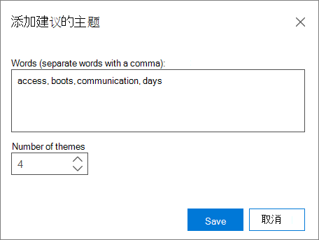

# 在高级电子数据展示和经典 (快速)  

> [!NOTE]
> 若要使用高级电子数据展示，组织必须订阅随附高级合规性加载项的 Office 365 E3，或订阅 E5。如果没有此计划，但又要试用高级电子数据展示，可以[注册 Office 365 企业版 E5 试用版](https://go.microsoft.com/fwlink/p/?LinkID=698279)。 
  
您可以使用快速 **分析** 快速分析案例并导出结果。 
  
您可以使用快速分析来计算近重复项和电子邮件线程并计算主题。 还可以在 Express 分析的高级设置中设置主题、文档相似性和导出文件 [的某些参数](use-express-analysis-in-advanced-ediscovery.md#BK_AdvancedSettings)。
  
## 运行快速分析

1. 在 **"快速** 分析 (1) "选项卡中，选择一个容器以启用** Express analysis ** (2) 和 **高级** 设置按钮。 
    
    
  
2. 在 **"分析参数"下**：
    
  - 如果要 **运行分析，** 请检查"计算近重复项"和"电子邮件线程"。 默认情况下选中此选项。 
    
  - 选中 **"计算主题** "可处理所有文件并为其分配主题。 默认情况下选中此选项。 
    
3. 在 **"导出目标"下**：
    
  - 选中 **"下载到本地计算机** "以下载到本地计算机。 
    
  - 如果选中" **导出到用户定义的 Azure blob"，** 则还可以指定容器 URL 和 SAS 令牌。 
    
    > [!NOTE]
    > 将导出包存储到用户定义的 Azure blob 后，数据将不再由高级电子数据展示管理。 它由 Azure blob 管理。 这意味着，如果删除案例，导出的文件仍将保留在 Azure blob 上。 
  
  - **保存 SAS 令牌以用于将来的导出会话**：如果选中，SAS 令牌将在高级电子数据展示的内部数据库中进行加密，供将来使用。
    
    > [!NOTE]
    > 目前，SAS 令牌将在一个月后过期。 如果尝试在一个月后下载，您必须撤消上一个会话，然后再次导出。 
  
4. 若要使用默认设置启动快速分析，请选择 **"快速** 分析"，并显示" **任务状态** "页 
    
    在"**任务状态**"页上，可以展开"进程"、"分析和导出 **"选项卡以显示** 有关快速运行的详细信息。 
    
    
  
5. 选择 **"快速分析摘要** "页以列出有关运行的详细信息。 
    
    在" **快速** 分析摘要"页面底部 **，选择"** 下载最后一个会话"以下载分析文件 tp 本地计算机。 您首先必须下载电子数据展示导出工具，然后将导出密钥粘贴到电子数据展示导出工具。 
    
## Express 分析的高级设置

可以选择设置高级 **设置来** 更改默认的 Express 分析参数。 
  
1. 在" **分析"** 部分： 
    
  - 在 **"近重复项"和"电子邮件线程**"中，输入 **"文档相似性** "值，或接受默认值 65%。 
    
  - 在 **"最大主题数"中** ，输入或选择要创建的主题数的值。 默认值为 200。 
    
    > [!NOTE]
    > 增加主题数量会影响性能以及主题的一般化能力。 主题数量越高，主题越精细。 例如，如果一组 50 个主题包含主题，如"Basketball、Clipps、Clippers、Lakers";300 个主题可能包含单独的主题："小马"、"Clippers"、"Lakers"。 如果你对主题"Basketball"没有了解，并且对 ECA 使用此功能，则看到主题"Basketball"可能很有用。 但是，如果处理主题过多，你可能永远不会看到单词"Basketball"，并且可能不知道"小球"和"Clippers"是需要审阅的优秀"篮球"主题，而不是启动和用于发的项目。 
  
  - 在 **"建议的主题"中** ， **选择"修改** "以建议主题词以控制主题处理。 高级电子数据展示将侧重于这些建议词语，并尝试基于"主题最大数量"设置创建一个或多个相关主题。 
    
    例如，如果建议的单词是"computer"，并且你指定"2"作为"最大主题数"，则高级电子数据展示将尝试生成与单词"computer"相关的两个主题。 例如，这两个主题可能是"计算机软件"和"计算机硬件"。
    
    
  
  - **模式** 从下拉列表中，选择" **主题"** 选项： 
    
  - **创建和应用模型**：按一段文件按模型计算主题，然后分发其中的文件。
    
  - **创建模型**：从文件段计算主题模型。 划分文件的"应用"过程在另一个时间单独完成。
    
  - **应用模型**：此选项仅在之前创建且尚未应用模型时显示。 这将基于主题划分文件。
    
2. 在" **导出"** 部分： 
    
1. 在 **"选择导出批处理"中**：
    
  - 从 **"导出批处理** "列表中，选择批处理名称或将结果导出到"导出批处理 01"， (默认批处理) 。 
    
  - 若要导出添加到现有案例的新文件的结果，请继续执行当前批处理。 若要在批处理中创建会话，请选择相同的批处理号并单击"创建导出会话"。可以使用此选项以增量方式导出与上一批次相同的参数。 
    
  - 若要导出到新批处理，请单击"添加"图标，在批处理名称中输入新名称 (或接受"批处理) 中的默认名称和  **说明**。  单击“确定”。
    
  - 若要编辑批处理名称或说明，请选择"导出批处理"中的名称 **，单击"** 编辑编辑"  然后修改字段。
    
    > [!NOTE]
    > 为导出批处理运行会话后，将无法删除这些会话。 此外，运行第一个会话后，只能编辑某些参数。 
  
  - 若要创建重复的导出批处理，请选择 **"重复** 导出批处理 创建重复导出批处理"图标，然后输入面板中重复批处理  的名称和说明。 
    
  - 若要删除导出批处理，请选择 **"删除**  。
    
  - 若要查看批处理的历史记录，请选择"批处理 **历史记录** 视图  。
    
2. 在"定义 p **opulation：** Select **Include only files above Relevance cut-off score** and/or Refine export **batch** if you want to fine-tune the settings for your export batch. 如果选择"仅包含相关性截止分数上方的文件"，则启用"问题"，如果文件的相关性分数高于选定问题的截止分数，则导出文件。  文件将被导出，除非它已被'审阅筛选器 **'** 排除。 如果选择" **精简导出批处理**"，则启用"禁用 **"** 和"按'审阅'筛选" **字段** 单选按钮。 如果选择"删除"，则重复文件将按照定义的策略进行筛选：[案例级别 (默认) ：从整个情况下的每组重复文件删除除一个文件外的所有重复文件。 保管人级别：从同一保管人的每组重复文件中，除一个文件外的所有文件都将取消删除。 导出输出中提供了所有重复文件的记录。 If you choose **Filter by 'For review'** field， select **Modify under Metadata** to enter your **'For review'** field settings. 选择 **"包括输入文件**"以在包内容中包括源文件。 可以清除此选项以加快导出过程。 请注意，将在任何情况下导出本机文件。
    
3. 在 **"定义元数据**"下，从导出模板列表中的以下选项 (每个会话一次) 。 
    
  - **标准**：数据项、元数据和属性的基本集。 如果导入数据已在高级电子数据展示中处理，并且导出数据已上载到已包含这些文件的系统，请使用此选项。 默认情况下，创建并填充导出模板列。
    
  - **全部**：包括所有处理数据在内的一整套标准元数据，以及分析和相关性分数。 当高级电子数据展示执行处理且文件数据首次上载到外部系统时，此模板是必需的。
    
  - **问题**： **选择"所有** 问题"或选择已创建的特定问题。 
    
选择 **"** 确定"保存高级设置，"**还原** 默认值"以使用默认值，或选择"取消"取消设置高级设置。 
  
## 另请参阅

[高级电子数据展示（经典）](office-365-advanced-ediscovery.md)

