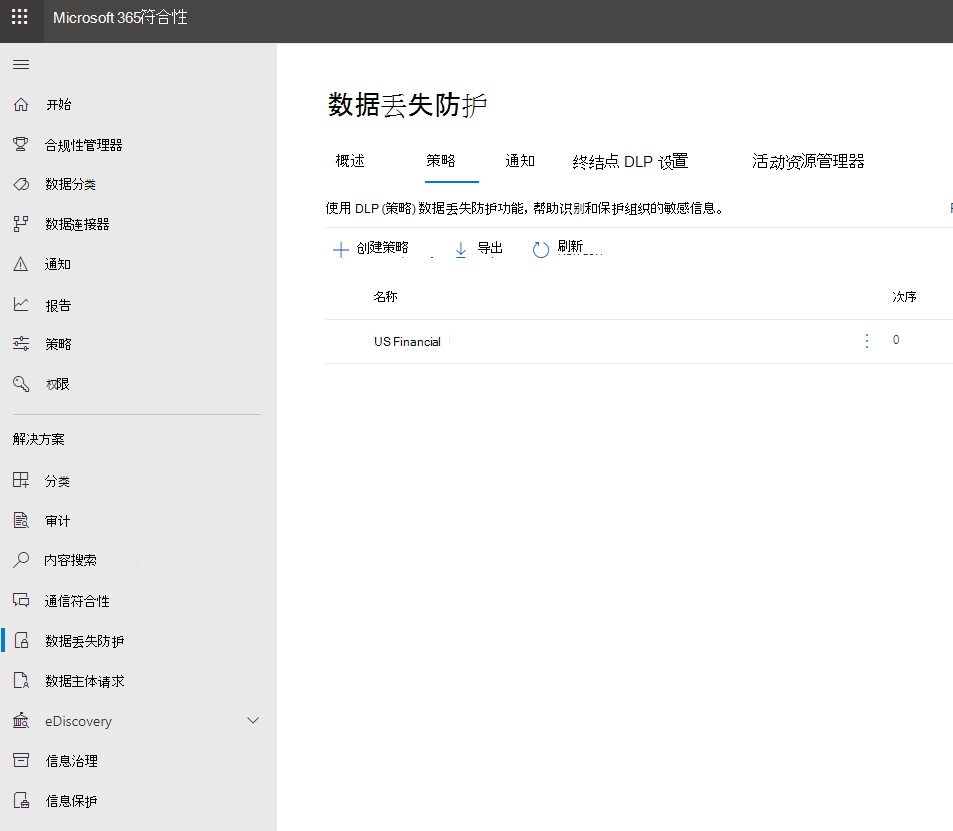

# 发送电子邮件通知并显示 DLP 策略的策略提示

数据丢失防护 (DLP) 策略可用于跨 Office 365 识别、监视和保护敏感信息。 您希望组织中处理此敏感信息的人遵守 DLP 策略，但不希望不必要地阻止他们完成工作。 这是电子邮件通知和策略提示可以提供帮助的情况。

在合规中心内，创建 DLP 策略时，可以将用户通知配置为：

- 向选择描述该问题的人发送电子邮件通知。

- 显示与 DLP 策略冲突的内容的策略提示：

  - 对于 Outlook 网页版 和 Outlook 2013 及更高版本中的电子邮件，策略提示显示在撰写邮件时收件人上方的邮件顶部。

  - 对于 OneDrive for Business 或 SharePoint Online 网站中的文档，策略提示由项目上出现的警告图标指示。 若要查看详细信息，可以选择一个项目，然后选择"信息 **"**  在页面的右上角打开详细信息窗格。

  - 对于存储在 DLP 策略中包含的 OneDrive for Business 站点或 SharePoint Online 站点上的 Excel、PowerPoint 和 Word 文档，策略提示会显示在消息栏和 Backstage 视图 (**文件** 菜单信息) 上。 \> 

## 向 DLP 策略添加用户通知

创建 DLP 策略时，可以启用用户 **通知**。 启用用户通知后，Microsoft 365发送电子邮件通知和策略提示。 你可以自定义向谁发送通知电子邮件、电子邮件文本和策略提示文本。

1. 转到 [https：// (https://compliance.microsoft.com/permissions ] (https：// (https://compliance.microsoft.com/permissions) 。

2. 使用工作或学校帐户进行登录。 现在，你已位于安全 &amp; 与合规中心。

3. 在安全 &amp; 与合规中心 \> 左侧导航 \> **中，数据丢失防护** \> **策略** \> **+ 创建策略**。

    

4. Choose the DLP policy template that protects the types of sensitive information that you need \> **Next**.

    若要从空模板开始，请选择"**自定义** \> **自定义策略""下一** \> **步"。**

5. 将策略名称为 \> **"下一步"。**

6. 若要选择希望 DLP 策略保护的位置，请执行下列操作之一：

   - Choose **All locations in Office 365** \> **Next**.

   - Choose **Let me choose specific locations** \> **Next**.

   若要包含或排除整个位置（如所有Exchange或所有OneDrive帐户），请打开或关闭该位置的"状态"。

   若要仅包含SharePoint或OneDrive帐户，请切换到"状态"，然后单击"包含"下的链接以选择特定网站或帐户。 

7. 选择 **"使用高级设置""** \> **下一步"。**

8. 选择“**+ 新建规则**”。

9. 在规则编辑器中的"用户 **通知"下**，打开状态。

    

> [!NOTE]
> 通知电子邮件不受保护的发送。

## 用于配置电子邮件通知的选项

对于 DLP 策略中的每个规则，您可以：

- 将通知发送给您选择的人员。这些人员可以包含内容的所有者、最后一次修改内容的人员、存储内容的网站所有者或特定用户。

- 使用 HTML 或令牌自定义通知中包含的文本。 有关详细信息，请参阅下面的部分。

> [!NOTE]
>  电子邮件通知只能发送给各个收件人，不能发送给组或通讯组列表。 只有新内容才会触发电子邮件通知。 编辑现有内容将触发策略提示，但不能触发电子邮件通知。

### 默认电子邮件通知

通知的"主题"行以所采取操作开头，例如，电子邮件的"通知"、"邮件被阻止"或文档的"访问被阻止"。 如果通知与文档有关，则通知邮件正文包含一个链接，该链接将你指向存储文档的网站，并打开文档的策略提示，可在其中解决任何问题 (请参阅以下有关策略提示) 的部分。 如果通知与邮件有关，则通知会作为附件包含与 DLP 策略匹配的邮件。

默认情况下，通知显示类似于网站上以下项的文本。通知文本针对每个规则单独配置，因此根据匹配的规则，显示的文本有所不同。

|**如果 DLP 策略规则也是如此...**|**然后，文档或SharePoint的默认OneDrive for Business显示...**|**然后，邮件的默认Outlook显示以下消息...**|
|:-----|:-----|:-----|
|发送通知但不允许替代    |此项与您的组织中的策略相冲突。    |您的电子邮件与贵组织的策略冲突。    |
|阻止访问，发送通知，并允许重写    |此项与您的组织中的策略相冲突。 如果不解决此冲突，则可能无法访问此文件。    |您的电子邮件与贵组织的策略冲突。 邮件未传递到所有收件人。    |
|阻止访问，并向发送通知    |此项与您的组织中的策略相冲突。除非是项目的所有者、最后一次修改内容的用户以及网站集主管理员，否则其他人对此项目的访问将受到阻止。    |您的电子邮件与贵组织的策略冲突。 邮件未传递到所有收件人。    |

### 自定义电子邮件通知

你可以创建自定义电子邮件通知，而不是向最终用户或管理员发送默认电子邮件通知。 自定义电子邮件通知支持 HTML，并且限制为 5，000 个字符。 可以使用 HTML 在通知中包括图像、格式设置和其他品牌。

您还可以使用以下令牌来帮助自定义电子邮件通知。 这些令牌是一些变量，由发送的通知中的特定信息取代。

|**标记**|**说明**|
|:-----|:-----|
|%%AppliedActions%%    |应用于内容的操作。    |
|%%ContentURL%%    |SharePoint Online 网站上或OneDrive for Business URL。    |
|%%MatchedConditions%%    |与内容匹配的条件。 使用此令牌向用户通知内容可能出现的问题。    |

## 用于配置策略提示的选项

对于 DLP 策略中的每个规则，您可以配置策略提示用于：

- 简单地通知该用户此项内容与 DLP 策略相冲突，以便用户可以执行相应的操作来解决此冲突。 可以使用默认文本 (请参阅下表) 或输入有关组织特定策略的自定义文本。

- 允许用户替换 DLP 策略。（可选） 您可以：

  - 要求用户输入替换该策略的业务理由。 将记录此信息，您可以在安全与合规中心的"报告"部分中的 DLP  &amp; 报告中查看此信息。

  - 允许用户报告误报并替换 DLP 策略。此信息还被记录下来用于报告，以便您可以使用误报来微调您的规则。

例如，您可能将 DLP 策略应用于检测到个人身份OneDrive for Business个人身份信息的网站 (PII) ，并且此策略有三个规则：

1. 第一个规则：如果在文档中检测到包含此敏感信息的实例少于五个，并且该文档与组织内部的人员共享，则“发送通知”操作将显示策略提示。对于策略提示，无需提供任何替换选项，因为此规则只是通知相关人员，但不会阻止访问。

2. 第二个规则：如果在文档中检测到包含此敏感信息的实例多于五个，并且该文档与组织内部的人员共享，则“阻止访问内容”操作将限制文件权限，并且“发送通知”操作会允许用户通过提供业务理由来替换该规则中的操作。 您的组织的业务有时要求内部人员共享 PII 数据，并且您不希望 DLP 策略阻止此操作。

3. 第三个规则：如果在文档中检测到包含此敏感信息的实例多于五个，并且该文档与组织外部的人员共享，则“阻止访问内容”操作将限制文件权限，并且“发送通知”操作将不允许用户替换该规则中的操作，因为该信息是与外部共享的。决不允许您组织中的用户在组织外部共享 PII 数据。

以下几点有助于您对使用策略提示替换规则的理解：

- 替代选项是按规则进行，它覆盖规则规则 (发送通知除外，通知在规则中) 。

- 内容可以匹配 DLP 策略中的多个规则，但只会显示来自限制最严格、优先级最高的规则的策略提示。 例如，阻止访问内容的规则所提供的策略提示比起只是发送通知的规则所提供的策略提示，前者的显示优先级高于后者。 这会让用户看不到策略提示的级联方式。

- 如果限制最严格的规则中的策略提示允许用户替换规则，那么替换此规则还会替换与此内容相匹配的所有其他规则。

## OneDrive for Business 网站或 SharePoint Online 网站上的策略提示

当 OneDrive for Business 或 SharePoint Online 站点上的文档与 DLP 策略中的规则匹配，并且该规则使用策略提示时，策略提示在文档中显示特殊图标：

1. 如果该规则发送有关该文件的通知，则会显示警告图标。

2. 如果该规则阻止访问该文档，则会显示阻止图标。

   

若要对文档采取操作，可以选择一个项目，选择" \> 信息 **信息**  在页面右上角打开详细信息窗格查看策略 \> **提示**。

策略提示会列出问题及其内容，如果对策略提示配置了这些选项，则您可以选择“解决”，然后选择“替换”策略提示或“报告”误报。

将 DLP 策略同步到网站，并定期以异步方式根据这些策略对内容进行评估，因此，您创建 DLP 策略的时间与开始看到策略提示的时间之间可能出现短暂的延迟。类似延迟还有可能出现在从您解决或替换策略提示到网站的文档上的图标消失的这段时间里。

### 网站上的策略提示的默认文本

默认情况下，策略提示显示在网站上类似于以下项的文本。通知文本针对每个规则单独配置，因此根据匹配的规则，显示的文本有所不同。

|**如果 DLP 策略规则也是如此...**|**然后默认策略提示的说明如下...**|
|:-----|:-----|
|发送通知但不允许替代    |此项与您的组织中的策略相冲突。    |
|阻止访问，发送通知，并允许重写    |此项与您的组织中的策略相冲突。 如果不解决此冲突，则可能无法访问此文件。    |
|阻止访问，并向发送通知    |此项与您的组织中的策略相冲突。除非是项目的所有者、最后一次修改内容的用户以及网站集主管理员，否则其他人对此项目的访问将受到阻止。    |

### 有关网站上策略提示的自定义文本

你可以将策略提示的文本与电子邮件通知分开自定义。 与上述部分 (电子邮件通知的自定义文本) ，策略提示的自定义文本不接受 HTML 或令牌。 相反，策略提示的自定义文本是纯文本，只有 256 个字符的限制。

## Outlook 网页版 2013 Outlook及更高版本中的策略提示

在 Outlook 网页版 和 Outlook 2013 及更高版本中撰写新电子邮件时，如果添加的内容与 DLP 策略中的规则匹配，并且该规则使用策略提示，则会看到策略提示。 撰写邮件时，策略提示显示在邮件顶部的收件人上方。

无论敏感信息出现在邮件正文、主题行中，还是邮件附件中，策略提示都正常工作，如下所示。

如果策略提示配置为允许覆盖，可以选择"显示详细信息替代"输入业务理由 \>  \> 或报告误报 \> **替代**。

请注意，向电子邮件添加敏感信息时，添加敏感信息和显示策略提示之间可能有延迟。

### Outlook 2013 及更高版本仅支持显示某些条件的策略提示

目前，Outlook 2013 及更高版本仅支持针对以下条件显示策略提示：

- 内容包含
- 共享内容

请注意，例外被视为条件，所有这些条件均在Outlook中工作，其中它们匹配内容，并强制对内容执行保护性操作。 但是，尚不支持向用户显示策略提示。 此外，Outlook显示应用于动态通讯组的 DLP 策略的策略提示。

### 安全Exchange中心中的策略 &amp; 提示

策略提示既可以与在管理中心中创建的 DLP 策略和邮件流规则Exchange，也可以与在安全与合规中心创建的 DLP 策略一起使用，但不能同时 &amp; 使用。 这是因为这些策略存储在不同位置，但策略提示只能从单个位置绘制。

如果在 Exchange 管理中心中配置了策略提示，那么在 Outlook 网页版 和 Outlook 2013 及更高版本中，在 Outlook 网页版 和 Outlook 2013 及更高版本中配置的任何策略提示将不会向用户显示，直到你在 Exchange 管理中心中关闭这些提示。 &amp; 这可确保当前Exchange邮件流规则 (传输规则) ，直到您选择切换到安全与合规 &amp; 中心。

请注意，虽然策略提示只能从单个位置进行绘制，但始终会发送电子邮件通知，即使您同时在安全与合规中心和 Exchange使用 DLP &amp; 策略。

### 电子邮件中的策略提示的默认文本

默认情况下，策略提示显示类似于以下内容的电子邮件文本。

|**如果 DLP 策略规则也是如此...**|**然后默认策略提示的说明如下...**|
|:-----|:-----|
|发送通知但不允许替代    |您的电子邮件与贵组织的策略冲突。    |
|阻止访问，发送通知，并允许重写    |您的电子邮件与贵组织的策略冲突。    |
|阻止访问，并向发送通知    |您的电子邮件与贵组织的策略冲突。    |

## Excel、PowerPoint 和 Word 中的策略提示

当用户在桌面版本的 Excel、PowerPoint 和 Word 中处理敏感内容时，策略提示可以实时通知他们内容与 DLP 策略冲突。 这要求：

- Office 文档存储在 OneDrive for Business 网站或 SharePoint Online 网站上。

- 该网站包含在配置为使用策略提示的 DLP 策略中。

Office桌面程序会自动直接从 Office 365 同步 DLP 策略，然后扫描文档以确保它们不会与 DLP 策略发生冲突，并实时显示策略提示。

> [!NOTE]
> Office桌面应用自己扫描文档以确定是否应显示 DLP 策略提示;它们不会显示 SharePoint Online 网站或 OneDrive for Business 网站已确定应在文件上显示的策略提示。 因此，你可能并不总是在桌面应用中看到 DLP 策略提示，你将在 SharePoint Online 网站或OneDrive for Business看到该提示。 相比之下，Office应用程序仅显示 DLP 策略提示，SharePoint或OneDrive for Business确定应显示的 DLP 策略提示。

根据您在 DLP 策略中对策略提示的配置方式，用户可以选择忽略策略提示、使用或不使用业务理由替换策略或报告误报。

在消息栏上显示策略提示。

策略提示也显示在 Backstage 视图（“文件”选项卡上）中。

如果对 DLP 策略中的策略提示配置了这些选项，您可以选择“解决”以“替换”策略提示或“报告”误报。

在每个桌面Office，用户可以选择关闭策略提示。 如果已关闭，则只是简单通知的策略提示将不会显示在消息栏或 Backstage 视图（“文件”选项卡上）上。 但是，仍会显示有关阻止和替换的策略提示，并且仍将收到电子邮件通知。 此外，关闭策略提示并不会将文档从任何已对其应用的 DLP 策略中予以免除。

### Excel 2016、PowerPoint 2016 和 Word 2016 中的策略提示的默认文本

默认情况下，策略提示将在打开文档的消息栏和 Backstage 视图中显示类似于以下的文本。通知文本针对每个规则单独配置，因此根据匹配的规则，显示的文本有所不同。

|**如果 DLP 策略规则也是如此...**|**然后默认策略提示的说明如下...**|
|:-----|:-----|
|发送通知但不允许替代    |此文件与您的组织中的策略相冲突。 有关详细信息， **请转到"文件** "菜单。    |
|阻止访问，发送通知，并允许重写    |此文件与您的组织中的策略相冲突。 如果不解决此冲突，则可能无法访问此文件。 有关详细信息， **请转到"文件** "菜单。    |
|阻止访问，并向发送通知    |此文件与您的组织中的策略相冲突。 如果不解决此冲突，则可能无法访问此文件。 有关详细信息， **请转到"文件** "菜单。    |

### 自定义策略提示的文本，包括 Excel、PowerPoint 和 Word

你可以将策略提示的文本与电子邮件通知分开自定义。 与上述部分 (电子邮件通知的自定义文本) ，策略提示的自定义文本不接受 HTML 或令牌。 相反，策略提示的自定义文本是纯文本，只有 256 个字符的限制。

## 更多信息

- [了解数据丢失防护](dlp-learn-about-dlp.md)
- [从模板创建 DLP 策略](create-a-dlp-policy-from-a-template.md)
- [DLP 策略条件、例外和操作 (预览) ](./dlp-microsoft-teams.md)
- [创建 DLP 策略来保护具有 FCI 或其他属性的文档](protect-documents-that-have-fci-or-other-properties.md)
- [DLP 策略模板包含的内容](what-the-dlp-policy-templates-include.md)
- [敏感信息类型属性定义](sensitive-information-type-entity-definitions.md)
