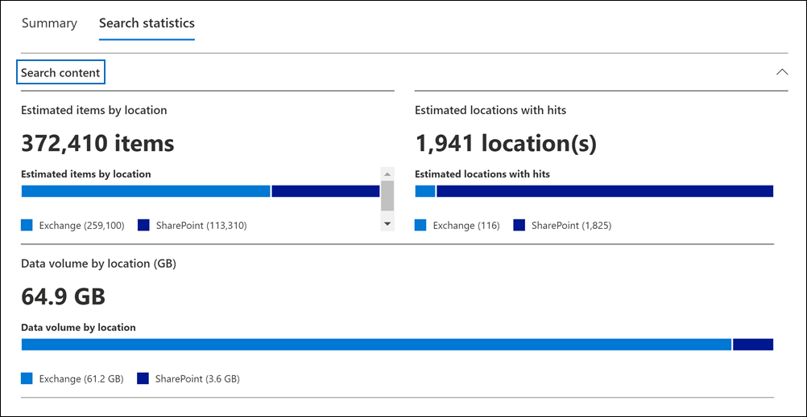
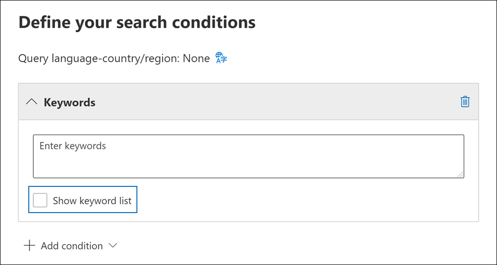

# 查看电子数据展示搜索结果的统计信息

创建并运行内容搜索或与核心电子数据展示案例关联的搜索后，可以查看有关估计搜索结果的统计信息。 这包括搜索结果 (类似于显示在搜索飞出页) 上的估计搜索结果摘要、查询统计信息（如具有与搜索查询匹配的项目的内容位置数量）和具有最匹配项目的内容位置的标识。
  
此外，您可以使用关键字列表配置搜索以返回搜索查询中每个关键字的统计信息。 这样，您可以比较查询中每个关键字返回的结果数。
  
还可以将搜索统计信息下载到 CSV 文件。 此操作使你能够使用 Excel 中的筛选和排序功能来比较结果，并准备搜索结果报告。
  
## 获取搜索统计信息

显示内容搜索或与核心电子数据展示案例关联的搜索的统计信息：
  
1. 在Microsoft 365 合规中心中，单击"**全部** 显示"，然后执行下列操作之一：

   - 单击 **"内容** 搜索"，然后选择一个搜索以显示该飞出页。

     或

   - 单击 **"电子数据展示** 核心"，选择一个案例，然后在"搜索"选项卡上选择搜索以显示  >  该飞出页面。 

2. 在所选搜索的飞出页面上，单击" **搜索统计信息"** 选项卡。
  
   

" **搜索统计信息** "选项卡包含以下部分，其中包含有关搜索的不同类型的统计信息。

### 搜索内容

此部分显示搜索返回的估计项目的图形摘要。 这指示与搜索条件匹配的项目数。 通过此信息，您可以了解搜索返回的预计项目数。

- **按位置估计的项目**：搜索返回的估计项目总数。 还会显示位于邮箱和网站中的特定数量的项目。

- **估计发生位置**：包含搜索返回的项目的内容位置总数。 还会显示特定数量的邮箱和站点位置。

- **按位置数据量 (MB) ：** 搜索返回的所有估计项目的总大小。 还会显示邮箱项目和网站项目的特定大小。

### 条件报告

此部分显示有关搜索查询和与搜索查询的不同部分匹配的估计项目数的统计信息。 可以使用这些统计信息来分析与搜索查询的每个组件匹配的项目数。 这可以帮助您优化搜索条件，并在必要时缩小范围。 您还可以下载 CSV 格式的此报告副本。

- **位置** 类型：查询统计信息适用于的内容位置的类型。 值 **Exchange指示** 邮箱位置;值 **SharePoint** 指示站点位置。

- **部分**：统计信息适用于的搜索查询部分。 **Primary** 指示整个搜索查询。 **Keyword** 指示行中的统计信息用于特定关键字。 如果使用关键字列表进行搜索查询，则此表中将包含查询的每个组件的统计信息。 有关详细信息，请参阅获取 [搜索的关键字统计信息](#get-keyword-statistics-for-searches)。

- **条件**：实际组件 (关键字或) 返回相应行中显示的统计信息的搜索查询的关键字或条件。

- **命中位置**：由"位置类型"列 (指定) 包含与"条件"列中列出的主查询或关键字查询匹配的项的内容 **位置** 的数量。

- **Items**：来自指定 (位置) 条件列中列出的查询的 **项数。** 如前所述，如果一个项目包含要搜索的关键字的多个实例，则此列中只计算一次。

- **大小 (MB) ：** 在"条件" (搜索查询匹配的指定内容位置) 找到的所有 **项目的总大小** 。

### 热门位置

此部分显示搜索返回的项目最多的特定内容位置的统计信息。 将会显示前 1,000 个位置。 您还可以下载 CSV 格式的此报告副本。

- 位置名称的名称 (邮箱的电子邮件地址和网站名称的 URL) 。

- 邮箱 (网站集的位置) 。

- 搜索返回的内容位置中的估计项目数。

- 每个内容位置中估计项目的总大小。

## 获取搜索的关键字统计信息

如前文所述，条件报告部分显示搜索查询以及匹配 (项) 列表和大小。 如果您在创建或编辑搜索查询时使用关键字列表，您可以获取增强统计信息，以显示与每个关键字或关键字短语匹配的项数。 这可以帮助您快速确定查询的哪些部分最有效 (最) 有效。 例如，如果关键字返回大量项目，您可以选择优化关键字查询以缩小搜索结果范围。

若要创建关键字列表并查看搜索的关键字统计信息，
  
1. 在Microsoft 365 合规中心中，创建新的内容搜索或与核心电子数据展示案例关联的搜索。

2. 在搜索 **向导** 的"条件"页上。 选中" **显示关键字列表"** 复选框。

   

3. 在关键字表中的行中键入关键字或关键字阶段。 例如，第一行中键入 **budget，** 第二行键入 **security，** 第三行键入 **FY2021。**

   

   > [!NOTE]
   > 为了帮助减少由大型关键字列表导致的问题，搜索查询的关键字列表中最多只能有 20 行。

4. 将关键字添加到要搜索并获取其统计信息的列表后，运行搜索。

5. 搜索完成后，选择它以显示飞出页面。

6. 在"**搜索统计信息**"选项卡上，单击"条件"报告以显示搜索的关键字统计信息。

    
  
    如前面的屏幕截图中所示，将显示每个关键字的统计信息;这包括：

    - 搜索中包含的每种类型的内容位置的关键字统计信息。

    - 未索引邮箱项目的数量。

    - 实际搜索查询和每个关键字的结果 (在"部件"列中标识为) 关键字，其中包括搜索查询的任何条件。

    - 完整的搜索查询 (在"部件"列) **标识** 为"主要"，并且每个位置类型的完整查询的统计信息。 请注意，这些统计信息与"摘要"选项卡 **上显示的** 统计信息相同。
