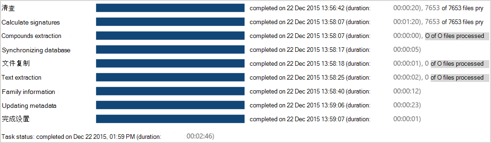
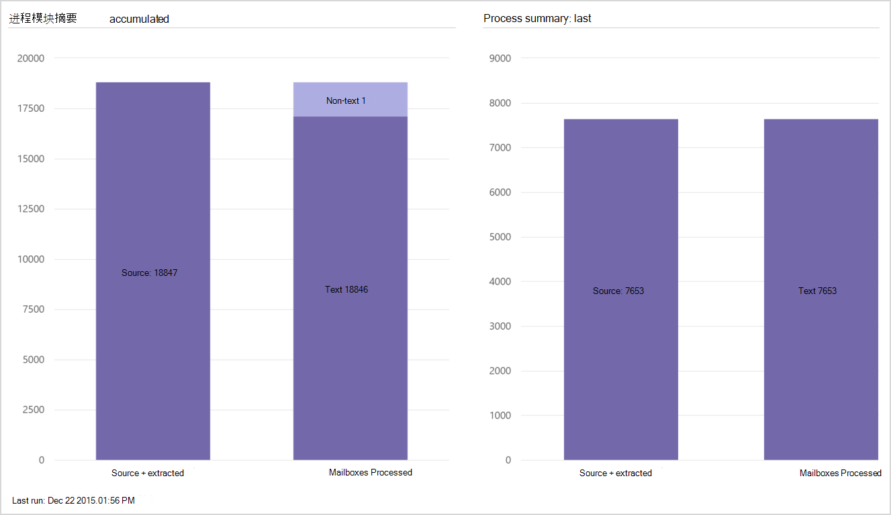

# View Process module results in Advanced eDiscovery (classic) 

启动 **"** \> **准备** 过程"后，可以查看进度和结果。 
  
> [!NOTE]
> 若要使用高级电子数据展示，组织必须订阅随附高级合规性加载项的 Office 365 E3，或订阅 E5。如果没有此计划，但又要试用高级电子数据展示，可以[注册 Office 365 企业版 E5 试用版](https://go.microsoft.com/fwlink/p/?LinkID=698279)。 
  
## 处理任务状态

在 **"准备** 进程结果"中， (如果进程当前正在运行) 或上一个进程状态任务状态，如以下示例 \>  \> 所示。
  

  
显示的任务可能因所选的"进程"选项而异。 
  
- **清单**：高级电子数据展示会访问为 Process 选择的所有文件，并执行基本数据收集。
    
- **计算签名**：计算 MD5 数字签名。
    
- **复合提取**：以递归方式从复合文件（如 PST、ZIP、MSG (）中以递归方式提取内部或包含) 。 解压缩的文件存储在大小写文件夹中。
    
- **同步数据库：内部** 数据库进程。
    
- **文件副本**：复制进程文件。 此任务始终显示，即使选择了高级复制文件选项。
    
- **文本提取**：存在本机文件时，高级电子数据展示使用 DTSearch 从这些文件中提取文本。 这些文件的提取文本作为文本文件存储在 case 文件夹中。
    
- **更新元数据**：处理加载的元数据。 
    
- **完成：** 完成内部处理，以完成已加载 (文件的数据，例如，标识错误和成功) 。 
    
任务状态：在任务完成之后显示。 任务正在运行时，将显示运行持续时间。
  
> [!NOTE]
> 已完成的任务可能还包括已完成处理的文件或出现错误的文件的总计。 
  
> [!TIP]
> "Cancel"提供了一个回滚选项，用于停止进程执行，然后回滚到以前的数据填充或保存的已处理数据。 回滚将清除所有已处理的数据。 例如，如果您不希望已处理的数据丢失 (，则计划重新加载这些文件) ，请在此窗口中选择"取消"选项，以选择不回滚。 
  
## 流程摘要

在" \> 准备进程结果流程"摘要中，根据成功的文件处理和错误结果显示已加载文件结果 \> \> 的细目。
  
这些窗格以图形方式显示导入的文件统计信息，如下所示：
  
- **进程摘要累计** d：案例内的所有文件。
    
- **最后一个进程摘要**：从最后一个会话或操作加载的文件。 
    
- **最后一个** 系列：如果有任何数据， (家庭) 。
    
- 如果 **添加了种子** 文件，则针对为文件定义的每个问题列出种子文件的数量。 
    
    如果" **种子"文件的** 标记失败，也会说明这一点。 
    
- 如果 **添加了预标记** 文件，则针对为文件定义的每个问题列出预标记文件的数量。 
    
    如果预标记 **文件的** 标记失败，则说明这一点。 
    

  
## 流程摘要累计和最后一个图表

左侧栏包括源 + 解压缩的文件：即找到的所有文件。 
  
右侧栏"已处理"包括：
  
- 加载错误的文件
    
- 已成功加载文件，其中可能包括： 
    
  - **现有**：之前加载且现在重新加载的文件 (包括重复) 。
    
  - **文本**：具有文本的唯一文件。
    
  - **非文本**：空文本文件、空本机文本文件、本机非文本文件。 
    
  - **重复** 项：包含文本的重复文件。
    
## 上一个进程错误

在"准备进程结果最后一个进程错误"中，将显示上一个 \> \> 会话或 \> 执行的操作中错误的详细信息。
  

  
## 另请参阅

[高级电子数据展示（经典）](office-365-advanced-ediscovery.md)
  
[运行进程模块并加载数据](run-the-process-module-and-load-data-in-advanced-ediscovery.md)

