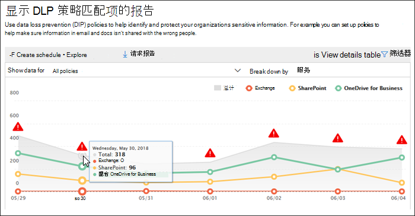

# 查看数据丢失防护报告

在 DLP (策略 (数据丢失防护) ，您需要验证它们是否正常工作，并帮助您保持合规性。 使用安全与合规中心中的 DLP 报告 &amp; ，可以快速查看：
  
- **DLP 策略匹配** 此报告显示随着时间的推移 DLP 策略匹配项的计数。 你可以按日期、位置、策略或操作筛选报表。 您可以使用此报表实现以下目的： 
    
  - 当你在测试模式中运行 DLP 策略时，你可以微调和优化它们。 你可以查看匹配内容的特定规则。
    
  - 重点关注特定的时间段，并了解峰值和发展趋势的原因。
    
  - 发现违反组织的 DLP 策略的业务流程。
    
  - 通过查看哪些操作正应用于内容来了解 DLP 策略的商业影响。
    
  - 通过显示该策略的匹配结果，验证该策略是否遵守特定 DLP 策略。
    
  - 查看参与你组织中事件的主要用户和重复用户的列表。
    
  - 查看你组织中主要敏感信息类型的列表。
    
- **DLP 事件** 此报告还会显示一段时间的策略匹配，如策略匹配报告。 但是，策略匹配报告在规则级别显示匹配项;例如，如果电子邮件匹配三个不同的规则，则策略匹配报告显示三个不同的行项目。 相比之下，事件报告在项目级别显示匹配项;例如，如果电子邮件与三个不同的规则匹配，则事件报告将显示该内容的单个行项。 
    
  因为报告计数的聚合方式不同，所以策略匹配报告更适用于标识特定规则的匹配项并微调 DLP 策略。 事件报告更适合于识别对 DLP 策略有问题的特定内容片段。
    
- **DLP 误报和重写** 如果您的 DLP 策略允许用户覆盖该策略或报告误报，则此报告显示随着时间的推移此类实例的计数。 你可以按日期、位置或策略筛选报表。 您可以使用此报表实现以下目的： 
    
  - 通过查看哪个策略造成更多的误报来微调或优化你的 DLP 策略。
    
  - 查看用户在通过替换策略解析策略提示时提交的理由。
    
  - 发现 DLP 策略在何处与有效商业流程冲突，造成很多用户替换。
    
所有 DLP 报告都可显示最近四个月时间段的数据。 最新数据可能需要最多 24 小时才能显示在报告中。
  
可以在安全与合规中心报告仪表板 &amp; \> **中查找** \> **这些报告**。
  

  
## 查看用户提交的替代理由

如果 DLP 策略允许用户重写，则可使用误报和重写报告来查看用户在策略提示中提交的文本。
  

  
## 对见解和建议采取措施

报告可以显示见解和建议，你可以单击红色警告图标查看有关潜在问题的详细信息并采取可能的补救措施。
  

  
## DLP 报告的权限

若要在安全与合规&查看 DLP 报告，您必须获得以下权限：

- **安全读者** 角色Exchange管理中心。 默认情况下，此角色分配给管理中心中的组织管理和安全读者Exchange组。

- **安全与合规中心** 中的"仅查看 DLP 合规性&角色。 默认情况下，此角色分配给安全与合规中心中的合规性管理员、组织管理、安全管理员和安全读者&组。

- **"仅查看收件人"** 角色Exchange管理中心。 默认情况下，此角色分配给管理中心中的合规性管理、组织View-Only组织管理Exchange组。

## 查找 DLP 报表的 cmdlet

若要使用安全 &amp; 合规中心的大多数 cmdlet，你需要执行以下操作：
  
1. [连接远程 &amp; PowerShell 访问安全与合规中心](/powershell/exchange/connect-to-scc-powershell)
    
2. 使用以下任一 [安全 &amp; 与合规中心 cmdlet](/powershell/exchange/exchange-online-powershell)
    
但是，DLP 报告需要从 Office 365（包括 Exchange Online）提取数据。 因此，DLP 报告 cmdlet 可用于 Exchange Online Powershell，而不是安全与合规中心 &amp; Powershell。 因此，若要使用适用于 DLP 报告的 cmdlet，你需要执行以下操作：
  
1. [使用远程 PowerShell 连接到 Exchange Online](/powershell/exchange/connect-to-exchange-online-powershell)
    
2. 对 DLP 报告使用以下任意 cmdlet：
    
      - [Get-DlpDetectionsReport](/powershell/module/exchange/get-dlpdetectionsreport)
    
      - [Get-DlpDetailReport](/powershell/module/exchange/get-dlpdetailreport)
