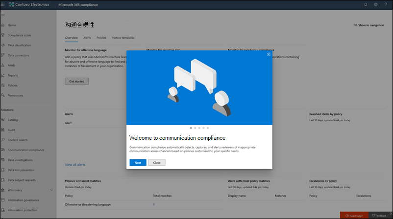

# Microsoft 365 合规性中心的新增功能

我们不断将新功能添加到[Microsoft 365 合规性中心](microsoft-365-compliance-center.md)，修复我们了解的问题，并根据你的反馈进行更改。 请查看下面的内容，查看今天可为你提供的内容。 有些功能以不同的速度向客户推出。 如果尚未看到功能，请尝试将自己添加到[目标版本](https://docs.microsoft.com/office365/admin/manage/release-options-in-office-365)。

> [!TIP]
> 对其他管理中心中的内容有兴趣？ 查看以下文章： [Microsoft 365 管理中心的新增功能](https://docs.microsoft.com/office365/admin/whats-new-in-preview?view=o365-worldwide) [SharePoint 管理中心的新增功能](https://docs.microsoft.com/sharepoint/what-s-new-in-admin-center)  
并访问[microsoft 365 路线图](https://www.microsoft.com/en-us/microsoft-365/roadmap)，了解已启动的 microsoft 365 功能、正在开发、已被取消或之前已发布的功能。

## 2020 年 1 月

等待已结束。 我们很高兴宣布 Microsoft 365 合规性中心可供所有客户使用 Microsoft 365、Office 365、企业移动性 + 安全性（EMS）和 Windows 10 企业版计划。 在 Office 365 安全 & 合规中心中管理的任何数据或策略在合规性中心中均可用，因此无需来回跳转。

> [!TIP]
> 再次阅读上个月的更新，以了解最近预览的一些[新解决方案](#new-compliance-solutions)的复习，并提供了一个路线图，该[指南](#updated-compliance-solutions)展示了 Office 365 安全性 & 合规性中心在 Microsoft 365 中的活动。

书签并将[https://compliance.microsoft.com](https://compliance.microsoft.com)其置于现在，以浏览您的一站式管理合规性，以跨整个组织 .。。或者[阅读本文](microsoft-365-compliance-center.md)以进一步深入研究。

我们也在本月发布了新的和更新的解决方案。 下面将快速浏览一下重点。

### 现在预览

**内幕风险管理（预览）**

我们很高兴宣布，我们的内幕风险管理解决方案现已处于公共预览版中。 简言之，内幕风险管理可帮助您的组织智能化地识别和采取对内幕风险的操作，方法是提供：

- 可帮助确保用户隐私的匿名控件。
- 智能策略模板，带有可识别内幕威胁的本机和第三方指示符，如数据泄露。
- 跨 IT、HR 和法律团队的集成的端到端调查工作流。

我们乐意听到你的想法。 在使用解决方案时，请将反馈留给我们，以确保我们在实现常规可用性时能够满足你的需求。

[了解有关内幕风险管理的详细信息](insider-risk-management.md)

### 刚刚启动

**沟通合规性**

毕业从预览阶段到完整可用性，通信合规性是我们新的内幕风险解决方案集的关键组件。 此强健的解决方案可帮助最大限度地减少使用工作流对不符合组织标准的邮件进行检测、调查和采取补救措施的工作流的通信风险。

在预览过程中，客户反馈很棒。 它产生了几项增强功能，包括首次运行体验，使您能够开始、调查和修正操作的改进等。

[了解有关通信合规性的详细信息](communication-compliance.md)

**数据连接器**

以前与 Office 365 安全 & 合规中心中的其他 "导入" 功能共享空间，数据连接器现在在 Microsoft 365 合规性中心拥有自己的主址。 使用新的 "数据连接器" 页面将组织的人力资源（HR）文件和各种第三方平台（如 Facebook、LinkedIn、Twitter 和即时 Bloomberg）中的数据导入和存档到 Microsoft 365 组织中的邮箱。 导入后，可以在几个合规性解决方案中管理此类数据，包括电子数据展示、内幕风险管理、通信合规性、审核、保留策略等。

[了解有关数据连接器的详细信息](archiving-third-party-data.md)

### 值得注意的更新

**针对合规性分数的新评估模板（预览）**

始终致力于帮助您提前掌握日益发展的合规性，我们的合规性分数团队提供了一组新的模板，以帮助您评估组织对最新法规的合规性情况，并获取有关如何实施的指导更有效的控件。 你将看到以下内容的新模板：

- ISO/IEC 27701:2019
- 加州消费者隐私法案 (CCPA)
- 巴西常规数据保护法律（Lei Geral de Proteção de Dados-LGPD）
- SOC 1 类型2和 SOC 2 类型2

[了解有关合规性分数模板的详细信息](compliance-score.md#templates)

## 2019年11月 &

在节日中，我们开始推出 Ignite 中演示的所有极好的合规性解决方案。 大多数情况下都处于预览状态，因此请将其测试出来，并确保通过打开合规性中心右侧右侧的反馈卡片来了解你的想法。

### 了解新的邻居

新的 Microsoft 365 合规性中心包含全新的解决方案以及 Office 365 安全性 & 合规性中心中了解和喜欢的合规性功能。 让我们更深入地了解 .。。

#### 新的合规性解决方案

您可能想知道什么是*解决方案*。 与云相比，云已彻底改变了业务的完成方式，它还为新的数据盗用和欺诈和必要的新法规提供了门。 我们的合规性解决方案是集成功能的集合，可帮助您帮助您管理这些不断发展的合规性要求。 解决方案的功能可能包括策略、警报、报告等的组合。

以下是你将发现的新解决方案的摘要。 请留意即将推出的其他人。

> [!NOTE]
> 这些解决方案仅位于 Microsoft 365 合规性中心。 不能在 Office 365 安全 & 合规性中心中进行管理。
 

|**新解决方案**|**说明**|**了解更多**|
|:-----|:-----|:-----|
|Microsoft 合规性分数（预览）  |根据[合规性管理器](compliance-manager-overview.md)，合规性分数是一项独立功能，可帮助您了解和改进组织的合规性状态，这是一个更简单、更易于用户友好的设计。 它将计算基于风险的分数，以衡量您在帮助降低数据保护和法规标准方面的风险的完成操作的进度。  |[Microsoft 合规性分数概述（预览）](compliance-score.md)|
|解决方案目录（预览）  |解决方案目录是用于发现、了解和快速开始使用合规性和风险管理解决方案的一站式业务。 目录分为三个符合性类别，每个类别都包含有关组成该类别的解决方案的详细信息。 类别包括信息保护 & 治理、内幕风险管理和发现 & 响应  |[解决方案目录概述（预览）](microsoft-365-solution-catalog.md)|
|通信合规性（预览）  |通信合规性是新的内幕风险管理类别的一部分，可帮助您对组织中不适当的邮件进行检测、捕获和采取补救措施，以帮助最大限度地减少通信风险。 该解决方案通过引入几项新的增强功能（如智能模板、灵活的修正工作流和可操作的见解）扩展了监督策略在 Office 365 中的功能。  |[Microsoft 365 中的通信合规性（预览）](communication-compliance.md)|
|数据分类（预览）  |我们新的数据分类页面包含强大的见解和工具，可帮助您发现和评估组织中的内容中使用的敏感信息和标签（保留和敏感度）。 查看包含敏感信息或应用了标签的内容、跨 Microsoft 365 位置浏览标签活动、创建自定义敏感信息类型，以及更多。 |[数据分类概述（预览）](data-classification-overview.md)|
|Trainable 分类器（预览）  |此功能强大的新工具使用我们的机器学习引擎帮助确定您的组织中的内容类别，如法规文档或员工协议。 创建后，可以在几个合规性解决方案中使用分类器来检测相关内容并对其进行分类、保护、保留等。 |[可训练分类器入门（预览）](classifier-getting-started-with.md)|

#### 更新了合规性解决方案

如果你已使用 Office 365 安全 & 合规性中心满足你的合规性需求，你可能会想知道在新的 Microsoft 365 合规性中心中，一些功能现在处于活动状态。 以下是帮助查找其新家庭的快速路线图。

> [!NOTE]
> 某些功能仍仅在 Office 365 安全 & 合规性中心中提供，如下所示。 但我们正在努力在 Microsoft 365 合规性中心预览这些问题，因此请随时关注更新。 
 

|**功能**|**Office 365 安全与合规中心**|**Microsoft 365 合规中心**|**了解更多**|
|:-----|:-----|:-----|:-----|
|高级电子数据展示|电子数据展示 > 高级电子数据展示   https://protection.office.com/advancedediscoverycases |电子数据展示 > 高级   https://compliance.microsoft.com/advancedediscovery | [Microsoft 365 中的高级电子数据展示解决方案概述](overview-ediscovery-20.md) |
|警报策略|警报 > 通知策略   https://protection.office.com/alertpolicies |目前，仅在 Office 365 安全性 & 合规性中心中管理警报策略。 |[安全与合规中心中的警报策略](alert-policies.md) |
|警报|警报 > 查看警报   https://protection.office.com/viewalerts |警报   https://compliance.microsoft.com/compliancealerts |[查看警报](alert-policies.md#viewing-alerts)|
|存档|信息治理 > 存档   https://protection.office.com/archiving |信息治理 > 存档 "选项卡   https://compliance.microsoft.com/informationgovernance?viewid=archive |[启用存档邮箱](enable-archive-mailboxes.md)|
|审核日志搜索|搜索 > 审核日志搜索   https://protection.office.com/unifiedauditlog |跟踪   https://compliance.microsoft.com/auditlogsearch| [在安全 & 合规性中心中搜索审核日志](search-the-audit-log-in-security-and-compliance.md)|
|内容搜索|搜索 > 内容搜索   https://protection.office.com/contentsearchbeta?ContentOnly=1 | 内容搜索   https://compliance.microsoft.com/contentsearch |[在 Office 365 中搜索内容](search-for-content.md) |
|数据连接器|信息治理 > 存档第三方数据   https://protection.office.com/nativeconnector | 数据连接器   https://compliance.microsoft.com/connectorlanding |[存档第三方数据](archiving-third-party-data.md)|
|数据丢失防护|数据丢失防护   https://protection.office.com/datalossprevention |数据丢失防护   https://compliance.microsoft.com/datalossprevention |[数据丢失防护概述](data-loss-prevention-policies.md)|
|数据主体请求 |数据隐私 > 数据主体请求   https://protection.office.com/dsrcases |数据主体请求   https://compliance.microsoft.com/datasubjectrequest |[使用 DSR case 工具管理 GDPR 数据主体请求](manage-gdpr-data-subject-requests-with-the-dsr-case-tool.md)|
|电子数据展示|电子数据展示 > 电子数据展示   https://protection.office.com/ediscoveryv1 |电子数据展示 > 核心   https://compliance.microsoft.com/classicediscovery |[管理电子数据展示事例](ediscovery-cases.md) |
|事件|记录管理 > 事件   https://protection.office.com/events |记录管理 > 事件选项卡   https://compliance.microsoft.com/recordsmanagement?viewid=events |[事件驱动保留概述](event-driven-retention.md)|
|文件计划|记录管理 > 文件计划   https://protection.office.com/fileplan |记录管理 > 文件计划选项卡   https://compliance.microsoft.com/recordsmanagement?viewid=fileplan |[文件计划管理器概述](file-plan-manager.md)|
|导入 PST 文件|信息治理 > 导入 PST 文件   https://protection.office.com/importV2 |信息管理 > 导入选项卡   https://compliance.microsoft.com/informationgovernance?viewid=import |[导入组织的 PST 文件概述](importing-pst-files-to-office-365.md)|
|标签活动资源管理器|信息治理 > 标签活动资源管理器   https://protection.office.com/labelexplorer |"数据分类 > 活动资源管理器" 选项卡   https://compliance.microsoft.com/dataclassification?viewid=activitiesexplorer |[查看关于标记的内容的活动（预览版）](data-classification-activity-explorer.md)|
|保留标签和标签策略 |分类 > 保留标签 > 标签和标签策略选项卡   https://protection.office.com/retentionlabels |信息治理 > 标签和标签策略选项卡   https://compliance.microsoft.com/informationgovernance?viewid=labels   https://compliance.microsoft.com/informationgovernance?viewid=labelpolicies | [保留标签概述](labels.md)|
|保留策略|信息治理 > 保留   https://protection.office.com/retention |信息治理 > 保留选项卡   https://compliance.microsoft.com/informationgovernance?viewid=retention |[保留策略概述](retention-policies.md)|
|敏感信息类型|分类 > 敏感信息类型   https://protection.office.com/sensitivetypes |数据分类 > 敏感信息类型选项卡   https://compliance.microsoft.com/dataclassification?viewid=sensitiveinfotypes |[敏感信息类型查找的内容](what-the-sensitive-information-types-look-for.md)|
|敏感度标签和标签策略|分类 > 敏感度标签 > 标签和标签策略 "选项卡   https://protection.office.com/sensitivity |信息保护 > 标签和标签策略选项卡   https://compliance.microsoft.com/informationprotection?viewid=sensitivitylabels   https://compliance.microsoft.com/informationprotection?viewid=sensitivitylabelpolicies |[了解敏感度标签](sensitivity-labels.md) |
|服务保证|服务保证   https://protection.office.com/serviceassurance/dashboard |目前，服务保证资源只能在 Office 365 安全 & 合规性中心中访问。 |[安全 & 合规中心中的服务保证](service-assurance.md)|
|监督|监督   https://protection.office.com/supervisoryreviewv2 |沟通合规性   https://compliance.microsoft.com/supervisoryreview |[Microsoft 365 中的通信合规性（预览）](communication-compliance.md) |

## 2019 年 9 月

不知为什么在本月的版本中静音？ 我们正在开发的新的创新合规性解决方案将在11月的[Microsoft Ignite](https://www.microsoft.com/ignite)中 unveiled。 请随时关注！

### 用于敏感度标签的新加密选项 

为敏感度标签配置加密时，您现在有两个选项，可让用户在手动将标签应用于电子邮件和文档时分配权限： 
- 将标签应用于**Outlook 电子邮件**时，用户可以强制实施与 "不转发" 选项等效的限制。 收件人将能够读取邮件，但不能转发、打印或复制内容。
- 将标签应用于**Word、PowerPoint 和 Excel 文件**时，系统将提示用户为特定用户和组分配访问权限。

[了解更多](encryption-sensitivity-labels.md#let-users-assign-permissions)

## 2019 年 8 月

### 对数据调查的更新

在执行数据调查时，您现在可以从其原始位置删除项目。 这意味着您可以在组织中删除 Exchange 邮箱、SharePoint 网站和 OneDrive 帐户中的项目。 由于已将项目作为证据收集，因此您可以将这些项目的副本保留在证据集中，以便您可以进一步调查或仅保留为参考。 [了解更多](manage-data-spillage-incidents.md#step-4-delete-the-spilled-data) 

## 2019 年 7 月

### 新管理员角色

我们发布了两个新的管理员角色，以帮助管理您的组织中的安全性和合规性。请告诉你的所有朋友。

- **合规性数据管理员**。具有此角色的用户具有在 Microsoft 365 合规性中心、Microsoft 365 管理中心和 Azure 中保护和跟踪数据的权限。 它们还可以管理 Exchange 管理中心、合规性管理器、团队 & Skype for Business 管理中心并为 Azure 和 Microsoft 365 创建支持票证。
- **Security 运算符**。 具有此角色的用户可以管理警报并拥有对安全相关功能的全局只读访问权限，其中包括 Microsoft 365 安全中心、Azure Active Directory、Identity Protection、特权身份管理和 Office 365 安全性 & 合规性中心中的所有内容。

[了解有关这些角色的详细信息](https://docs.microsoft.com/microsoft-365/security//office-365-security/permissions-microsoft-365-compliance-security)

### 搜索和筛选报告

不会再滚动浏览报告的海洋，以查找您需要的报告。 您现在可以搜索报告（基于其标题），并筛选类别（如 "标签" 和 "合规性"）以及 "Office 365" 和 "Microsoft 云应用安全" 等源。

