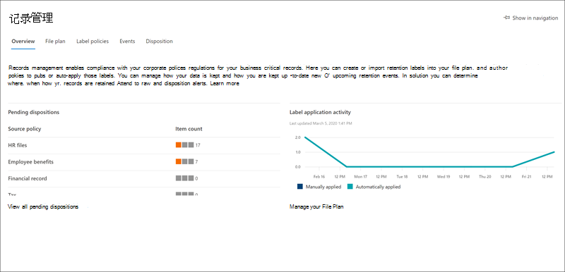

# Microsoft 365 合规中心更新信息What's new in Microsoft 365 compliance

无论是将新的解决方案添加到 [Microsoft 365 合规性中心](microsoft-365-compliance-center.md)，基于反馈更新现有功能，还是推出全新和更新的文档，Microsoft 365 都能帮助您在不断变化的合规性方面保持最高水平。Whether it be adding new solutions to the [Microsoft 365 compliance center](microsoft-365-compliance-center.md), updating existing features based on your feedback, or rolling out fresh and updated documentation, Microsoft 365 helps you stay on top of the ever-changing compliance landscape. 查看下面的内容，了解今天在 Microsoft 365 合规性方面的新增内容。Take a look below to see what’s new in Microsoft 365 compliance today. 

> [!NOTE]
> 某些合规性功能以不同的速度向我们的客户推出。Some compliance features get rolled out at different speeds to our customers. 如果尚未看到功能，请尝试将自己添加到 [目标版本](https://docs.microsoft.com/office365/admin/manage/release-options-in-office-365)。If you aren't seeing a feature yet, try adding yourself to [targeted release](https://docs.microsoft.com/office365/admin/manage/release-options-in-office-365).

> [!TIP]
> 对其他管理中心中的内容有兴趣？Interested in what's going on in other admin centers? 查看以下文章：Check out these articles: [Microsoft 365 管理中心的新增功能What's new in the Microsoft 365 admin center](https://docs.microsoft.com/office365/admin/whats-new-in-preview?view=o365-worldwide) [SharePoint 管理中心的新增功能What's new in the SharePoint admin center](https://docs.microsoft.com/sharepoint/what-s-new-in-admin-center) [Microsoft 威胁防护的新增功能What's new in Microsoft Threat Protection](https://docs.microsoft.com/microsoft-365/security/mtp/whats-new)  
并访问 [microsoft 365 路线图](https://www.microsoft.com/en-us/microsoft-365/roadmap) ，了解已启动的 microsoft 365 功能、正在开发、已被取消或之前已发布的功能。And visit the [Microsoft 365 Roadmap](https://www.microsoft.com/en-us/microsoft-365/roadmap) to learn about Microsoft 365 features that were launched, are rolling out, are in development, have been cancelled, or previously released.

## 2020 年 8 月August 2020

### 聚光灯：内幕风险和通信合规性更新Spotlight: Insider risk and communication compliance updates

本月的几个新增和改进功能命中了公共预览：Several new and improved features hit public preview this month:

**内幕风险管理****Insider risk management**

- 查看我们的六个新 [策略模板](insider-risk-management-policies.md#policy-templates)：Check out our six new [policy templates](insider-risk-management-policies.md#policy-templates):
    - 按优先级用户的数据泄露Data leaks by priority users
    - 因不满用户而进行的数据泄露Data leaks by disgruntled users
    - 一般安全策略冲突General security policy violations
    - 通过去声用户违反安全策略Security policy violations by departing users
    - 优先级用户违反安全策略Security policy violations by priority users
    - 因不满用户而违反安全策略Security policy violations by disgruntled users

- 与 [Microsoft DEFENDER atp](https://docs.microsoft.com/windows/security/threat-protection/microsoft-defender-atp/microsoft-defender-advanced-threat-protection) 的集成允许您导入和筛选 MICROSOFT defender atp 警报，以查找通过新的安全冲突策略模板所创建的策略检测到的活动。Integration with [Microsoft Defender ATP](https://docs.microsoft.com/windows/security/threat-protection/microsoft-defender-atp/microsoft-defender-advanced-threat-protection) allows you to import and filter Microsoft Defender ATP alerts for activities detected by policies created from the new security violation policy templates. 此外，还有相关的 [内幕风险设置](insider-risk-management-settings.md#microsoft-defender-advanced-threat-protection-preview) ，您可以选择根据 MICROSOFT Defender ATP 警报会审状态将安全警报导入到内幕风险管理中。There’s also a related [insider risk setting](insider-risk-management-settings.md#microsoft-defender-advanced-threat-protection-preview) where you can choose to import security alerts to insider risk management based on the Microsoft Defender ATP alert triage status.

    > [!NOTE]
    > 若要充分利用 Microsoft Defender ATP 集成 (包括新的安全策略冲突模板) ，您需要在组织中配置 Microsoft Defender ATP。To take advantage of Microsoft Defender ATP integration (including the new security policy violation templates), you'll need to have Microsoft Defender ATP configured in your organization. 你还需要通过 [在 Microsoft DEFENDER atp 中配置高级功能](https://docs.microsoft.com/windows/security/threat-protection/microsoft-defender-atp/advanced-features#share-endpoint-alerts-with-microsoft-compliance-center)来启用内幕风险管理集成的 MICROSOFT Defender atp。You’ll also need to enable Microsoft Defender ATP for insider risk management integration by [configuring advanced features in Microsoft Defender ATP](https://docs.microsoft.com/windows/security/threat-protection/microsoft-defender-atp/advanced-features#share-endpoint-alerts-with-microsoft-compliance-center).
 
- 在 [创建策略](insider-risk-management-policies.md#create-a-new-policy)时自定义指示器阈值。Customize indicator thresholds when [creating a policy](insider-risk-management-policies.md#create-a-new-policy).
- 设置 [优先级用户组](insider-risk-management-settings.md#priority-user-groups-preview) 以定义组织中的用户，其活动需要根据因素（如职位、敏感信息的访问级别或风险历史记录）进行更深入的检查。Set up [priority user groups](insider-risk-management-settings.md#priority-user-groups-preview) to define users in your organization whose activity requires closer inspection based on factors such as their position, level of access to sensitive information, or risk history.
- 使用 Office 365 管理活动 Api 将 [内幕风险警报详细信息导出](insider-risk-management-settings.md#export-alerts-preview) 到组织可能用于管理或聚合内幕风险数据的其他应用程序。Use Office 365 Management Activity APIs to [export insider risk alert details](insider-risk-management-settings.md#export-alerts-preview) to other applications your organization might use to manage or aggregate insider risk data.
- 新增的 [域设置](insider-risk-management-settings.md#domains-preview) 可帮助您定义和控制特定域中活动的风险级别。New [domain settings](insider-risk-management-settings.md#domains-preview) help you define and control risk levels for activity in specific domains.

**通信合规性****Communication compliance**

- [查看警报中的邮件](communication-compliance-investigate-remediate.md#step-3-decide-on-a-remediation-action)时，您现在可以在 Microsoft 团队频道、1:1 和群研讨中删除不适当的邮件。When [reviewing messages in an alert](communication-compliance-investigate-remediate.md#step-3-decide-on-a-remediation-action), you can now remove inappropriate messages in Microsoft Teams channels, 1:1, and group chats. 删除的邮件和内容将被替换为策略提示，表明由于敏感内容而删除了邮件。Removed messages and content are replaced with a policy tip that explains that it was removed due to sensitive content.
- 在9月发布的新通信合规性角色组中，新的 [通信角色](communication-compliance-configure.md#step-1-required-enable-permissions-for-communication-compliance) (也将包含在) 。New [communication roles](communication-compliance-configure.md#step-1-required-enable-permissions-for-communication-compliance) (these will also be included in new communication compliance role groups releasing in September).
- 新的通信合规性设置体验，其中包括 [隐私](communication-compliance-feature-reference.md#privacy-preview) 和 [通知模板](communication-compliance-feature-reference.md#notice-templates)的设置。New communication compliance settings experience that includes settings for [privacy](communication-compliance-feature-reference.md#privacy-preview) and [notice templates](communication-compliance-feature-reference.md#notice-templates).
- 帮助检测成人、racy 和 gory 图像的新 [分类](communication-compliance-feature-reference.md#classifiers) 器。New [classifiers](communication-compliance-feature-reference.md#classifiers) to help detect adult, racy, and gory images.
- 在 [警报中查看邮件](communication-compliance-investigate-remediate.md#step-2-examine-the-message-details) 时显示的新 "模式检测到" 通知使您可以了解用户对同一行为的重复实例。New ‘Pattern detected’ notification that appears when [reviewing messages in an alert](communication-compliance-investigate-remediate.md#step-2-examine-the-message-details) lets you know about reoccurring instances of the same behavior by a user.

### 敏感度标签Sensitivity labels

- 对于美国政府（GCC、GCC-H 和 GCC-HC）租户，目前仅支持其Azure信息保护统一标签客户端和扫描仪的敏感性标签。For US Government tenants (GCC, GCC-H, and DoD), sensitivity labels are currently supported only for the Azure Information Protection unified labeling client and scanner. 更多详细信息，请参阅[Azure 信息保护高级政府服务说明](https://docs.microsoft.com/enterprise-mobility-security/solutions/ems-aip-premium-govt-service-description)。For more information, see [Azure Information Protection Premium Government Service Description](https://docs.microsoft.com/enterprise-mobility-security/solutions/ems-aip-premium-govt-service-description).
- 现在，您可以 [使用安全 & 合规性中心 PowerShell](create-sensitivity-labels.md#use-powershell-for-sensitivity-labels-and-their-policies) 来创建和配置您在标签管理中心中看到的所有设置。You can now [use Security & Compliance Center PowerShell](create-sensitivity-labels.md#use-powershell-for-sensitivity-labels-and-their-policies) to create and configure all settings you see in your labeling admin center. 这意味着，除了将 PowerShell 用于标记管理中心中不可用的设置外，现在还可以完全编写敏感度标签和敏感度标签策略的创建和维护的脚本。This means that, in addition to using PowerShell for settings that aren't available in the labeling admin centers, you can now fully script the creation and maintenance of sensitivity labels and sensitivity label policies.

### 记录管理：内容彻底检修Records management: Content overhaul

包括部署步骤、将内容标记为记录和记录版本控制的新文档：New docs covering deployment steps, marking content as records, and record versioning:

- [记录管理入门Get started with records management](get-started-with-records-management.md)
- [使用保留标签声明记录Declare records by using retention labels](declare-records.md)
- [使用记录版本控制来更新存储在 SharePoint 或 OneDrive 中的记录Use record versioning to update records stored in SharePoint or OneDrive](record-versioning.md)

### 保留标签 & 策略Retention labels & policies

与保留相关的管理员活动现在已记录并可在审核日志中查看。Retention-related admin activity is now recorded and available to review in the audit log. 如需完整的列表，请参阅[保留策略和保留标签活动](search-the-audit-log-in-security-and-compliance.md#retention-policy-and-retention-label-activities)。For the full list, see [Retention policy and retention label activities](search-the-audit-log-in-security-and-compliance.md#retention-policy-and-retention-label-activities).

### 高级电子数据展示Advanced eDiscovery

- [将集合添加到审阅集](add-data-to-review-set.md#define-options-to-scope-your-collection-for-review)时，现在可以包括新式附件 (也称为 "云附件" ) 和 SharePoint 文档版本。When [adding a collection to a review set](add-data-to-review-set.md#define-options-to-scope-your-collection-for-review), you can now include modern attachments (also called “cloud attachments”) and SharePoint document versions.
- 全新的 [直接下载导出体验](export-documents-from-review-set.md)，不再需要使用 Azure 存储资源管理器下载事例内容。New [direct download export experience](export-documents-from-review-set.md), eliminating the need to use Azure Storage Explorer to download case content.

## 2020 年 7 月July 2020

### 在帮助文档上聚焦Spotlight on help docs

为了帮助您了解使用哪些合规性解决方案来保护和管理组织的敏感数据，我们创建了两个新登录页，并概述了这些解决方案如何协同工作以实现这些目标，包括指向相关文档的链接，以便您可以进一步深入研究。To help you understand which compliance solutions are used to protect and govern your organization’s sensitive data, we created two new landing pages with overviews of how the solutions work together to achieve those goals, including links to related docs so you can dive in further.

[Microsoft 365 中的 microsoft 信息保护Microsoft Information Protection in Microsoft 365](protect-information.md) 
[Microsoft 365 中的 microsoft 信息管理Microsoft Information Governance in Microsoft 365](manage-Information-governance.md)

### 高级电子数据展示：将非 custodial 数据源添加到你的案例Advanced eDiscovery: Add non-custodial data sources to your cases

向事例添加数据，而无需将其与称为 [非 custodial 数据源](non-custodial-data-sources.md)) 的保管人 (相关联。Add data to a case without having to associate it with a custodian (known as [non-custodial data sources](non-custodial-data-sources.md)). 如果你需要将此非 custodial 数据置于保留状态，你将能够使用新的高级索引功能执行此操作。And if you need to place this non-custodial data on hold, you’ll be able to do so using our new Advanced Indexing feature.

### 数据连接器： HR 连接器增强功能Data connectors: HR connector enhancements

 (在预览中) [HR 连接器](import-hr-data.md) 的新版本允许您导入与作业级更改、性能检查和性能改进计划相关的数据。(In preview) A new version of the [HR connector](import-hr-data.md) lets you import data related to job level changes, performance reviews, and performance improvement plans. 然后，可以在几个 [内幕风险策略](insider-risk-management-policies.md) 中使用这些数据来检测相关活动。This data can then be used in several [insider risk policies](insider-risk-management-policies.md) to detect related activity.

### 保留标签：对电子邮件的新支持Retention labels: New support for email

您现在可以创建 [保留标签](retention.md#retention-labels) ，以根据邮件的标记时间来开始保留电子邮件。You can now create a [retention label](retention.md#retention-labels) to start retaining email based on when messages were labeled. 这不适用于日历项目，这些项目将根据邮件的发送时间而保留。This doesn’t apply to calendar items, which will be retained based on when the item is sent.

### 敏感度标签：新增功能和改进Sensitivity labels: New feature and an improvement

-  (在预览中) 为标签配置加密设置时，查找新选项以使用 [双密钥加密](encryption-sensitivity-labels.md#double-key-encryption) 以进一步保护带标签的文件和电子邮件。(In preview) When configuring encryption settings for a label, look for the new option to use [Double Key Encryption](encryption-sensitivity-labels.md#double-key-encryption) to further protect labeled files and emails.
- 在创建或删除敏感度标签或创建、编辑或删除其标签策略时，更改现在将在1小时内同步到所有用户、应用程序和服务。When creating or deleting sensitivity labels or creating, editing, or deleting their label policies, changes now synchronize within 1 hour to all users, apps, and services.

## 2020 年 6 月June 2020

### 聚光灯：新数据连接器命中预览Spotlight: New data connectors hit preview

为了帮助您将数据从更多的第三方源导入 Microsoft 365，我们很高兴地宣布推出两个更多数据连接器的预览版本：Building on our promise to help you import data from more third-party sources into Microsoft 365, we’re pleased to announce the preview release of two more data connectors:

- [Bloomberg 消息](archive-bloomberg-message-data.md)。[Bloomberg message](archive-bloomberg-message-data.md). 从 Bloomberg 邮件协作工具导入和存档金融服务电子邮件数据。Import and archive financial services email data from the Bloomberg Message collaboration tool. 在存储在邮箱中的数据后，您可以访问和使用合规性功能中的数据，如诉讼保留、内容搜索、就地存档、审核、通信合规性和保留策略。After the data’s stored in mailboxes, you can access and use the data in compliance features such as litigation hold, content search, In-place archiving, auditing, communication compliance, and retention policies.
- [ICE 聊天](archive-icechat-data.md)。[ICE Chat](archive-icechat-data.md). 从 "ICE 聊天协作" 工具导入和存档金融服务聊天数据。Import and archive financial services chat data from the ICE Chat collaboration tool. 在存储在邮箱中的数据后，您可以访问和使用合规性功能中的数据，如诉讼保留、电子数据展示、存档、审核、通信合规性和保留策略。After the data’s stored in mailboxes, you can access and use the data in compliance features such as litigation hold, eDiscovery, archiving, auditing, communication compliance, and retention policies.

### 合规性分数 & 合规性管理器：已继续进行了访问Compliance Score & Compliance Manager: The hits keep coming

六月更新包括 [符合性分数](compliance-score.md)中的新评估向下钻取视图。June updates include a new assessment drill-down view in [Compliance Score](compliance-score.md). 监视器控制进度、添加、删除评估直接依据合规性分数等。Monitor control progress, add, delete assessments directly from Compliance Score, and more.

想要掌握对合规性分数和合规性管理器的更新的最新信息？Want to stay on top of updates to Compliance Score and Compliance Manager? 为 [合规性分数发布说明](compliance-score-release-notes.md) 加上书签，并经常查看。Bookmark the [Compliance Score release notes](compliance-score-release-notes.md) and check back often.

## 2020 年 5 月May 2020

### 聚光灯：已正式发布数据分类Spotlight: Data classification is officially released

数据分类（亦称为 "[了解数据](data-classification-overview.md)"）功能 (分析、内容资源管理器和活动资源管理器) 从预览阶段开始渐变，并可供所有组织使用。Data classification, aka ‘[Know your data](data-classification-overview.md)’, features (analytics, content explorer, and activity explorer) have graduated from the preview phase and are available to all organizations. 功能强大的见解和工具可帮助您发现和评估在您的组织中的内容中使用的敏感信息和标签 (保留和敏感度) 。Powerful insights and tools can help you discover and evaluate how sensitive info and labels (retention and sensitivity) are being used in content across your organization. 查看包含敏感信息或应用了标签的内容、跨 Microsoft 365 位置浏览标签活动、创建自定义敏感信息类型等。Review content that contains sensitive info or has labels applied, explore label activity across Microsoft 365 locations, create custom sensitive info types, and more.

获取视频教程 .。。Take a video tour...

> [!VIDEO https://www.microsoft.com/videoplayer/embed/RE4vx8x]

### Trainable 分类程序：修补程序和功能Trainable classifiers: A fix and a feature

可能对 trainable 分类器进行了更多增强：May brings more enhancements to trainable classifiers:

- 基于你的反馈的修补程序：当你设定自定义分类器的种子和训练时，不再需要手动输入 SharePoint 网站 Url 和文件夹路径。A fix based on your feedback: When you seed and train a custom classifier, you no longer need to manually enter SharePoint site URLs and folder paths. 您现在可以从预先填充的网站和文件夹列表中进行选择。You can now choose from a pre-populate list of sites and folders.
- 新功能：创建灵敏度标签和配置 Office 应用的自动标记设置时，您现在可以自动应用 (或建议用户将标签应用于与 trainable 分类程序匹配的内容) 。New feature: When creating a sensitivity label and configuring auto-labeling settings for Office apps, you can now automatically apply (or recommend that users apply) the label to content that matches trainable classifiers. [了解更多Learn more](apply-sensitivity-label-automatically.md#configuring-trainable-classifiers-for-a-label)

### 通信合规性：此处为 Yammer 支持Communication compliance: Yammer support is here

在通信合规性策略中支持 Yammer 中的私人邮件和公共社区对话。Private messages and public community conversations in Yammer are supported in communication compliance policies. Yammer 是一个可选的频道，并且必须处于 [本机模式](https://docs.microsoft.com/yammer/configure-your-yammer-network/overview-native-mode) 以支持邮件和附件的扫描。Yammer is an optional channel and must be in [native mode](https://docs.microsoft.com/yammer/configure-your-yammer-network/overview-native-mode) to support scanning of messages and attachments.

### 数据丢失防护：新的共享限制Data loss prevention: New sharing restriction

在设置 DLP 策略以保护 SharePoint 或 OneDrive 中的内容时，您现在可以配置 "限制对内容的访问" 操作，以阻止通过 "[具有链接的任何人](https://support.microsoft.com/office/share-files-outside-your-organization-with-anyone-links-53e91027-fb8e-4a6e-a3e4-5df4be32e38a)" 选项访问内容的人员。When setting up a DLP policy to protect content in SharePoint or OneDrive, you can now configure the “Restrict access to content” action to block people who were given access to the content through the ‘[Anyone with the link](https://support.microsoft.com/office/share-files-outside-your-organization-with-anyone-links-53e91027-fb8e-4a6e-a3e4-5df4be32e38a)’ option.

### 内幕风险管理：定制警报音量Insider risk management: Tailor your alert volume

由内幕风险策略检测到的用户活动被分配了特定风险分数，这反过来又决定了警报严重性 (低、中、高) 。User activities detected by insider risk policies are assigned a specific risk score, which in turn determines the alert severity (low, medium, high). 默认情况下，Microsoft 365 会生成一定数量的低、中和高严重性警报，但在新的 [警报卷设置](insider-risk-management-settings.md#alert-volume)中，可以根据需要增加或减小该卷。By default, Microsoft 365 generates a certain amount of low, medium, and high severity alerts, but with the new [alert volume setting](insider-risk-management-settings.md#alert-volume), you can increase or decrease the volume to suit your needs.

### PST 导入：支持的新区域PST import: New region supported

网络上传现已推出阿拉伯联合酋长国。Network upload is now available in United Arab Emirates.

### 敏感度标签：新隐私选项Sensitivity labels: New privacy option

为标签配置 [网站和组设置](sensitivity-labels-teams-groups-sites.md#how-to-configure-site-and-group-settings) 时，您现在可以将 "隐私" 选项设置为 " **无-允许用户选择可以访问网站的用户**"。When configuring [site and group settings](sensitivity-labels-teams-groups-sites.md#how-to-configure-site-and-group-settings) for a label, you can now set the privacy option to **None - let user choose who can access the site**. 如果要使用敏感度标签保护容器中的内容，但仍允许用户自行配置隐私设置，这将非常有用。This is useful when you want to protect content in the container by using a sensitivity label, but still let users configure the privacy setting themselves.

## 2020 年 4 月April 2020

### 记录管理：检修 .。。以及新的添加Records management: Overhaul…and a new addition

四月份包含对我们的记录管理解决方案的几个关键更新：April includes a couple key updates to our records management solution:

- "记录管理" 部分现已在合规性中心中完全可用。The ‘Records management’ section is now fully available in the compliance center. 充分利用更新的用户界面和功能，用于文件计划、保留标签和标签策略、事件和处置。Take advantage of updated user interfaces and functionality for file plan, retention labels and label policies, events, and disposition.
- 说到了处置，我们还为 SharePoint 和 OneDrive 中的记录提供了 [处置证明](disposition.md#disposition-of-records) 。Speaking of disposition, we also rolled out [proof of disposition](disposition.md#disposition-of-records) for records in SharePoint and OneDrive. 现在，您可以在已自动或在处置评审之后处置的这些位置中的项目列表进行查看。You can now see a list of items in those locations that have been disposed of automatically or after a disposition review.

### 敏感度标签：预览自动标记策略Sensitivity labels: Preview auto-labeling policies

使用自动标记策略，您现在可以自动将敏感度标签应用于已保存的 SharePoint 和 OneDrive 文档， (是 "静态数据") 和已发送或接收的电子邮件 (又称为 "传输中的电子邮件" ) 。With auto-labeling policies, you can now automatically apply sensitivity labels to SharePoint and OneDrive docs that are already saved (aka ‘data at rest) and emails that are already sent or received (aka ‘email in transit’). 由于此标记由服务（而不是应用程序）应用，因此无需担心用户拥有哪些应用以及什么版本。Because this labeling is applied by services rather than by apps, you don't need to worry about what apps users have and what version.

此功能扩展了在创建灵敏度标签时，已包含在 "Office 应用程序的自动标记" 设置中的现有客户端标签。This capability extends the existing client-side labeling that’s already included in the ‘Auto-labeling for Office apps’ settings when you create a sensitivity label. 若要快速了解这两种自动标记选项的区别和优点，请查看 [更新后的文章](apply-sensitivity-label-automatically.md)。To get up to speed on the differences and benefits of both auto-labeling options, check out the [updated article](apply-sensitivity-label-automatically.md).

## 2020 年 3 月March 2020

### 高级审核简介Introducing Advanced Audit

[Microsoft 365 中的高级审核](advanced-audit.md) 引入了新的审核功能，可帮助组织进行取证和合规性调查。[Advanced Audit in Microsoft 365](advanced-audit.md) introduces new auditing capabilities that can help your organization with forensic and compliance investigations. 要点包括长期保留审核日志、自定义审核日志保留策略、新 *MailItemsAccessed* 邮箱审核操作，以及引入新的租户级别限制限制，这将为组织提供自己的完全分配的带宽配额以访问审核数据。Highlights include long term retention of audit logs, custom audit log retention policies, new *MailItemsAccessed* mailbox auditing action, and the introduction of a new tenant-level throttling limit, which provides your organization with its own fully allocated bandwidth quota to access your auditing data.

### 合规性分数 & 合规性管理器：预览最新的增强功能Compliance Score & Compliance Manager: Preview the latest enhancements

此预览版版本的关键更新包括：Key updates for this preview release include:

- 简化了创建和修改模板的过程Simplified process for creating and modifying templates
- 模板和操作的版本控制通知和控制Versioning notice and control for templates and actions
- 跨组同步常见操作Synchronizing common actions across groups
- 语言支持现已扩展到中文 (简化) 、中文 (传统) 、法语、德语、意大利语、日语、朝鲜语、葡萄牙语 (巴西) 、俄语和西班牙语Language support now extended to Chinese (Simplified), Chinese (Traditional), French, German, Italian, Japanese, Korean, Portuguese (Brazil), Russian, and Spanish

了解有关[合规性分数](compliance-score.md)和[合规性管理器](compliance-manager-overview.md)的详细信息Learn more about [Compliance Score](compliance-score.md) and [Compliance Manager](compliance-manager-overview.md)

### 敏感度标签：在 SharePoint 和 OneDrive 中对 Office 文件进行标记的支持 (预览) Sensitivity labels: Support for labeling Office files in SharePoint and OneDrive (preview)

启用预览后，用户可以在 web 上的 Office 中应用敏感度标签。Enabling the preview allows users to apply sensitivity labels in Office on the web. 他们将能够在状态栏上看到功能区上的 **灵敏度** 按钮和应用的标签名称。They’ll be able to see the **Sensitivity** button on the ribbon and the applied label name on the status bar. 此外，如果用户在 SharePoint 或 OneDrive 上使用桌面应用程序标记并保存文件，Microsoft 365 现在将能够处理这些文件的内容（如果标签应用了加密设置）。In addition, if they use desktop apps to label and then save their files on SharePoint or OneDrive, Microsoft 365 will now be able to process the content of these files if the label has encryption settings applied. 在这些情况下，还将支持合著、电子数据丢失、数据丢失防护、搜索以及其他协作功能。Coauthoring, eDiscovery, data loss prevention, search, and other collaborative features will also be supported in these circumstances.

[了解如何启用预览Learn how to enable the preview](sensitivity-labels-sharepoint-onedrive-files.md)

## 2020 年 2 月February 2020

### 正式发布的内幕风险管理Insider risk management is officially released

鼓总纸，请 .。。Drum roll, please... 内幕风险管理现在可供具有以下订阅的组织使用：Insider risk management is now available to organizations with the following subscriptions:

- [Microsoft 365 E5](https://go.microsoft.com/fwlink/?linkid=2120431) (付费或试用) [Microsoft 365 E5](https://go.microsoft.com/fwlink/?linkid=2120431) (paid or trial)
- Microsoft [E5 合规性加载](https://go.microsoft.com/fwlink/?linkid=2120432)项的 Microsoft 365 企业版 E3 订阅Microsoft 365 Enterprise E3 subscription with the [Microsoft E5 Compliance add-on](https://go.microsoft.com/fwlink/?linkid=2120432)

在预览版本（包括 [新的角色组](insider-risk-management-configure.md#step-1-enable-permissions-for-insider-risk-management) 和 [解决方案范围的设置](insider-risk-management-configure.md#step-4-configure-insider-risk-settings)）之后进行了一些改进。Heads up that we made some improvements since the preview release, including [new role groups](insider-risk-management-configure.md#step-1-enable-permissions-for-insider-risk-management) and [solution-wide settings](insider-risk-management-configure.md#step-4-configure-insider-risk-settings).

与往常一样，请在使用解决方案时留下反馈，以便我们可以继续进行改进。As always, please leave feedback as you use the solution so we can continue to make improvements.

### 记录管理Records management

这一新的解决方案将所有记录管理功能都引入到一个伞中。This new solution brings all the records management capabilities under a single umbrella. 重点包括引入了 SharePoint 和 OneDrive 的记录版本控制以及记录的处置证明。Highlights include the introduction of records versioning for SharePoint and OneDrive and proof of disposal for records.

[了解有关记录管理的详细信息Learn more about records management](records-management.md)

### 解决方案焦点： Facebook 和 Twitter 的数据连接器Solution spotlight: Data connectors for Facebook and Twitter

[上个月发布](#just-launched)的数据连接器，我们将在测试以下连接器时查找您的帮助。Data connectors [released last month](#just-launched) and we're looking for your help in testing out the following connectors.

- [Facebook 商业页面](archive-facebook-data-with-sample-connector.md)。[Facebook business pages](archive-facebook-data-with-sample-connector.md). 将 Facebook 商业页面中的数据导入和存档到 Microsoft 365。Imports and archives data from Facebook business pages to Microsoft 365. 对法规遵从性解决方案（如记录管理和电子数据展示）有益。Beneficial for compliance solutions such as records management and eDiscovery.
- [Twitter](archive-twitter-data-with-sample-connector.md)。[Twitter](archive-twitter-data-with-sample-connector.md). 将 Twitter 中的数据导入和存档到 Microsoft 365。Imports and archives data from Twitter to Microsoft 365. 对法规遵从性解决方案（如记录管理和电子数据展示）有益。Beneficial for compliance solutions such as records management and eDiscovery.

在您设置和验证这些连接器时，请向我们提供有关什么情况的反馈、什么不是什么，以及我们可以执行哪些操作来改进体验。As you set up and validate these connectors, please leave us feedback about what went well, what didn't, and what we can do to improve the experience.

## 2020 年 1 月January 2020

等待已结束。The wait is over. 我们很高兴宣布 Microsoft 365 合规性中心可供所有客户使用 Microsoft 365、Office 365、企业移动性 + 安全性 (EMS) 和 Windows 10 企业版计划。We're pleased to announce that the Microsoft 365 compliance center is available to all customers with Microsoft 365, Office 365, Enterprise Mobility + Security (EMS), and Windows 10 Enterprise plans. 在安全 & 合规性中心中管理的任何数据或策略在合规性中心中均可用，因此无需来回跳转。Any data or policies you were managing in the Security & Compliance Center are available in the compliance center, so no need to jump back and forth.

> [!TIP]
> 再次阅读上个月的更新，以了解最近预览的一些 [新解决方案](#new-compliance-solutions) 的刷新器，以及说明安全 & 合规性中心中的合规性功能现在在 Microsoft 365 中的活动的 [路线图](#updated-compliance-solutions) 。Read through last month's update again for a refresher on some of the [new solutions](#new-compliance-solutions) we previewed recently, as well as a [roadmap](#updated-compliance-solutions) showing where compliance features from the Security & Compliance Center now live in Microsoft 365.

书签并将其置于现在，以 [https://compliance.microsoft.com](https://compliance.microsoft.com) 浏览您的一站式管理合规性，以跨整个组织 .。。或者 [阅读本文](microsoft-365-compliance-center.md) 以进一步深入研究。Bookmark and head over now to [https://compliance.microsoft.com](https://compliance.microsoft.com) to tour your one-stop-shop for managing compliance across your org...or [read this article](microsoft-365-compliance-center.md) to dig in a bit more.

我们也在本月发布了新的和更新的解决方案。We also released new and updated solutions this month. 下面将快速浏览一下重点。Here's a quick glance at the highlights.

### 现在预览Now in preview

\*\*内幕风险管理 (预览) \*\***Insider risk management (preview)**

我们很高兴宣布，我们的内幕风险管理解决方案现已处于公共预览版中。We're happy to announce that our insider risk management solution is now in public preview. 简言之，内幕风险管理可帮助您的组织智能化地识别和采取对内幕风险的操作，方法是提供：In a nutshell, insider risk management helps your organization intelligently identify and take action on insider risks by providing:

- 可帮助确保用户隐私的匿名控件。Anonymity controls to help ensure user privacy.
- 智能策略模板，带有可识别内幕威胁的本机和第三方指示符，如数据泄露。Intelligent policy templates with native and third-party indicators that identify insider threats, such as data leaks.
- 跨 IT、HR 和法律团队的集成的端到端调查工作流。Integrated end-to-end investigation workflows that span across IT, HR and legal teams.

我们乐意听到你的想法。We'd love to hear what you think. 在使用解决方案时，请将反馈留给我们，以确保我们在实现常规可用性时能够满足你的需求。As you use the solution, leave us feedback so we can make sure we're meeting your needs as we head toward general availability.

[了解有关内幕风险管理的详细信息Learn more about insider risk management](insider-risk-management.md)

### 刚刚启动Just launched

**通信合规性****Communication compliance**

毕业从预览阶段到完整可用性，通信合规性是我们新的内幕风险解决方案集的关键组件。Graduating from the preview phase to full availability, communication compliance is a key component of our new insider risk solution set. 此强健的解决方案可帮助最大限度地减少使用工作流对不符合组织标准的邮件进行检测、调查和采取补救措施的工作流的通信风险。This robust solution helps minimize communication risks using workflows for detecting, investigating, and taking remediation actions for messages that don't meet your organization's standards.

在预览过程中，客户反馈很棒。Customer feedback during the preview was fantastic. 它产生了几项增强功能，包括首次运行体验，使您能够开始、调查和修正操作的改进等。It resulted in several enhancements, including a first-run experience to get you started, improvements to investigation and remediation actions, and more.

[了解有关通信合规性的详细信息Learn more about communication compliance](communication-compliance.md)

**数据连接器****Data connectors**

以前与 Office 365 安全 & 合规中心中的其他 "导入" 功能共享空间，数据连接器现在在 Microsoft 365 合规性中心拥有自己的主址。Formerly sharing space with other 'Import' features in the Office 365 Security & Compliance Center, data connectors now have their very own home in the Microsoft 365 compliance center. 使用新的 "数据连接器" 页面导入组织的人力资源中的数据，并将其存档 (HR) 文件和各种第三方平台 (如 Facebook、LinkedIn、Twitter 和即时 Bloomberg) 到 Microsoft 365 组织中的邮箱。Use the new 'Data connectors' page to import and archive data from your organization's human resources (HR) files and various third-party platforms (like Facebook, LinkedIn, Twitter, and Instant Bloomberg) to mailboxes in your Microsoft 365 organization. 导入后，可以在几个合规性解决方案中管理此类数据，包括电子数据展示、内幕风险管理、通信合规性、审核、保留策略等。Once imported, this data can be managed in several compliance solutions, including eDiscovery, insider risk management, communication compliance, audit, retention policies, and more.

[了解有关数据连接器的详细信息Learn more about data connectors](archiving-third-party-data.md)

### 值得注意的更新Noteworthy updates

\*\*适用于合规性分数的新评估模板 (预览版) \*\***New assessment templates for Compliance Score (preview)**

始终致力于帮助您提前掌握日益发展的合规性，我们的合规性分数团队提供了一组新的模板，以帮助您评估组织对最新法规的合规性情况，并获取有关如何实施更有效的控制措施的指导。Always working hard to help you get ahead of the ever-evolving compliance landscape, our Compliance Score team shipped a new set of templates to help you assess your organization's compliance posture against recent regulations and get guidance on how to implement more effective controls. 你将看到以下内容的新模板：You'll see new templates for:

- ISO/IEC 27701:2019ISO/IEC 27701:2019
- 加州消费者隐私法案 (CCPA)California Consumer Privacy Act (CCPA)
- 巴西常规数据保护法律 (Lei Geral de Proteção de Dados-LGPD) Brazil General Data Protection Law (Lei Geral de Proteção de Dados - LGPD)
- SOC 1 类型2和 SOC 2 类型2SOC 1 Type 2 and SOC 2 Type 2

[了解有关合规性分数模板的详细信息Learn more about Compliance Score templates](compliance-score.md#templates)

## 2019年11月 &November & December 2019

在节日中，我们开始推出 Ignite 中演示的所有极好的合规性解决方案。Over the holidays, we started rolling out all the great compliance solutions that were demo'd at Ignite. 大多数情况下都处于预览状态，因此请将其测试出来，并确保通过打开合规性中心右侧右侧的反馈卡片来了解你的想法。Most are in a preview state, so test them out and be sure to let us know what you think by opening the Feedback card at the bottom right of the compliance center.

### 了解新的邻居Get to know the new neighborhood

新的 Microsoft 365 合规性中心包含全新的解决方案以及 Office 365 安全性 & 合规性中心中了解和喜欢的合规性功能。The new Microsoft 365 compliance center includes brand new solutions as well as the compliance features you know and love from the Office 365 Security & Compliance Center. 让我们更深入地了解 .。。Let's dig in a bit more…

#### 新的合规性解决方案New compliance solutions

您可能想知道什么是 *解决方案* 。You might be wondering what a *solution* is. 与云相比，云已彻底改变了业务的完成方式，它还为新的数据盗用和欺诈和必要的新法规提供了门。As much as the cloud has revolutionized the way business is done, it's also opened the door for new methods of data theft and fraud and necessitated new regulations. 我们的合规性解决方案是集成功能的集合，可帮助您帮助您管理这些不断发展的合规性要求。Our compliance solutions are collections of integrated capabilities that can help you help you manage these evolving compliance requirements. 解决方案的功能可能包括策略、警报、报告等的组合。A solution's capabilities might include a combination of policies, alerts, reports, and more.

以下是你将发现的新解决方案的摘要。Here's a summary of the new solutions you'll find. 请留意即将推出的其他人。Keep an eye out for others coming soon.

> [!NOTE]
> 这些解决方案仅位于 Microsoft 365 合规性中心。These solutions are located only in the Microsoft 365 compliance center. 不能在 Office 365 安全 & 合规性中心中进行管理。They can't be managed in the Office 365 Security & Compliance Center.
 

|**新解决方案****New solution**|**说明****Description**|**了解更多****Learn more**|
|:-----|:-----|:-----|
|Microsoft (预览版中的 Microsoft 合规性分数) Microsoft Compliance Score (preview)  |根据 [合规性管理器](compliance-manager-overview.md)，合规性分数是一项独立功能，可帮助您了解和改进组织的合规性状态，这是一个更简单、更易于用户友好的设计。Built from [Compliance Manager](compliance-manager-overview.md), Compliance Score is a standalone feature with a simpler, more user-friendly design that helps you understand and improve your organization's compliance posture. 它将计算基于风险的分数，以衡量您在帮助降低数据保护和法规标准方面的风险的完成操作的进度。It calculates a risk-based score measuring your progress in completing actions that help reduce risks around data protection and regulatory standards.  |[ (预览的 Microsoft 合规性分数概述) Overview of Microsoft Compliance Score (preview)](compliance-score.md)|
| (预览的解决方案目录) Solution catalog (preview)  |解决方案目录是用于发现、了解和快速开始使用合规性和风险管理解决方案的一站式业务。The solution catalog is your one-stop-shop for discovering, learning about, and quickly getting started with our compliance and risk management solutions. 目录分为三个符合性类别，每个类别都包含有关组成该类别的解决方案的详细信息。The catalog is organized into three compliance categories, each containing details about the solutions that make up that category. 类别包括信息保护 & 治理、内幕风险管理和发现 & 响应Categories include Information protection & governance, Insider risk management, and Discovery & response  |[解决方案目录 (预览的概述) Overview of the solution catalog (preview)](microsoft-365-solution-catalog.md)|
| (预览的通信合规性) Communication compliance (preview)  |通信合规性是新的内幕风险管理类别的一部分，可帮助您对组织中不适当的邮件进行检测、捕获和采取补救措施，以帮助最大限度地减少通信风险。Communication compliance is part of the new insider risk management category that helps minimize communication risks by helping you detect, capture, and take remediation actions for inappropriate messages in your organization. 该解决方案通过引入几项新的增强功能（如智能模板、灵活的修正工作流和可操作的见解）扩展了监督策略在 Office 365 中的功能。The solution extends the capabilities of supervision policies in Office 365 by introducing several new enhancements such as intelligent templates, flexible remediation workflows, and actionable insights.  |[Microsoft 365 (预览版中的通信合规性) Communication compliance in Microsoft 365 (preview)](communication-compliance.md)|
|数据分类 (预览) Data classification (preview)  |我们新的数据分类页面包含强大的见解和工具，可帮助您发现和评估在您的组织中的内容中使用的敏感信息和标签 (保留和敏感度) 。Our new Data classification page contains powerful insights and tools to help you discover and evaluate how sensitive info and labels (retention and sensitivity) are being used in content across your organization. 查看包含敏感信息或应用了标签的内容、跨 Microsoft 365 位置浏览标签活动、创建自定义敏感信息类型，以及更多。Review content that contains sensitive info or has labels applied, explore label activity across Microsoft 365 locations, create custom sensitive info types, and much more. |[数据分类概述（预览）Data classification overview (preview)](data-classification-overview.md)|
|Trainable 类元 (预览) Trainable classifiers (preview)  |此功能强大的新工具使用我们的机器学习引擎帮助确定您的组织中的内容类别，如法规文档或员工协议。This powerful new tool uses our machine learning engine to help identify categories of content in your org, like regulatory docs or employee agreements. 创建后，可以在几个合规性解决方案中使用分类器来检测相关内容并对其进行分类、保护、保留等。Once created, classifiers can be used in several compliance solutions to detect related content and classify it, protect it, retain it, and more. |[了解可训练的分类器（预览版）Learn about trainable classifiers (preview)](classifier-learn-about.md)|

#### 更新了合规性解决方案Updated compliance solutions

如果你已使用 Office 365 安全 & 合规性中心满足你的合规性需求，你可能会想知道在新的 Microsoft 365 合规性中心中，一些功能现在处于活动状态。If you've been using the Office 365 Security & Compliance Center for your compliance needs, you might wonder where some features now live in the new Microsoft 365 compliance center. 以下是帮助查找其新家庭的快速路线图。Here's a quick roadmap to help find their new homes.

> [!NOTE]
> 某些功能仍仅在 Office 365 安全 & 合规性中心中提供，如下所示。Some features are still available only in the Office 365 Security & Compliance Center – these are noted below. 但我们正在努力在 Microsoft 365 合规性中心预览这些问题，因此请随时关注更新。But we're working hard to preview these in the Microsoft 365 compliance center, so stay tuned for updates. 
 

|**功能****Feature**|**Office 365 安全与合规中心****Office 365 Security & Compliance Center**|**Microsoft 365 合规中心****Microsoft 365 compliance center**|**了解更多****Learn more**|
|:-----|:-----|:-----|:-----|
|高级电子数据展示Advanced eDiscovery|电子数据展示 > 高级电子数据展示eDiscovery > Advanced eDiscovery   https://protection.office.com/advancedediscoverycases |电子数据展示 > 高级eDiscovery > Advanced   https://compliance.microsoft.com/advancedediscovery | [Microsoft 365 中的高级电子数据展示解决方案概述Overview of the Advanced eDiscovery solution in Microsoft 365](overview-ediscovery-20.md) |
|警报策略Alert policies|警报 > 通知策略Alerts > Alert policies   https://protection.office.com/alertpolicies |目前，仅在 Office 365 安全性 & 合规性中心中管理警报策略。At this time, alert policies are managed only in the Office 365 Security & Compliance Center. |[安全与合规中心警报策略Alert policies in the security and compliance center](alert-policies.md) |
|警报Alerts|警报 > 查看警报Alerts > View alerts   https://protection.office.com/viewalerts |警报Alerts   https://compliance.microsoft.com/compliancealerts |[查看警报Viewing alerts](alert-policies.md#viewing-alerts)|
|存档Archive|信息治理 > 存档Information governance > Archive   https://protection.office.com/archiving |信息治理 > 存档 "选项卡Information governance > Archive tab   https://compliance.microsoft.com/informationgovernance?viewid=archive |[启用存档邮箱Enable archive mailboxes](enable-archive-mailboxes.md)|
|审核日志搜索Audit log search|搜索 > 审核日志搜索Search > Audit log search   https://protection.office.com/unifiedauditlog |AuditAudit   https://compliance.microsoft.com/auditlogsearch | [在安全 & 合规性中心中搜索审核日志Search the audit log in the Security & Compliance Center](search-the-audit-log-in-security-and-compliance.md)|
|内容搜索Content search|搜索 > 内容搜索Search > Content search   https://protection.office.com/contentsearchbeta?ContentOnly=1 | 内容搜索Content search   https://compliance.microsoft.com/contentsearch |[在 Office 365 中搜索内容Search for content in Office 365](search-for-content.md) |
|数据连接器Data connectors|信息治理 > 存档第三方数据Information governance > Archive third-party data   https://protection.office.com/nativeconnector | 数据连接器Data connectors   https://compliance.microsoft.com/connectorlanding |[存档第三方数据Archive third-party data](archiving-third-party-data.md)|
|数据丢失防护Data loss prevention|数据丢失防护Data loss prevention   https://protection.office.com/datalossprevention |数据丢失防护Data loss prevention   https://compliance.microsoft.com/datalossprevention |[数据丢失防护概述Overview of data loss prevention](data-loss-prevention-policies.md)|
|数据主体请求Data subject requests |数据隐私 > 数据主体请求Data privacy > Data subject requests   https://protection.office.com/dsrcases |数据主体请求Data subject requests   https://compliance.microsoft.com/datasubjectrequest |[使用 DSR case 工具管理 GDPR 数据主体请求Manage GDPR data subject requests with the DSR case tool](manage-gdpr-data-subject-requests-with-the-dsr-case-tool.md)|
|电子数据展示eDiscovery|电子数据展示 > 电子数据展示eDiscovery > eDiscovery   https://protection.office.com/ediscoveryv1 |电子数据展示 > 核心eDiscovery > Core   https://compliance.microsoft.com/classicediscovery |[管理电子数据展示事例Manage eDiscovery cases](ediscovery-cases.md) |
|活动Events|记录管理 > 事件Records management > Events   https://protection.office.com/events |记录管理 > 事件选项卡Records management > Events tab   https://compliance.microsoft.com/recordsmanagement?viewid=events |[从事件发生时开始计算保留期Start retention when an event occurs](event-driven-retention.md)|
|文件计划File plan|记录管理 > 文件计划Records management > File plan   https://protection.office.com/fileplan |记录管理 > 文件计划选项卡Records management > File plan tab   https://compliance.microsoft.com/recordsmanagement?viewid=fileplan |[使用文件计划管理保留标签Use file plan to manage retention labels](file-plan-manager.md)|
|导入 PST 文件Import PST files|信息治理 > 导入 PST 文件Information governance > Import PST files   https://protection.office.com/importV2 |信息管理 > 导入选项卡Information governance > Import tab   https://compliance.microsoft.com/informationgovernance?viewid=import |[有关导入组织的 PST 文件的概述Overview of importing your organization's PST files](importing-pst-files-to-office-365.md)|
|标签活动资源管理器Label activity explorer|信息治理 > 标签活动资源管理器Information governance > Label activity explorer   https://protection.office.com/labelexplorer |"数据分类 > 活动资源管理器" 选项卡Data classification > Activity explorer tab   https://compliance.microsoft.com/dataclassification?viewid=activitiesexplorer |[查看关于标记的内容的活动（预览版）View activity on your labeled content (preview)](data-classification-activity-explorer.md)|
|保留标签和标签策略Retention labels and label policies |分类 > 保留标签 > 标签和标签策略选项卡Classification > Retention labels > Labels and Label policies tabs   https://protection.office.com/retentionlabels |信息治理 > 标签和标签策略选项卡Information governance > Labels and Label policies tabs   https://compliance.microsoft.com/informationgovernance?viewid=labels   https://compliance.microsoft.com/informationgovernance?viewid=labelpolicies | [保留标签概述Overview of retention labels](retention.md)|
|保留策略Retention policies|信息治理 > 保留Information governance > Retention   https://protection.office.com/retention |信息治理 > 保留选项卡Information governance > Retention tab   https://compliance.microsoft.com/informationgovernance?viewid=retention |[了解保留策略和保留标签Learn about retention policies and retention labels](retention.md)|
|敏感信息类型Sensitive info types|分类 > 敏感信息类型Classification > Sensitive info types   https://protection.office.com/sensitivetypes |数据分类 > 敏感信息类型选项卡Data classification > Sensitive info types tab   https://compliance.microsoft.com/dataclassification?viewid=sensitiveinfotypes |[敏感信息类型属性定义Sensitive information type entity definitions](sensitive-information-type-entity-definitions.md)|
|敏感度标签和标签策略Sensitivity labels and label policies|分类 > 敏感度标签 > 标签和标签策略 "选项卡Classification > Sensitivity labels > Labels and Label policies tabs   https://protection.office.com/sensitivity |信息保护 > 标签和标签策略选项卡Information protection > Labels and Label policies tabs   https://compliance.microsoft.com/informationprotection?viewid=sensitivitylabels   https://compliance.microsoft.com/informationprotection?viewid=sensitivitylabelpolicies |[了解敏感性标签Learn about sensitivity labels](sensitivity-labels.md) |
|服务保证Service assurance|服务保证Service assurance   https://protection.office.com/serviceassurance/dashboard |目前，服务保证资源只能在 Office 365 安全 & 合规性中心中访问。At this time, service assurance resources can only be accessed in the Office 365 Security & Compliance Center. |[安全与合规中心内的服务保证Service assurance in the Security & Compliance Center](service-assurance.md)|
|监督Supervision|监督Supervision   https://protection.office.com/supervisoryreviewv2 |通信合规性Communication compliance   https://compliance.microsoft.com/supervisoryreview |[Microsoft 365 (预览版中的通信合规性) Communication compliance in Microsoft 365 (preview)](communication-compliance.md) |

## 2019 年 9 月September 2019

不知为什么在本月的版本中静音？Wondering why it's quiet on the release front this month? 我们正在开发的新的创新合规性解决方案将在11月的 [Microsoft Ignite](https://www.microsoft.com/ignite) 中 unveiled。We're heads down building new, innovative compliance solutions that'll be unveiled at [Microsoft Ignite](https://www.microsoft.com/ignite) in November. 请随时关注！Stay tuned!

### 用于敏感度标签的新加密选项New encryption options for sensitivity labels 

为敏感度标签配置加密时，您现在有两个选项，可让用户在手动将标签应用于电子邮件和文档时分配权限：When configuring encryption for a sensitivity label, you now have two options that lets users assign permissions when they manually apply the label to email and docs: 
- 将标签应用于 **Outlook 电子邮件**时，用户可以强制实施与 "不转发" 选项等效的限制。When applying the label to **Outlook email**, users can enforce restrictions equivalent to the Do Not Forward option. 收件人将能够读取邮件，但不能转发、打印或复制内容。Recipients will be able to read the message but not forward, print, or copy the content.
- 将标签应用于 **Word、PowerPoint 和 Excel 文件**时，系统将提示用户为特定用户和组分配访问权限。When applying the label to **Word, PowerPoint, and Excel files**, users will be prompted to assign access permissions to specific users and groups.

转到 " [使用敏感度标签限制对内容的访问" 以应用加密](encryption-sensitivity-labels.md#let-users-assign-permissions) 以了解详细信息。Go to [Restrict access to content by using sensitivity labels to apply encryption](encryption-sensitivity-labels.md#let-users-assign-permissions) to learn more.
