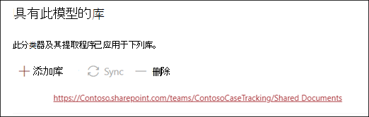
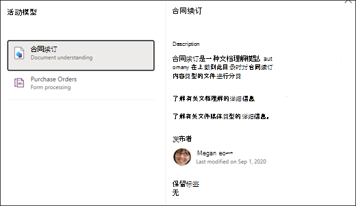

# 在 Microsoft SharePoint Syntex 中应用文档理解模型

 

> [!VIDEO https://www.microsoft.com/videoplayer/embed/RE4CSoL]

 

发布文档理解模型后，可将其应用到 Microsoft 365 租户中的一个或多个 SharePoint 文档库。

> [!NOTE]
> 只能将模型应用到你有权访问的文档库。

## 将模型应用于文档库。

要将模型应用到 SharePoint 文档库，请执行以下操作：

1. 在模型主页上，在 **“将模型应用于库”** 平铺中，选择 **“发布模型”**。 或者，你可以在 **应用了模型的库** 部分选择 **“+ 添加库”**。  

     

2. 然后，你可以选择包含要应用模型的文档库的 SharePoint 网站。 如果该网站未显示在列表中，请使用搜索框进行查找。 

     

    > [!NOTE]
    > 你必须拥有 *管理列表* 权限，或者 *编辑* 对应用模型的文档库的权限。 

3. 选择网站后，选择要向其应用模型的文档库。 在此示例中，从 *Contoso Case 跟踪* 网站中，选择 “*文档"* 文档库。 

     

4. 由于模型与内容类型相关联，因此将其应用到库时，它将添加该内容类型及其视图，其中包含作为列显示的已提取标签。 默认情况下，此视图是库的默认视图，但是你可以选择 **“高级设置”** ，然后取消选定 **“将此新视图设置为默认”**，不让其成为默认视图。 

     

5. 选择 **“添加”** 将模型应用到库中。 
6. 在模型主页上，在 **应用了此模型库** 部分，你会看到列出的 SharePoint 网站的 URL。 

     

7. 转到你的文档库，并确保你处于模型的文档库视图中。 请注意，如果选择文档库名称旁的“信息”按钮，会显示一条消息，说明文档库已应用一个模型。

      

    你可以选择 **“查看活动模型”** 来查看应用于文档库的任何模型的详细信息。

8. 在 **“活动模型”** 窗格中，你可以看到应用于文档库的模型。 选择一个模型以查看关于它的更多详细信息，例如模型的描述、发布该模型的人，以及该模型是否将保留标签应用于它所分类的文件。

      

将模型应用到文档库之后，你可以开始将文档上传到网站并查看结果。

模型将标识任何具有模型的关联内容类型的文件，并将其列在视图中。 如果你的模型有任何提取器，则视图会显示每个文件中正在提取的数据的列。

### 将模型应用于文档库中已有的文件

应用的模型将处理在应用后上载到文档库的所有文件，还可执行以下操作，在应用模型之前对文档库中已存在的文件运行该模型：

1. 在文档库中，选择要由模型处理的文件。
2. 选择文件后，**“分类和提取”** 将在文档库功能区中显示。 选择 **“分类和提取”**。
3. 将向队列添加所选的文件进行处理。

        

> [!NOTE]
> 您可以将单个文件复制到库中，然后将其应用于模型，但不能应用于文件夹。

### 分类日期字段

SharePoint Syntex 文档理解模型或表单处理模型应用于文档库时，文档库架构包含一个<b>“分类日期”</b>字段。 默认情况下，此字段为空，但由模型处理和分类文档时，此字段会更新为完成日期时间戳。 

     

分类日期字段由[<b>“内容理解模型对文件进行分类时”</b>触发器](/connectors/sharepointonline/#when-a-file-is-classified-by-a-content-understanding-model)使用，以便在 Syntex 内容理解模型完成处理文件并更新“分类日期”字段后运行 Power Automate 流程。

    

<b>“内容理解模型对文件进行分类时”</b>触发器然后可用于使用从文件中提取的任何信息启动另一个工作流。

## 另请参阅
[创建分类器](create-a-classifier.md)

[创建提取程序](create-an-extractor.md)

[文档理解概述](document-understanding-overview.md)