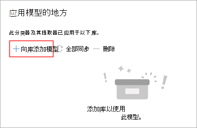
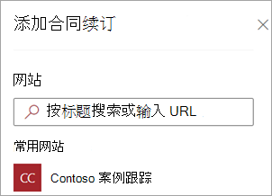
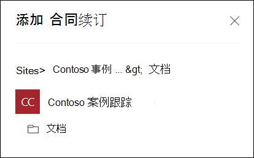
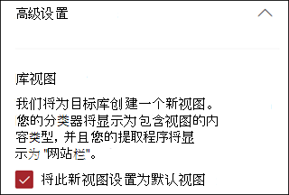
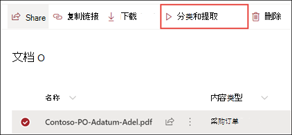

# 在 Microsoft SharePoint Syntex 中应用文档理解模型

 

> [!VIDEO https://www.microsoft.com/videoplayer/embed/RE4CSoL]

 

发布文档理解模型后，可以将其应用于Microsoft 365租户中的一个或多个SharePoint文档库。

> [!NOTE]
> 只能将模型应用到你有权访问的文档库。

## 将模型应用到文档库

若要将模型应用于SharePoint文档库：

1. 在模型主页上，在“ **将模型应用于库”磁** 贴上，选择 **“应用模型**”。 或者，在 **“应用模型的位置”** 部分中，选择 **“+添加库**”。

    

2. 然后，你可以选择包含要应用模型的文档库的 SharePoint 网站。 如果网站未显示在列表中，请使用搜索框查找它。

    

    > [!NOTE]
    > 你必须拥有 *管理列表* 权限，或者 *编辑* 对应用模型的文档库的权限。

3. 选择网站后，选择要向其应用模型的文档库。 在此示例中，从 *Contoso Case 跟踪* 网站中，选择 “*文档"* 文档库。

    

4. 由于模型与内容类型相关联，因此将模型应用于库时，它将添加内容类型，并使用提取的标签更新默认视图，这些标签显示为列。 但是，可以选择 **“高级”设置** ，以选择保留当前库视图或使用包含模型信息和文件缩略图的新视图。 如果选择保留当前库视图，则库视图菜单下仍可使用包含模型信息的新视图。

    

    有关详细信息，请参阅本文后面 [的文档库中的“更改视图](#change-the-view-in-a-document-library) ”。

5. 选择 **“添加”** 将模型应用到库中。

6. 在模型主页上的“**应用模型的位置**”部分中，应会看到列出了SharePoint网站的名称。

7. 转到你的文档库，并确保你处于模型的文档库视图中。 选择 **AutomateView** >  **文档理解模型**。

8. 在 **“审阅模型”和“应用新模型”** 页上，选择“ **应用** ”选项卡以查看应用于文档库的模型。

     

9. 选择 **“查看模型详细信息** ”以查看有关模型的信息，例如模型说明、发布模型的人员，以及模型是否将保留或敏感度标签应用于其分类的文件。

将模型应用到文档库之后，你可以开始将文档上传到网站并查看结果。

该模型标识具有模型关联内容类型的任何文件和文件夹，并在视图中列出这些文件和文件夹。 如果模型有任何提取器，视图会显示从每个文件或文件夹中提取的数据的列。

> [!NOTE]
> 如果将两个或多个文档理解模型应用于同一库，则使用平均置信度分数最高的模型对上传的文件进行分类。 提取的实体将仅来自应用的模型。   如果将自定义表单处理模型和文档理解模型应用于同一库，则使用文档理解模型和该模型的任何定型提取器对该文件进行分类。 如果有任何与表单处理模型匹配的空列，则将使用这些提取的值填充这些列。

## 将更改同步到一个或多个库

将模型发布到多个文档库，然后更新模型（例如添加或删除提取器）时，需要将更新推送到已应用模型的所有库。

同步对所有已应用库的更改：

1. 在模型主页上的“ **应用模型的位置** ”部分中，选择 **“全部同步**”。

     

若要同步对一个或唯一所选库的更改：

1. 在模型主页上的“ **应用模型的位置”** 部分中，选择要将更改应用到的库或库。

2. 选择“**同步**”。

     

## 将模型应用于文档库中已有的文件和文件夹内容

虽然应用的模型处理在应用文档库后上传到文档库的所有文件和文件夹内容，但你也可以执行以下操作，在应用模型之前对文档库中已存在的文件和文件夹内容运行模型：

1. 在文档库中，选择要由模型处理的文件和文件夹。

2. 选择文件和文件夹后， **分类和提取** 将显示在文档库功能区中。 选择 **“分类和提取”**。

       

3. 所选的文件和文件夹将添加到要处理的队列中。

    > [!NOTE]
    > 你将收到一条消息，指示分类可能需要多长时间。 如果仅选择文件，分类可能需要长达 30 分钟的时间。 如果选择了一个或多个文件夹，分类可能需要长达 24 小时。

### 分类日期字段

将SharePoint Syntex文档理解模型 (或表单处理模型) 应用到文档库时，“**分类日期”** 字段将包含在库架构中。 默认情况下，此字段为空。 但是，当文档由模型处理和分类时，此字段将使用完成日期时间戳进行更新。 

    

“**分类日期”** 字段由 [**内容理解模型触发器对文件进行分类**](/connectors/sharepointonline/#when-a-file-is-classified-by-a-content-understanding-model)，以便在模型处理完文件或文件夹的内容并更新了“**分类日期”** 字段后运行Power Automate流。

   

**然后，当文件由内容理解模型** 触发器分类时，可以使用文件或文件夹中的任何提取的信息来启动流。

例如，当使用 **分类日期** 标记模型时，可以在 **SharePoint Syntex处理文件流后使用“发送电子邮件**”来通知用户新文件已由SharePoint文档库中的模型处理和分类。

若要运行流，请执行以下操作：

1. 选择文件，然后选择“**集成** > **Power Automate** > **创建流**。

2. 在 **“创建流**”面板上，选择 **SharePoint Syntex处理文件后发送电子邮件**。

     

## 更改文档库中的视图

[!INCLUDE [Change the view in a document library](../includes/change-library-view.md)]

## 另请参阅

[创建分类器](create-a-classifier.md)

[创建提取程序](create-an-extractor.md)

[文档理解概述](document-understanding-overview.md)
