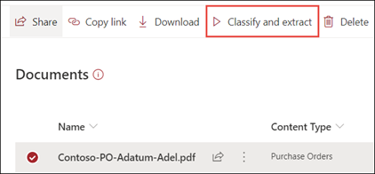

# 在 Microsoft SharePoint Syntex 中应用文档理解模型

 

> [!VIDEO https://www.microsoft.com/videoplayer/embed/RE4CSoL]

 

发布文档理解模型后，可以应用于 SharePoint 租户中的一个或多个Microsoft 365库。

> [!NOTE]
> 只能将模型应用到你有权访问的文档库。

## 将模型应用到文档库

要将模型应用到 SharePoint 文档库，请执行以下操作：

1. 在模型主页上的"将模型 **应用到库"磁贴上**，选择"**应用模型"。** 或者，在 **应用模型的地方部分** ，选择 **+添加库**。

    

2. 然后，你可以选择包含要应用模型的文档库的 SharePoint 网站。 如果该网站未显示在列表中，请使用搜索框进行查找。

    

    > [!NOTE]
    > 你必须拥有 *管理列表* 权限，或者 *编辑* 对应用模型的文档库的权限。

3. 选择网站后，选择要向其应用模型的文档库。 在此示例中，从 *Contoso Case 跟踪* 网站中，选择 “*文档"* 文档库。

    

4. 由于模型与内容类型相关联，因此在将模型应用到库时，它将添加内容类型及其视图，其中提取的标签以列显示。 默认情况下，此视图是库的默认视图。 但是，可以选择不作为默认视图，选择"高级"设置并清除"将 **这个新视图设置为默认视图"** 复选框。

    

5. 选择 **“添加”** 将模型应用到库中。

6. 在模型主页上的"**应用** 模型的地方"部分，应看到列出的SharePoint的名称。

7. 转到你的文档库，并确保你处于模型的文档库视图中。 选择 **"自动化**  >  **查看文档了解模型"。**

8. 在"**审阅模型和应用新模型"** 页上，选择"已应用"选项卡以查看应用于文档库的模型。

     

9. 选择 **"** 查看模型详细信息"可查看有关模型的信息，例如模型说明、模型发布者以及模型是否将保留标签或敏感度标签应用于它分类的文件。

将模型应用到文档库之后，你可以开始将文档上传到网站并查看结果。

模型标识具有模型关联内容类型的任何文件和文件夹，并列出它们在你的视图中。 如果您的模型有任何提取程序，则视图将显示您从每个文件或文件夹提取的数据的列。

## 将更改同步到一个或多个库

将模型发布到多个文档库，然后更新模型（如添加或删除提取程序）时，需要将更新推送到已应用模型的所有库。

同步所有已应用库的更改：

1. 在模型主页上的"**应用** 模型的地方"部分，选择"**全部同步"。**

     

若要将更改同步到一个或仅选定的库：：

1. 在模型主页上的" **应用** 模型的位置"部分，选择要应用更改的库。

2. 选择“**同步**”。

     

## 将模型应用到文档库中已有的文件和文件夹内容

虽然应用的模型处理应用后上载到文档库的所有文件和文件夹内容，但您也可以执行以下操作，以在应用模型之前对文档库中已存在的文件和文件夹内容运行模型：

1. 在文档库中，选择要由模型处理的文件和文件夹。

2. 选择文件和文件夹后 **，"分类和提取** "将显示在文档库功能区中。 选择 **“分类和提取”**。

       

3. 所选的文件和文件夹将添加到队列中进行处理。

    > [!NOTE]
    > 你将收到一条消息，指示分类可能需要多久。 如果仅选择了文件，分类可能最多需要 30 分钟。 如果你已选择一个或多个文件夹，分类最多可能需要 24 小时。

### 分类日期字段

当SharePoint Syntex文档理解或表单处理模型应用于文档库时，分类 **日期** 字段将包含在库架构中。 默认情况下，此字段为空。 但是，当文档由模型处理和分类时，此字段会使用完成日期时间戳进行更新。 

    

"分类 **日期**"字段由"当 文件由内容理解模型分类时"触发器使用，在 Syntex 内容理解模型完成对文件或文件夹的处理并更新了"分类日期"字段后，运行Power Automate 流。

   

The **When a file is classified by a content understanding model** trigger can then be used to start another workflow using any extracted information from the file or folder.

## 另请参阅

[创建分类器](create-a-classifier.md)

[创建提取程序](create-an-extractor.md)

[文档理解概述](document-understanding-overview.md)
