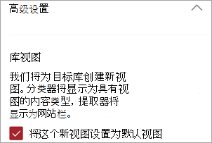

# 在 Microsoft SharePoint Syntex 中应用文档理解模型Apply a document understanding model in Microsoft SharePoint Syntex

 

> [!VIDEO https://www.microsoft.com/videoplayer/embed/RE4CSoL]

 

发布文档理解模型后，可将其应用到 Microsoft 365 租户中的一个或多个 SharePoint 文档库。After publishing your document understanding model, you can apply it to one or more SharePoint document library in your Microsoft 365 tenant.

> [!NOTE]
> 只能将模型应用到你有权访问的文档库。You are only able to apply the model to document libraries that you have access to.

## 将模型应用于文档库。Apply your model to a document library.

要将模型应用到 SharePoint 文档库，请执行以下操作：To apply your model to to a SharePoint document library:

1. 在模型主页上，在 **“将模型应用于库”** 平铺中，选择 **“发布模型”**。On model home page, on the **Apply model to libraries** tile, select **Publish model**. 或者，你可以在 **应用了模型的库** 部分选择 **“+ 添加库”**。Or you can select  **+Add Library** in the **Libraries with this model** section.  

     

2. 然后，你可以选择包含要应用模型的文档库的 SharePoint 网站。You can then select the SharePoint site that contains the document library that you want to apply the model to. 如果该网站未显示在列表中，请使用搜索框进行查找。If the site does not show in the list, use the search box to find it. 

     

    > [!NOTE]
    > 你必须拥有 *管理列表* 权限，或者 *编辑* 对应用模型的文档库的权限。You must have *Manage List* permissions or *Edit* rights to the document library you are applying the model to. 

3. 选择网站后，选择要向其应用模型的文档库。After selecting the site, select the document library to which you want to apply the model. 在此示例中，从 *Contoso Case 跟踪* 网站中，选择 “*文档"* 文档库。In the sample, select the *Documents* document library from the *Contoso Case Tracking* site. 

     

4. 由于模型与内容类型相关联，因此将其应用到库时，它将添加该内容类型及其视图，其中包含作为列显示的已提取标签。Since the model is associated to a content type, when you apply it to the library it will add the content type and its view with the labels you extracted showing as columns. 默认情况下，此视图是库的默认视图，但是你可以选择 **“高级设置”** ，然后取消选定 **“将此新视图设置为默认”**，不让其成为默认视图。This view is the library's default view by default, but you can optionally choose to not have it be the default view by selecting **Advanced settings** and deselecting **Set this new view as default**. 

     

5. 选择 **“添加”** 将模型应用到库中。Select **Add** to apply the model to the library. 
6. 在模型主页上，在 **应用了此模型库** 部分，你会看到列出的 SharePoint 网站的 URL。On the model home page, in the **Libraries with this model** section, you should see the URL to the SharePoint site listed. 

     

7. 转到你的文档库，并确保你处于模型的文档库视图中。Go to your document library and make sure you are in the model's document library view. 请注意，如果选择文档库名称旁的“信息”按钮，会显示一条消息，说明文档库已应用一个模型。Notice that if you select the information button next to the document library name, a message notes that the document library has a model applied to it.

      

    你可以选择 **“查看活动模型”** 来查看应用于文档库的任何模型的详细信息。You can the select **View active models** to see details about any models that are applied to the document library.

8. 在 **“活动模型”** 窗格中，你可以看到应用于文档库的模型。In the **Active models** pane, you can see the models that are applied to the document library. 选择一个模型以查看关于它的更多详细信息，例如模型的描述、发布该模型的人，以及该模型是否将保留标签应用于它所分类的文件。Select a model to see more details about it, such as a description of the model, who published the model, and if the model applies a retention label to the files it classifies.

      

将模型应用到文档库之后，你可以开始将文档上传到网站并查看结果。After applying the model to the document library, you can begin uploading documents to the site and see the results.

模型将标识任何具有模型的关联内容类型的文件，并将其列在视图中。The model identifies any files with model’s associated content type and lists them in your view. 如果你的模型有任何提取器，则视图会显示每个文件中正在提取的数据的列。If your model has any extractors, the view displays columns for the data you are extracting from each file.

### 将模型应用于文档库中已有的文件Apply the model to files already in the document library

应用的模型将处理在应用后上载到文档库的所有文件，还可执行以下操作，在应用模型之前对文档库中已存在的文件运行该模型：While an applied model processes all files uploaded to the document library after it is applied, you can also do the following to run the model on files that already exists in the document library prior to the model being applied:

1. 在文档库中，选择要由模型处理的文件。In your document library, select the files that you want to be processed by your model.
2. 选择文件后，**“分类和提取”** 将在文档库功能区中显示。After selecting your files, **Classify and extract** will appear in the document library ribbon. 选择 **“分类和提取”**。Select **Classify and extract**.
3. 将向队列添加所选的文件进行处理。The files you selected will be added to the queue to be processed.

        

> [!NOTE]
> 您可以将单个文件复制到库中，然后将其应用于模型，但不能应用于文件夹。You can copy individual files to a library and apply them to a model, but not folders.

### 分类日期字段The Classification Date field

SharePoint Syntex 文档理解模型或表单处理模型应用于文档库时，文档库架构包含一个<b>“分类日期”</b>字段。When a SharePoint Syntex document understanding or form processing model is applied to a document library, a <b> Classification date </b> field is included in the library schema. 默认情况下，此字段为空，但由模型处理和分类文档时，此字段会更新为完成日期时间戳。By default this field is empty, but when documents are processed and classified by a model, this field is updated with a date-time stamp of completion. 

     

分类日期字段由[<b>“内容理解模型对文件进行分类时”</b>触发器](/connectors/sharepointonline/#when-a-file-is-classified-by-a-content-understanding-model)使用，以便在 Syntex 内容理解模型完成处理文件并更新“分类日期”字段后运行 Power Automate 流程。The Classification date field is used by the [<b>When a file is classified by a content understanding model</b> trigger](/connectors/sharepointonline/#when-a-file-is-classified-by-a-content-understanding-model) to run a Power Automate flow after a Syntex content understanding model has finished processing a file and updated the "Classification date" field.

    

<b>“内容理解模型对文件进行分类时”</b>触发器然后可用于使用从文件中提取的任何信息启动另一个工作流。The <b>When a file is classified by a content understanding model</b> trigger can then be used to start another workflow using any  extracted information from the file.

## 另请参阅See Also
[创建分类器Create a classifier](create-a-classifier.md)

[创建提取程序Create an extractor](create-an-extractor.md)

[文档理解概述Document Understanding overview](document-understanding-overview.md)
