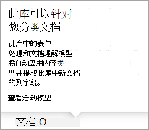

# 在 SharePoint 整合中向模型应用保留标签

 

> [!VIDEO https://www.microsoft.com/videoplayer/embed/RE4GydO]  

 

可以轻松将 [保留标签](../compliance/retention.md) 应用于 Microsoft SharePoint Syntex 中的文档理解模型。 这可同时针对文档了解和表单处理模型执行这一操作。

保留标签允许将保留设置应用于模型识别的文档。  例如，希望模型不仅可以识别上传到文档库的任何 *保险通知* 文档，还可将 *商务* 保留标记应用于这些文档，以便在指定时间段（如接下来的五个月）中不能从文档库中删除这些文档。

可以通过模型主页上的模型设置将预先存在的保留标签应用于模型。 

> [!Important]
> 若要将保留标签应用于文档理解模型，需要在文档理解模型中创建和发布Microsoft 365 合规中心。  

## 将保留标签添加到文档理解模型

1. 在模型主页中，选择 **模型设置**。 
2. 在 **模型设置** 的 **安全和合规** 部分，选择 **保留标签** 菜单以查看可应用于模型的保留标签列表。 
   
3. 选择要应用于模型的保留标签，然后选择 **保存**。 

将保留标签应用于模型后，可将其应用于：
- 新文档库
- 已应用模型的文档库
 
## 将保留标签应用于已应用模型的文档库

如果文档理解模型已应用于文档库，可执行以下操作来同步保留标签更新以将其应用于文档库： 

1. 在模型主页的 **带模型的库** 部分，选择要应用保留标签更新的文档库。   
2. 选择 **同步**。  
   

应用更新并将其同步到模型后，可通过执行以下操作来确认此更新已应用：

1. 在内容中心的 **带模型的库** 部分，单击应用了已更新模型的库。  
2. 在文档库视图中，选择“信息”图标以查看模型属性。   
3. 在 **活动模型** 列表中，选择已更新模型。 
4. 在 **保留标签** 部分，将看到已应用保留标签的名称。 

文档库的模型视图页面将显示新的 **保留标签** 列。  当模型对其标识为属于其内容类型的文件进行分类并将文件在库视图中列出时，保留标签列也将显示通过模型对其应用的保留标签名称。

例如，模型识别的所有 *保险通知* 文档也将拥有已应用的 *商务* 保留标签，以防止在五个月中从文档库中删除这些文档。 如果尝试从文档库中删除文件，将显示一条错误消息，提示由于应用了保留标签，不允许删除文件。

## 向表单处理模型添加保留标签

> [!Important]
> 若要将保留标签应用于表单处理模型，需要在表单处理模型中创建和发布Microsoft 365 合规中心。  

创建模型时，可以将保留标签应用于窗体处理模型，或将标签应用于现有模型。

### 创建表单处理模型时添加保留标签

1. 在新建 [窗体处理模型时，](./create-a-form-processing-model.md)" <b>"设置。</b>
2. 在 <b>高级设置</b>中，在 <b>"保留标签</b> "部分中，选择菜单，然后选择要应用到模型的保留标签。</b>

 
      

3.  完成其余模型设置后，请选择 <b>创建</b> 以生成模型。

### 将保留标签添加到现有表单处理模型

可以通过不同方式将保留标签添加到现有表单处理模型中：
- 通过文档库中的"自动"菜单
- 通过文档库中的活动模型设置 

#### 通过"自动"菜单将保留标签添加到现有表单处理模型

可以通过应用模型的文档库中的"自动"菜单，将保留标签添加到现有表单处理模型中。

1. 在应用表单处理模型的文档库中，选择" <b>自动执行</b> "菜单，选择 <b>AI Builder</b>，然后选择 <b>"查看表单处理模型的详细信息</b>。

    

2. 在模型详细信息的" <b>标签"</b> 部分，选择要应用保留标签。  然后选择“<b>保存</b>”。

       

#### 在活动模型设置中将保留标签添加到现有表单处理模型

可以通过应用模型的文档库中的活动模型设置，将保留标签添加到现有表单处理模型中。

1. 在应用模型的 SharePoint 文档库中，选择 <b>查看活动模型</b> 图标，然后选择 <b>查看活动</b>。</b>

     

2. 在 <b>活动</b>中，选择要应用保留标签的窗体处理模型。

       

3. 在模型详细信息的" <b>标签"</b> 部分，选择要应用保留标签。  然后选择“<b>保存</b>”。

> [!NOTE]
> 您必须是模型设置窗格的模型所有者，然后可编辑。 

## 另请参阅
[创建分类器](create-a-classifier.md)

[创建提取程序](create-an-extractor.md)

[文档理解概述](document-understanding-overview.md)
