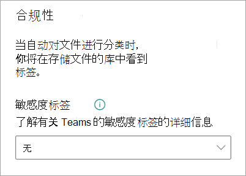

# 在 Microsoft SharePoint Syntex 中向模型应用保留标签

可以轻松将 [敏感度标签](../compliance/sensitivity-labels.md) 应用于 Microsoft SharePoint Syntex 中的文档理解模型。 此功能尚不可用于表单处理模型。

敏感度标签使你可以对模型标识的文档应用加密。 例如，您希望模型不仅识别任何包含上载到文档库的银行帐户编号或信用卡号的财务文档，还希望应用使用加密设置配置的敏感度标签，以限制可以访问该内容的人及其使用方式。 SharePoint Syntex 模型遵循 [标签顺序](../compliance/apply-sensitivity-label-automatically.md#how-multiple-conditions-are-evaluated-when-they-apply-to-more-than-one-label) 规则，也不会覆盖用户手动应用于文件的现有标签。 

可以通过模型主页上的模型设置将预先存在的敏感度标签应用于模型。 标签必须已经发布，可以在模型设置中进行选择。

> [!Important]
> 对于可应用于内容理解模型的保留标签，需要 [在 Microsoft 365 合规中心中创建和发布](../business-video/create-sensitivity-labels.md)。

## 将敏感度标签添加到文档理解模型

1. 从模型主页中，选择“**模型设置**”。

   

2. 在“**模型设置**”窗格中的“**合规性**”部分中，选择“**敏感度标签**”菜单，以查看可应用于模型的敏感度标签列表。

    

3. 选择要应用于模型的敏感度标签，然后选择“**保存**”。

将敏感度标签应用于模型后，可以将其应用于：

- 新文档库
- 已应用模型的文档库
 
### 将敏感度标签应用于已应用该标签模型的文档库

如果已将文档理解模型应用于文档库，则可执行以下操作来同步敏感度标签更新以将其应用于文档库：

1. 在模型主页的“**带模型的库**”部分中，选择要应用敏感度标签更新的文档库。

2. 选择“**同步**”。

   

应用更新并将其同步到模型后，可通过执行以下步骤来确认此更新已应用：

1. 在内容中心的“**带模型的库**”部分中，单击应用了已更新模型的库。 

2. 在文档库视图中，选择“信息”图标以查看模型属性。

3. 在 **活动模型** 列表中，选择已更新模型。

4. 在“**敏感度标签**”部分中，将看到已应用的敏感度标签的名称。

在文档库中模型视图页面上，将显示新的“**敏感度标签**”列。 当模型对其标识为属于其内容类型的文件进行分类并将文件在库视图中列出时，**敏感度标签** 列也将显示通过模型对其应用的敏感度标签名称。

例如，模型识别的所有财务文档也将具有应用于它们的 *加密* 敏感度标签，防止未授权人员对其进行访问。 如果未授权人员尝试从文档库中访问文件，将显示一条错误消息，提示由于应用了敏感度标签，不允许访问文件。

<!---
## Add a sensitivity label to a form processing model

> [!Important]
> For sensitivity labels to be available to apply to your form processing model, they need to be [created and published in the Microsoft 365 Compliance Center](../business-video/create-sensitivity-labels.md).

You can either apply a sensitivity label to a form processing model when you are creating a model, or apply it to an existing model.

### Add a sensitivity label when you create a form processing model

1. When you [create a new form processing model](create-a-form-processing-model.md), select **Advanced settings**.

2. In **Advanced settings**, in the **Sensitivity label** section, select the menu and then select the sensitivity label you want to apply to the model.

3.  After you've completed your remaining model settings, select **Create** to build your model.

### Add a sensitivity label to an existing form processing model

You can add a sensitivity label to an existing form processing model in different ways:

- Through the **Automate** menu in the document library
- Through the **Active model** settings in the document library 

#### Add a sensitivity label to an existing form processing model through the Automate menu

You can add a sensitivity label to an existing form processing model that you own through the **Automate** menu in the document library in which the model is applied.

1. In your document library to which the form processing model is applied, select the **Automate** menu, select **AI Builder**, and then select **View form processing model details**.

2. On the **Model details** pane, in the **Sensitivity label** section, select the sensitivity label you want to apply. Then select **Save**.

#### Add a sensitivity label to an existing form processing model in the active model settings

You can add a sensitivity label to an existing form processing model that you own through the **Active model** settings in the document library in which the model is applied.

1. In the SharePoint document library in which the model is applied, select the **View active models** icon, and then select **View active models**.

2. In **Active models**, select the form processing model to which you want to apply the sensitivity label.

3. On the **Model details** pane, in the **Sensitivity label** section, select the sensitivity label you want to apply. Then select **Save**.

   > [!NOTE]
   > You must be the model owner for the **Model settings** pane to be editable. 
--->

## 另请参阅

[应用保留标签](apply-a-retention-label-to-a-model.md)

[创建分类器](create-a-classifier.md)

[创建提取程序](create-an-extractor.md)

[文档理解概述](document-understanding-overview.md)
