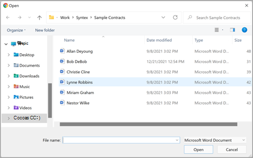
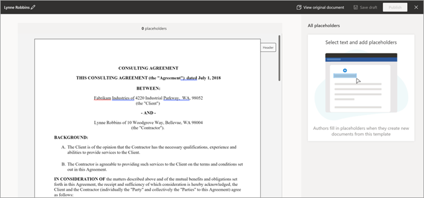
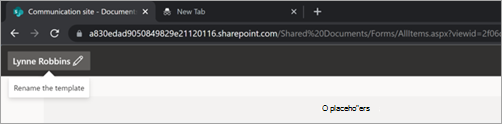
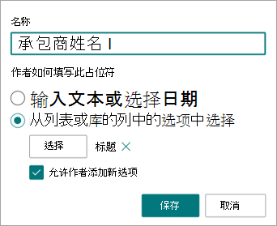
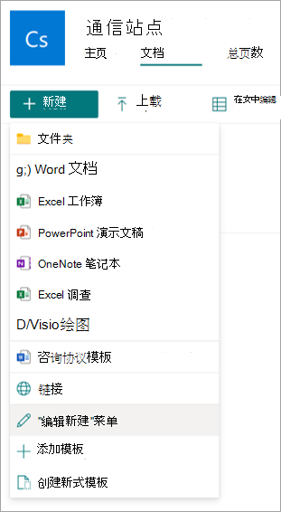
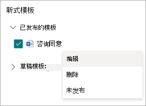
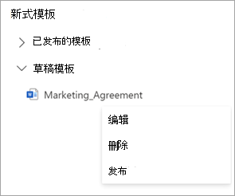
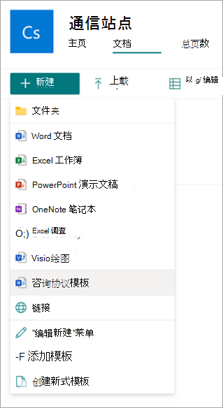
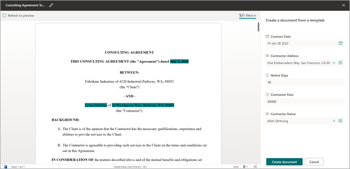

# 使用 Microsoft 网站中的内容程序集创建SharePoint Syntex

您可以使用 SharePoint Syntex自动生成标准重复业务文档，例如合同、工作声明、服务协议、同意书、销售说明和通信。 通过使用内容程序集，您可以更快速、更一致地执行所有这些操作，并且更不容易SharePoint Syntex。

使用内容程序集，可以使用现有文档创建新式模板，然后使用该模板将 SharePoint 列表或用户输入作为数据源自动生成新内容。

> [!NOTE]
> 您必须是许可用户SharePoint Syntex访问和使用内容程序集功能。 您还必须具有管理列表SharePoint权限。

## 创建新式模板

按照以下步骤创建新式模板。

1. 在 Sharepoint 文档库中，选择"**新建**  >  **创建新式模板"。** 
 
   

2. 选择要用作创建新式模板的基础的现有 Word 文档，然后选择"打开 **"。** 
 
   

   > [!NOTE]
   > 目前，只能上载 Word 文档（.docx 扩展名) 创建模板。 Upload存储或桌面访问 Word 文档。

3. 上载文档后，该文档将显示在 template studio 中，您可以在其中将文档转换为模板。
 
   

4. 在 template studio 的左上角，选择模板的名称。 默认名称是用于创建模板的文档的名称。 如果要重命名模板，请选择该名称旁边的默认名称或铅笔图标，键入新名称，然后选择 **Enter**。
 
   

5. 为文档中用户可能想要从一个文档更改为另一个文档的所有动态文本创建占位符。 例如，您可能需要为输入创建占位符，例如公司名称、客户端名称、地址、电话号码或日期。

    若要创建占位符，请选择文本 (例如日期) 。 All **placeholders** panel will open， where you'll give the placeholder a relevant name and choose the type of input you want to associate with the placeholder.
 
   

   目前，有两种方法供用户填写占位符：

   - [输入文本或选择日期](#associate-a-placeholder-by-entering-text-or-selecting-a-date)
   - [从列表或库列中的选项中选择](#associate-a-placeholder-by-selecting-from-choices-in-a-column-of-a-list-or-library)

### 通过输入文本或选择日期来关联占位符 

在" **所有占位符"面板** 上：

1. 在 **"名称** "字段中，输入占位符的相关名称。

   

2. 在" **作者如何填充此占位符"部分** ，选择 **"输入文本"或选择日期**。

3. 在 **"信息类型** "字段中，数据类型要与占位符关联的字段。 目前，有六个选项可用：**单** 行文本、多行 **文本**、数字、**日期和时间**、**电子邮件** 和 **超链接**。 

4. 选择“**添加**”。

### 通过从列表或库的列中的选项选择来关联占位符

在" **所有占位符"面板** 上：

1. 在 **"名称** "字段中，输入占位符的相关名称。

   

2. 在"**作者如何填写此** 占位符"部分，选择"从列表或库的列中的选项中选择"，然后选择"选择 **"。**

3. 在"**选择用于添加源列的列表**"页上，选择要使用的列表，然后选择"下一步 **"。**

   

4. 在"**从现有列表选择** 源列"页上，选择要与占位符关联的列名称，然后选择"保存 **"。** 

   

    如果要再次查看列表的原始页面，请选择"转到 (列表名称) 列表底部的"链接"。

5. 完成后，将看到列表字段已与占位符关联。

   

6. 如果希望用户能够手动添加输入，除了从列表中选择之外，请选择"允许作者 **添加新选项"。** 在这种情况下，手动输入的默认值数据类型 *文本单行 。* 此外，作者输入的值将仅用于生成文档。 它们不会添加到列表SharePoint列表。
 
你可以创建所需多的占位符。 完成后，可以选择将模板另存为草稿或发布模板。

   - **保存草稿** – 将模板另存为草稿，你稍后可以访问它。 通过从文档库中选择"新建编辑"菜单，可以从"新式模板"部分查看、编辑或  >  发布保存的草稿。 
   - **发布** – 发布组织中其他用户用于创建文档的模板。 通过从文档库中选择"新建编辑"菜单，可以从"新式模板"部分查看、编辑或  >  取消发布已发布的模板。 

## 编辑新式模板

如果需要编辑现有模板或者删除或取消发布模板，请按照以下步骤操作。

1. 从 Sharepoint 文档库中，选择"**新建**  >  **编辑""新建"菜单**。 
 
   

2. 在"**编辑新建"菜单** 面板的"新式模板"部分，选择要编辑的已发布或草稿模板。
 
   

3. 编辑已发布的模板或草稿模板：

   - 对于 **"已发布的模板"，** **选择**   "编辑"以打开可在其中编辑已发布模板的模板 Studio。 还可以选择删除或取消发布模板。 
 
      

   - 对于 **"草稿模板"，** **选择**   "编辑"以打开可在其中编辑草稿模板的 template studio。 您还可以选择删除或发布模板。
 
      

## 从新式模板创建文档

可以使用已发布 *的新式* 模板快速创建类似的文档，而无需从头开始。 若要使用已发布模板创建文档，请按照以下步骤操作：

1. 从 Sharepoint 文档库中，选择 **"新建**"，然后选择想要使用的新式模板。
 
   

2. 模板将在 template studio 中打开。

3. 在"**从模板创建文档"面板** 上，输入信息，然后选择"**创建文档"。**

   

   为了帮助减少填充占位符值所涉及的时间和精力，SharePoint Syntex提供：

      - 帮助您在从列表中选择值时轻松选取值的建议。
      - 如果能够唯一标识与同一列表关联的占位符的记录，自动填充占位符值。

> [!NOTE]
> - 目前，Microsoft Word模板仅支持) 文档 (.docx 扩展名。 在上载文档之前，请确保 Word 文档未启用 **跟踪更改** 或注释。 如果文档包含图像的文本占位符，请确保它们不是文本换行的。
>- 模板和文档与一个文档库相关联。 若要在另一个文档库中使用该模板，您需要在该文档库中再次创建模板。
>- 用于创建新式模板的上载文档将另存为单独的副本，并放置在文档库的 /forms 目录中。 磁盘上的原始文件不会受到影响。
>- 只能为文本创建占位符。 目前，不支持图像、智能图片、表格和项目符号列表。
>- 从模板创建文档后，文档不会与该模板关联。

 
