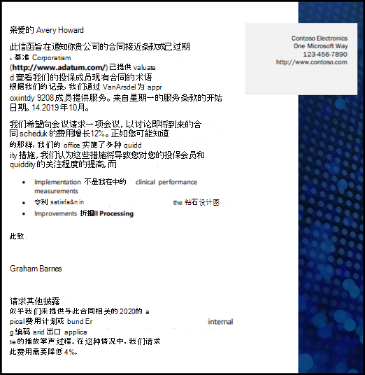
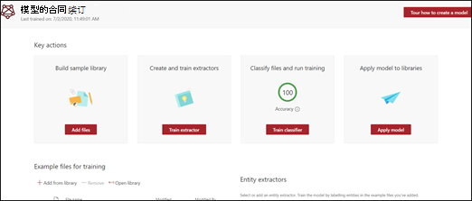
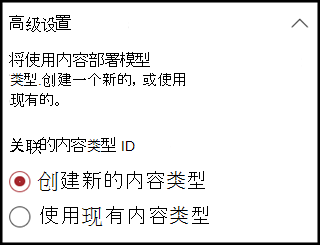
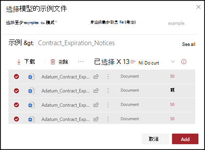
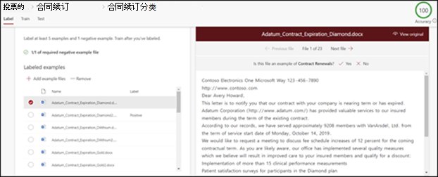
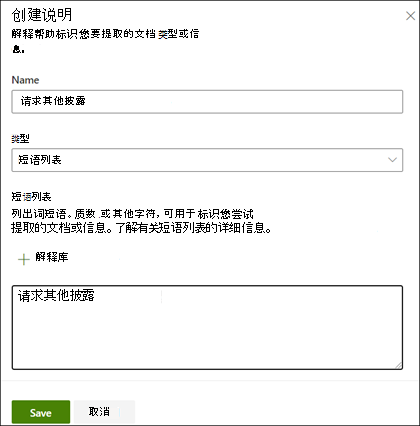
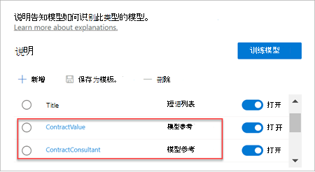

# 在 Microsoft SharePoint Syntex 中创建分类器

 

> [!VIDEO https://www.microsoft.com/videoplayer/embed/RE4CL0R]  

 

分类器是一种模型类型，可用于自动化文档类型的标识和分类。 例如，可能想要标识所有添加到文档库中的“*合同续订*”文档，如下图所示。

创建分类器使你能够创建将与模型关联的新 [SharePoint 内容类型](/sharepoint/governance/content-type-and-workflow-planning#content-type-overview)。

创建分类器时，需要创建 *说明* 来定义模型。 这可以使你记下预期会一贯地找到此文档类型的常见数据。 

使用文档类型的示例（“示例文件”）来“培训”你的模型，以便识别具有相同内容类型的文件。

若要创建分类器，需要执行以下操作：
1. 命名模型。
2. 添加示例文件。
3. 标记示例文件。
4. 创建说明。
5. 测试模型。

> [!NOTE]
> 虽然你的模型使用分类器来标识和分类文档类型，但是你也可以选择从模型识别的每个文件中提取特定信息。 可通过创建 **提取程序** 并添加到模型中来实现此操作。 请参阅“[创建提取程序](create-an-extractor.md)”。

## 命名模型

创建模型的第一步是为其命名：

1. 从内容中心中，选择“**新建**”，然后选择“**创建模型**”。
2. 在“**新的了解模型文档**”窗格中，在“**名称**”的字段中键入模型的名称。 例如，如果想要标识合同续订文档，可将该模型命名“*合同续订*”。
3. 选择 **“创建”**。 这将为该模型创建主页。 

    

创建模型时，也将创建新的网站内容类型。 内容类型表示具有共同特征的文档类别，并共享该特定内容的列或元数据属性的集合。 可通过“[内容类型库](https://support.microsoft.com/office/create-or-customize-a-site-content-type-27eb6551-9867-4201-a819-620c5658a60f)”管理 SharePoint 内容类型。 在此示例中，创建模型时，将创建新的“*合同续订*”内容类型。

如果想要将此模型映射到 SharePoint 内容类型库中的现有企业内容类型以使用其架构，请选择“**高级设置**”。 企业内容类型存储在 SharePoint 管理中心中的内容类型中心中，并与租户中的所有网站联合。 请注意，虽然可使用现有内容类型，利用其架构来帮助标识和分类，但仍需训练模型从识别的文件中提取信息。 

## 添加示例文件

在模型主页上，添加帮助训练模型识别文档类型的示例文件。  
 

> [!VIDEO https://www.microsoft.com/videoplayer/embed/RE4D0iX] 

 

> [!NOTE]
> 应为分类器和[提取程序培训](create-an-extractor.md)使用相同的文件。 你始终可以选择稍后再添加更多，但你通常可以添加完整的示例文件集。 标记一些文件以培训模型，并测试其余未标记的文件以评估模型适用性。 

对于你的培训集，你应该要使用正例和反例：
- 正例：表示文档类型的文档。 其中包含始终属于此类型文档内的字符串和信息。
- 反例：任何不表示你想要分类的文档的其他文档。 

请务必使用至少五个正例，以及至少一个反例来培新模型。  你应该要创建额外示例，以便在培训过程之后测试你的模型。

添加示例文件：

1. 在模型主页上的“**添加示例文件**”磁贴中，单击“**添加文件**”。
2. 在“**为模型选择示例文件**”页面上，从内容中心的”培训文件”库中选择示例文件。 如果尚未上传到其中，请单击“**上传**”来选择立即上传它们，以便把它们复制到“培训文件”库中，。
3. 选择用于培训模型的示例文件后，单击“**添加**”。

     

## 标记示例文件

添加示例文件后，需要将其标记为正例或反例。

1. 在模型主页的“**分类文件并运行培训**”磁贴中，单击“**训练分类器**”。
   这将显示一个标签页，该页将显示示例文件的列表，第一个文件可见于查看器中。
2. 在查看器中第一个示例文件的顶部那里，你会看到询问该文件是否为刚创建模型的示例的文本。 如果是正例，请选择 **“是”**。 如果是反例，请选择 **“否”**。
3. 在左侧“**已标记示例**”的列表中，选择要用作示例的附加文件，然后为其添加标签。 

     

> [!NOTE]
> 标记至少五个正例。 还必须标记至少一个反例。 

## 创建说明

下一步是让你在“培训”页面上创建说明。 说明有助于模型理解如何识别文档。 例如，“合同续订”文档始终包含“*请求附加说明*”的文本字符串。

> [!Note]
> 与提取程序配合使用时，说明将会识别你想要从文档中提取的字符串。 

要创建说明，请执行以下操作：

1. 在模型主页中，选择“**培训**”选项卡以转到“培训”页面。
2. 在“培训”页面上的“**已培训文件**”部分中，你应该会看到先前标记的示例文件列表。 从列表中选择其中一个正例文件，然后它将在查看器中显示。
3. 在“说明”部分中，选择“**新建**”，然后“**空白**”。
4. 在“**创建说明**”页面上： 
    a. 键入“**名称**”（例如，“说明文本块”）。 
    b. 选择“**类型**”。 对于示例，请选择“**短语列表**”，因为添加了文本字符串。 
    c. 在“**在此处键入**”框中，键入字符串。 对于示例，请添加“请求附加说明”。 如果字符串需要区分大小写，则可以选择“**区分大小写**”。 
    d. 单击“**保存**”。

     
    
5. 现在，内容中心将检查你创建的说明是否完整，足以正确地识别其他已标记的示例文件为正例和反例。 在“**已培训文件**”的部分中，训练完成后，检查“**评估**”列以查看结果。 如果你创建的说明足以匹配标记为正例或反例的内容，则文件显示“**匹配**”。

     

    如果在已标记的文件上收到“**不匹配**”，则可能需要创建额外的说明，以便为模型提供更多标识文档类型的信息。 如果发生这种情况，请单击文件以获取更多有关发生不匹配情况的原因详情。

培训提取程序后，已培训提取程序就可以作为说明了。 在“**说明**”部分中，这显示为 **模型参考**。

## 测试模型

如果你在已标记的示例文件上收到“匹配”，则现在可以在其余未标记且模型未见过的示例文件上测试模型。 这是一个可选但很有用的步骤，可在使用模型之前评估其“适用性”和“就绪度”，方法是在该模型之前未见过的文件上对其进行测试。

1. 在模型主页中，选择“**测试**”选项卡。这将在未标记的示例文件上运行模型。
2. 在“**测试文件**”列表中，将列出并显示示例文件（如果模型将其预测为正例或反例的话）。 使用此信息以帮助确定分类器在文档识别中的有效性。

     

## 另请参阅
[创建提取程序](create-an-extractor.md)

[文档理解概述](document-understanding-overview.md)

[说明类型](explanation-types-overview.md)

[应用模型](apply-a-model.md) 

[SharePoint 整合辅助功能模式](accessibility-mode.md)