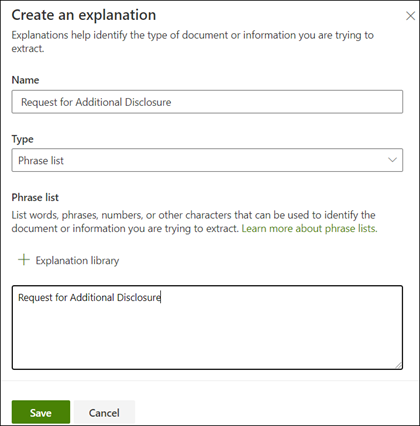

# 创建分类器（预览）Create a classifier (Preview)

> [!Note] 
> 本文中的内容适用于 Project Cortex 私人预览。The content in this article is for Project Cortex Private Preview. 了解[有关 Project Cortex 的详细信息](https://aka.ms/projectcortex)。[Find out more about Project Cortex](https://aka.ms/projectcortex).

 

> [!VIDEO https://www.microsoft.com/videoplayer/embed/RE4CL0R]  

 

分类器是一种自动标识和分类文档类型的模型。A classifier is a type of model that automates identification and classification of a document type. 例如，您可能想要确定添加到文档库中的所有*合同续订*文档，如下所示。For example, you may want to identify all *Contract Renewal* documents that are added to your document library, such as the following.

创建一个分类器将创建一个新的[SharePoint 内容类型](https://docs.microsoft.com/sharepoint/governance/content-type-and-workflow-planning#content-type-overview)，该类型将与模型相关联。Creating a classifier will create a new [SharePoint Content Type](https://docs.microsoft.com/sharepoint/governance/content-type-and-workflow-planning#content-type-overview) that will be associated to the model.

创建分类器时，您需要创建*说明*，以帮助定义模型，方法是通过对此文档类型的预期持续查找的常用数据进行标注。When creating the classifier, you need to create *explanations* that help to define the model by noting common data that you would expect to find consistently for this document type. 

您可以使用文档类型（"示例文件"）的示例来帮助 "培训" 您的模型，以确定具有相同内容类型的文件。You use examples of the document type ("example files") to help "train" your model to identify files that have the same content type.

若要创建分类器，需要执行以下操作：To create a classifier, you need to:
1. 命名模型Name your model
2. 添加示例文件Add your example files
3. 为示例文件添加标签Label your example files
4. 创建说明Create an explanation
5. 测试模型Test your model 

> [!Note]
> 虽然您的模型使用分类符来标识和分类文档类型，但您也可以选择从模型所标识的每个文件中提取特定的信息部分。While a classifier is used by your model to identify and classify document types, you can also choose to pull specific pieces of information from each file identified by the model. 为此，请创建要添加到模型中的**提取**程序，这将在[创建提取程序](create-an-extractor.md)中进行说明。You do this by creating an **extractor** to add to your model, and this is described in [Create an extractor](create-an-extractor.md).

## 命名模型Name your model

第一步是在内容中心中创建模型，方法是为其提供名称：The first step is to create your model in your Content Center by giving it a name:

1. 在内容中心中，单击 "**新建**"，然后单击 "**创建模型**"。In your Content Center, click **New**, and then click **Create a model**.
2. 在 "**新建文档理解模型**" 窗格中的 "**名称**" 字段中，键入模型的名称。In the **New document understanding model** pane, in the **Name** field, type the name of the model. 对于我们的示例，如果我们想要确定合同续订文档，我们可以命名此模型*合同续订*。For our example, if we want to identify contract renewal documents, we might name this model *Contract Renewal*.
3. 单击“**创建**”。Click **Create**. 这将为模型创建主页。This will create a home page for the model. 

    

创建模型时，将创建新的 SharePoint 内容类型。When you create a model, you are creating a new SharePoint content type. SharePoint 内容类型表示具有共同特征的文档类别，并共享该特定内容的一组列或元数据属性。A SharePoint content type represents a category of documents that have common characteristics and share a collection of columns or metadata properties for that particular content. SharePoint 内容类型通过[内容类型库]()进行管理。SharePoint Content Types are managed through the [Content types gallery](). 在我们的示例中，创建模型时，我们将创建新的*合同续订*内容类型。For our example, when we create the model, we will be creating a new *Contract Renewal* content type.

如果要将此模型映射到 SharePoint 内容类型库中的现有内容类型以使用其架构，请选择 "**高级设置**"。Select **Advanced settings** if you want to map this model to an existing content type in the SharePoint Content types gallery to use its schema. 请注意，虽然您可以使用现有内容类型来帮助进行标识和分类，但您仍需要对模型进行训练，以便从它标识的文件提取信息。Note that while you can use an existing content type to leverage its schema to help with identification and classification, you will still need to train your model to extract information from files it identifies. 

## 添加示例文件Add your example files

在模型主页上，您可以添加示例文件，您需要这些文件来帮助训练模型以标识您的文档类型。On the model home page, you can add your examples files you will need to help train the model to identify your document type.  
 

> [!VIDEO https://www.microsoft.com/videoplayer/embed/RE4D0iX] 

 

> [!Note]
> 对于分类器和[提取器培训](create-an-extractor.md)，应使用相同的文件。The same files should be used for both classifier and [extractor training](create-an-extractor.md). 你始终可以选择添加更多的更高版本，但通常应添加完整的示例文件集。You always have the option to add more later, but typically you should add a full set of example files. 您将标记一些以培训您的模型，并测试其余未标记的模型以评估模型适用性。You will label some to train your model, and test the remaining unlabeled ones to evaluate model fitness. 

对于你的培训集，你将需要使用正则示例和消极示例：For your training set, you will want to use both positive examples, and negative examples:
- 正则示例：表示文档类型的文档。Positive example: Documents that represent the document type. 它们包含的字符串和信息总是在这种类型的文档中。They contain strings and information that would always be in this type of document.
- 负示例：不代表文档类型的文档。Negative example: Documents that do not represent the document type.  这些类型的文档中缺少需要的字符串和信息。They are missing strings and information that needs to be present in this type of document.

你将需要使用至少5个正则示例和一个负示例来培训你的模型。You will want to use at least five positive examples and one negative examples to train your model.  你将需要其他附加的用户才能在培训后测试你的模型。You will want to have additional ones to test your model after training.

添加示例文件：To add sample files:

1. 在模型主页上的 "**生成示例库**" 磁贴中，单击 "**添加文件**"。On the model home page, in the **Build sample library** tile, click **Add files**.
2. 在 "**选择模型的示例文件**" 页上，从内容中心的示例文件库中选择示例文件。On the **Select sample files for your model** page, select your example files from the Sample files library in the Content Center. 如果尚未将其上传到那里，则可以通过单击 "**上载**" 将其移到示例文件库中，选择立即上载。If you had not already uploaded them there, you can choose to upload them now by clicking **Upload** to move them the Sample file library.
3. 选择用于培训模型的示例文件后，单击 "**添加**"。After selecting your example files to use to train the model, click **Add**.

     

## 为示例文件添加标签Label your example files

添加示例文件后，需要将其标记为正示例或负示例。After adding your example files, you then need to label them as either positive examples or negative examples.

1. 在模型主页上的 "对**文件进行分类和运行培训**图块" 中，单击 "**训练分类器**"。On the model home page, on the **Classify files and run training** tile, click **Train Classifier**.
   这将显示 "标签" 页面，其中显示了示例文件的列表，查看器中的第一个文件可见。This will display the label page that shows a listing of your example files, with the first file visible in the viewer.
2. 在查看器中，第一个示例文件的顶部，您将看到文本，询问您文件是否是您刚创建的模型的示例。In the viewer, on the top of the first example file, you will see text asking you if the file is an example of the model you just created. 如果是一个正则示例，请选择 **"是"**。If it is a positive example, select **Yes**. 如果它是一个负示例，请选择 "**否**"。If it is a negative example, select **No**.
3. 从左侧的 "**标记的示例**" 列表中，选择要用作示例的其他文件，并标记这些文件。From the **Labeled examples** list on the left, select additional files that you want to use as examples, and label them as well. 

     

> [!Note]
> 至少为五个正则的示例添加标签和一个负的示例。Label at least five positive examples, and one negative example. 

## 创建说明Create an explanation

下一步是在 "培训" 页面上创建一个说明。The next step is to create an explanation on the Train page.  解释是一个提示或线索，可帮助模型了解如何识别此文档。An explanation is a hint or clue to help the model understand how to recognize this document. 例如，我们的合同续订文档始终包含一个*请求以获取额外的泄露*文本字符串。For example, our Contract Renewal documents always contain a *Request for additional disclosure* text string.

> [!Note]
> 在与提取程序一起使用时，使用说明来标识要从文档中提取的字符串。When used with extractors, an explanation is use to identify the string that you want to extract from the document. 

若要创建说明：To create an explanation:

1. 在模型主页上，单击 "**定型**" 选项卡以转到 "培训" 页面。On the model home page, click the **Train** tab to go to the Train page.
2. 在 "培训" 页上的 "**训练有素的文件**" 部分中，您将看到先前已标记的示例文件的列表。On the Train page, in the **Trained files** section, you will see a list of the example files that you had labeled previously. 从列表中选择一个正则文件，它将显示在查看器中。Select one of your positive files from the list, and it will display in the viewer.
3. 在 "说明" 部分，单击 "**新建**"，然后单击 "**空白**"。In the Explanation section, click **New**, then click **Blank**.
4. 在 "**创建说明**" 页上：On the **Create an explanation** page: 
    a.a. 键入**名称**（例如，"披露 Block"）。Type the **Name** (for example, "Disclosure Block"). 
    b.b. 选择 "**类型**"。Select the **Type**. 对于我们的示例，我们将选择**短语 "列表**"，因为我们要添加文本字符串。For our example, we'll select **Phrase list**, since we are adding a text string. 
    c.c. 在 "**请键入此处**" 框中，键入字符串。In the **Type here** box, type the string.  对于我们的示例，我们将添加 "请求其他披露"。For our example, we'll add "Request for additional disclosure". 如果字符串需要区分大小写，则可以选择 "区分**大小写**"。You can select **Case sensitive** if the string needs to be case sensitive. 
    d.d. 单击“**保存**”。Click **Save**.

     
    
 
5.  模型现在将检查您创建的解释是否足够好，以确定剩余的标记的示例文件正确无误，如正面和负数示例。The model will now check to see if the explanation you created was good enough to identify your remaining labeled example files correctly as positive and negative examples. 在 "训练有素的文件" 部分中，选中 "完成培训后的**评估**" 列以查看结果。In Trained Files section, check the **Evaluation** column after the training has completed to see the results.  如果您创建的解释足以匹配已标记为（正数或负数）的内容，则文件将显示**匹配**的值。The files will show a value of **Match** if the explanation you created was enough to match what you had labeled them as (positive or negative).

     

如果您在标记的文件上收到**不匹配**项，则可能需要创建其他说明，以提供模型以详细了解该文档类型。If you receive a **Mismatch** on your labeled files, you may need to create an additional explanation to provide the model more information to identify the document type. 您可以单击文件以获取有关为什么发生不匹配的原因的详细信息。You can click on the file to get more information about why the mismatch occurred.

## 测试模型Test your model

如果您在标记的示例文件中接收到匹配项，则现在可以在剩余的未标记的示例文件上测试模型。If you received a match on your labeled example files, you can now test your model on your remaining unlabeled example files.

1. 在模型主页上，单击 "**测试**" 选项卡。 这将在未标记的示例文件上运行模型。On the model home page, click the **Test** tab.  This will run the model on your unlabeled example files.
2. 在 "**测试文件**" 列表中，将显示示例文件，并显示该模型是否将它们预测为正数或负数示例。In the **Test files** list, your example files will display and will show if the model predicted them to be positive or negative examples. 您可以使用此信息来帮助您确定您的分类程序的有效性，以标识您的文档。You can use this information to help determine the effectiveness of your classifier in identifying your documents.

     

## 另请参阅See Also
[创建提取程序Create an extractor](create-an-extractor.md) 
[文档理解概述Document Understanding overview](document-understanding-overview.md) 
[创建表单处理模型Create a form processing model](create-a-form-processing-model.md) 
[应用模型Apply a model](apply-a-model.md) 

