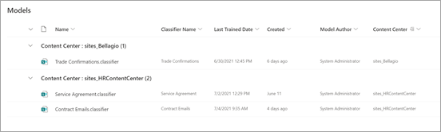

# 在 Microsoft SharePoint Syntex 中创建内容中心

 

> [!VIDEO https://www.microsoft.com/videoplayer/embed/RE4CPSF]

 

要创建和管理文档理解模型，首先需要内容中心。 内容中心是模型创建界面，它还包含已应用文档库发布模型的相关信息。

   

[设置](set-up-content-understanding.md)期间创建默认内容中心。 但 SharePoint 管理员也可根据需要选择创建其他中心。 虽然单个内容中心对于你要汇总所有模型活动的环境可能不错，但你可能希望组织中多个部门有其他中心，这可能对其模型有不同需求和权限要求。

此外，如果要尝试 SharePoint Syntex，可以使用本文中的说明来创建内容中心，而无需购买许可证。 未经许可的用户可以创建文档理解模型，但无法将其应用于文档库。

> [!NOTE]
> 在 [Microsoft 365 多地理环境](../enterprise/microsoft-365-multi-geo.md)中，如果中心位置中具有一个默认内容中心，则只能提供该位置内的模型活动汇总。 当前无法在多地理环境中跨服务器场边界汇总模型活动。 

## 创建内容中心

SharePoint 管理员可以创建内容中心网站，就像通过管理中心网站预配面板 [创建任何其他 SharePoint 网站](/sharepoint/create-site-collection) 一样。

创建新的内容中心：

1. 在Microsoft 365 管理中心上，转到活动SharePoint <a href="https://go.microsoft.com/fwlink/?linkid=2185220" target="_blank">管理>**中心**</a>。

2. 在“**活动网站**”页面上，单击“**创建**”，然后选择“**其他选项**”。

3. 在“**选择模板**”菜单上，选择“**内容中心**”。

4. 对于新网站，提供 **网站名称**、**主管理员** 和 **语言**。 

   > [!NOTE] 
   > 可选择一个内容中心网站呈现任意可用语言，但请注意，当前模型仅可为英语文件创建。 另请注意，与其他网站模板一样，网站创建后，默认网站语言不可编辑。

5. 选择“**已完成**”。
 
创建内容中心网站后，你将看到它在管理中心的活动SharePoint列出。 

### 授予其他用户访问权限
 
创建网站后，可通过标准的 [SharePoint 网站权限模型](/sharepoint/modern-experience-sharing-permissions)授予其他用户网站访问权限。

### 默认内容中心中的模型汇总

在 SharePoint Syntex 中，在安装过程中创建的第一个内容中心是 *默认内容中心*。 如果创建了后续内容中心，则其模型将显示在默认内容中心视图中。

默认内容中心视图中的 **模型** 库按内容中心对创建的模型进行分组，以获取已创建的所有文档理解模型和表单处理模型的摘要视图。

> [!NOTE]
> 无法更改指定的默认内容中心。 它始终是在安装过程中创建的第一个内容中心。 

## 另请参阅
[创建分类器](create-a-classifier.md)

[创建提取程序](create-an-extractor.md)

[创建内容中心](create-a-content-center.md)

[文档理解概述](document-understanding-overview.md)

[创建表单处理模型](create-a-form-processing-model.md)

[应用模型](apply-a-model.md)