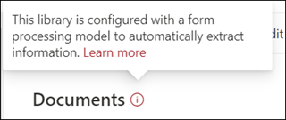

# 在 Microsoft SharePoint Syntex 中创建表单处理模型

 

> [!VIDEO https://www.microsoft.com/videoplayer/embed/RE4GnhN]  

 

使用[AI Builder](https://docs.microsoft.com/ai-builder/overview) - Microsoft PowerApps 中的一项功能 - SharePoint Syntex 用户可以直接从 SharePoint 文档库中创建[表单处理模型](form-processing-overview.md)。 

创建表单处理模型涉及以下操作：
 - 步骤 1：创建表单处理模型以创建内容类型
 - 步骤 2：添加和分析示例文件
 - 步骤 3：选择表单字段
 - 步骤 4：培训并测试你的模型
 - 步骤 5：发布模型
 - 步骤 6：使用模型

## 要求

只能在启用了表单处理的 SharePoint 文档库中创建表单处理模型。如果已启用表单处理，你可以在文档库中的“**自动化**”菜单下看到 “**AI Buidler**” “**创建表单处理模型**”。如果需要在文档库中启用处理，则必须联系你的 SharePoint 管理员。

  

## 步骤 1：创建表单处理模型

创建表单处理模型的第一步是将其命名并创建新内容类型的定义，以及为其创建新的文档库视图。

1. 在文档库中，选择 “**自动化**”菜单，选择 “**AI Builder**”，然后选择“**创建表单处理模型**”。

     

2. 在“**新的表单处理模型**”窗格中，在“**名称**”字段中，键入模型的名称（例如，“*采购订单*”）。

      

3. 创建表单处理模型时，将创建新的 SharePoint 内容类型。SharePoint 内容类型表示具有共同特征并共享该特定内容的列或元数据属性集合的文档类别。可通过“[内容类型库]()”管理 SharePoint 内容类型。

    如果想要将此模型映射到 SharePoint 内容类型库中的现有内容类型以使用其架构，请选择“**高级设置**”。 

4. 你的模型将在文档库中为提取的数据创建一个新视图。如果不希望其成为默认视图，请取消选择“**将视图设置为默认**”。

5. 选择 **“创建”**。

## 步骤 2：添加和分析文档

创建新的表单处理模型后，浏览器将打开一个新的 PowerApps AI Builder 表单处理模型页面。在此页面上，你可以添加和分析示例文档。  

> [!NOTE]
> 查找要使用的示例文件时，请参阅[表单处理模型输入文档要求和优化提示](https://docs.microsoft.com/ai-builder/form-processing-model-requirements)。 

     
 
1. 选择“**添加文档**”，开始添加已分析的示例文档，以确定可提取的命名值对。然后，你可以选择“**从本地存储上传**”、“**SharePoint**”或“**Azure Blob 存储**”。至少需要使用五个文件进行培训。

2. 添加文件后，选择“**分析**”，检查所有文件的任何常见信息。此操作可能需要几分钟才能完成。  
 
      

3. 分析文件后，在“**选择想要保存的表单域**”页面上，选择该文件以查看检测到的字段。 

      

## 步骤 3：选择表单字段

为字段而分析文档后，你现在可以看到找到的字段，并确定要保存的字段。保存的字段在模型的文档库视图中显示为列，并显示从每个文档中提取的值。

1. 下一页将显示其中一个示例文件，并突出显示系统自动检测到的所有常见字段。  

      

2. 选择要保存的字段，然后选中该复选框以确认选择。例如，在“采购订单”模型中，选择选中“*日期*”、“*PO*”和“*总数*”字段。请注意，如果选择的话，你也可以选择重命名字段。 

      

3. 如果分析未检测到字段，你仍然可以选择添加。突出显示要提取的信息，然后在名称框中键入所需名称。然后选中复选框。请注意，你需要在其余示例文件中确认未检测到的字段。

4. 选择要保存的字段后，单击“**确认字段**”。  
 
      
 
5. 在“**选择想要保存的表单字段**”页面，它将显示所选的字段数量。选择“**完成**”。

## 步骤 4：培训并测试模型

选择想要保存的字段后，“**模型摘要**”页面可用于培训并测试模型。

1. 在“**模型摘要**”页面上，已保存字段将显示在“**选定字段**”部分。选择“**培训**”以开始对示例文件进行培训。请注意，这可能需要几分钟才能完成。 

       

2. 当你看到“已完成培训”的通知时，请选择“**转到详细信息页面**。 

3. 在“**模型详细信息**”页面上，可选择“**快速测试**”来测试模型的工作方式。这使你可以将文件拖放到页面上，查看是否检测到字段。

      

2. 当你看到“已完成培训”的通知时，请选择“**转到详细信息页面**。 

3. 在“**模型详细信息**”页面上，选择“**快速测试**”来测试模型的工作方式。这使你可以将文件拖放到页面上，查看是否检测到字段。

## 步骤 5：发布模型

1. 如果你对模型的结果感到满意，请选择“**发布**”，使其可供使用。

2. 发布模型后，选择“**使用模型**”。这将创建一个可在 SharePoint 文档库中运行的 PowerAutomate 流，还可以提取已在模型中标识的字段，然后选择“**创建流**”。
  
3. 完成后，你将看到一条消息“**已成功创建流**”。
 
## 步骤 6：使用模型

发布模型并创建 PowerAutomate 流后，可在 SharePoint 文档库中使用模型。

1. 发布模型后，选择“**转到 SharePoint**”，以便转到文档库。

2. 在文档库模型视图中，注意看，所选字段现在已显示为列。 

      

3. 注意看，**文档** 旁的信息链接提示了表单处理模型已应用于此文档库。

       

4. 将文件上传到文档库。任何被模型识别为其内容类型的文件都会在视图中列出文件，并且在列中显示提取的数据。 

       

## 另请参阅
  
[Power Automate 文档](https://docs.microsoft.com/power-automate/)

[培训：使用 AI Builder 改善业务绩效](https://docs.microsoft.com/learn/paths/improve-business-performance-ai-builder/?source=learn)
