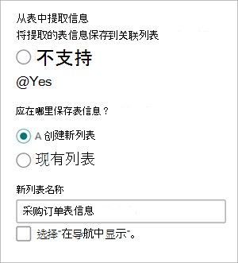
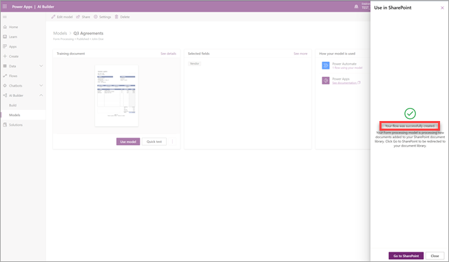

# 在 Microsoft SharePoint Syntex 中创建表单处理模型

 

> [!VIDEO https://www.microsoft.com/videoplayer/embed/RE4GnhN]  

 

使用 [AI Builder](/ai-builder/overview) - Microsoft PowerApps 中的一项功能 - SharePoint Syntex 用户可以直接根据 SharePoint 文档库创建“[表单处理模型](form-processing-overview.md)”。 

创建表单处理模型涉及以下步骤：

 - [步骤 1：创建表单处理模型](create-a-form-processing-model.md#step-1-create-a-form-processing-model)
 - [步骤 2：添加和分析文档](create-a-form-processing-model.md#step-2-add-and-analyze-documents)
 - [步骤3：标记字段和表](create-a-form-processing-model.md#step-3-tag-fields-and-tables)
 - [步骤 4：训练并测试模型](create-a-form-processing-model.md#step-4-train-and-publish-your-model)
 - [步骤 5：使用模型](create-a-form-processing-model.md#step-5-use-your-model)

## 要求

只能在启用了表单处理模型的 SharePoint 文档库中创建表单处理模型。 如果已启用表单处理，则可以在文档库中看到“**自动化**” > “**AI Buidler**” > “**创建表单处理模型**”菜单。 如果需要在文档库中启用处理，则必须联系你的 SharePoint 管理员。

 

## 步骤 1：创建表单处理模型

创建表单处理模型的第一步是命名模型、定义新内容类型，以及为其创建新的文档库视图。

1. 在文档库中，选择“**自动化**”菜单，选择“**AI Builder**”，然后选择“**创建表单处理模型**”。

    

2. 在“**创建表单处理模型**”窗格的 **名称** 字段中，键入模型的名称（例如，“*购买订单*”）。

     

3. 现在，可以从 SharePoint 文档库中共享类似布局的结构化文件（如发票或税务文档）*集合* 中自动提取和保存信息。 使用这一功能，可以将多个模型组合到单个模型中，并提取特定的表项信息。

   集合名称将保存到应用模型的文档库中的专用列，这使你可以区分由同一模型处理的不同文件布局。

   此外，提取的表信息将保存到指定列表，并与上传的文件相关联，以便轻松查看或实现其他业务流程自动化。

   要将表信息提取到关联列表，请执行以下操作：  

     1. 在 **从表中提取信息？** 部分中，选择“**是**”。

       

     2. 在 **应在何处保存表信息？** 部分中，执行以下操作：
 
        - 如果选择“**新列表**”（默认设置），则会在 **新建列表名称** 框中自动提供建议的名称。 可以按需修改名称。 要在网站导航中显示列表，请选择“**在网站导航中显示**”复选框。

        - 如果选择“**现有列表**”，请在“**所选列表**”框中，选择要使用的列表。

4. 创建表单处理模型时，将创建新的 SharePoint 内容类型。 SharePoint 内容类型表示具有共同特征的文档类别，并共享该特定内容的列或元数据属性的集合。 SharePoint 内容类型通过 SharePoint 管理中心进行管理。

   要将此模型映射到 SharePoint 内容类型库中的现有内容类型，请选择“**高级设置**”。

     

   1. 在 **内容类型** 部分中，选择是创建新内容类型还是使用现有内容类型。 

   2. 要使用现有内容类型，请选择“**选择一个**”，然后从列表中选择内容类型。

   3. 你的模型将在文档库中为提取的数据创建一个新视图。 如果不希望该视图为默认视图，请在 **此模型的库视图** 部分中，清除“**将视图设置为默认**”复选框。

   4. 要将保留标签应用于文件，请在 **保留标签** 部分中，选择要使用的保留标签。

5. 选择 **“创建”**。

## 步骤 2：添加和分析文档

创建新的表单处理模型后，浏览器将打开一个新的 PowerApps AI Builder 表单处理模型页面。 在此页面上，可以添加和分析示例文档。 

> [!NOTE]
> 查找要使用的示例文件时，请参阅 [表单处理模型输入文档要求和优化提示](/ai-builder/form-processing-model-requirements)。 
 
1. 首先定义要在 **选择要提取的信息** 页上指导模型进行提取的字段和表。 有关详细步骤，请参阅 [定义要提取的字段和表](/ai-builder/create-form-processing-model#define-fields-and-tables-to-extract)。 

2.  可以创建希望模型处理的尽可能多的文档布局集合。 有关详细步骤，请参阅 [按集合分组文档](/ai-builder/create-form-processing-model#group-documents-by-collections)。 

3. 创建集合并为每一个添加示例文件后，AI Builder 将检查已上传文档以检测字段和表。 这通常需要几分钟时间。 分析完成后，可以继续标记文档。

## 步骤 3：标记字段和表

需要标记文档，以指导模型理解要提取的字段和表数据。 有关详细步骤，请参阅 [标记文档](/ai-builder/create-form-processing-model#tag-documents)。

## 步骤 4：训练和发布模型

1. 创建和训练模型后，即已准备好发布模型并在 SharePoint 中使用它。 有关详细步骤，请参阅 [训练和发布表单处理模型](/ai-builder/form-processing-train)。 

2. 发布模型后，选择“**使用模型**”，然后选择“**创建流**”。 此操作将创建一个可在 SharePoint 文档库中运行，并提取已在模型中标识的字段的 Power Automate 流。

    
 
3. 完成后，你将看到以下消息 *已成功创建流*。

    

4. 选择“**转到 SharePoint**”按钮，以查看随模型更新的文档库。

## 步骤 5：使用模型

1. 在文档库模型视图中，请注意所选字段现在已显示为列。

    

2. 请注意，**文档** 旁边的信息链接指出表单处理模型已应用于此文档库。

      

3. 将文件上传到文档库。 任何由模型识别为其内容类型的文件都会在视图中列出文件，并在列中显示提取的数据。

     

## 另请参阅
  
[Power Automate 文档](/power-automate/)

[培训：使用 AI Builder 改善业务绩效](/learn/paths/improve-business-performance-ai-builder/?source=learn)