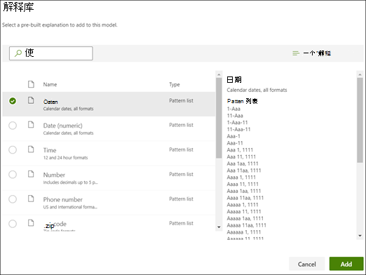
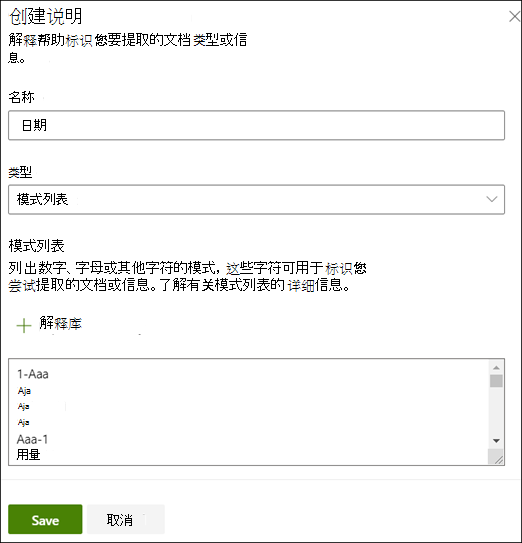
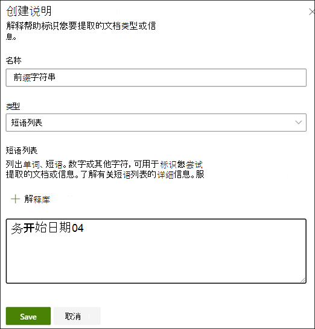
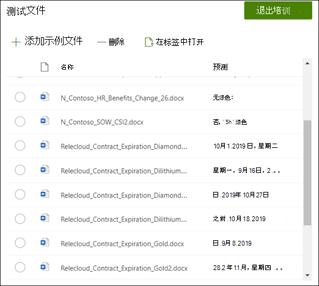

# 在 Microsoft SharePoint Syntex 中创建提取程序

 

> [!VIDEO https://www.microsoft.com/videoplayer/embed/RE4CL2G]

  

在创建分类器模型以自动识别和分类特定文档类型之前或之后，可选择性地选择将提取程序添加到模型中以从这些文档中提取特定信息。 例如，你可能希望模型不仅可以标识所有添加到文档库中的“*合同续订*”文档，还可将每个文档的“*服务开始日期*”显示为文档库中的列值。

需要为要所提取的文档中的每个实体创建一个提取程序。 在本示例中，从模型识别的每个“ **合同续订**” 文档中，我们要从中提取“ **服务开始日期** ”。 我们希望能够在文档库中看到所有“ **合同续订**” 文档的视图，其中一列显示每个文档的“**服务开始** 日期值”。 

> [!NOTE]
> 为创建提取程序，请使用之前所上载的训练分类器的相同文件。 

## 命名提取程序

1. 在模型主页的 **“创建和训练提取器”** 磁贴中，选择 **“训练提取器**”。

2. 在“**新实体提取程序**”屏幕上，在“**新提取程序名称**”字段中键入提取程序的名称。 例如，如果想要从每个”合同续订文档”中提取服务开始日期，请将其命名为“**服务开始日期**”。 也可以选择重复使用以前创建的列（例如，托管元数据列）。

    默认情况下，列类型为 **单行文本**。 如果要更改列类型，请选择 **“高级设置** > **”类型**，然后选择要使用的类型。

     

    > [!NOTE]
    > 对于列类型为 **单行文本的** 提取器，最大字符限制为 255。 您键入的任何超出限制的字符都会被截断。

3. 完成后，选择 **“创建**”。

## 添加标签

下一步是在示例培训文件中标记想要提取的实体。

创建提取程序将打开提取程序页。此时，将看到示例文件的列表，并在查看器中显示列表中的第一个文件。

1. 从查看器中，选择要从文件中提取的数据。 例如，如果想要提取“*开始服务日期*”，请突出显示第一个文件中的日期值（*星期一，2019 年 10 月 14 日*）。 然后选择 **“保存**”。 在“**标签**”列下，你应该会在“已标记示例”列表中看到从文件显示的值。
2. 选择 **“下一个文件** ”以自动保存，并在查看器的列表中打开下一个文件。 或选择“**保存**”，然后从“**已标记的示例**”列表中中选择另一个文件。
3. 在查看器中，重复第 1 步和第 2 步，然后重复执行，直到将标签保存到所有五个文件中。

     

 
标记了五个文件后，将显示一条通知横幅，告知你移动到培训。 你可以选择更多标签，更多文档或前进到培训。 

### 使用“查找”搜索文件

使用 **“查找”** 功能在文档中搜索你要标记的实体。

    

如果在搜索大型文档，或者文档中有多个实体实例，则“查找”功能非常有用。 如果发现多个实例，可以在搜索结果中选择需要的实例，进入查看器中的那个位置对它进行标记。

## 添加说明

对于我们的示例，我们将创建一个说明，提供有关实体格式本身的提示，以及它在示例文档中可能具有的变体。 例如，日期值可以采用多种不同的格式，例如：
- 10/14/2019
- 2019 年 10 月 14 日
- 星期一，2019 年 10 月 14 日

为帮助标识“*服务开始日期*”，可创建模式说明。

1. 在“说明”部分中，选择“**新建**”，然后键入名称（例如，“*日期*”）。
2. 对于“类型”，请选择“**模式列表**”。
3. 对于“数值”，请提供示例文件中显示的日期变体。 例如，如果你的日期格式显示为 0/00/0000，则可在文档中输入显示的任何变体，如：
    - 0/0/0000
    - 0/00/0000
    - 00/0/0000
    - 00/00/0000
4. 选择“**保存**”。

> [!NOTE]
> 有关更多关于说明类型的详细信息，请参阅“[说明类型](./explanation-types-overview.md)”。  

### 使用“说明库”

若要为日期等项创建说明， [使用解释库](./explanation-types-overview.md) 比手动输入所有变体更容易。 说明库是一组预建短语和模式说明。 库尝试为常见短语或模式列表提供所有格式，例如日期、电话号码、邮政编码和其他许多格式。 

对于 *服务开始日期* 示例，在解释库中对 *Date* 使用预生成的说明更为有效：

1. 在“**说明**”部分中，选择“**新建**”，然后选择“**从说明库中**”。
2. 从说明库中，选择“**日期**”。 可查看所识别的日期的所有变体。
3. 选择“**添加**”。

     

4. 在“**创建说明**”页面上，说明库中的“*日期*”信息将自动填充字段。 选择“**保存**”。

     

## 培训模型 

保存说明将开始训练。 如果模型有足够的信息从标记的示例文件中提取数据，则会看到每个文件都标有 **Match**。  

 

如果说明没有足够的信息来查找要提取的数据，则每个文件都将标记为 **不匹配**。 可以选择 **不匹配** 的文件，查看有关为何不匹配的详细信息。

## 添加另一个说明

通常，不匹配表明我们提供的说明没有提供足够的信息来提取服务开始日期值，以匹配我们标记的文件。 可能需要编辑它或添加其他说明。

在我们的示例中，请注意，文本字符串“*开始服务日期*”始终在实际值之前。 若要帮助标识“服务开始日期”，需要创建短语说明。

1. 在“说明”部分中，选择“**新建**”，然后键入名称（例如，*前缀字符串*）。
2. 对于“类型”，选择“**短语列表**”。
3. 使用“*服务开始日期*”作为值。
4. 选择“**保存**”。

     

## 再次培训模型

保存说明会再次启动培训，这次将在示例中使用两个说明。 如果你的模型拥有足够的信息来提取已标记示例文件中的数据，你将看到每个文件都标记了“**匹配**”。 

如果你在已标记的文件上再次收到“**不匹配**”，则可能需要创建其他说明，以便为模型提供更多用来标识文档类型的信息，或考虑对现有的说明进行更改。

## 测试模型

如果你在标记的示例文件上收到匹配，则现在可以在其余未标记的示例文件中测试模型。 这是一个可选但很有用的步骤，可在使用模型之前评估其“适用性”和“就绪度”，方法是在该模型之前未见过的文件上对其进行测试。

1. 在模型主页中，选择“**测试**”选项卡。这将在未标记的示例文件上运行模型。

2. 在“**测试文件**”列表中，如果模型能够提取所需的信息，将显示出陈列的示例文件。 使用此信息以帮助确定分类器在文档识别中的有效性。

     

### 进一步优化提取器

如果你有重复的实体，并且只想要提取一个值或一定数量的值，则可以设置一个规则来指定所需的处理方式。 若要添加规则以优化提取的信息，请执行以下步骤：

1. 在模型主页的 **“实体提取器** ”部分中，选择要优化的提取器，然后选择 **“优化提取的信息**”。

     

2. 在“ **优化提取的信息** ”页上，选择以下规则之一：

    - 保留一个或多个第一个值
    - 保留最后一个或多个值
    - 删除重复值
    - 保留一行或多行
    - 保留最后一行或多行
 
     

3. 输入要使用的行数或值，然后选择 **“优化**”。

4. 如果要通过更改行数或值来编辑规则，请选择要编辑的提取器，选择 **“优化提取的信息**”，更改编号，然后选择 **“保存**”。

5. 测试提取器时，可以在 **“测试文件**”列表的“**精简结果**”列中看到优化。 

     

6. 如果要删除提取器上的优化规则，请选择要从中删除规则的提取器，选择 **“优化提取的信息**”，然后选择 **“删除**”。

## 另请参阅
[创建分类器](create-a-classifier.md)

[说明类型](explanation-types-overview.md)

[创建提取程序时利用术语库分类](leverage-term-store-taxonomy.md)

[文档理解概述](document-understanding-overview.md)

[应用模型](apply-a-model.md) 

[SharePoint 整合辅助功能模式](accessibility-mode.md)
