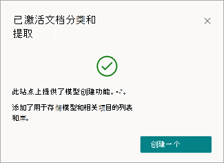
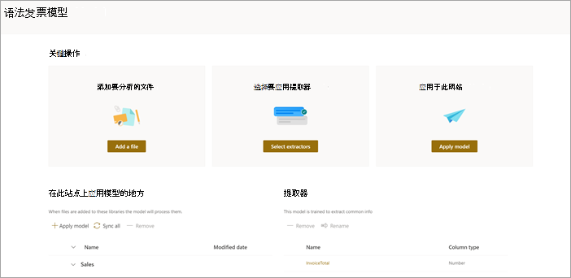

# 使用 Microsoft 网站在本地 SharePoint创建SharePoint Syntex

SharePoint Syntex现在提供一个选项，在您自己的网站本地创建和训练SharePoint模型。 这些模型只能在创建它们的网站中使用。 

通过激活文档分类和提取SharePoint，SharePoint Syntex文档库中的文件进行分类，从新文件中提取信息，并基于提取的信息自动执行活动。

激活本地模型创建时，以下列表和库将添加到网站：

- 模型文档库
- 培训文件文档库
- 说明模板列表
- 模型使用列表

此功能仅适用于创建了解模型[和](apply-a-model.md)[预生成模型的文档](prebuilt-models.md)。 

## 在本地网站上创建模型

1. 从SharePoint库中，选择要分析的文件，然后选择"分类和提取 **"**。

     

2. 首次使用此功能时，将激活SharePoint Syntex网站。 你将看到以下消息。

     

3. 选择 **"激活** "以继续。 你将看到以下消息。

     

4. 选择 **"创建模型"**。

5. 在 **"创建模型"** 面板上，键入模型的名称，选择模型类型，然后选择"创建 **"**。

     

6. 继续[培训文档理解模型](apply-a-model.md)，或者使用所选的文件配置预创建模型。

7. 完成后，将 **打开"添加到库"** 面板。

     

8. 在 **"添加到库**"面板中，你将看到SharePoint网站的名称以及将应用模型的文档库。 如果要将模型应用到其他库，请选择" **返回到** 库"，然后选择想要使用的库。 然后，选择“**添加**”。

9. 在模型主页上的" **在此** 网站上应用模型的位置"部分，可以看到应用了模型的库。 若要将模型应用到网站上的其他库，请选择"应用 **模型"**。 

     

