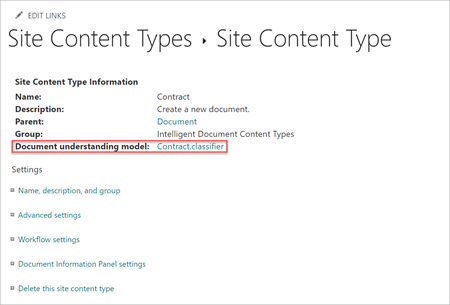

# 文档理解与表单处理模型之间的差异 

通过 Microsoft SharePoint Syntex 中的内容理解功能，你可以识别上传到 SharePoint 文档库的文档、对其进行分类并从每个文件中提取相关信息。  例如，当文件上传到 SharePoint 文档库中时，所有被识别为 *采购订单* 的文件都被归类为采购订单，然后在自定义文档库视图中显示。 此外，可从每个文件中提取特定信息（例如， *PO 编号* 和 *总数*），并将其显示为文档库视图中的一列。 

内容理解使你能够创建 *模型* 来识别和提取所需的信息。 模型在帮助解决搜索、业务流程、合规性等业务问题上具有价值。

有两种模型类型可以使用：

- [文档理解模型 ](document-understanding-overview.md)
- [表单处理模型](form-processing-overview.md)

虽然这两种模型通常用于相同的用途，但下面列出的主要差异会影响你使用的区别。

> [!NOTE]
> 有关表单处理和文档理解方案示例的详细信息，请参阅 [SharePoint Syntex 采纳：入门指南](./adoption-getstarted.md)。

## 结构化内容与非结构化和半结构化内容的比较

使用文档理解模型从信件或合同等非结构化文档中识别和提取数据，在这些文档中，所需提取的文本实体位于文档的句子或特定区域中。 例如，一个非结构化的文件可以是一份可以用不同的方式来写的续签合同书。 然而，每份合同续签文档的正文中都有一致的信息，例如 *服务开始日期* 的文本字符串，后是实际日期。

使用表单处理模型识别文件并从结构化或半结构化文档（如表单或发票）中提取数据。表单处理模型经过培训，可了解示例文档中表单的布局，并学习查找从相似位置提取的数据。窗体通常具有更结构化的布局，其中实体位于同一位置（例如，税务表单中的社会保险号）。

> [!NOTE]
> 必须有访问内容中心站点的权限，才能创建文档理解模型或将其应用于SharePoint文档库。 

## 模型创建位置

文档理解模型在 SharePoint 内容中心站点中创建和管理。 

> [!NOTE]
> 有关输入文档的详细信息，请参阅 [表单处理模型的要求和限制](/ai-builder/form-processing-model-requirements)。 

表单处理模型在 PowerApps [AI 生成器](/ai-builder/overview)中创建而成，但创建活动是直接从 SharePoint 文档库开始的。 文档库必须启用表单处理模型创建，用户才能为其创建表单处理模型。 管理员可以在内容理解管理员设置中启用表单处理模型创建。 当文件上传到文档库时，表格处理模型会使用 PowerAutomate 流来处理文件。

创建文档理解模型时，将创建一个新的 [SharePoint 内容类型](https://support.microsoft.com/office/use-content-types-to-manage-content-consistently-on-a-site-48512bcb-6527-480b-b096-c03b7ec1d978) 保存到 SharePoint 内容类型库中。 或者如果需要的话，可使用现有的内容类型来定义模型。

创建内容类型并与模型关联后，还可以从 **网站内容类型** 属性面板引用该模型。

表单处理模型还可创建新 [SharePoint 内容类型](https://support.microsoft.com/office/use-content-types-to-manage-content-consistently-on-a-site-48512bcb-6527-480b-b096-c03b7ec1d978)，并且还存储在 SharePoint 内容类型库中。

## 可适用的地方

可将文档理解模型应用于有权访问的 SharePoint 文档库中。 使用内容中心创建文档理解模型，并将其应用于不同的文档库。 内容中心可以让你更集中地控制文档理解模型的使用方式和应用位置。 注意，这些信息也必须滚动到内容中心。

表单处理模型目前只能应用于创建它们的 SharePoint 文档库。 这使得拥有网站访问权限的许可用户能够创建表单处理模型。 请注意，管理员需要在 SharePoint 文档库中启用表单处理功能，以便供许可用户使用。

## 表单处理和文档理解的比较

使用下表了解何时使用表单处理以及何时使用文档理解。

| 功能 | 表单处理 | 文档理解 |
| ------- | ------- | ------- |
| 模型类型 - 何时使用每种模型 | 用于非结构化的文件格式，例如表单内容 (如发票或采购订单) 的 PDF，其布局和格式是相似的。  | 用于半结构化文件格式 - 例如，Office 文档在布局上存在差异但仍类似的信息需要提取。 |
| 模型创建 | 在 AI 生成器中创建的模型，可从 SharePoint 文档库中无缝访问。| 在 SharePoint 的新站点--内容中心中创建的模型。 |
| 分类类型| 定式分类器用于为系统提供要提取的数据的线索。| 具有使用计算机教学来分配数据提取文档位置可选提取器的可培训分类器。|
| 位置 | 受过使用单个文档库的培训。| 可应用于多个库。|
| 支持的文件类型| PDF、JPG、PNG 格式的培训，共50MB，500页。| 培训 5-10 个 PDF、Office 或电子邮件文件，包括反面例子。 Office 文件以 64k 字符为截断标准。 OCR 扫描的文件限制为 20 页以内。|
| 与托管元数据集成 | 不支持 | 是，通过训练实体提取程序引用配置的托管元数据字段。|
| 启用 Microsoft 信息保护时合规性功能集成 | 设置已发布的保留标签。 即将设置敏感度标签。 | 设置已发布的保留标签。 设置发布的敏感度标签。 |
| 支持的区域| 表单处理依赖于 Power Platform。 有关 Power Platform 和 AI Builder 的全球可用性信息，请参阅 [Power Platform 可用性](https://dynamics.microsoft.com/geographic-availability/)。 | 在所有地区可用。|
| 交易性成本 | AI 生成器点数。 可分批购买 1M 的积分。 购买 300 个以上的 SharePoint Syntex 许可证，即可获得 1M 积分。 1M 积分可以处理 2000 个文件页。 | 不适用 |
| 容量 | 使用默认的 Power Platform 环境（支持 Dataverse 数据库的自定义环境）。 | 没有容量限制。|
| 支持的语言| 英语  2021 年的晚些时候推出：拉丁文字母语言 | 模型适用于所有拉丁字母语言。 除英语外，还包括： 德语、瑞典语、法语、西班牙语、意大利语和葡萄牙语。|

## 另请参阅

[培训：使用 AI 生成器提高业务绩效](/learn/paths/improve-business-performance-ai-builder/?source=learn)

[文档理解概述](document-understanding-overview.md)

[表单处理概述](form-processing-overview.md)

[SharePoint Syntex 简介](index.md)