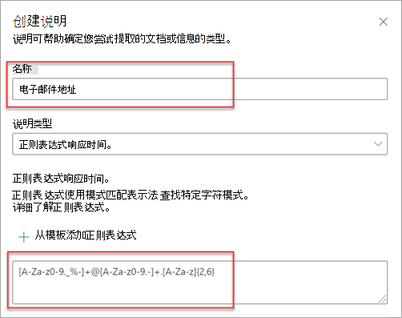
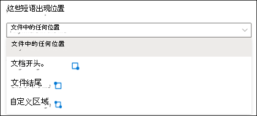
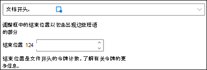
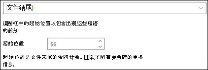
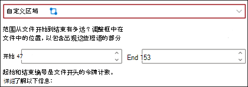

# Microsoft SharePoint Syntex 中的说明类型

说明用于帮助定义要标记的信息并在 Microsoft SharePoint Syntex 中的文档理解模型里进行提取。 创建说明时，需要选择说明类型。 本文将帮助你了解不同的说明类型以及它们的使用方式。

可使用以下说明类型：

- [**短语列表**](#phrase-list)：可在文档中或正在提取的信息中使用的单词、短语、数字或其他字符列表。 例如，文本字符串 *咨询医生* 存在于你正在识别的所有医疗转介文档中。 或者来自正在识别的所有医疗转介文档中咨询医生的“*电话号码*”。

- [**正则表达式**](#regular-expression)：使用模式匹配表示法查找特定的字符模式。 例如，可以使用正则表达式在文档集中查找 *电子邮件地址* 的所有实例。

- [**邻近度**](#proximity)：描述两个说明之间的接近程度。 例如，*街道号码* 短语列表会先于 *街道名称* 短语列表出现，且两者之间不设有令牌（本文稍后部分将介绍令牌）。 使用邻近度类型要求模型中至少有两个说明，否则将禁用该选项。

## 短语列表

短语列表说明类型通常用于通过模型识别和分类文档。 正如“*咨询医生*”标签示例中所述，它是所标识的文档中一致出现的单词、短语、数字或字符的字符串。

虽然不是强制要求，但如果要捕获的短语位于文档中的一致位置，则可以在说明上取得更好的成功。 例如，“*咨询医生*”标签可能一致位于文档中的第一段。 也可以使用 **[配置短语在文档中出现的位置](explanation-types-overview.md#configure-where-phrases-occur-in-the-document)** 高级设置来选择短语所在的特定区域，尤其是在短语可能出现在文档中多个位置的情况下。

如果标识标签时需要区分大小写，使用短语列表类型可以使你在说明中指定这种情况，只需通过选择“**仅完全匹配的大写**”复选框。

当创建以不同格式识别和提取信息（如日期、电话号码和信用卡号码）的说明时，短语类型尤其有用。 例如，可按多种不同格式显示日期（1/1/2020、1-1-2020、01/01/20、01/01/2020、Jan 1,2020）。 通过在尝试识别和提取的数据中捕获任何可能的变化，定义短语列表可以让说明变得更加高效。

对于 *电话号码* 示例，你从模型识别的所有医疗转介文档中提取每个咨询医生的电话号码。 创建说明时，请键入电话号码在文档中可能显示的不同格式，以便能够捕捉可能的变化。

在此示例中，在“**高级设置**” 中，选择“**0 - 9 中的任何数字**”复选框，以将短语列表中使用的每个“0”值识别为 0 到 9 中的任何数字。

同样，如果创建包含文本字符的短语列表，请选择“**a-z 中的任何字母**”复选框，以将短语列表中使用的每个“a”字符识别为“a”到“z”中的任何字符。

例如，如果创建“**日期**”短语列表，并且想要确保识别出某个日期格式（如 *Jan 1, 2020*），则需执行以下操作：

- 将 *aaa 0, 0000* 和 *aaa 00, 0000* 添加到短语列表中。
- 确保也选中了 **a-z 中的任何字母**。

如果在短语列表中有大写要求，可选择“**仅完全匹配大写**”复选框。 对于日期示例，如果要求月份的第一个字母大写，则需要执行以下操作：

- 将 *Aaa 0, 0000* 和 *Aaa 00, 0000* 添加到短语列表中。
- 确保也选中了“**仅完全匹配的大写**”。

> [!NOTE]
> 请使用 [说明库](explanation-types-overview.md#use-explanation-templates)，以使用常见短语列表的短语列表模板，如 *日期*、*电话号码*、*信用卡号码*，而不是手动创建短语列表说明。

## 正则表达式

通过正则表达式类型，可以创建在文档中帮助查找和识别某些文本字符串的模式。 可以使用正则表达式快速分析大量文本，以：

- 查找特定字符模式。
- 验证文本以确保其匹配预定义的模式（如电子邮件地址）。
- 提取、编辑、替换或删除文本字符串。

创建识别和提取不同格式信息（如电子邮件地址、银行账号或 URL）的说明时，短语类型尤其有用。 例如，电子邮件地址（如 megan@contoso.com）以某种格式（“megan”是前半部分，“com”是后半部分）显示。

适用于电子邮件地址的正则表达式为：**[A-Za-z0-9._%-]+@[A-Za-z0-9.-]+.[A-Za-z]{2,6}**。

此表达式包括五个部分，顺序如下：

1. 任何数量的以下字符：

   a. 从 a 到 z 的字母

   b. 从 0-9 的数字

   c. 句点、下划线、百分号或破折号

2. @ 符号

3. 任何数量的与电子邮件地址前半部分相同的字符

4. 一个句点

5. 两个到六个字母

要添加正则表达式说明类型，请：

1. 从“**创建说明**”面板中的“**说明类型**”下面，选择“**正则表达式**”。

   

2. 可以在“**正则表达式**”文本框中键入表达式，或者选择“**从模板中添加正则表达式**”。

   通过使用模板添加正则表达式时，模板自动向文本框添加名称和正则表达式。 例如，如果选择“**电子邮件地址**”模板，则将填充“**创建说明**”面板。

   

### 限制

下表显示了当前无法用于正则表达式模式的内联字符选项。

|选项  |状态  |当前功能  |
|---------|---------|---------|
|区分大小写 | 当前不受支持。 | 执行的所有匹配均不区分大小写。  |
|线条定位标记     | 当前不受支持。 | 无法指定出现匹配时字符串中的特定位置。   |

## 邻近度

邻近度说明类型可帮助模型识别数据（通过定义另一份数据与其的接近程度）。 例如，在模型中，假设已经定义了两个用于标记客户的“*街道地址编号*”和“*电话号码*”的说明。

注意客户的电话号码始终出现在街道地址编号的前面。

Alex Wilburn 
555-555-5555 
One Microsoft Way 
Redmond, WA 98034 

使用邻近度说明来定义电话号码说明的距离，以便更好地识别文档中的街道地址编号。

#### 什么是令牌？

要使用邻近度说明类型，需要了解什么是令牌。 令牌数目是邻近度说明测量某个说明与另一个说明距离的方法。 令牌是字母和数字的连续跨度结构（不包含空格或标点）。

下表显示了一些如何确定短语中令牌数目的示例。

|短语|令牌的数目|说明|
|--|--|--|
|`Dog`|1|单个单词，无标点符号或空格。|
|`RMT33W`|1|记录定位器编号。其中可能包含数字和字母，但不包含标点符号。|
|`425-555-5555`|5|电话号码。 每个标点符号是一个令牌，因此 `425-555-5555` 是 5 个令牌： `425` `-` `555` `-` `5555` |
|`https://luis.ai`|7|`https` `:` `/` `/` `luis` `.` `ai` |

#### 配置邻近度说明类型

针对示例，请配置邻近度设置，以定义从“*街道地址编号*”说明到“*电话号码*”说明的令牌数量的范围。 注意最小范围是“0”，因为电话号码和街道地址编号之间没有令牌。

但示例文档中的某些电话号码附加了 *(mobile)*。

Nestor Wilke 
111-111-1111 (mobile) 
One Microsoft Way 
Redmond, WA 98034 

*(mobile)* 中有三个令牌：

|短语|令牌计数|
|--|--|
|(|1|
|mobile|2|
|)|3|

配置邻近度设置，以便拥有 0 到 3 的范围。

## 配置短语在文档中出现的位置

创建说明时，默认情况下在整个文档中搜索尝试提取的短语。 但是，可以使用“**这些短语出现的位置**”高级设置来帮助隔离文档中出现短语的特定位置。 当文档的其他位置可能出现短语的类似实例，而你希望确保选择正确的一个时，此设置非常有用。

以我们的医疗转诊文档为例，文档的第一段中总是会提到 *转诊医生*。 通过“**这些短语出现的位置**”设置，在本示例中，你可以配置说明以仅在文档开头或可能出现该短语的任何其他位置搜索该短语。

可以为此设置选择以下选项：

- 文件中的任何位置：将在整个文档中搜索短语。

- 文件开头：从文档开头开始搜索短语。

   

    在查看器中，可以手动调整选择框以包括出现短语的位置。 **结束位置** 值将更新以显示所选区域包含的令牌数。 也可以更新“**结束位置**”值，以调整所选区域。

   

- 文件末尾：从文档末尾到短语位置搜索文档。

   

    在查看器中，可以手动调整选择框以包括出现短语的位置。 **开始位置** 值将更新以显示所选区域包含的令牌数。 也可以更新开始位置值以调整所选区域。

   

- 自定义范围：搜索文档的指定范围查找短语位置。

   

    在查看器中，可以手动调整选择框以包括出现短语的位置。 对于此设置，需要选择一个 **开始** 和 **结束** 位置。 这些值表示从文档开头开始的令牌数。 尽管可以手动输入这些值，但在查看器中手动调整选择框更加方便。

## 使用说明模板

可手动添加各个短语列表值进行解释，但使用解释库中提供模板更为轻松。

例如，可以使用 *日期* 的短语列表模板添加 *日期* 的所有变体，而不是通过手动添加，因为模板中已包含许多短语列表值：

说明库包含常用的 *短语列表* 说明，包括：

- 日期：日历日期，所有格式。 包括文本和数字（例如，“2020 年 12 月 9 日”）。
- 日期（数值）：日历日期，所有格式。 包含数字（例如 1-11-2020）。
- 时间：12 和 24 小时格式。
- 数字：正数和负数（最多 2 位小数）。
- 百分比：表示百分比的模式列表。 例如，1%、11%、100% 或 11.11%。
- 电话号码：常用的美国和国际格式。 例如，000 000 0000、000-000-0000、(000)000-0000 或 (000) 000-0000。
- 邮政编码：美国邮政编码格式。 例如，11111、11111-1111。
- 句首词：最多 9 个字符单词的常用模式。
- 句尾：句子结尾的常用标点符号。
- 信用卡：常用的信用卡卡号格式。 例如，1111-1111-1111-1111。
- 社会安全号码：美国社会安全号码格式。例如，111-11-1111。
- 复选框：表示已填充复选框上变体的短语列表。 例如，_X_、_ _X_。
- 货币：主要国际符号。 例如：$。
- 电子邮件抄送：带有术语“CC：”的短语列表，通常位于邮件发送给的其他人员或组的姓名或电子邮件地址附近。
- 电子邮件日期：带有术语“发送于：”的短语列表，通常位于发送电子邮件日期附近。
- 电子邮件问候语：电子邮件的常见打开行。
- 电子邮件收件人：带有术语“收件人：”的短语列表，通常位于邮件发送到的人员或组的姓名或电子邮件地址附近。
- 电子邮件发件人：带有术语“发件人：”的短语列表，通常位于发件人姓名或电子邮件地址附近。
- 电子邮件主题：带有术语“主题：”的短语列表，通常位于电子邮件的主题附近。

说明库还包含常用的 *正则表达式* 说明，包括：

- 6 到 17 位数字：匹配任何长度为 6 到 17 位的数字。 美国银行账号适合此模式。
- 电子邮件地址：匹配常见类型的电子邮件地址，如 meganb@contoso.com。
- 美国纳税人 ID 编号：匹配以 9 开头的 3 位数字，后跟以 7 或 8 开头的 6 位数字
- Web 地址 (URL)：匹配以 http://或 https:// 开头的 web 地址格式。

此外，说明库还包含三种自动模板类型，用于处理示例文件中标记的数据：

- 标记后：示例文件中标签后发生的字词或字符。
- 标签之前：示例文件中标签前发生的字词或字符。
- 标签：示例文件前 10 个标签。

为提供自动模板工作方式的示例，以下示例文件中将使用“标签之前”说明模板，以帮助向模型提供更多信息，从而获得更准确的匹配。

选择标签之前说明模板时，将查找示例文件中标签之前显示的第一组字词。 在示例中，第一个示例文件中标识的字词为"截至"。

可选择" **添加** 模板创建解释。  添加更多示例文件时，将在短语列表中标识并添加其他字词。

#### 若要使用说明库中的模板

1. 从模型的“**培训**”页面的“**说明**”部分中，选择“**新建**”，然后选择“**通过模板**”。

   

2.  在“**说明模板**”页面上，选择要使用的说明，然后选择“**添加**”。

    

3. 所选模板的信息显示在“**创建说明**”页面。 如果需要，可编辑解释名称，并从短语列表中添加或删除项目。

    

4. 完成后，选择“**保存**”。