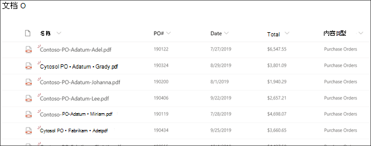

# Microsoft SharePoint Syntex 中的表单处理概述

  

Microsoft SharePoint Syntex 使用 Microsoft PowerApps [AI 生成器](/ai-builder/overview) 表单处理在 SharePoint 文档库中创建模型。

可使用 AI 生成器表单处理来创建 AI 模型，它能够使用机器学习技术识别和提取结构化或半结构化文档（如表单和发票）中的关键值对和表数据。

组织通常从多种来源（如邮件、传真、电子邮件等）接收大量发票。处理这些文档并手动将其输入到数据库中可能需要花费大量时间。 通过使用 AI 提取文档中的文本、键/值对和表格，表单处理可自动执行此过程。 

> [!NOTE]
> 有关表单处理方案示例的详细信息，请参阅 [SharePoint Syntex 采用：入门指南](./adoption-getstarted.md)。

例如，可以创建一个表单处理模型来标识上传到文档库的所有采购订单文档。 可从每个采购订单提取并显示对你非常重要的特定数据，如 *PO 编号*、 *日期* 或 *总成本*。

   

你可以使用示例文件来训练模型，并定义将从表单提取的信息。 文档的布局通过培训你的模型获知。 只需 5 个表单文档即可开始操作。 AI Builder 将分析键值对的示例文件，还可以手动识别可能尚未检测到的文件。  可通过 AI 生成器测试示例文件的模型准确性。

在训练和发布模型后，你的模型将创建一个Power Automate[流](/power-automate/getting-started)。 将文件上传到 SharePoint 文档库时将运行该流程，并提取模型中标识的数据。 提取的数据将显示在模型的文档库视图的列中。

管理员Office 365需要为文档库启用表单SharePoint，以便用户能够创建[表单处理模型](create-a-form-processing-model.md)。 设置过程中或设置完成后，可在管理设置中选择网站。

### 文件限制

使用表单处理模型时，请确保注意[文件使用的要求和限制](/ai-builder/form-processing-model-requirements)。

### 支持的语言

表单处理支持多种语言的文档。 有关语言列表，请参阅 [表单处理语言支持](/power-platform-release-plan/2021wave2/ai-builder/form-processing-new-language-support)。

### 多地理环境

在 [Microsoft 365 多地理环境](../enterprise/microsoft-365-multi-geo.md)中设置 SharePoint Syntex 时，只能将其配置为在中心位置使用表单处理。 如果要在卫星位置使用表单处理，请联系 Microsoft 支持人员。

## 另请参阅
  
[Power Automate 流程](/power-automate/)

[创建表单处理模型](create-a-form-processing-model.md)

[文档理解概述](document-understanding-overview.md)

[培训：使用 AI 生成器提高业务绩效](/learn/paths/improve-business-performance-ai-builder/?source=learn)