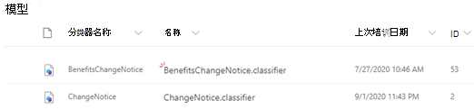

# 了解有关通过示例模型了解模型的文档

Microsoft SharePoint Syntex 为您提供了一个示例模型，您可以使用它来进行检查，从而更好地了解如何创建自己的模型。 示例模型还允许您检查模型组件，如其分类器、提取程序和说明。 您还可以使用示例文件来培训模型。

## 导入示例模型

若要访问示例模型，需要先将模型导入到内容中心。

1. 从内容中心中，选择 " **模型** " 以查看您的模型列表。 
2. 在 " **模型** " 页上，选择 " **导入示例模型**"。 

      

3. 查找在模型列表中显示的标题为 " *BenefitsChangeNotice* " 的示例模型。 

      

4. 选择 " *BenefitsChangeNotice*"，以打开模型的主页。 
  
     

5. 从模型主页中，仔细检查模型以查看其创建方式。
 
- 查看用于培训模型的示例文件。
- 仔细检查模型的实体提取程序，以查看示例模型是如何配置说明的。

     

## 另请参阅
[创建类元](create-a-classifier.md) 
[创建提取程序](create-an-extractor.md) 
[文档理解概述](document-understanding-overview.md) 
[创建表单处理模型](create-a-form-processing-model.md)  
