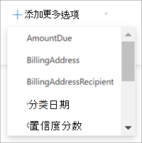

# 在 Microsoft 文档库中搜索元数据SharePoint Syntex

通过 SharePoint Syntex 中的高级元数据搜索功能，可以在 SharePoint 文档库上执行基于元数据的特定查询。 可以基于特定元数据列值进行更快、更精确的查询，而不仅仅是搜索关键字。

使用高级元数据搜索，可以使用与文档关联的元数据来帮助在 SharePoint 文档库中查找文件。 在拥有要搜索的特定信息（例如上次修改文档时间、与文件关联的特定人员或特定文件类型）时，此功能特别有用。

> [!NOTE]
> 此功能仅适用于获得许可的用户SharePoint Syntex。 

## 使用高级元数据搜索

1. 在 SharePoint 文档库的“**搜索此库**”框中，选择元数据搜索图标（）。

    

2. 在元数据搜索窗格中，键入文本或选择要在一个或多个搜索字段中查找的参数。

    

   目前提供以下元数据搜索字段。 以后将添加更多字段。

   |字段    |使用此字段可  |
   |---------|---------|
   |关键字 |在元数据或文档的全文中搜索字符串匹配项。 |
   |文件名     |在库的 **名称** 列中搜索。          |
   |人员   |搜索库中任何列中人员匹配项。   |
   |修改日期 |按库中 **已修改** 列中的选定日期范围进行搜索。         |
   |文件类型     |按所选文件类型（例如 Word 文档或 PDF）搜索。        |
   |内容类型  |按所选内容类型搜索。 仅当库中应用了非默认内容类型时，才会显示此选项。 默认内容类型为 *文档* 和 *文件夹*。        |

3. 还可以搜索处于当前库视图中的自定义网站列。 如果在库上运行模型，此功能尤其有用，因为元数据提取器会自动将信息填充到网站列中。  

    要向搜索添加自定义网站列，请选择“**添加更多选项**”，然后选择网站列的名称。

    

    > [!NOTE]
    > 目前无法添加托管元数据字段或多行文本字段。 

4. 选择“**搜索**”。与元数据搜索匹配的文档将显示在结果页面上。 
