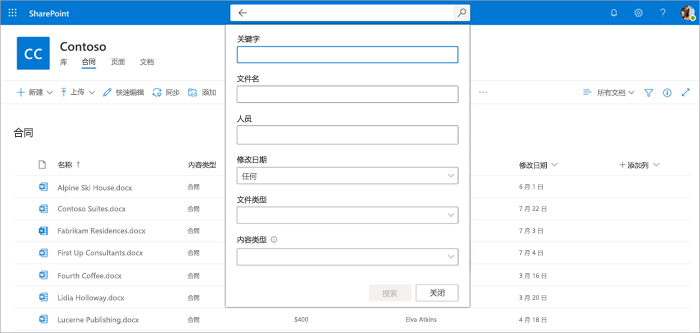

# 在 Microsoft 文档库中搜索元数据SharePoint Syntex

通过 SharePoint Syntex 中的高级元数据搜索功能，可以在 SharePoint 文档库上执行基于元数据的特定查询。 可以基于特定元数据列值进行更快、更精确的查询，而不仅仅是搜索关键字。

使用高级元数据搜索，可以使用与文档关联的元数据来帮助在 SharePoint 文档库中查找文件。 当你有要搜索的特定信息（例如上次修改文档的时间、与文件关联的特定人员或特定文件类型）时，这一点特别有用。

> [!NOTE]
> 此功能仅适用于获得许可的用户SharePoint Syntex。 

## 使用高级元数据搜索

1. 在 SharePoint 文档库的 **搜索此库** 框中，单击或点击元数据搜索图标（）。

    

2. 在元数据搜索窗格中，键入文本或选择要在一个或多个搜索字段中查找的参数。

    

   目前，有五个元数据搜索字段可用。 以后将添加更多字段。

   |字段    |使用此字段可  |
   |---------|---------|
   |关键字 |在元数据或文档的全文中搜索字符串匹配项。 |
   |名称     |在库的 **名称** 列中搜索。          |
   |人员   |搜索库中任何列中人员匹配项。   |
   |Modified |按库中 **已修改** 列中的选定日期范围进行搜索。         |
   |类型     |按所选文件类型搜索。        |

3. 选择“**搜索**”。 与元数据搜索匹配的文档显示在结果页面上。 
