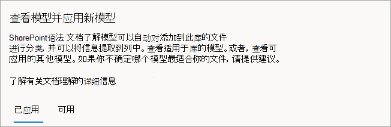

# 在 Microsoft SharePoint Syntex 中发布和发现模型

可以使经过训练的文档理解模型可供他人直接从 SharePoint 文档库查看和使用。 

还可以在由组织的其他人员创建的其他内容中心内查找和评估经过训练的模型。 选择最适用于对文件进行分类或从中提取特定信息的模型。 

> [!NOTE]
> 此功能尚不可用于表单处理模型。

## 使模型可供他人发现

要使经过训练的模型可供他人使用:

1. 在模型的 **模型** 页面上，选择 **模型设置**。

2. 在 **模型设置** 面板的 **此模型可用的站点** 部分，选择 **编辑**。

3. 此时，**选择此模型可用的站点** 面板将有所不同，具体取决于你是否为管理员。 

    如果你是管理员SharePoint，你将看到此视图。

    

    - **在任何站点上都不可用**– 模型将不可供他人使用。
    - **所有站点**– 模型将在内容类型库中可用，以供他人使用。
    - **仅选定站点**– 可以选择一个或多个模型将可用的站点。 在文本框中点击以搜索并选择希望应用模型的站点。 你将仅看到有权访问的站点。

    如果你不是 *管理员SharePoint，* 你将看到此视图。

    

    只能添加或删除已有权访问的特定站点的可用性。

4. 选择希望模型可供其他用户应用的站点，然后选择 **保存**。

## 发现其他经过训练的模型

要查找可能适合你的内容的经过训练的模型:

1. 在模型的文档库中，选择 **自动执行** > **查看文档理解模型**。

2. 在 **查看模型并应用新模型** 页面上，可以查看已应用模型和可供应用于文档库的模型。

    

   - 在 **已应用** 选项卡上，查看已应用于库的模型。 选择 **查看模型详细信息** 以查看有关模型的信息，例如说明、提取程序以及其他设置。
   
   - 在 **可用** 选项卡上，查看可供应用于库的经过训练的模型。

### 将经过训练的模型应用于库

可以针对内容评估经过训练的模型，从而帮助查找最合适的模型。 要选择希望应用于库的模型:

1. 在 **查看模型并应用新模型** 页面上，选择 **可用** 选项卡以查看列表中的模型。

    

2. 选择你认为将获得最佳结果的模型，选择 **查看模型详细信息**，然后选择 **应用于库**。

### 获取有关经过训练的模型的建议

如果不确定哪个模型最适合你的文件，可以请求建议。 建议最多可以包含 10 个模型。

1. 在 **查看模型并应用新模型** 页面上，选择 **可用** 选项卡。

2. 在第一个磁贴上，选择 **获取建议**。

    

3. 在 **选择一个或多个模型进行分析** 页面上，选择你认为最适合的模型，然后选择 **下一步**。

    

4. 在 **选择要分析的文件** 页面上，选择将存储在库中的相同或相似类型的文件。 然后选择 **选择**。

    

5. 在 **查看结果并选择模型** 页面上，在 **我们的建议** 下，你将看到推荐文件。 不必应用推荐模型。 可以选择应用其他你认为更适合的模型。

    

6. 对于你认为将获得最佳结果的模型，选择 **查看模型详细信息**，然后选择 **应用于库**。

7. 如果没有基于选定文件的推荐模型，则可以返回并选择其他文件或选择不同的模型。

### 删除已应用模型

要从文档库中删除已应用模型:

1. 在 **查看模型并应用新模型** 页面上，在 **已应用** 选项卡上，查看已应用于库的模型。

2. 在要删除的模型上，选择 **查看模型详细信息**，然后选择 **从库中删除**。

## 另请参阅

[应用文档理解模型](apply-a-model.md)

[文档理解概述](document-understanding-overview.md)
