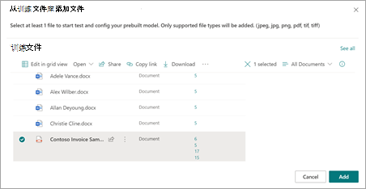
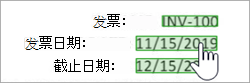
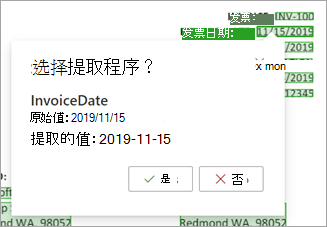

# 使用预想的模型从 Microsoft 发票或收据中提取SharePoint Syntex

预构建的模型经过预约束，可识别文档中的文档和结构化信息。 无需从头开始创建新的自定义模型，您可以对现有预约束模型进行访问，以添加满足组织需求的特定字段。 

目前，有两种预预的模型可用：发票和收据。

- 发票 *预建立模型* 分析销售发票的关键信息并从中提取关键信息。 API 分析各种格式的发票，并提取关键发票信息，如客户姓名、帐单地址、截止日期和到期金额。

- 收据 *预内置模型* 分析和提取销售收据的关键信息。 API 分析打印和手写的收据，并提取关键收据信息，如商家名称、商家电话号码、交易日期、税务和交易总额。

其他预内置模型将在将来的版本中提供。

## 创建预生成模型

按照以下步骤创建预生成模型，以对文档中的文档SharePoint Syntex。

1. 从" **模型"** 页中， **选择"创建模型"**。

     

2. 在 **"创建模型"面板** 的" **名称** "字段中，键入模型的名称。

     

3. 在 **"模型类型** "部分，选择一个预内置模型：
   - **发票处理预安装**
   - **收据处理预内置**

   如果要创建传统的非约束文档理解模型，而不是预构建的模型，请选择"自定义文档理解 **"**。

4. 如果要更改内容类型或添加保留标签，请选择" **高级设置"**。

    > [!NOTE]
    > 敏感度标签目前不适用于预内置模型。

5. 选择“**创建**”。 模型将保存在模型 **库中** 。

## 添加要分析的文件

1. 在" **模型** "页上的" **添加要分析的文件"部分** ，选择" **添加文件"**。

     

2. 在"**要分析模型的文件"页上**，选择"添加"以查找想要使用的文件。

     

3. 在" **从培训文件库添加** 文件"页上，选择该文件，然后选择"添加 **"**。

     

6. 在" **要分析模型的文件"页上，选择** "下一 **步"**。

## 为模型选择提取程序

在提取程序详细信息页面上，你将在右侧看到文档区域，左侧是 **提取器** 面板。 " **提取程序** "面板显示文档中标识的提取程序列表。

    

文档区域中以绿色突出显示的实体字段是模型在分析文件时检测到的项目。 选择要提取的实体时，突出显示的字段将更改为蓝色。 如果稍后决定不包含实体，突出显示的字段将变为灰色。 突出显示使查看所选提取程序的当前状态变得更容易。

> [!TIP]
> 可以使用鼠标上的滚轮或文档区域底部的控件，根据需要放大或缩小以读取实体字段。

### 选择提取程序实体

可以从文档区域或提取器面板中选择提取程序，具体取决于您的偏好。
 
- 若要从文档区域选择提取程序，请选择实体字段。

     

- 若要从提取器面板 **中选择** 提取程序，请选中实体名称右边的复选框。

     

选择提取程序时，文档区域中将显示" **选择** 提取程序？"框。 该框显示提取程序名称、原始值以及选择它作为提取程序的选项。 对于某些数据类型（如数字或日期）来说，它还会显示提取的值。

    

原始值是文档中的实际值。 提取的值是将写入列的SharePoint。 将模型应用于库时，可以使用列格式指定您希望它在文档中的外观。

继续选择想要使用的其他提取程序。 还可以添加其他文件来分析此模型配置。

## 重命名提取器

可以从模型主页或提取器面板重命名 **提取** 程序。 您可以考虑重命名所选提取程序，因为这些名称将在模型应用于库时用作列名称。

若要从模型主页重命名提取程序：

1. 在" **提取程序"** 部分，选择要重命名的提取程序，然后选择"重命名 **"**。

     

2. 在" **重命名实体提取程序"** 面板上，输入提取程序的新名称，然后选择"重命名 **"**。

若要从提取程序面板重命名 **提取** 程序：

1. 选择要重命名的提取程序，然后选择"重命名 **"**。

     

2. 在" **重命名提取程序** "框中，输入提取程序的新名称，然后选择"重命名 **"**。

## 应用模型

- 若要保存更改并返回到模型主页，请在"提取 **程序** "面板上，选择" **保存并退出"**。

- 如果已准备好将模型应用到库，请在文档区域中选择"下一步 **"**。 在" **添加到库"** 面板上，选择要将模型添加到的库，然后选择"添加 **"**。

## 另请参阅

[应用文档理解模型](apply-a-model.md)