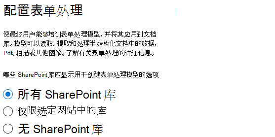
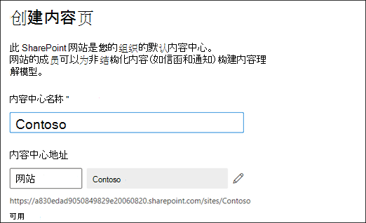

# 设置 SharePoint Syntex

管理员可使用 <a href="https://go.microsoft.com/fwlink/p/?linkid=2024339" target="_blank">Microsoft 365 管理中心</a> 设置 [Microsoft SharePoint Syntex](index.md)。 

开始之前应考虑下列建议：

- 要在哪些 SharePoint 网站中启用表单处理？ 全部、部分、还是选定的站点？
- 你会如何为默认内容中心命名？

可在 <a href="https://go.microsoft.com/fwlink/p/?linkid=2024339" target="_blank">Microsoft 365 管理中心</a> 内的初始设置后更改你的设置。

设置之前，请确保规划在环境中设置和配置内容了解的最佳方式。例如，你需要做出以下决策：

- 要启用表单处理的 SharePoint 网站 - 所有网站、部分网站或所选网站
- 内容中心的名称和管理员

## 要求 

> [!NOTE]
> 必须拥有全局管理员或 SharePoint 管理员权限，才能访问 Microsoft 365 管理中心并设置 SharePoint Syntex。

作为管理员，你还可在设置后随时随时更改所选设置，并更改 <a href="https://go.microsoft.com/fwlink/p/?linkid=2024339" target="_blank">Microsoft 365 管理中心</a> 中的内容理解管理设置。

如果计划使用自定义 Power Platform 环境，必须 [在此环境中安装 *用于 Project Cortex 的 AI 生成器* 应用](/power-platform/admin/manage-apps#install-an-app-in-the-environment-view)，以及向其 [分配 AI 生成器点数](/power-platform/admin/capacity-add-on)，然后才能创建表单处理模型。

### 许可

若要使用 SharePoint 整合，您的组织必须具有 SharePoint Syntex 订阅，并且每个用户必须分配以下许可证：

- SharePoint Syntex
- SharePoint 整合 - SPO 类型
- 用于 SharePoint 整合的常用数据服务

若要使用表单处理，还需要 AI Builder 额度。 如果你有 300 个或更多许可用户，则每月会分配 AI 生成器额度。

有关 SharePoint Syntex 许可的详细信息，请参阅 [SharePoint Syntex 许可](syntex-licensing.md)

## 对设置 SharePoint Syntex

1. 在 Microsoft 365 管理中心中，选择“<a href="https://go.microsoft.com/fwlink/p/?linkid=2171997" target="_blank">**设置**</a>”，然后查看 **文件和内容** 部分。

2. 在“**文件和内容**”部分中，选择“**自动内容理解**”。 请注意，当前 AI 生成器点数可用性在“**概览**”部分中显示。 

3. 在 **自动理解内容** 页面上，单击 **开始**， 以逐步完成设置流程。  

    > [!div class="mx-imgBorder"]
    >  

4. 在 **配置表单处理** 页面上，可选择是否希望用户能够在特定的 SharePoint 文档库中创建表单处理模型。 在文档库功能区中存在一个菜单选项，以便在已启用该功能的SharePoint文档库中 **创建表单处理模型**。
 
     对于 **应显示用于创建表单处理模型的SharePoint库选项**，可选择： 
      - “**所有 SharePoint 网站中的库**”，从而使组织内的所有 SharePoint 库都可显示该选项。 
      - “**所选 SharePoint 网站中的库**”，然后选择可显示该选项的网站或上传一个包含最多 50 个网站的列表。 
      - 如果不希望对任何网站提供 **SharePoint 库**，则不需要SharePoint库（可在设置后更改）。

   > [!div class="mx-imgBorder"]
   > 

   > [!Note]
   > 在收录一个站点后，删除该站点不会影响应用于该站点中的库的现有模型，也不会影响将文档理解模型应用于库的能力。 
    
    如果配置了多个 Power Platform 环境，可以选择希望使用哪一个进行表单处理。 （如果只有一个环境，则将不显示此选项。）

    

    对于 **Power Platform 环境**，可以选择：
    - **使用默认环境** 以使用默认 Power Platform 环境。
    - **使用自定义环境** 以使用某个自定义环境。 请从列表中选择要使用的环境。 （[请参阅自定义环境的要求](/microsoft-365/contentunderstanding/set-up-content-understanding#requirements)）。

    单击“**下一步**”。

5. 在 **创建内容中心** 页面上，可创建一个 SharePoint 内容中心站点，用户可在该网站上创建和管理文档理解模型。 如果之前从 SharePoint 管理中心创建了内容中心，则该信息将显示在此处，你只需选择“**下一步**”。

    1. 对于 **站点名称**，键入要为内容中心站点提供的名称。
    
    1. **站点地址** 将显示站点的 URL，具体取决于所选择的站点名称。如果想要更改它，请单击“**编辑**”。

       > [!div class="mx-imgBorder"]
       >  

       选择 **下一步**。

6. 在 **审查并完成** 页面上，可查看所选设置并选择进行更改。 如果对你的选择感到满意，请选择 **激活**。

7. 在确认页面上，点击 **完成**。

8. 你将返回到 **自动理解内容** 页面。 在此页面中，可选择 **管理**，对配置设置进行任何更改。 

## 分配许可证

配置 SharePoint Syntex 后，必须为将使用任何 SharePoint Syntex 功能的用户分配许可证。

以分配许可证：

1. 在 Microsoft 365 管理中心中，在 **用户** 下面，点击“<a href="https://go.microsoft.com/fwlink/p/?linkid=834822" target="_blank">**活动用户**</a>”。

2. 选择要给予许可的用户，然后选择“**管理产品许可证**”。

3. 从下拉菜单中选择“**应用**”。

4. 选择 **显示 SharePoint Syntex 的应用**。在“**应用**”下，确保已选择 “**面向 SharePoint Syntex 的 Common Data Service**”、“**SharePoint Syntex**”和“**SharePoint Syntex - SPO 类型**”。

    > [!div class="mx-imgBorder"]
    > 

5. 单击 **保存更改**。

## 另请参阅

[表单处理模式概述](/ai-builder/form-processing-model-overview)

[逐步：如何构建文档理解模型（视频）](https://www.youtube.com/watch?v=DymSHObD-bg)

[在 Power Platform 管理中心创建和管理环境](/power-platform/admin/create-environment)
