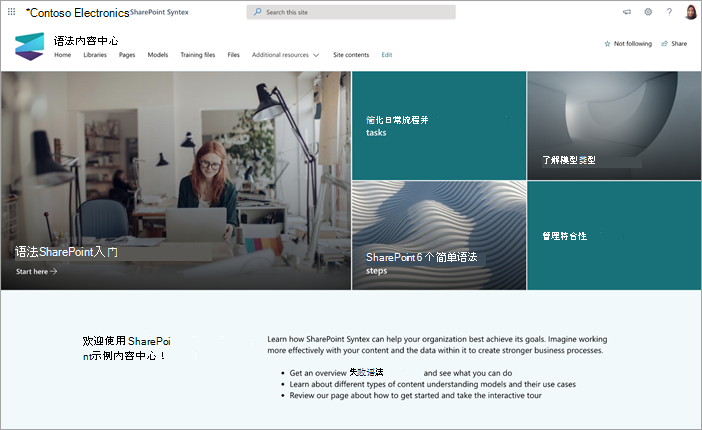

# 使用适用于 Microsoft 网站的内容中心网站SharePoint Syntex

内容SharePoint Syntex网站是一个随时可供SharePoint说明性网站模板，旨在帮助您更好地了解SharePoint Syntex功能。

你将了解创建和训练自己的模型所需的工具和信息。 然后，你将能够使用此网站作为中央内容库或用作管理您自己的模型SharePoint Syntex中心。

在此网站中，可以使用自己的内容对模型进行培训和评估。 但是，若要将模型应用到库，SharePoint Syntex许可证。  

## 设置网站

可以从内容中心目录服务SharePoint[内容中心网站](https://lookbook.microsoft.com/)。

> [!NOTE]
> 您必须是全局管理员或SharePoint管理员Microsoft 365网站。

1. 从"查看设计 > "SharePoint 主页上的"查看设计"菜单上，选择"SharePoint Syntex **SharePoint Syntex内容中心"**。

2. 在" **内容中心"** 页上，选择 **"添加到租户"**。

    

3. 输入您的电子邮件地址 (，以通知网站何时准备好使用) 、想要使用的网站 URL 以及要用于网站的标题。 

    

4. 选择“**预配**”，很快你的网站就可供使用了。 You'll get an email (sent to the email address you provided) indicating the request to provision the Content Center site template is completed.

5. 选择 **"打开** 网站"，你将看到您的内容中心网站。 在这里，你可以浏览网站并了解有关网站SharePoint Syntex。 

有关从书SharePoint设置详细信息，请参阅预配[新的学习路径解决方案](/office365/customlearning/custom_provision)。

## 浏览网站

内容中心网站包括预填充的页面，可让你完成在组织中开始使用SharePoint Syntex的步骤。 

### 开始SharePoint Syntex

获取一个SharePoint Syntex，并了解如何为组织使用它。 观看一个视频，该视频概述了SharePoint Syntex，并查找可帮助你入门的培训。

### 了解模型类型

了解三种类型的模型，并了解如何使用它们来解决搜索、业务流程、合规性等的业务问题。

### 进行交互式教程以创建模型

了解如何在模型库中构建文档理解模型，然后启用预约束的示例模型。

### SharePoint Syntex个简单步骤完成

从内容中心开始，然后逐步了解如何创建模型以标识、分类和提取您需要的信息。

### 简化日常流程和任务

了解如何使用SharePoint Syntex手动操作，并针对组织将其自动化和简化。

### 管理合规性

实施用于降低风险的步骤，并确保以安全且周到的方式使用组织捕获的数据和信息。

### 查看模型活动

了解如何使用内容来说明模型活动，并提供有关如何使用模型详细信息。

### 查找其他资源

发现其他资源和方案，帮助你了解有关SharePoint Syntex。

