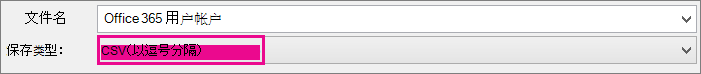

# <a name="add-several-users-at-the-same-time-to-microsoft-365---admin-help"></a>同时添加多个用户以Microsoft 365管理员帮助

团队中的每个人都需要一个用户帐户，然后才能登录和访问 Microsoft 365 服务，如电子邮件和Office。 如果有很多用户，可以从 CSV 格式保存的电子表格或其他Excel一次添加其帐户。 [不确定 CSV 格式是什么](add-several-users-at-the-same-time.md#not-sure-what-csv-format-is)？
  
> [!NOTE]
> 如果未使用新的 Microsoft 365 管理中心，可通过选择“**试用新的管理中心**”切换按钮（位于主页顶部）将其打开。

## <a name="add-multiple-users-in-the-microsoft-365-admin-center"></a>在网站中添加Microsoft 365 管理中心

1. 使用工作或学校帐户登录 Microsoft 365。

2. 在管理中心中，选择"**用户** \> <a href="https://go.microsoft.com/fwlink/p/?linkid=834822" target="_blank">**""活动用户"。**</a>

3. 选择 **"添加多个用户"。**

4. 在" **导入多个用户** "面板上，可以选择下载包含或不填充示例数据的示例 CSV 文件。

    电子表格需要包含与示例一 **完全相同** 的列标题 (用户名、名字等列标题) 。 如果使用模板，请用文本编辑工具（如 记事本）打开它，并考虑单独保留第 1 行的所有数据，并仅输入第 2 行及以下行的数据。

    电子表格还需要包含用户名值（如 (bob@contoso.com) ）和 显示名称 (（如 Bob Kelly) ）的值。

  ```
  User Name,First Name,Last Name,Display Name,Job Title,Department,Office Number,Office Phone,Mobile Phone,Fax,Address,City,State or Province,ZIP or Postal Code,Country or Region
  chris@contoso.com,Chris,Green,Chris Green,IT Manager,Information Technology,123451,123-555-1211,123-555-6641,123-555-6700,1 Microsoft way,Redmond,Wa,98052,United States
  ben@contoso.com,Ben,Andrews,Ben Andrews,IT Manager,Information Technology,123452,123-555-1212,123-555-6642,123-555-6700,1 Microsoft way,Redmond,Wa,98052,United States
  david@contoso.com,David,Longmuir,David Longmuir,IT Manager,Information Technology,123453,123-555-1213,123-555-6643,123-555-6700,1 Microsoft way,Redmond,Wa,98052,United States
  cynthia@contoso.com,Cynthia,Carey,Cynthia Carey,IT Manager,Information Technology,123454,123-555-1214,123-555-6644,123-555-6700,1 Microsoft way,Redmond,Wa,98052,United States
  melissa@contoso.com,Melissa,MacBeth,Melissa MacBeth,IT Manager,Information Technology,123455,123-555-1215,123-555-6645,123-555-6700,1 Microsoft way,Redmond,Wa,98052,United States
  
  ```

5. 在框中输入文件路径，或 **选择"浏览**"浏览到 CSV 文件位置，然后选择"验证 **"。**
  
    如果文件有问题，则问题将显示在面板中。 还可以下载日志文件。

6. 在 **"设置用户选项** "对话框中，可以设置登录状态并选择将分配给所有用户的产品许可证。

7. 在"查看结果"对话框中，可以选择将结果发送给您自己或其他用户 (密码将为纯文本) 并且您可以查看已创建的用户数，以及是否需要购买更多许可证以分配给一些新用户。

## <a name="next-steps"></a>后续步骤

- 现在这些用户已拥有帐户，他们需要在电脑或 Mac Microsoft 365或 Office [2016](https://support.office.com/article/4414eaaf-0478-48be-9c42-23adc4716658)上下载和安装或重新安装。 团队的每个人都可以在最多 5 台Microsoft 365 Mac 上安装此设备。

- 每个人还可以在[Office](https://support.office.com/article/7dabb6cb-0046-40b6-81fe-767e0b1f014f) 5 台平板电脑和 5 部手机（如 iPhone、iPad 以及 Android 手机和平板电脑）上设置 Office 应用和电子邮件。 这样，他们就可以从Office编辑文件。

    有关[设置Microsoft 365](https://support.office.com/article/6a3a29a0-e616-4713-99d1-15eda62d04fa)的端到端列表，请参阅设置适用于企业的业务。

## <a name="more-information-about-how-to-add-users-to-microsoft-365"></a>有关向用户添加用户Microsoft 365

### <a name="not-sure-what-csv-format-is"></a>不确定 CSV 格式是什么？

CSV 文件是包含逗号分隔值的文件。 可以使用任何文本编辑器或电子表格程序（如文本编辑器或电子表格程序）创建或编辑Excel。
  
您可以下载 [此示例电子表格](https://www.microsoft.com/download/details.aspx?id=45485) 作为起点。 请记住Microsoft 365第一行中需要列标题，因此不要将它们替换为其他内容。 
  
使用新名称保存文件，并指定 CSV 格式。
  

  
保存文件时，可能会收到提示，提示如果以 CSV 格式保存文件，工作簿中的某些功能将会丢失。 这没有问题。 单击" **是**"即可继续。
  

  
### <a name="tips-for-formatting-your-spreadsheet"></a>使用技巧设置电子表格格式的模板

- **是否需要与示例电子表格中相同的列标题？** 是。 示例电子表格包含第一行中的列标题。 这些标题是必需的。 对于要添加到"用户"Microsoft 365，在标题下创建一行。 如果添加、更改或删除任何列标题，Microsoft 365可能无法从文件中的信息创建用户。

- **如果我没有每个用户所需的全部信息，应该怎么做？** 用户名和显示名称是必需的，如果没有此信息，则不能添加新用户。 如果没有其他一些信息（如传真），可以使用空格加逗号指示字段应保留为空。

- **电子表格可以有多小或多大？** 电子表格必须至少包含两行。 一个标题用于用户 (列标签) 列标题，另一个列标题用于用户。 行数不能超过 251 行。 如果需要导入超过 250 个用户，可以创建多个电子表格。

- **我可以使用哪些语言？** 创建电子表格时，可以使用任何语言或字符输入用户数据列标签，但不得更改标签的顺序，如示例中所示。 然后，可以使用任何语言或字符在字段中输入条目，以 Unicode 或 UTF-8 格式保存文件。

- **如果我添加来自不同国家/地区的用户，应怎么做？** 为每个区域创建单独的电子表格。 你需要逐步完成批量添加用户向导，其中每个电子表格都提供你正在处理的文件中包含的所有用户的单个位置。

- **我可以使用的字符数是否有限制？** 下表显示了示例电子表格中的用户数据列标签和每个标签的最大字符长度。

|**用户数据列标签**|**最大字符长度**|
|:-----|:-----|
|用户名 (必填)   <br/> |79 包括 @ (@) ，格式为 \<extension\> name@domain。 用户的别名不能超过 50 个字符，并且域名不能超过 48 个字符。  <br/> |
|名字  <br/> |64  <br/> |
|姓氏  <br/> |64  <br/> |
|显示名称 (必填)   <br/> |256  <br/> |
|职务  <br/> |64  <br/> |
|部门  <br/> |64  <br/> |
|OfficeNumber  <br/> |128  <br/> |
|办公室电话  <br/> |64  <br/> |
|Mobile Phone － 移动电话  <br/> |64  <br/> |
|Fax  <br/> |64  <br/> |
|地址  <br/> |1023  <br/> |
|城市  <br/> |128  <br/> |
|省/自治区/直辖市  <br/> |128  <br/> |
|邮政编码  <br/> |40  <br/> |
|国家或地区  <br/> |128  <br/> |

### <a name="still-having-problems-when-adding-users-to-microsoft-365"></a>向用户添加用户时仍有Microsoft 365？

- **仔细检查电子表格的格式是否正确。** 检查列标题以确保它们与示例文件中的标题匹配。 确保遵循字符长度规则，并且每个字段用逗号分隔。

- **如果还没有看到新用户Microsoft 365，请稍等几分钟。** 更改可能需要一点时间才能跨 Microsoft 365。 

## <a name="related-articles"></a>相关文章

[将用户单独或批量添加到Microsoft 365](/office365/admin/add-users/add-users)