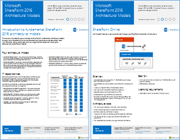
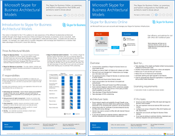
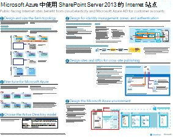

# SharePoint、Exchange、Skype for Business和Lync的架构模型。

本文中的 IT 海报介绍了适用于 SharePoint、Exchange、Skype for Business 和 Lync 的体系结构模型和部署选项。 它们还提供用于部署 SharePoint 中的Microsoft Azure。
  
通过使用 Microsoft 365，可以通过云提供熟悉的协作和通信服务。 无论你是维护本地部署还是使用本地部署，用户体验都Microsoft 365。 

这种统一的用户体验使决定在何处放置每个工作负载变得复杂。 它还引发了问题：
  
- 如何为单个工作负载选择平台？
    
- 将任何服务保留在内部部署是否有意义？
    
- 混合部署适用于什么方案？
    
- Azure 如何适应图片？
    
- Azure 支持Office哪些配置？
    
> [!TIP]
> 本文中的大多数海报都提供多种语言。 可用语言包括中文、英语、法语、德语、意大利语、日语、朝鲜语、葡萄牙语、俄语和西班牙语。 若要下载其中一种语言的海报，请在海报缩略图图像下选择"更多 **语言"。**
  
请将你的想法告诉我们！向我们 ([cloudadopt@microsoft.com](mailto:cloudadopt@microsoft.com)) 发送电子邮件。 
  
使用以下链接获取所需的海报：
  
- **体系结构模型**：使用这些资源确定 2016 和 SharePoint 2015 Skype for Business平台和配置。
    
  - [Microsoft SharePoint 2016 体系结构模型](architectural-models-for-sharepoint-exchange-skype-for-business-and-lync.md#SP2016_ArchModel)
    
  - [SharePointServer 2016 数据库](architectural-models-for-sharepoint-exchange-skype-for-business-and-lync.md#SP2016_Databases)
    
  - [Microsoft Skype for Business 2015 体系结构模型](architectural-models-for-sharepoint-exchange-skype-for-business-and-lync.md#SfB2015_ArchModel)
    
- **平台**：使用这些资源确定适用于 SharePoint 2013、Exchange 2013 和 Lync 2013 的理想平台和配置。
    
  - [SharePoint 2013 平台选项](architectural-models-for-sharepoint-exchange-skype-for-business-and-lync.md#SP2013_Options)
    
  - [Exchange 2013 平台选项](architectural-models-for-sharepoint-exchange-skype-for-business-and-lync.md#Exch2013_options)
    
  - [Lync 2013 平台选项](architectural-models-for-sharepoint-exchange-skype-for-business-and-lync.md#Lync2013_Options)
    
- SharePoint Azure 中的 SharePoint **Server 2013：** 使用这些 IT 海报在 Azure 基础结构服务中设计和配置 SharePoint Server 2013 工作负载。
    
  - [使用 SharePoint Server 2013 的 Azure 中的 Internet 站点](architectural-models-for-sharepoint-exchange-skype-for-business-and-lync.md#Azure_sharepoint2013)
    
  - [设计示例：Azure for SharePoint 2013 中的 Internet 站点](architectural-models-for-sharepoint-exchange-skype-for-business-and-lync.md#DesignSampleInternetSites)
    
  - [SharePoint灾难恢复到 Azure](architectural-models-for-sharepoint-exchange-skype-for-business-and-lync.md#sharepoint_recovery_Azure)
    
## 体系结构模型海报

SharePoint 2016 和 Skype for Business 2015 的 IT 海报提供了一种以易于打印的格式比较部署方法的方法。 海报列出了所有配置或平台选项。 它们针对每个选项提供以下信息：
  
- **概述**：平台的简短摘要，包括概念图。
    
- **最适合**：非常适合平台的常见方案。
    
- **许可证要求**：部署所需的许可证。
    
- **体系结构任务**：架构师需要做出的决策。
    
- **IT 专业人员任务或职责**：IT 员工需要规划的日常职责。
    

### Microsoft SharePoint Server 2016 体系结构模型

|项目|说明|
|---|---|
|[          ](https://www.microsoft.com/download/details.aspx?id=52650)   [PDF](https://download.microsoft.com/download/4/F/A/4FA0F94B-EE2F-41DB-A047-D9864FEF41E9/SharePoint2016ArchitecturalModels.pdf)  \| [Visio](https://download.microsoft.com/download/4/F/A/4FA0F94B-EE2F-41DB-A047-D9864FEF41E9/SharePoint2016ArchitecturalModels.vsdx)  \| [更多语言](https://www.microsoft.com/download/details.aspx?id=52650)|本 IT 海报SharePoint业务SharePoint和解决方案架构师需要知道的 SharePoint Online、Azure 和本地配置。    - **SharePoint Online (SaaS) ：SharePoint** 软件即服务 (使用 SaaS) 模型。   - **SharePoint混合**：将SharePoint网站和应用以你自己的节奏移动到云。   - **SharePoint Azure (IaaS) ：** 将本地环境扩展到 Azure，SharePoint 2016 服务器。  (此模型适用于高可用性或灾难恢复环境以及开发/测试环境。)    - **SharePoint：** 规划、部署、维护和自定义SharePoint数据中心中的环境。|
   

### SharePoint Server 2016 数据库

|项目|说明|
|---|---|
|   [PDF](https://download.microsoft.com/download/D/5/D/D5DC1121-8BC5-4953-834F-1B5BB03EB691/DBrefguideSPS2016_tabloid.pdf)  \| [Visio](https://download.microsoft.com/download/D/5/D/D5DC1121-8BC5-4953-834F-1B5BB03EB691/DBrefguideSPS2016_tabloid.vsdx)  \| [更多语言](https://www.microsoft.com/download/details.aspx?id=55041)|此 IT 海报是 SharePoint Server 2016 数据库的快速参考。 你将看到每个数据库的详细信息：    - 大小   - 扩展指南   - I/O 模式   - 要求：     第一页SharePoint数据库和服务应用程序具有多个数据库。 第二页显示了具有单个数据库的所有服务应用程序。     有关详细信息，请参阅 SharePoint [Server 2016 中的数据库类型和说明](/SharePoint/technical-reference/database-types-and-descriptions)。|
   

### Microsoft Skype for Business 2015 体系结构模型

|项目|说明|
|---|---|
|   [PDF](https://download.microsoft.com/download/7/7/4/7741262C-A60D-41F7-863B-99BF5964FBFE/Skype%20for%20Business%20Architectural%20Models.pdf)  \| [Visio](https://download.microsoft.com/download/7/7/4/7741262C-A60D-41F7-863B-99BF5964FBFE/Skype%20for%20Business%20Architectural%20Models.vsd)  \| [更多语言](https://www.microsoft.com/download/details.aspx?id=55022)|此海报介绍了 Skype for Business Online、本地、混合和云专用交换机 (PBX) 。 它还描述了与业务Exchange SharePoint架构师需要知道的一些配置和配置集成。    该海报面向 IT 专业人员，旨在提升对基本体系结构模型Skype for Business联机和Skype for Business内部部署体验。   从最适合组织需求和计划的配置开始。 请考虑并根据需要使用其他配置。 例如，您可能需要考虑与 Exchange SharePoint 或利用 Microsoft 云 PBX 产品的解决方案集成。|
   
## 平台选项海报

SharePoint 2013、Exchange 2013 和 Lync 2013 的 IT 海报提供了一种一目了然地比较部署方法的方法。 每个海报都列出了所有配置或平台选项。 它提供每个选项的以下信息：
  
- **概述**：平台的简短摘要，包括概念图。
    
- **最适合**：非常适合平台的常见方案。
    
- **许可证要求**：部署所需的许可证。
    
- **体系结构任务**：架构师需要做出的决策。
    
- **IT 专业人员任务或职责**：IT 员工需要规划的日常职责。
    

## SharePoint 2013 平台选项

|项目|说明|
|---|---|
|   [PDF](https://go.microsoft.com/fwlink/p/?LinkId=324594)  \| [Visio](https://go.microsoft.com/fwlink/p/?LinkId=324593)  \| [更多语言](https://www.microsoft.com/download/details.aspx?id=40332)|对于业务决策者和架构师，此海报显示了 SharePoint 2013、Microsoft 365 中的 SharePoint、与 Microsoft 365、Azure 和仅本地部署本地混合的平台选项。 它包括每个体系结构的概述、建议、许可证要求以及每个平台的架构师和 IT 专业人员任务列表。 海报重点介绍了 Azure SharePoint解决方案。|
   

## Exchange 2013 平台选项

|项目|说明|
|---|---|
|[          ](https://www.microsoft.com/download/details.aspx?id=42676)   [PDF](https://go.microsoft.com/fwlink/p/?LinkID=398740)  \| [Visio](https://go.microsoft.com/fwlink/p/?LinkID=398742)  \| [更多语言](https://www.microsoft.com/download/details.aspx?id=42676)|本海报针对业务决策者和架构师介绍了适用于 Exchange 2013 的平台选项。 客户可以从Exchange Online、Microsoft 365混合Exchange、Exchange Server本地和托管Exchange。 海报详细介绍了每个体系结构选项，包括每个选项的理想方案、许可证要求和 IT 专业人员的职责。|
   

## Lync 2013 平台选项

|项目|说明|
|---|---|
|[          ](https://www.microsoft.com/download/details.aspx?id=41677)   [PDF](https://go.microsoft.com/fwlink/p/?LinkID=391837)  \| [Visio](https://go.microsoft.com/fwlink/p/?LinkID=391839)  \| [更多语言](https://www.microsoft.com/download/details.aspx?id=41677)|本海报针对业务决策者和架构师介绍了 Lync 2013 的平台选项。 客户可以从 Lync Online 和 Microsoft 365、混合 Lync、本地 Lync Server 和托管 Lync 进行选择。 IT 海报详细介绍了每个体系结构选项，包括每个选项的理想方案、许可证要求和 IT 专业人员的职责。|
   

## Azure 解决方案中的 SharePoint 海报

Azure 中适用于 SharePoint 的 IT 海报显示了使用 SharePoint Server 2013 的基于 Azure 的解决方案。
  

### 使用 Microsoft Azure Server 2013 SharePoint Internet 站点

|项目|说明|
|---|---|
|[          ](https://www.microsoft.com/download/details.aspx?id=41992)   [PDF](https://go.microsoft.com/fwlink/p/?LinkId=392552)  \| [Visio](https://go.microsoft.com/fwlink/p/?LinkId=392551)  \| [更多语言](https://www.microsoft.com/download/details.aspx?id=41992)|此海报概述了 Azure 中面向 Internet 的网站的关键设计活动及推荐的体系结构。     有关详细信息，请参阅以下文章：     - [使用 SharePoint Server 2013 的 Azure 中的 Internet 站点](internet-sites-in-microsoft-azure-using-sharepoint-server-2013.md)   - [SharePoint 2013 的 Azure 体系结构](microsoft-azure-architectures-for-sharepoint-2013.md)|
   

### Azure for SharePoint 2013 中的 Internet 站点

|项目|说明|
|---|---|
|[          ](https://www.microsoft.com/download/details.aspx?id=41991)   [PDF](https://go.microsoft.com/fwlink/p/?LinkId=392549)  \| [Visio](https://go.microsoft.com/fwlink/p/?LinkId=392548)  \| [更多语言](https://www.microsoft.com/download/details.aspx?id=41991)|使用此设计示例作为起点，使用 SharePoint Server 2013 在 Azure 中构建面向 Internet 的站点。    有关详细信息，请参阅以下文章：     - [使用 SharePoint Server 2013 的 Azure 中的 Internet 站点](internet-sites-in-microsoft-azure-using-sharepoint-server-2013.md)   - [SharePoint 2013 的 Azure 体系结构](microsoft-azure-architectures-for-sharepoint-2013.md)|
   

### SharePoint 灾难恢复到 Microsoft Azure

|项目|说明|
|---|---|
|[          ](https://www.microsoft.com/download/details.aspx?id=41993)   [PDF](https://go.microsoft.com/fwlink/p/?LinkId=392555)  \| [Visio](https://go.microsoft.com/fwlink/p/?LinkId=392554)  \| [更多语言](https://www.microsoft.com/download/details.aspx?id=41993)|此 IT 海报显示 Azure 中的灾难恢复环境的体系结构原则。    有关详细信息，请参阅以下文章：     - [SharePointAzure 中的 Server 2013 灾难恢复](sharepoint-server-2013-disaster-recovery-in-microsoft-azure.md)   - [SharePoint 2013 的 Azure 体系结构](microsoft-azure-architectures-for-sharepoint-2013.md)|
   
## 另请参阅

- [Microsoft 365 解决方案和体系结构中心](../solutions/index.yml)
  
- [Microsoft 云体系结构模型](../solutions/cloud-architecture-models.md)
  
- [Microsoft 365测试实验室指南](m365-enterprise-test-lab-guides.md)
  
- [混合解决方案](hybrid-solutions.md)