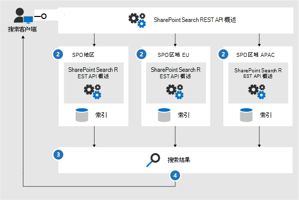
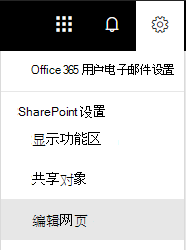
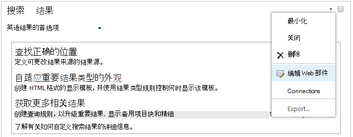

# <a name="configure-search-for-microsoft-365-multi-geo"></a>为 Microsoft 365 多地理位置配置搜索

在多地理位置环境中，每个地理位置都有自己的搜索索引和搜索中心。 在用户搜索时，查询会扇出以覆盖所有索引，并合并返回的结果。

例如，位于一个地理位置的用户可以搜索在另一个地理位置中存储的内容，也可以搜索只限不同地理位置的 SharePoint 网站内容。 如果用户有权访问此内容，便会看到搜索结果。

## <a name="which-search-clients-work-in-a-multi-geo-environment"></a>在多地理位置环境中可以运行哪些搜索客户端？

这些客户端可以返回来自所有地理位置的结果：

- OneDrive
- Delve
- SharePoint 主页
- 搜索中心
- 使用 SharePoint 搜索 API 的自定义搜索应用程序

### <a name="onedrive"></a>OneDrive

多地理位置环境一旦设置，在 OneDrive 中搜索的用户即可获得来自所有地理位置的结果。

### <a name="delve"></a>Delve

多地理位置环境一旦设置，在 Delve 中搜索的用户即可获得来自所有地理位置的结果。

Delve 源和个人资料卡片只能显示存储在中央位置中的文件预览。对于存储在附属位置的文件，将改为显示文件类型的图标。

### <a name="the-sharepoint-home-page"></a>SharePoint 主页

多地理位置环境一旦设置，用户即可在其 SharePoint 主页上看到来自多地理位置的资讯、最近访问和关注的网站。如果他们使用 SharePoint 主页上的搜索框，则他们将获得来自多地理位置的合并结果。

### <a name="the-search-center"></a>搜索中心

多地理位置环境设置后，每个搜索中心将继续仅显示来自其各自地理位置的结果。管理员必须[更改每个搜索中心的设置](#_Set_up_a_1)，以获取来自所有地理位置的结果。之后，在搜索中心搜索的用户将获得来自所有地理位置的结果。

### <a name="custom-search-applications"></a>自定义搜索应用程序

同样，自定义搜索应用程序使用现有 SharePoint Search REST API 与搜索索引进行交互。若要获取来自所有（或部分）地理位置的结果，应用程序必须在请求中[调用 API 并包含新的多地理位置查询参数](#_Get_custom_search)。这将触发对所有地理位置的查询扇出。

## <a name="whats-different-about-search-in-a-multi-geo-environment"></a>在多地理位置环境中搜索有什么不同之处？

你所熟悉的某些搜索功能在多地理位置环境中的工作方式可能有所不同。

<table>
<thead>
<tr class="header">
<th align="left">功能</th>
<th align="left">如何工作</th>
<th align="left">解决方法</th>
</tr>
</thead>
<tbody>
<tr class="odd">
<td align="left">升级的结果</td>
<td align="left">您可以在不同级别创建具有升级的结果的查询规则：整个租户、网站集或网站。 在多地理位置环境中的租户级别定义升级的结果，以便将结果升级到所有地理位置中的搜索中心。 如果只想升级位于站点集或站点的搜索中心中的结果，请在站点集或站点级别定义升级的结果。 不会升级位于其他地理位置的结果。</td>
<td align="left">如果不需要对每个地理位置使用不同的升级结果（例如，在出差时使用不同的规则），我们建议在租户级别定义升级的结果。</td>
</tr>
<tr class="even">
<td align="left">搜索精简</td>
<td align="left">搜索将返回来自租户的所有地理位置的精简内容，然后对其进行聚合。聚合是最佳做法，意味着精简计数可能并非 100% 准确。对于大部分搜索驱动的方案，此准确度已足够。 </td>
<td align="left">对于依赖于精简完整度的搜索驱动的应用程序，请单独查询每个地理位置。</td>
</tr>
<tr class="odd">
<td align="left"></td>
<td align="left">多地理位置搜索不支持数值精简的动态存储桶。</td>
<td align="left">对 <a href="/sharepoint/dev/general-development/query-refinement-in-sharepoint">数字精简条件使用"Discretize"</a> 参数。</td>
</tr>
<tr class="even">
<td align="left">文档 ID</td>
<td align="left">如果正在开发依赖于文档 ID 的搜索驱动的应用程序，请注意，多地理位置环境中的文档 ID 对所有地理位置来说并不是唯一的，它们只对每个地理位置来说是唯一的。</td>
<td align="left">我们添加了用于标识地理位置的列。 使用此列来实现唯一性。 此列名为"GeoLocationSource"。</td>
</tr>
<tr class="odd">
<td align="left">结果数</td>
<td align="left">搜索结果页将显示来自地理位置的组合结果，但该页显示的结果不能超过 500 个。</td>
<td align="left"></td>
</tr>
<tr class="even">
<td align="left">混合搜索</td>
<td align="left">在具有<a href="/sharepoint/hybrid/learn-about-cloud-hybrid-search-for-sharepoint">云混合搜索</a>的混合 SharePoint 环境中，本地内容将添加到中心位置的 Microsoft 365 索引。</td>
<td align="left"></td>
</tr>
</tbody>
</table>

## <a name="whats-not-supported-for-search-in-a-multi-geo-environment"></a>在多地理位置环境中不支持的搜索有哪些？

你所熟悉的某些搜索功能在多地理位置环境中可能不受支持。

<table>
<thead>
<tr class="header">
<th align="left">搜索功能</th>
<th align="left">注意</th>
</tr>
</thead>
<tbody>
<tr class="odd">
<td align="left">仅应用身份验证</td>
<td align="left">在多地理位置搜索中不支持仅应用身份验证（来自服务的特权访问）。</td>
</tr>
<tr class="even">
<td align="left">来宾</td>
<td align="left">来宾仅从要搜索的地理位置获取结果。</td>
</tr>
</tbody>
</table>

## <a name="how-does-search-work-in-a-multi-geo-environment"></a>如何在多地理位置环境中进行搜索？

所有搜索客户端均使用现有 SharePoint Search REST API 与搜索索引进行交互。



1. 搜索客户端使用查询属性 EnableMultiGeoSearch= true 来调用搜索 REST 终结点。
2. 查询将被发送到租户中的所有地理位置。
3. 将对来自每个地理位置的搜索结果进行合并和排名。
4. 客户端将获得统一的搜索结果。

<span id="_Set_up_a" class="anchor"><span id="_Ref501388384" class="anchor"></span></span>请注意，在收到来自所有地理位置的结果之前，我们不会合并搜索结果。 这意味着，与仅包含一个地理位置的环境中的搜索相比，多地理位置搜索会有额外的延迟。

<span id="_Set_up_a_1" class="anchor"><span id="_Ref505252370" class="anchor"></span></span>
## <a name="get-a-search-center-to-show-results-from-all-geo-locations"></a>获取搜索中心以显示来自所有地理位置的结果

每个搜索中心具有多个类别，必须单独设置每个类别。

1. 请确保执行这些步骤所使用的帐户具有编辑搜索结果页和搜索结果 Web 部件的权限。

2. 导航到搜索结果页（请参阅搜索结果页的[列表](https://support.office.com/article/174d36e0-2f85-461a-ad9a-8b3f434a4213)）

3. 选择要设置的类别，单击右上角的 **“设置”** 齿轮图标，然后单击 **“编辑页面”**。搜索结果页将在编辑模式下打开。

   

4. 在搜索结果 Web 部件中，将鼠标指针移动到 Web 部件的右上角，单击箭头，然后单击菜单上的“**编辑 Web 部件** ”。 搜索结果 Web 部件工具窗格在页面右上角的功能区下方打开。

   

5. 在 Web 部件工具窗格中的 **“设置”** 部分，在 **“结果控制设置”** 下，选择 **“显示多地理位置结果”**，获取搜索结果 Web 部件，以显示来自所有地理位置的结果。

6. 单击 **“确定”**，以保存更改并关闭 Web 部件工具窗格。

7. 单击主菜单 **“页面”选项卡上的“签入”**，查看对搜索结果 Web 部件所做的更改。

8. 使用页面顶部的注释中提供的链接来发布更改。

<span id="_Get_custom_search" class="anchor"><span id="_Ref501388387" class="anchor"></span></span>
## <a name="get-custom-search-applications-to-show-results-from-all-or-some-geo-locations"></a>获取自定义搜索应用程序，以显示来自所有（或部分）地理位置的结果

自定义搜索应用程序通过指定对 SharePoint Search REST API 的请求的查询参数获取来自所有（或部分）地理位置的结果。根据查询参数，查询将被扇出到所有（或部分）地理位置。例如，如果只需要查询地理位置的子集来查找相关信息，可以控制仅扇出到这些子集。如果请求成功，则 SharePoint Search REST API 将返回响应数据。

### <a name="requirement"></a>要求

对于每个地理位置，必须确保组织中的所有用户都已授予根网站（例如 contoso **APAC**.sharepoint.com/ and contoso **EU**.sharepoint.com/）的 **读取** 权限级别。[了解权限](https://support.office.com/article/understanding-permission-levels-in-sharepoint-87ecbb0e-6550-491a-8826-c075e4859848)。

### <a name="query-parameters"></a>查询参数

EnableMultiGeoSearch - 此布尔值指定是否应将查询扇出到多地理位置租户的其他地理位置的索引。 将其设置为 **true** 以扇出查询；设置为 **false** 则不扇出查询。 如果不包含此参数，则默认值为 **false**（除非针对使用企业搜索中心模板的网站执行 REST API 调用，在这种情况下，默认值为 **true**）。 如果在非多地理位置环境中使用该参数，则会忽略该参数。

ClientType - 此参数为字符串。 输入每个搜索应用程序的唯一客户端名称。 如果不包括此参数，则不会将查询扇出到其他地理位置。

MultiGeoSearchConfiguration - 这是一个可选列表，其中包含多地理位置租户中的一些地理位置，当 **EnableMultiGeoSearch** 为 **true** 时，会将查询扇出到这些地理位置。 如果不包括此参数，或将其保留为空白，则会将查询扇出到所有地理位置。 对于每个地理位置，请以 JSON 格式输入以下各项：

<table>
<thead>
<tr class="header">
<th align="left">项目</th>
<th align="left">说明</th>
</tr>
</thead>
<tbody>
<tr class="odd">
<td align="left">DataLocation</td>
<td align="left">地理位置，例如 NAM。</td>
</tr>
<tr class="even">
<td align="left">终结点</td>
<td align="left">要连接到的终结点，例如 https://contoso.sharepoint.com</td>
</tr>
<tr class="odd">
<td align="left">SourceId</td>
<td align="left">结果源的 GUID，例如 B81EAB55-3140-4312-B0F4-9459D1B4FFEE。</td>
</tr>
</tbody>
</table>

如果省略 DataLocation 或终结点，或如果 DataLocation 是重复的，则请求将会失败。[可以使用 Microsoft Graph 获取有关租户地理位置终结点的信息](/sharepoint/dev/solution-guidance/multigeo-discovery)。

### <a name="response-data"></a>响应数据

MultiGeoSearchStatus - 这是 SharePoint Search API 响应请求返回的属性。该属性的值是一个字符串，提供有关 SharePoint Search API 所返回结果的以下信息：

<table>
<thead>
<tr class="header">
<th align="left">值</th>
<th align="left">说明</th>
</tr>
</thead>
<tbody>
<tr class="odd">
<td align="left">完整</td>
<td align="left">来自<strong>所有</strong>地理位置的完整结果。</td>
</tr>
<tr class="even">
<td align="left">部分</td>
<td align="left">来自一个或多个地理位置的部分结果。由于暂时性错误，该结果不完整。</td>
</tr>
</tbody>
</table>

### <a name="query-using-the-rest-service"></a>使用 REST 服务查询

使用 GET 请求，指定 URL 中的查询参数。使用 POST 请求，在正文中以 JavaScript 对象表示法 (JSON) 格式传递查询参数。

#### <a name="request-headers"></a>请求标头

<table>
<thead>
<tr class="header">
<th align="left">名称</th>
<th align="left">值</th>
</tr>
</thead>
<tbody>
<tr class="odd">
<td align="left">Content-Type</td>
<td align="left">application/json;odata=verbose</td>
</tr>
</tbody>
</table>

#### <a name="sample-get-request-thats-fanned-out-to-all-geo-locations"></a>扇出到 **所有** 地理位置的示例 GET 请求

```http
https:// \<tenant\>/\_api/search/query?querytext='sharepoint'&Properties='EnableMultiGeoSearch:true'&ClientType='my\_client\_id'
```

#### <a name="sample-get-request-to-fan-out-to-some-geo-locations"></a>扇出部分地理位置的示例 GET 请求

```http
https:// \<tenant\>/\_api/search/query?querytext='site'&ClientType='my_client_id'&Properties='EnableMultiGeoSearch:true, MultiGeoSearchConfiguration:[{DataLocation\\:"NAM"\\,Endpoint\\:"https\\://contosoNAM.sharepoint.com"\\,SourceId\\:"B81EAB55-3140-4312-B0F4-9459D1B4FFEE"}\\,{DataLocation\\:"CAN"\\,Endpoint\\:"https\\://contosoCAN.sharepoint-df.com"}]'
```

> [!NOTE]
> MultiGeoSearchConfiguration 属性的地理位置列表中的逗号和冒号前面带有 **反斜杠** 字符。 这是因为 GET 请求使用冒号分隔属性，并使用逗号分隔属性的参数。 如果不使用反斜杠作为转义字符，则 MultiGeoSearchConfiguration 属性会被错误解读。

#### <a name="sample-post-request-thats-fanned-out-to-all-geo-locations"></a>扇出到 **所有** 地理位置的示例 POST 请求

```http
    {
    "request": {
            "__metadata": {
            "type": "Microsoft.Office.Server.Search.REST.SearchRequest"
        },
        "Querytext": "sharepoint",
        "Properties": {
            "results": [
                {
                    "Name": "EnableMultiGeoSearch",
                    "Value": {
                        "QueryPropertyValueTypeIndex": 3,
                        "BoolVal": true
                    }
                }
            ]
        },
        "ClientType": "my_client_id"
        }
    }
```

#### <a name="sample-post-request-thats-fanned-out-to-some-geo-locations"></a>扇出到 **部分** 地理位置的示例 POST 请求

```http
    {
        "request": {
            "Querytext": "SharePoint",
            "ClientType": "my_client_id",
            "Properties": {
                "results": [
                    {
                        "Name": "EnableMultiGeoSearch",
                        "Value": {
                            "QueryPropertyValueTypeIndex": 3,
                            "BoolVal": true
                        }
                    },
                    {
                        "Name": "MultiGeoSearchConfiguration",
                        "Value": {
                        "StrVal": "[{\"DataLocation\":\"NAM\",\"Endpoint\":\"https://contoso.sharepoint.com\",\"SourceId\":\"B81EAB55-3140-4312-B0F4-9459D1B4FFEE\"},{\"DataLocation\":\"CAN\",\"Endpoint\":\"https://contosoCAN.sharepoint.com\"}]",
                            "QueryPropertyValueTypeIndex": 1
                        }
                    }
                ]
            }
        }
    }
```

### <a name="query-using-csom"></a>使用 CSOM 查询

以下是扇出到 **所有** 地理位置的示例 CSOM 请求：

```CSOM
var keywordQuery = new KeywordQuery(ctx);
keywordQuery.QueryText = query.SearchQueryText;
keywordQuery.ClientType = <enter a string here>;
keywordQuery.Properties["EnableMultiGeoSearch"] = true;
```
