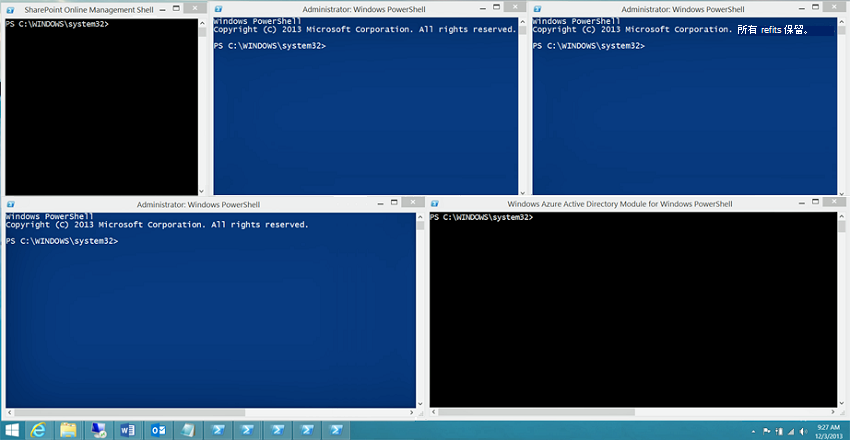

# <a name="connect-to-all-microsoft-365-services-in-a-single-windows-powershell-window"></a><span data-ttu-id="c2ada-103">在单个 Windows PowerShell 窗口中连接所有 Microsoft 365 服务</span><span class="sxs-lookup"><span data-stu-id="c2ada-103">Connect to all Microsoft 365 services in a single Windows PowerShell window</span></span>

<span data-ttu-id="c2ada-104">使用 PowerShell 管理 Microsoft 365 时，可以同时打开五个不同的 Windows PowerShell 会话，分别对应 Microsoft 365 管理中心、SharePoint Online、Exchange Online、Skype for Business Online、Microsoft Teams 和安全 &amp; 合规中心。</span><span class="sxs-lookup"><span data-stu-id="c2ada-104">When you use PowerShell to manage Microsoft 365, it is possible to have up to five different Windows PowerShell sessions open at the same time corresponding to Microsoft 365 admin center, SharePoint Online, Exchange Online, Skype for Business Online, Microsoft Teams, and the Security &amp; Compliance Center.</span></span> <span data-ttu-id="c2ada-105">各个 Windows PowerShell 会话中存在五种不同的连接方法，你的桌面可能如下所示：</span><span class="sxs-lookup"><span data-stu-id="c2ada-105">With five different connection methods in separate Windows PowerShell sessions, your desktop could look like this:</span></span>
  

  
<span data-ttu-id="c2ada-107">这不是用于管理 Microsoft 365 的最佳方法，因为你不能在这五个窗口间交换数据，因此无法实现跨服务管理。</span><span class="sxs-lookup"><span data-stu-id="c2ada-107">This is not optimal for managing Microsoft 365 because you can't exchange data among those five windows for cross-service management.</span></span> <span data-ttu-id="c2ada-108">本主题介绍如何使用 Windows PowerShell 的单个实例，你可以从中管理 Microsoft 365 帐户、Skype for Business Online、Exchange Online、SharePoint Online、Microsoft Teams 和安全 &amp; 合规中心。</span><span class="sxs-lookup"><span data-stu-id="c2ada-108">This topic describes how to use a single instance of Windows PowerShell from which you can manage Microsoft 365 accounts, Skype for Business Online, Exchange Online, SharePoint Online, Microsoft Teams, and the Security &amp; Compliance Center.</span></span>

>[!Note]
><span data-ttu-id="c2ada-109">本文目前只包含连接到全球 (+GCC) 云的命令。</span><span class="sxs-lookup"><span data-stu-id="c2ada-109">This article currently only contains the commands to connect to the Worldwide (+GCC) cloud.</span></span> <span data-ttu-id="c2ada-110">其他说明提供了有关连接到其他 Microsoft 365 云的信息的文章链接。</span><span class="sxs-lookup"><span data-stu-id="c2ada-110">Additional notes provide links to articles with information about connecting to the other Microsoft 365 clouds.</span></span>
>

## <a name="before-you-begin"></a><span data-ttu-id="c2ada-111">准备工作</span><span class="sxs-lookup"><span data-stu-id="c2ada-111">Before you begin</span></span>

<span data-ttu-id="c2ada-112">在可以从 Windows PowerShell 的单个实例管理所有 Microsoft 365 之前，请考虑以下先决条件：</span><span class="sxs-lookup"><span data-stu-id="c2ada-112">Before you can manage all of Microsoft 365 from a single instance of Windows PowerShell, consider the following prerequisites:</span></span>
  
- <span data-ttu-id="c2ada-113">在这些过程中使用的 Microsoft 365 工作或学校帐户必须是 Microsoft 365 管理员角色的成员。</span><span class="sxs-lookup"><span data-stu-id="c2ada-113">The Microsoft 365 work or school account that you use for these procedures needs to be a member of a Microsoft 365 admin role.</span></span> <span data-ttu-id="c2ada-114">有关详细信息，请参阅[关于管理员角色](https://docs.microsoft.com/microsoft-365/admin/add-users/about-admin-roles?view=o365-worldwide)。</span><span class="sxs-lookup"><span data-stu-id="c2ada-114">For more information, see [About admin roles](https://docs.microsoft.com/microsoft-365/admin/add-users/about-admin-roles?view=o365-worldwide).</span></span> <span data-ttu-id="c2ada-115">这是对 PowerShell for Microsoft 365 的要求，不一定适用于所有其他 Microsoft 365 服务。</span><span class="sxs-lookup"><span data-stu-id="c2ada-115">This a requirement for PowerShell for Microsoft 365, not necessarily for all other Microsoft 365 services.</span></span>
    
- <span data-ttu-id="c2ada-116">可以使用以下 64 位版本的 Windows：</span><span class="sxs-lookup"><span data-stu-id="c2ada-116">You can use the following 64-bit versions of Windows:</span></span>
    
  - <span data-ttu-id="c2ada-117">Windows 10</span><span class="sxs-lookup"><span data-stu-id="c2ada-117">Windows 10</span></span>
    
  - <span data-ttu-id="c2ada-118">Windows 8.1 或 Windows 8</span><span class="sxs-lookup"><span data-stu-id="c2ada-118">Windows 8.1 or Windows 8</span></span>
    
  - <span data-ttu-id="c2ada-119">Windows Server 2019</span><span class="sxs-lookup"><span data-stu-id="c2ada-119">Windows Server 2019</span></span>
    
  - <span data-ttu-id="c2ada-120">Windows Server 2016</span><span class="sxs-lookup"><span data-stu-id="c2ada-120">Windows Server 2016</span></span>
    
  - <span data-ttu-id="c2ada-121">Windows Server 2012 R2 或 Windows Server 2012</span><span class="sxs-lookup"><span data-stu-id="c2ada-121">Windows Server 2012 R2 or Windows Server 2012</span></span>
    
  - <span data-ttu-id="c2ada-122">Windows 7 Service Pack 1 (SP1)\*</span><span class="sxs-lookup"><span data-stu-id="c2ada-122">Windows 7 Service Pack 1 (SP1)\*</span></span>
    
  - <span data-ttu-id="c2ada-123">Windows Server 2008 R2 SP1\*</span><span class="sxs-lookup"><span data-stu-id="c2ada-123">Windows Server 2008 R2 SP1\*</span></span>
    
    <span data-ttu-id="c2ada-124">\* 需要安装 Microsoft .NET Framework 4.5.*x*，然后安装 Windows Management Framework 3.0 或 Windows Management Framework 4.0。</span><span class="sxs-lookup"><span data-stu-id="c2ada-124">\* You need to install the Microsoft .NET Framework 4.5.*x* and then either the Windows Management Framework 3.0 or the Windows Management Framework 4.0.</span></span> <span data-ttu-id="c2ada-125">有关详细信息，请参阅[安装 .NET Framework](https://go.microsoft.com/fwlink/p/?LinkId=257868)、[Windows Management Framework 3.0](https://go.microsoft.com/fwlink/p/?LinkId=272757) 或 [Windows Management Framework 4.0](https://go.microsoft.com/fwlink/p/?LinkId=391344)。</span><span class="sxs-lookup"><span data-stu-id="c2ada-125">For more information, see [Installing the .NET Framework](https://go.microsoft.com/fwlink/p/?LinkId=257868) and [Windows Management Framework 3.0](https://go.microsoft.com/fwlink/p/?LinkId=272757) or [Windows Management Framework 4.0](https://go.microsoft.com/fwlink/p/?LinkId=391344).</span></span>
    
    <span data-ttu-id="c2ada-126">出于对 Skype for Business Online 模块和一个 Microsoft 365 模块的要求，你需要使用 64 位版本的 Windows。</span><span class="sxs-lookup"><span data-stu-id="c2ada-126">You need to use a 64-bit version of Windows because of the requirements for the Skype for Business Online module and one of the Microsoft 365 modules.</span></span>
    
- <span data-ttu-id="c2ada-127">需要安装 Azure Active Directory (Azure AD)、Exchange Online、SharePoint Online、Skype for Business Online 和 Teams 所需的模块：</span><span class="sxs-lookup"><span data-stu-id="c2ada-127">You need to install the modules that are required for Azure Active Directory (Azure AD), Exchange Online, SharePoint Online, Skype for Business Online and Teams:</span></span>
    
   - [<span data-ttu-id="c2ada-128">Azure Active Directory V2</span><span class="sxs-lookup"><span data-stu-id="c2ada-128">Azure Active Directory V2</span></span>](connect-to-microsoft-365-powershell.md#connect-with-the-azure-active-directory-powershell-for-graph-module)
   - [<span data-ttu-id="c2ada-129">SharePoint Online 命令行管理程序</span><span class="sxs-lookup"><span data-stu-id="c2ada-129">SharePoint Online Management Shell</span></span>](https://go.microsoft.com/fwlink/p/?LinkId=255251)
   - [<span data-ttu-id="c2ada-130">Skype for Business Online、Windows PowerShell 模块</span><span class="sxs-lookup"><span data-stu-id="c2ada-130">Skype for Business Online, Windows PowerShell Module</span></span>](https://go.microsoft.com/fwlink/p/?LinkId=532439)
   - [<span data-ttu-id="c2ada-131">Exchange Online PowerShell V2</span><span class="sxs-lookup"><span data-stu-id="c2ada-131">Exchange Online PowerShell V2</span></span>](https://docs.microsoft.com/powershell/exchange/exchange-online/exchange-online-powershell-v2/exchange-online-powershell-v2?view=exchange-ps#install-and-maintain-the-exchange-online-powershell-v2-module)
   - [<span data-ttu-id="c2ada-132">Teams PowerShell 概览</span><span class="sxs-lookup"><span data-stu-id="c2ada-132">Teams PowerShell Overview</span></span>](https://docs.microsoft.com/microsoftteams/teams-powershell-overview)
    
-  <span data-ttu-id="c2ada-133">需要对 Windows PowerShell 进行配置才能为 Skype for Business Online 和安全 &amp; 合规中心运行签名的脚本。</span><span class="sxs-lookup"><span data-stu-id="c2ada-133">Windows PowerShell needs to be configured to run signed scripts for Skype for Business Online and the Security &amp; Compliance Center.</span></span> <span data-ttu-id="c2ada-134">若要执行此操作，请在提升的 Windows PowerShell 会话（通过选择“以管理员身份运行”\*\*\*\* 打开的 Windows PowerShell 窗口）中运行以下命令。</span><span class="sxs-lookup"><span data-stu-id="c2ada-134">To do this, run the following command in an elevated Windows PowerShell session (a Windows PowerShell window you open by selecting **Run as administrator**).</span></span>
    
   ```powershell
   Set-ExecutionPolicy RemoteSigned
   ```

## <a name="connection-steps-when-using-just-a-password"></a><span data-ttu-id="c2ada-135">仅使用密码时的连接步骤</span><span class="sxs-lookup"><span data-stu-id="c2ada-135">Connection steps when using just a password</span></span>

<span data-ttu-id="c2ada-136">下面是仅使用密码进行登录时在单个 PowerShell 窗口中连接到所有服务的步骤。</span><span class="sxs-lookup"><span data-stu-id="c2ada-136">Here are the steps to connect to all the services in a single PowerShell window when you are using just a password for sign-in.</span></span>
  
1. <span data-ttu-id="c2ada-137">打开 Windows PowerShell。</span><span class="sxs-lookup"><span data-stu-id="c2ada-137">Open Windows PowerShell.</span></span>
    
2. <span data-ttu-id="c2ada-138">运行以下命令并输入你的 Microsoft 365 工作或学校帐户凭据。</span><span class="sxs-lookup"><span data-stu-id="c2ada-138">Run this command and enter your Microsoft 365 work or school account credentials.</span></span>
    
   ```powershell
   $credential = Get-Credential
   ```

3. <span data-ttu-id="c2ada-139">运行以下命令，使用 Azure Active Directory PowerShell for Graph 模块连接到 Azure AD。</span><span class="sxs-lookup"><span data-stu-id="c2ada-139">Run this command to connect to Azure AD using the Azure Active Directory PowerShell for Graph module.</span></span>
    
   ```powershell
   Connect-AzureAD -Credential $credential
   ```
  
   <span data-ttu-id="c2ada-140">或者，如果你使用的是用于 Windows PowerShell 的 Microsoft Azure Active Directory 模块，请运行以下命令。</span><span class="sxs-lookup"><span data-stu-id="c2ada-140">Alternately, if you are using the Microsoft Azure Active Directory Module for Windows PowerShell module, run this command.</span></span>
      
   ```powershell
   Connect-MsolService -Credential $credential
   ```

   > [!Note]
   > <span data-ttu-id="c2ada-141">PowerShell Core 不支持用于 Windows PowerShell 模块和 cmdlet 的其名称中包含 **Msol** 的 Microsoft Azure Active Directory 模块。</span><span class="sxs-lookup"><span data-stu-id="c2ada-141">PowerShell Core does not support the Microsoft Azure Active Directory Module for Windows PowerShell module and cmdlets with **Msol** in their name.</span></span> <span data-ttu-id="c2ada-142">若要继续使用这些 cmdlet，必须从 Windows PowerShell 运行它们。</span><span class="sxs-lookup"><span data-stu-id="c2ada-142">To continue using these cmdlets, you must run them from Windows PowerShell.</span></span>

4. <span data-ttu-id="c2ada-143">运行以下命令以连接到 SharePoint Online。</span><span class="sxs-lookup"><span data-stu-id="c2ada-143">Run these commands to connect to SharePoint Online.</span></span> <span data-ttu-id="c2ada-144">指定域的组织名称。</span><span class="sxs-lookup"><span data-stu-id="c2ada-144">Specify the organization name for your domain.</span></span> <span data-ttu-id="c2ada-145">例如，对于“litwareinc.onmicrosoft.com”，组织名称值为“litwareinc”。</span><span class="sxs-lookup"><span data-stu-id="c2ada-145">For example, for "litwareinc.onmicrosoft.com", the  organization name value is "litwareinc".</span></span>
    
   ```powershell
   $orgName="<for example, litwareinc for litwareinc.onmicrosoft.com>"
   Connect-SPOService -Url https://$orgName-admin.sharepoint.com -Credential $userCredential
   ```

5. <span data-ttu-id="c2ada-146">运行以下命令以连接到 Skype for Business Online。</span><span class="sxs-lookup"><span data-stu-id="c2ada-146">Run these commands to connect to Skype for Business Online.</span></span> <span data-ttu-id="c2ada-147">有关增加 `WSMan NetworkDelayms` 值的警告应在首次连接时出现，并应予以忽略。</span><span class="sxs-lookup"><span data-stu-id="c2ada-147">A warning about increasing the `WSMan NetworkDelayms` value is expected the first time you connect and should be ignored.</span></span>
     
   ```powershell
   Import-Module SkypeOnlineConnector
   $sfboSession = New-CsOnlineSession -Credential $credential
   Import-PSSession $sfboSession
   ```

6. <span data-ttu-id="c2ada-148">运行以下命令以连接到 Exchange Online。</span><span class="sxs-lookup"><span data-stu-id="c2ada-148">Run this command to connect to Exchange Online.</span></span>
    
   ```powershell
   Connect-ExchangeOnline -Credential $credential -ShowProgress $true
   ```

   > [!Note]
   > <span data-ttu-id="c2ada-149">若要连接到除全球云以外的其他 Microsoft 365 云的 Exchange Online，请使用 **-ExchangeEnvironmentName** 参数。</span><span class="sxs-lookup"><span data-stu-id="c2ada-149">To connect to Exchange Online for Microsoft 365 clouds other than Worldwide, use the **-ExchangeEnvironmentName** parameter.</span></span> <span data-ttu-id="c2ada-150">有关详细信息，请参阅 [Connect-ExchangeOnline](https://docs.microsoft.com/powershell/module/exchange/powershell-v2-module/connect-exchangeonline?view=exchange-ps)。</span><span class="sxs-lookup"><span data-stu-id="c2ada-150">See [Connect-ExchangeOnline](https://docs.microsoft.com/powershell/module/exchange/powershell-v2-module/connect-exchangeonline?view=exchange-ps) for more information.</span></span>

7. <span data-ttu-id="c2ada-151">运行以下命令以连接到 Teams PowerShell。</span><span class="sxs-lookup"><span data-stu-id="c2ada-151">Run these commands to connect to Teams PowerShell.</span></span>
    
   ```powershell
   Import-Module MicrosoftTeams
   Connect-MicrosoftTeams -Credential $credential
   ```
  
   > [!Note]
   > <span data-ttu-id="c2ada-152">若要连接到除全球云以外的其他 Microsoft Teams 云，请参阅 [Connect-MicrosoftTeams](https://docs.microsoft.com/powershell/module/teams/connect-microsoftteams?view=teams-ps)。</span><span class="sxs-lookup"><span data-stu-id="c2ada-152">To connect to Microsoft Teams clouds other than Worldwide, see [Connect-MicrosoftTeams](https://docs.microsoft.com/powershell/module/teams/connect-microsoftteams?view=teams-ps).</span></span>

8. <span data-ttu-id="c2ada-153">运行以下命令以连接到安全 &amp; 合规中心。</span><span class="sxs-lookup"><span data-stu-id="c2ada-153">Run these commands to connect to the Security &amp; Compliance Center.</span></span>
    
   ```powershell
   $SccSession = New-PSSession -ConfigurationName Microsoft.Exchange -ConnectionUri https://ps.compliance.protection.outlook.com/powershell-liveid/ -Credential $credential -Authentication "Basic" -AllowRedirection
   Import-PSSession $SccSession -Prefix cc
   ```

   > [!Note]
   > <span data-ttu-id="c2ada-154">若要连接到除全球云以外的其他 Microsoft 365 云的安全 &amp; 合规中心，请参阅[连接到安全与合规中心 PowerShell](https://docs.microsoft.com/powershell/exchange/office-365-scc/connect-to-scc-powershell/connect-to-scc-powershell)。</span><span class="sxs-lookup"><span data-stu-id="c2ada-154">To connect to the Security &amp; Compliance Center for Microsoft 365 clouds other than Worldwide, see [Connect to Security & Compliance Center PowerShell](https://docs.microsoft.com/powershell/exchange/office-365-scc/connect-to-scc-powershell/connect-to-scc-powershell).</span></span>

<span data-ttu-id="c2ada-155">下面是使用 Azure Active Directory PowerShell for Graph 模块时的单个块中的所有命令。</span><span class="sxs-lookup"><span data-stu-id="c2ada-155">Here are all the commands in a single block when using the Azure Active Directory PowerShell for Graph module.</span></span> <span data-ttu-id="c2ada-156">指定你的域主机的名称，然后一次性全部运行。</span><span class="sxs-lookup"><span data-stu-id="c2ada-156">Specify the name of your domain host, and then run them all at one time.</span></span>
  
```powershell
$orgName="<for example, litwareinc for litwareinc.onmicrosoft.com>"
$credential = Get-Credential
Connect-AzureAD -Credential $credential
Import-Module Microsoft.Online.SharePoint.PowerShell -DisableNameChecking
Connect-SPOService -Url https://$orgName-admin.sharepoint.com -credential $credential
Import-Module SkypeOnlineConnector
$sfboSession = New-CsOnlineSession -Credential $credential
Import-PSSession $sfboSession
$SccSession = New-PSSession -ConfigurationName Microsoft.Exchange -ConnectionUri https://ps.compliance.protection.outlook.com/powershell-liveid/ -Credential $credential -Authentication "Basic" -AllowRedirection
Import-PSSession $SccSession -Prefix cc
Connect-ExchangeOnline -Credential $credential -ShowProgress $true
Import-Module MicrosoftTeams
Connect-MicrosoftTeams -Credential $credential
```

<span data-ttu-id="c2ada-157">此外，下面是使用用于 Windows PowerShell 的 Microsoft Azure Active Directory 模块时的单个块中的所有命令。</span><span class="sxs-lookup"><span data-stu-id="c2ada-157">Alternately, here are all the commands in a single block when using the Microsoft Azure Active Directory Module for Windows PowerShell module.</span></span> <span data-ttu-id="c2ada-158">指定你的域主机的名称，然后一次性全部运行。</span><span class="sxs-lookup"><span data-stu-id="c2ada-158">Specify the name of your domain host, and then run them all at one time.</span></span>
  
```powershell
$orgName="<for example, litwareinc for litwareinc.onmicrosoft.com>"
$credential = Get-Credential
Connect-MsolService -Credential $credential
Import-Module Microsoft.Online.SharePoint.PowerShell -DisableNameChecking
Connect-SPOService -Url https://$orgName-admin.sharepoint.com -credential $credential
Import-Module SkypeOnlineConnector
$sfboSession = New-CsOnlineSession -Credential $credential
Import-PSSession $sfboSession
$SccSession = New-PSSession -ConfigurationName Microsoft.Exchange -ConnectionUri https://ps.compliance.protection.outlook.com/powershell-liveid/ -Credential $credential -Authentication "Basic" -AllowRedirection
Import-PSSession $SccSession -Prefix cc
Connect-ExchangeOnline -Credential $credential -ShowProgress $true
Import-Module MicrosoftTeams
Connect-MicrosoftTeams -Credential $credential
```

<span data-ttu-id="c2ada-159">当你准备好关闭 Windows PowerShell 窗口时，运行以下命令以删除与 Skype for Business Online、SharePoint Online、安全 &amp; 合规中心和 Teams 的活动会话：</span><span class="sxs-lookup"><span data-stu-id="c2ada-159">When you are ready to close down the Windows PowerShell window, run this command to remove the active sessions to Skype for Business Online, SharePoint Online, the Security &amp; Compliance Center, and Teams:</span></span>
  
```powershell
Remove-PSSession $sfboSession ; Remove-PSSession $SccSession ; Disconnect-SPOService ; Disconnect-MicrosoftTeams 
```

## <a name="connection-steps-when-using-multi-factor-authentication"></a><span data-ttu-id="c2ada-160">使用多重身份验证时的连接步骤</span><span class="sxs-lookup"><span data-stu-id="c2ada-160">Connection steps when using multi-factor authentication</span></span>

<span data-ttu-id="c2ada-161">下面是使用 Azure Active Directory PowerShell for Graph 模块在单个窗口中通过多重身份验证连接到 Azure AD、SharePoint Online、Skype for Business、Exchange Online 和 Teams 时单个块中的所有命令。</span><span class="sxs-lookup"><span data-stu-id="c2ada-161">Here are all the commands in a single block to connect to Azure AD, SharePoint Online, Skype for Business, Exchange Online, and Teams using multi-factor authentication in a single window using the Azure Active Directory PowerShell for Graph module.</span></span> <span data-ttu-id="c2ada-162">指定用户帐户的用户主体名称 (UPN) 和你的域主机名称，然后一次性全部运行。</span><span class="sxs-lookup"><span data-stu-id="c2ada-162">Specify the user principal name (UPN) name of a user account and your domain host name, and then run them all at one time.</span></span>

```powershell
$acctName="<UPN of the account, such as belindan@litwareinc.onmicrosoft.com>"
$orgName="<for example, litwareinc for litwareinc.onmicrosoft.com>"
#Azure Active Directory
Connect-AzureAD
#SharePoint Online
Connect-SPOService -Url https://$orgName-admin.sharepoint.com
#Skype for Business Online
$sfboSession = New-CsOnlineSession -UserName $acctName
Import-PSSession $sfboSession
#Exchange Online
Connect-ExchangeOnline -UserPrincipalName $acctName -ShowProgress $true
#Teams
Import-Module MicrosoftTeams
Connect-MicrosoftTeams
```

<span data-ttu-id="c2ada-163">此外，下面是使用用于 Windows PowerShell 的 Microsoft Azure Active Directory 模块时的所有命令。</span><span class="sxs-lookup"><span data-stu-id="c2ada-163">Alternately, here are all the commands when using the Microsoft Azure Active Directory Module for Windows PowerShell module.</span></span>

```powershell
$acctName="<UPN of the account, such as belindan@litwareinc.onmicrosoft.com>"
$orgName="<for example, litwareinc for litwareinc.onmicrosoft.com>"
#Azure Active Directory
Connect-MsolService
#SharePoint Online
Connect-SPOService -Url https://$orgName-admin.sharepoint.com
#Skype for Business Online
$sfboSession = New-CsOnlineSession -UserName $acctName
Import-PSSession $sfboSession
#Exchange Online
Connect-ExchangeOnline -UserPrincipalName $acctName -ShowProgress $true
#Teams
Import-Module MicrosoftTeams
Connect-MicrosoftTeams
```

<span data-ttu-id="c2ada-164">对于安全 &amp; 合规中心，要使用多重身份验证进行连接，请参阅[使用多重身份验证连接到安全与合规中心 PowerShell](https://docs.microsoft.com/powershell/exchange/office-365-scc/connect-to-scc-powershell/mfa-connect-to-scc-powershell?view=exchange-ps)：</span><span class="sxs-lookup"><span data-stu-id="c2ada-164">For the Security &amp; Compliance Center, see [Connect to Security & Compliance Center PowerShell using multi-factor authentication](https://docs.microsoft.com/powershell/exchange/office-365-scc/connect-to-scc-powershell/mfa-connect-to-scc-powershell?view=exchange-ps) to connect using multi-factor authentication:</span></span>

## <a name="see-also"></a><span data-ttu-id="c2ada-165">另请参阅</span><span class="sxs-lookup"><span data-stu-id="c2ada-165">See also</span></span>

- [<span data-ttu-id="c2ada-166">使用 PowerShell 连接 Microsoft 365</span><span class="sxs-lookup"><span data-stu-id="c2ada-166">Connect to Microsoft 365 with PowerShell</span></span>](connect-to-microsoft-365-powershell.md)
- [<span data-ttu-id="c2ada-167">使用 PowerShell 管理 SharePoint Online</span><span class="sxs-lookup"><span data-stu-id="c2ada-167">Manage SharePoint Online with PowerShell</span></span>](manage-sharepoint-online-with-microsoft-365-powershell.md)
- [<span data-ttu-id="c2ada-168">使用 PowerShell 管理 Microsoft 365 用户帐户、许可证和组</span><span class="sxs-lookup"><span data-stu-id="c2ada-168">Manage Microsoft 365 user accounts, licenses, and groups with PowerShell</span></span>](manage-user-accounts-and-licenses-with-microsoft-365-powershell.md)
- [<span data-ttu-id="c2ada-169">使用 Windows PowerShell 在 Microsoft 365 中创建报告</span><span class="sxs-lookup"><span data-stu-id="c2ada-169">Use Windows PowerShell to create reports in Microsoft 365</span></span>](use-windows-powershell-to-create-reports-in-microsoft-365.md)
