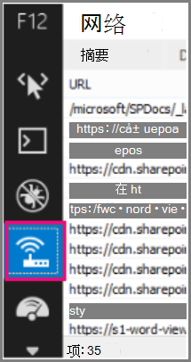
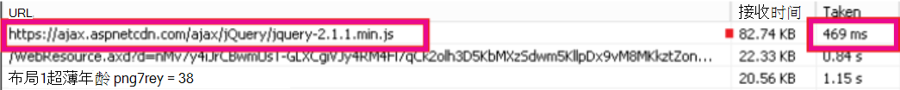

# <a name="content-delivery-networks-cdns"></a>内容分发网络 (CDN)

*此文章适用于 Microsoft 365 企业版和 Office 365 企业版。* 

CDN 有助于使最终用户Office 365且可靠。 云服务（Office 365 CDN）使用与浏览器更近的静态资产进行缓存，以加快下载速度并减少感知的最终用户延迟。 本主题中的信息将帮助你了解内容交付网络 (CDN) 以及这些网络Office 365。

## <a name="what-exactly-is-a-cdn"></a>具体什么是CDN？

一CDN是地理上分布的网络，由数据中心中的代理服务器和文件服务器组成，这些服务器由高速主干网络连接。 CDN 用于减少网站或服务中一组指定文件和对象的延迟和加载时间。 一CDN数千个终结点，用于为来自任何位置的传入请求提供最佳服务。

CDN 通常用于为网站或服务（如 Javascript 文件、图标和图像）提供快速的通用内容下载，还可以提供对用户内容（如 SharePoint Online 文档库中的文件、流式媒体文件和自定义代码）的私有访问。

CDN 由大多数企业云服务使用。 云服务Office 365数百万客户下载混合的专有内容 (如电子邮件) 和常规内容 (如图标) 一次。 将每个人都使用的图像（如图标）尽可能靠近用户计算机会更有效。 每个云服务构建一个 CDN 数据中心并不可行，这些数据中心将此类通用内容存储在每个都市区，甚至全球每个主要 Internet 中心，因此其中一些 CDN 是共享的。

## <a name="how-do-cdns-make-services-work-faster"></a>CDN 如何使服务更快地工作？

一次又一次地下载常见对象（如网站图像和图标）可能会占用网络带宽，网络带宽可以更好地用于下载重要的个人内容，如电子邮件或文档。 由于Office 365使用包含 CDN 的体系结构，因此可以从距离客户端计算机更近的服务器下载图标、脚本和其他常规内容，从而加快下载速度。 这意味着可以更快地访问个人内容，这些内容可安全Office 365数据中心。

CDN 通过多种方式帮助提高云服务性能：

- CDN 将部分网络和文件下载负担从云服务中转移，通过减少为静态资产请求提供服务的需求，释放云服务资源，从而提供用户内容和其他服务。
- CDN 旨在通过实现高性能网络和文件服务器，以及利用更新的网络协议（如 [HTTP/2）](https://en.wikipedia.org/wiki/HTTP/2) 和高效压缩和请求多路复用来提供低延迟文件访问。
- CDN网络使用许多全局分布式终结点，尽可能向用户提供内容。

## <a name="the-office-365-cdn"></a>The Office 365 CDN

内置 Office 365 内容分发网络 (CDN) 允许 Office 365 管理员通过缓存距离请求它们的浏览器更近的静态资产，为组织的 SharePoint Online 页面提供更好的性能，这有助于加快下载速度并降低延迟。 该Office 365 CDN[使用 HTTP/2](https://en.wikipedia.org/wiki/HTTP/2)协议来提高压缩和下载速度。

> [!NOTE]
> 此Office 365 CDN仅适用于全球生产 (云中的) 租户。  美国政府、中国德国云中的租户当前不支持Office 365 CDN。

Office 365 CDN 由多个 CDN 组成，用户可以在多个位置（即 _源_）托管静态资产，并从全局高速网络提供这些资产。 可以添加 **公共** 源、**私有** 源或同时添加这两种源，具体取决于想要托管在 Office 365 CDN 中的内容种类。


Office 365 内的 **公共** 源中的内容可供匿名访问，并且任何具有托管资产 URL 的人员均可访问它。 由于对公用源中内容的访问是匿名的，因此只应使用它们来缓存非敏感的常规内容，如 Javascript 文件、脚本、图标和图像。 默认情况下，使用 Office 365 CDN 下载常规资源资产（如公共源中的 Office 365 客户端应用程序）。

**应用程序** 内的专用源Office 365 CDN用户内容（如 SharePoint Online 文档库、网站和专有图像）的专用访问权限。 使用动态生成的令牌保护为私有源中内容的访问提供保护，以便只有有权访问原始文档库或存储位置的用户才能访问它。 Office 365 CDN 中的私有源只能用于 SharePoint Online 内容，并且用户只能通过 SharePoint Online 租户重定向访问资产。

Office 365 CDN 服务被归入 SharePoint Online 订阅。

有关如何使用 web 内容传递Office 365 CDN，请参阅使用 Office 365 [Online SharePoint网络](use-microsoft-365-cdn-with-spo.md)。

若要观看一系列简短视频，这些视频提供有关使用 Office 365 CDN 的概念和 HOWTO 信息，请访问 SharePoint 开发人员模式和做法[YouTube 频道](https://aka.ms/sppnp-videos)。

## <a name="other-microsoft-cdns"></a>其他 Microsoft CDN

虽然不是 Office 365 CDN 的一部分，但您可以在 Office 365 租户中使用这些 CDN 来访问 SharePoint 开发库、自定义代码和超出 Office 365 CDN 范围的其他用途。

### <a name="azure-cdn"></a>Azure CDN

>[!NOTE]
>从 2020 年第 3 SharePoint季度开始，SharePoint Online 将开始在 Azure CDN 上缓存视频，以支持改进的视频播放和可靠性。 热门视频将流式传输CDN距离用户最近的终结点。 此数据将保留在合规性Microsoft 365内。 这是所有租户的免费服务，不需要任何客户操作进行配置。

可以使用 **Azure CDN** 来部署自己的 CDN 实例，以托管自定义 Web 部件、库和其他资源资产，从而可以将访问键应用到 CDN 存储，并更好地控制 CDN 配置。 使用 Azure CDN不是免费的，并且需要 Azure 订阅。

若要详细了解如何配置 azure 存储Azure CDN，请参阅[快速入门：将 Azure](/azure/cdn/cdn-create-a-storage-account-with-cdn)存储帐户与 Azure CDN 集成。

有关如何使用 Azure CDN 托管 SharePoint Web 部件的示例，请参阅将[SharePoint 客户端 Web](/sharepoint/dev/spfx/web-parts/get-started/deploy-web-part-to-cdn)部件部署到 Azure CDN 。

有关 PowerShell Azure CDN的信息，请参阅使用[PowerShell Azure CDN管理 PowerShell。](/azure/cdn/cdn-manage-powershell)

### <a name="microsoft-ajax-cdn"></a>Microsoft Ajax CDN

Microsoft **的 Ajax CDN** 是只读 CDN，提供许多热门开发库，包括 jQuery (及其所有其他库) 、ASP.NET Ajax、Bootstrap、Knockout.js 和其他库。
  
若要在项目中包括这些脚本，只需将对这些公开可用的库的任何引用替换为对 CDN 地址的引用，而不是将其包括在项目本身中。 例如，使用以下代码链接到 jQuery：

``` html
<script src=https://ajax.aspnetcdn.com/ajax/jquery-2.1.1.js> </script>
```

有关如何使用 Microsoft Ajax CDN，请参阅[Microsoft Ajax CDN。](/aspnet/ajax/cdn/overview)

## <a name="how-does-office-365-use-content-from-a-cdn"></a>如何使用Office 365内容 CDN？

无论你为CDN配置了哪些Office 365，基本数据检索过程都是相同的。

1. 客户端 (浏览器或Office应用程序) 请求来自Office 365。

2. Office 365将数据直接返回到客户端，或者，如果数据是 CDN 托管的一组内容的一部分，则将您的客户端重定向到 CDN URL。

    a. 如果数据已缓存在公用源中，则客户端会直接从最近的CDN位置下载到客户端。

    b. 如果数据已缓存在专用源中，CDN服务将检查Office 365用户帐户对源的权限。  如果您具有权限，SharePoint Online 将动态生成由 CDN 中的资产路径和两个访问令牌组成的自定义 URL，并返回客户端的自定义 URL。 然后，客户端使用自定义 URL 将数据直接从最近的CDN位置下载到客户端。

3. 如果数据未缓存在 CDN，CDN 节点会从 Office 365 请求数据，然后在客户端下载数据后缓存一段时间的数据。

该CDN可找出距离用户浏览器最近的数据中心，然后使用重定向从该数据中心下载请求的数据。 CDN重定向速度很快，并且可以节省大量下载时间。

## <a name="how-should-i-set-up-my-network-so-that-cdns-work-best-with-office-365"></a>如何设置我的网络，以便 CDN 最符合Office 365？

最大程度地减少网络中客户端与CDN之间的延迟是确保最佳性能的关键考虑因素。 您可以使用管理[Office 365](managing-office-365-endpoints.md)终结点中概述的最佳实践，以确保网络配置允许客户端浏览器直接访问 CDN，而不是通过中央代理路由 CDN 流量，以避免引入不必要的延迟。

还可以阅读网络连接[Office 365，](./microsoft-365-network-connectivity-principles.md)了解优化网络性能Office 365的概念。

## <a name="is-there-a-list-of-all-the-cdns-that-office-365-uses"></a>是否有由用户使用的所有 CDN Office 365？

用户使用的 CDN Office 365随时更改，并且在许多情况下，如果一个 cdn 不可用，CDN配置多个 CDN。 这些组使用的主要 CDN Office 365为：

|CDN  |Company  |用法  |链接  |
|---------|---------|---------|---------|
|Office 365 CDN     |Microsoft Azure         |公共源中的常规资产，SharePoint源中的用户内容         |[Microsoft Azure CDN](https://azure.microsoft.com/documentation/services/cdn/)         |
|Azure CDN     |Microsoft         |自定义代码、SharePoint 框架解决方案         |[Microsoft Azure CDN](https://azure.microsoft.com/documentation/services/cdn/)         |
|Microsoft Ajax CDN (只读)      |Microsoft         |Ajax、jQuery、ASP.NET、Bootstrap、Knockout.js库。         |[Microsoft Ajax CDN](/aspnet/ajax/cdn/overview)         |

## <a name="what-performance-gains-does-a-cdn-provide"></a>性能提升在哪些CDN？

在衡量直接从 Office 365 下载的数据与从特定 CDN 下载的数据（例如，相对于租户和最近的 CDN 终结点的位置、CDN 所服务的页面上的资产数量以及网络延迟和带宽的暂时变化）之间，在性能上存在很多因素。 但是，简单的 A/B 测试有助于显示特定文件的下载时间差异。

以下屏幕截图演示了 Office 365 中的本机文件位置与[Microsoft Ajax](/aspnet/ajax/cdn/overview)内容分发网络 上托管的相同文件之间的下载速度差异。 这些屏幕截图来自 Internet Explorer  11 开发人员工具中的"网络"选项卡。 这些屏幕截图显示了热门库 jQuery 上的延迟。 若要显示此屏幕，请在Internet Explorer按 **F12** 并选择"网络"选项卡，该选项卡上标有Wi-Fi图标。
  

  
此屏幕截图显示上载到 SharePoint Online 网站本身的母版页样式库。 上载库所花时间是 1.51 秒。
  

  
第二个屏幕截图显示了 Microsoft CDN。 这一次延迟约为 496 毫秒。 这是一项较大的改进，表明下载对象的总时间将持续一秒钟。
  


## <a name="is-my-data-safe"></a>我的数据是否安全？

我们非常小心保护运行你的业务的数据。 存储在 Office 365 CDN 的数据在传输中和在其余位置都进行加密，并且对 Office 365 SharePoint CDN 中数据的访问受 Office 365 用户权限和令牌授权保护。 必须提交对 Office 365 SharePoint CDN 数据的请求 (从) 租户Office 365重定向，否则不会生成授权令牌。

为了确保数据保持安全，建议不要将用户内容或其他敏感数据存储在公共CDN。 由于对公共网站中数据CDN匿名访问，因此公共 CDN 只能用于托管常规内容，如 Web 脚本文件、图标、图像和其他非敏感资产。

> [!NOTE]
> 第三CDN提供商的隐私和合规性标准可能与信任中心概述Office 365标准不同。 通过 CDN 服务缓存的数据可能不符合 Microsoft 数据处理条款 (DPT) ，并且可能超出 Office 365 信任中心合规性边界。

有关提供程序的隐私和数据保护的Office 365 CDN，请访问以下内容：  

- 在 Microsoft 信任Office 365了解有关[保护隐私和数据保护的信息](https://www.microsoft.com/trustcenter)
- 在 Akamai 隐私信任中心了解有关[Akamai](https://www.akamai.com/us/en/about/compliance/data-protection-at-akamai.jsp)隐私和数据保护的信息
- 在 Azure 信任中心了解有关 Azure 隐私和数据保护 [的信息](https://azure.microsoft.com/overview/trusted-cloud/)

## <a name="how-can-i-secure-my-network-with-all-these-3rd-party-services"></a>如何使用所有这些第三方服务保护网络？

利用一组广泛的合作伙伴服务，Office 365扩展并满足可用性要求，并增强使用 Office 365。 利用的第三方Office 365包括证书吊销列表;例如 crl.microsoft.com 或 sa.symcb.com CDN;例如 r3.res.outlook.com。 由 CDN 生成的每个 FQDN Office 365都是自定义 FQDN Office 365。 如果您根据请求发送到 FQDN Office 365您可以确保 CDN 提供程序控制该位置的 FQDN 和基础内容。
  
对于希望将发往 Microsoft 或 Office 365 数据中心的请求与发往第三方的请求隔离的客户，我们已编写有关管理 Office 365 终结点[的指导](https://support.office.com/article/99cab9d4-ef59-4207-9f2b-3728eb46bf9a)。

## <a name="is-there-a-list-of-all-the-fqdns-that-leverage-cdns"></a>是否有利用 CDN 的所有 FQ CDN 的列表？

FQDN 列表及其利用 CDN 如何随着时间的推移而更改。 请参阅我们发布的[Office 365 URL](./urls-and-ip-address-ranges.md)和 IP 地址范围页面，了解使用 CDN 的最新 FQN。

您还可以使用 Office 365 [IP 地址](microsoft-365-ip-web-service.md)和 URL Web 服务请求当前 URL Office 365格式设置为 CSV 或 JSON 的 IP 地址范围。

## <a name="can-i-use-my-own-cdn-and-cache-content-on-my-local-network"></a>能否使用我自己的CDN本地网络缓存内容？

我们一直在寻找新方法来支持我们的客户需求，并且目前正在探索缓存代理解决方案和其他本地部署解决方案CDN的使用。

尽管这不是 Office 365 CDN 的一部分，但您也可以使用 **Azure CDN** 托管自定义 Web 部件、库和其他资源资产，这允许您将访问键应用到 CDN 存储，并更好地控制 CDN 配置。 使用 Azure CDN不是免费的，并且需要 Azure 订阅。 若要详细了解如何配置 azure 存储Azure CDN，请参阅[快速入门：将 Azure](/azure/cdn/cdn-create-a-storage-account-with-cdn)存储帐户与 Azure CDN 集成。

## <a name="im-using-azure-expressroute-for-office-365-does-that-change-things"></a>我使用 Azure ExpressRoute 进行Office 365，这是否更改了一切？

[Azure ExpressRoute for Office 365](azure-expressroute.md)提供与与公共 internet 隔离的 Office 365 基础结构的专用连接。 这意味着客户端仍然需要通过非 ExpressRoute 连接进行连接，以连接到未明确包含在 ExpressRoute 支持的服务列表中的 CDN 和其他 Microsoft 基础结构。 若要详细了解如何路由特定流量，如发往 CDN 的请求，请参阅Office 365[网络流量管理。](routing-with-expressroute.md)

## <a name="can-i-use-cdns-with-sharepoint-server-on-premises"></a>能否将 CDN 与本地 SharePoint服务器一起使用？

使用 CDN 仅在 SharePoint Online 上下文中有意义，应避免使用 SharePoint Server。 这是因为，如果服务器位于本地或地理位置靠近，则地理位置的所有优势都不存在。 此外，如果与托管它的服务器存在网络连接，则无需 Internet 连接即可使用站点，因此无法检索CDN文件。 否则，如果CDN库和文件有可用且稳定的库，则应该使用资源库。
  
以下是可以用于返回的简短链接：[https://aka.ms/o365cdns]()
  
## <a name="see-also"></a>另请参阅

[Office 365 网络连接原则](./microsoft-365-network-connectivity-principles.md)

[评估 Office 365 网络连接](assessing-network-connectivity.md)

[管理 Office 365 终结点](managing-office-365-endpoints.md)

[Office 365 URL 和 IP 地址范围](./urls-and-ip-address-ranges.md)

[结合使用 Office 365 内容传送网络和 SharePoint Online](use-microsoft-365-cdn-with-spo.md)

[Microsoft 信任中心](https://www.microsoft.com/trustcenter)

[优化 Office 365 性能](tune-microsoft-365-performance.md)
