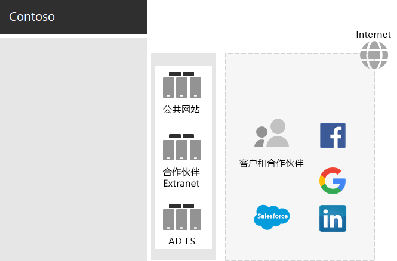
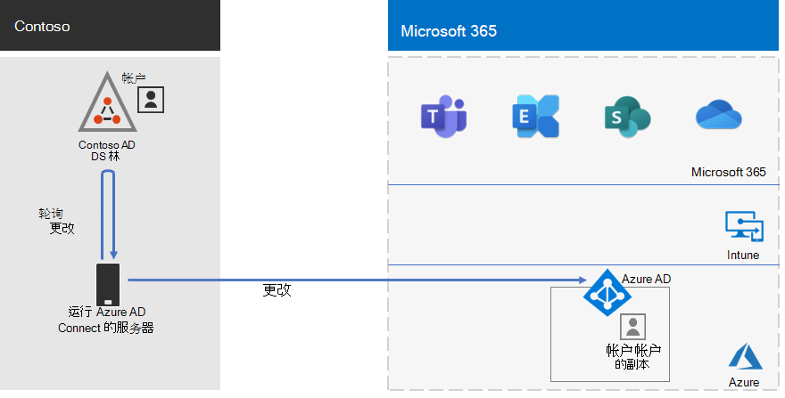
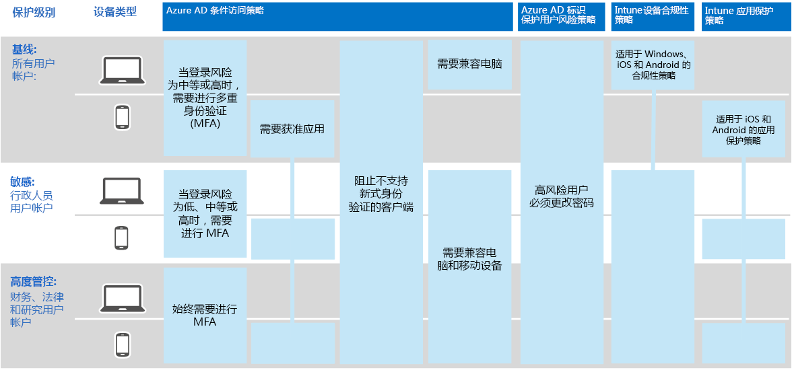

# Contoso Corporation 的标识

Microsoft 通过 Azure AD (跨云) 提供标识即服务Azure Active Directory (IDaaS) 。 若要Microsoft 365企业版，Contoso IDaaS 解决方案必须使用其本地标识提供程序，并包括具有其现有受信任的第三方标识提供程序的联合身份验证。

## Contoso Active Directory 域服务林

Contoso 将单个 Active Directory 域服务 (AD DS) 林用于具有七个子域的 contoso com，每个子域分别用于世界上的一 \. 个子域。 总部、区域中心办事处和分支办事处包含用于本地身份验证和授权的域控制器。

下面是 Contoso 林，其中包含包含区域中心的世界不同区域的区域域。

 
Contoso 决定使用 contoso com 林中的帐户和组来验证和授权其Microsoft 365 \. 工作负载和服务。

## Contoso 联合身份验证基础结构

Contoso 允许：

- 客户使用其 Microsoft、Facebook 或 Google Mail 帐户登录到公司的公共网站。
- 供应商和合作伙伴使用其 LinkedIn、Salesforce 或 Google Mail 帐户登录到公司的合作伙伴 Extranet。

下面是 Contoso DMZ，其中包含一个公共网站、一个合作伙伴 Extranet 和一组 Active Directory 联合身份验证服务 (AD FS) 服务器。 DMZ 连接到包含客户、合作伙伴和 Internet 服务的 Internet。

 
DMZ 中的 AD FS 服务器便于其标识提供程序验证客户凭据，以便访问公共网站，使用合作伙伴凭据访问合作伙伴 Extranet。

Contoso 决定保留此基础结构，并专用于客户和合作伙伴身份验证。 Contoso 标识架构师正在研究如何将此基础结构转换为 Azure AD [B2B](/azure/active-directory/b2b/hybrid-organizations) 和 [B2C](/azure/active-directory-b2c/solution-articles) 解决方案。

## 通过混合标识和密码哈希同步实现基于云的身份验证

Contoso 想要使用其本地 AD DS 林进行身份验证，以Microsoft 365云资源。 它决定在 PHS (密码哈希) 。

PHS 将本地 AD DS 林与 Microsoft 365 的 Azure AD 租户同步，用于企业订阅、复制用户和组帐户以及用户帐户密码的哈希版本。

为了执行目录同步，Contoso 在其巴黎数据中心的连接部署了 Azure AD 连接 工具。

下面是运行 Azure AD 的服务器，连接 Contoso AD DS 林中查看更改，然后将这些更改与 Azure AD 租户同步。

 
## 针对标识和设备访问的条件访问策略

Contoso 为以下三种保护级别创建了一组 Azure AD 和 Intune [条件访问策略](../security/office-365-security/identity-access-policies.md)：

- *基线* 保护适用于所有用户帐户。
- *敏感* 保护适用于高层领导和管理人员。
- *高度管控* 保护适用于金融、法律和研究部门中有权访问高度管控数据的特定用户。

下面是生成的 Contoso 标识和设备条件访问策略集。

 
## 后续步骤

了解 Contoso 如何使用其Microsoft Endpoint Configuration Manager基础结构[在整个组织中部署](contoso-win10.md)Windows 10 企业版保持最新状态。

## 另请参阅

[Microsoft 365 的识别指南](identity-roadmap-microsoft-365.md)

[Microsoft 365 企业版概述](microsoft-365-overview.md)

[测试实验室指南](m365-enterprise-test-lab-guides.md)