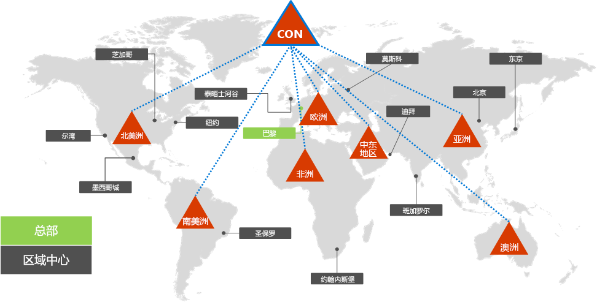
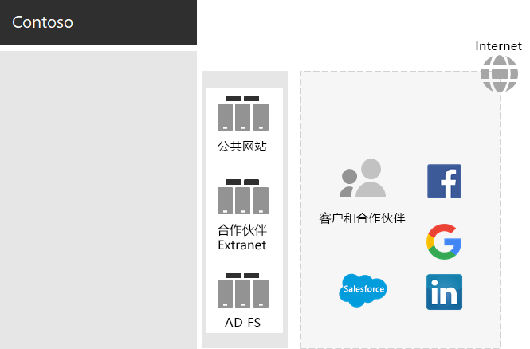
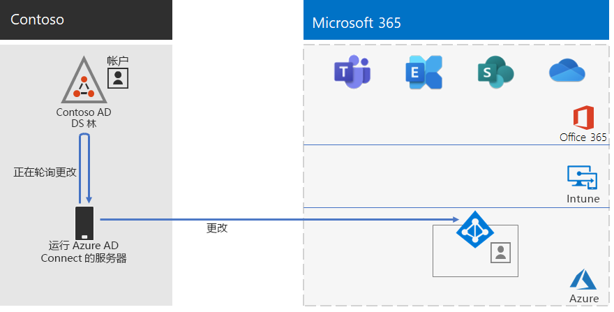
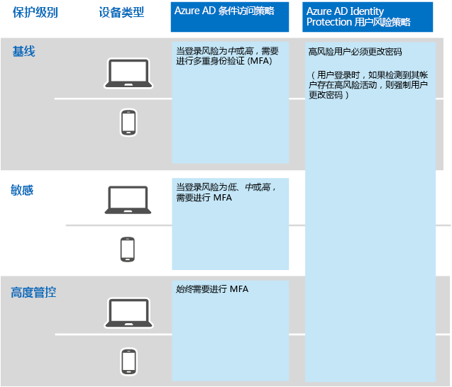

# Contoso Corporation 的标识

**摘要：** Contoso 如何利用标识即服务 (IDaaS)，并为其员工提供基于云的身份验证以及为其合作伙伴和客户提供联合身份验证。

Microsoft 通过 Azure Active Directory (Azure AD). 在其云产品中提供标识即服务 (IDaaS)。 若要采用 Microsoft 365 企业版，Contoso 的 IDaaS 解决方案必须利用其本地标识提供程序，并且仍包括其现有受信任的第三方标识提供程序提供的联合身份验证。

## Contoso 的 Active Directory 域服务林

Contoso 借助七个子域将单个 Active Directory 域服务 (AD DS) 林用于 contoso.com，每个域对应世界上的一个地区。 总部、区域中心办事处和分支办事处包含用于本地身份验证和授权的域控制器。

这是 Contoso 林和包含区域中心的全球各个区域的区域性域。

 
Contoso 想要在 contoso.com 林中使用帐户和组来对其 Microsoft 365 工作负载和服务进行身份验证和授权。

## Contoso 的联合身份验证基础结构

Contoso 允许：

- 客户使用 Microsoft、Facebook 或 Google Mail 帐户登录其公共网站。
- 供应商和合作伙伴使用他们的领英、Salesforce 或 Google Mail 帐户登录合作伙伴 Extranet。

这是包含一个公共网站、一个合作伙伴 Extranet 和一组 Active Directory 联合身份验证服务 (AD FS) 服务器的 Contoso DMZ。 DMZ 已连接至包含客户、合作伙伴和 Internet 服务的 Internet。

 
DMZ 中的 AD FS 服务器可加快由标识提供程序对客户凭据进行身份验证以访问公共网站，并对合作伙伴凭据进行身份验证以访问合作伙伴 Extranet。

Contoso 决定保留此基础结构，并将其专用于客户和合作伙伴的身份验证。 Contoso 标识架构师正在研究如何将此基础结构转换为 Azure AD [B2B](https://docs.microsoft.com/azure/active-directory/b2b/hybrid-organizations) 和 [B2C](https://docs.microsoft.com/azure/active-directory-b2c/solution-articles) 解决方案。

## 通过混合标识和密码哈希同步实现基于云的身份验证

Contoso 想要利用其本地 AD DS 林来进行针对 Microsoft 365 云资源的身份验证。 它决定密码哈希同步 (PHS)。

PHS 将本地 AD DS 林与 Microsoft 365 企业版订阅的 Azure AD 租户同步，同时复制用户和组帐户以及哈希版用户帐户密码。 

为了执行持续目录同步，Contoso 在其巴黎数据中心的服务器上部署了 Azure AD Connect 工具。 

这是运行 Azure AD Connect 的服务器，该服务器会轮询 Contoso AD DS 林来查找更改，然后将这些更改与 Azure AD 租户同步。

 
## 针对标识和设备访问的条件访问策略

Contoso 为以下三种保护级别创建了一组 Azure AD 和 Intune [条件访问策略](identity-access-policies.md)：

- **基准**保护适用于所有用户帐户
- **敏感**保护适用于高层领导和管理人员
- **高度管控**保护适用于具有高度管控数据访问权限的财务、法务和研究部门的特定用户

这是 Contoso 最终得到的一组标识和设备条件访问策略。

 
## 后续步骤

[了解](contoso-win10.md) Contoso 如何利用其 System Center Configuration Manager 基础结构在组织中部署 Windows 10 企业版并使之保持最新。

## 另请参阅

[Microsoft 365 企业版的标识](identity-infrastructure.md)

[部署指南](deploy-microsoft-365-enterprise.md)

[测试实验室指南](m365-enterprise-test-lab-guides.md)
