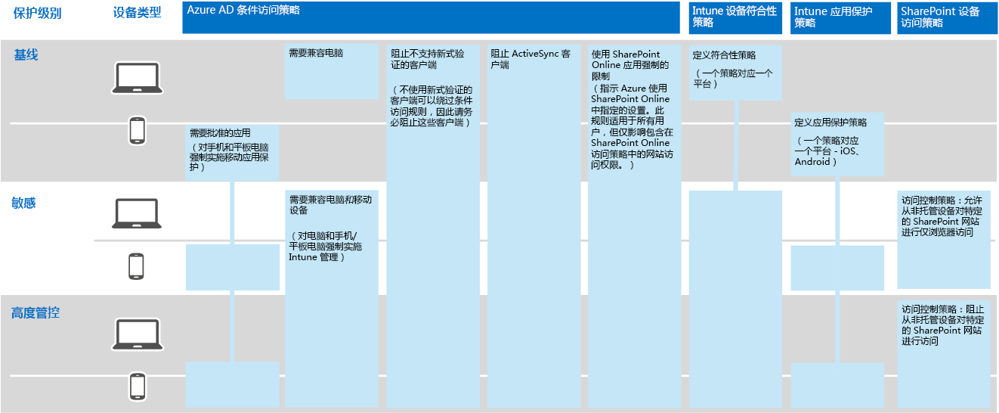

# Contoso Corporation 的信息保护

**摘要：** 了解 Contoso 如何使用 Microsoft 365 企业版中的信息保护功能来保护其在云中的数字资产。

Contoso 在信息安全和保护方面非常严谨。例如，在描述产品设计和专有制造技术时，其知识产权的泄露或破坏将使他们在竞争中处于劣势。

在将敏感和最有价值的数字资产转移到云之前，他们将确保本地信息分类和保护要求在 Microsoft 365 企业版基于云的服务中得到支持和实现。

## Contoso 的数据安全分类

Contoso 执行数据分析，并确定以下级别。

||||
|:-------|:-----|:-----|
| **1 级：基准** | **2 级：敏感** | **3 级：高度管控** |
| 数据已加密，并且仅供已通过身份验证的用户使用     向存储在本地和基于云的存储空间和工作负载（例如 Office 365）中的所有数据提供。驻留在服务中和在服务与客户端设备之间传输时，数据处于加密状态。    1 级数据的示例为正常的业务通信（电子邮件）和供管理、销售和支持工作人员使用的文件。 | 1 级再加上强身份验证和数据丢失防护：     强身份验证包括具有 SMS 验证的多重身份验证。数据丢失防护确保敏感或关键的信息不会在本地网络以外出现。
    2 级数据的示例包括财务和法律信息，以及新产品的研发数据。 | 2 级再加上最高级别的加密、身份验证和审核。      对静态和云中的数据采用最高级别的加密，遵循区域法规，并结合具有智能卡以及精细审核和警报的多重身份验证。     3 级数据的示例是客户和合作伙伴的个人身份信息、产品工程规范以及专有的制造技术。  |
||||

## Contoso 的信息策略
下表列出了 Contoso 的信息策略。

|||||
|:-------|:-----|:-----|:-----|
|  | **访问** | **数据保留** | **信息保护** |
| 1 级：业务价值较低（基准） | 允许所有人员访问  | 6 个月 | 使用加密 |
| 2 级：业务价值中等（敏感） | 允许 Contoso 员工、分包商和合作伙伴访问     使用多重身份验证 (MFA)、传输层安全性 (TLS) 和移动应用管理 (MAM) | 2 年  | 使用哈希值实现数据完整性  |
| 3 级：高业务价值（高度管控） | 允许工程设计和制造中的执行人员和潜在客户访问     仅限托管网络设备的权限管理系统 (RMS)  | 7 年  | 使用数字签名实现不可否认性  |
|||||

## 使用 Microsoft 365 企业版的 Contoso 信息保护路径

Contoso 使用以下步骤为 Microsoft 365 企业版准备其信息保护要求：

1. 标识要保护的信息

   Contoso 对其现有数字资产进行了广泛审查，这些资产位于本地 SharePoint 网站和文件共享中，并对每一个资产都进行了分类。

2. 确定数据级别的访问策略、保留策略和信息保护策略

   Contoso 基于数据级别确定了详细的策略要求，这些要求被用于保护现有数字资产，因为它们被转移到了云中。

3. 创建了 Azure 信息保护标签以及它们对不同级别信息的设置

   Contoso 修改了默认的 Azure 信息保护标签，其中的标题与它们的数据级别相匹配，并配置了“敏感”和“高度管控”标签，以通过 Azure 云密钥进行加密。他们为特定类型的商业机密数据创建了“高度管控”标签的子标签，并限制了他们对特定研发小组的访问。Contoso 还将 Azure 信息保护客户端部署到了所有 Windows 电脑和设备。

4. 为敏感和高度管控数据创建了受保护的 SharePoint Online 网站，同时包含锁定访问权限的权限

   敏感和高度管控网站均配置为[独立网站](https://docs.microsoft.com/office365/enterprise/isolated-sharepoint-online-team-sites)，其中默认的 SharePoint Online 团队网站权限自定义到 Azure AD 组。敏感和高度管控的 SharePoint Online 网站也配置了默认 Office 365标签。高度管控的 SharePoint Online 网站中存储的文件受作用域内策略的 Azure 信息保护 (AIP) 子标签的保护。有关详细信息，请参阅[针对高度管控数据的 Microsoft Teams 和 SharePoint Online 网站](teams-sharepoint-online-sites-highly-regulated-data.md)方案。

5.  将数据从本地 SharePoint 网站和文件共享转移到新的 SharePoint Online 网站

    迁移到新的 SharePoint Online 网站的文件继承了分配给该网站的默认 Office 365 标签。

6.  培训员工如何在新文档中使用 Azure 信息保护标签，如何在创建新的 SharePoint Online 网站时与 Contoso IT 进行交互，以及如何始终在 SharePoint Online 网站上存储数字资产。

    Contoso IT 和管理被视为云信息保护过渡中最困难的部分，需要改变组织员工的不良信息存储习惯，以始终标记其数字资产，绝不使用本地文件共享。

## 用于信息保护的条件访问策略

与身份标识和移动设备管理基础结构结合使用，并作为他们推出 Exchange Online 和 SharePoint Online 的一部分，Contoso 配置了以下一组条件访问策略，并将其应用到相应的 Azure AD 组：

- [设备策略上的托管和非托管应用程序访问](identity-access-policies.md)
- [Exchange Online 访问策略](secure-email-recommended-policies.md)
- [SharePoint Online 访问策略](sharepoint-file-access-policies.md)

图 1 显示 Contoso 信息保护策略的结果集。

**图 1：设备、Exchange Online 和 SharePoint Online 的条件访问策略**
 
>[!Note]
>此外，Contoso 还配置了其他条件访问策略用于标识和登录。请参阅 [Contoso Corporation 的标识](contoso-identity.md)。
>

这些策略确保：

- 应用保护政策定义哪些应用程序是允许的，以及它们可以使用组织数据执行哪些操作。
- 电脑和移动设备必须兼容。
- Exchange Online 使用 Exchange Online 的 Office 365 邮件加密。
- SharePoint Online 使用应用强制的限制。
- SharePoint Online 使用访问控制策略进行仅浏览器访问并阻止非托管设备的访问。

## 将 Microsoft 365 企业版功能映射到 Contoso 的数据级别

下表显示 Contoso 的数据级别在 Microsoft 365 企业版信息保护功能中的映射。

|||||
|:-------|:-----|:-----|:-----|
| | **Office 365** | **Windows 10 和 Office 365 专业增强版** | **EMS** |
| 1 级：基准  | SharePoint Online 和 Exchange Online 条件访问策略   SharePoint Online 网站的权限 | Azure 信息保护客户端   BitLocker   Windows 信息保护 | 设备条件访问策略和移动应用管理策略 |
| 2 级：高度敏感 | 1 级：基准再加上：     Azure 信息保护标签   SharePoint Online 网站上的 Office 365 标签   用于 SharePoint Online 和 Exchange Online 的 Office 365 数据丢失防护   独立 SharePoint Online 网站  | 1 级：基准再加上：     数字资产上的 Azure 信息保护标签   Office 365 高级数据管理 | 1 级：基准 |
| 3 级：高度管控 | 2 级：高度敏感再加上：    针对商业机密信息的自带密钥 (BYOK) 加密和保护   将 Azure Key Vault 用于与 Office 365 服务交互的业务线应用程序 | 2 级：高度敏感 | 1 级：基准 |
|||||

## 后续步骤

[请参阅](contoso-security-summary.md) Contoso 如何使用安全功能跨 Microsoft 365 企业版实现身份识别和访问管理、威胁防护、信息保护以及安全管理。

## 另请参阅

[Microsoft 365 企业版信息保护](infoprotect-infrastructure.md)

[部署指南](deploy-microsoft-365-enterprise.md)

[测试实验室指南](m365-enterprise-test-lab-guides.md)

