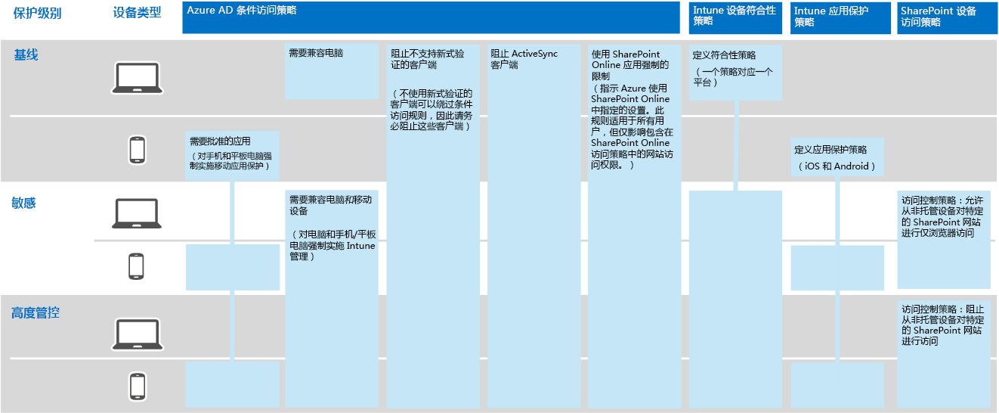
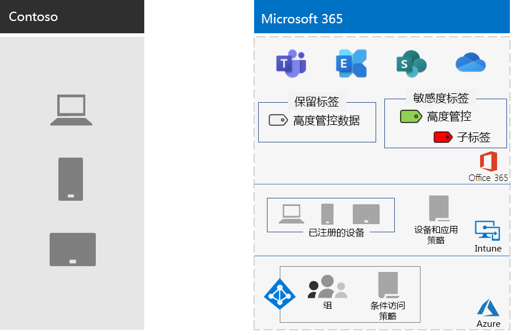

# Contoso Corporation 的信息保护Information protection for the Contoso Corporation

Contoso 非常关心其信息安全。Contoso is serious about their information security. 泄露或销毁描述其产品开发和专有制造技术的知识产权将使它们处于竞争劣势。Leakage or destruction of intellectual property that describes their product designs and proprietary manufacturing techniques would place them at a competitive disadvantage.

在将敏感的数字资产迁移到云之前，Contoso 已确保本地信息分类和保护要求受 Microsoft 365 企业版基于云的服务支持。Before moving their sensitive digital assets to the cloud, Contoso made sure that their on-premises information classification and protection requirements were supported by the cloud-based services of Microsoft 365 for enterprise.

## Contoso 数据安全分类Contoso data security classification

Contoso 对数据进行了分析，并确定了以下分类级别。Contoso performed an analysis of their data and determined the following classification levels.

| 1 级：基准Level 1: Baseline | 2 级：敏感Level 2: Sensitive | 3 级：高度管控Level 3: Highly regulated |
|:-------|:-----|:-----|
| 数据已加密，并且仅供已通过身份验证的用户使用。Data is encrypted and available only to authenticated users.    为本地和基于云的存储和工作负载中存储的所有数据提供。Provided for all data stored on-premises and in cloud-based storage and workloads. 数据驻留在服务中以及服务与客户端设备之间传输时加密。Data is encrypted while it resides in the service and in transit between the service and client devices.   1 级数据的示例为正常的业务通信（电子邮件）和供管理、销售和支持工作人员使用的文件。Examples of Level 1 data are normal business communications (email) and files for administrative, sales, and support workers. | 1 级再加上强身份验证和数据丢失防护。Level 1 plus strong authentication and data loss protection.    强身份验证包括 Azure AD 多重 (身份验证) MFA 短信验证。Strong authentication includes Azure AD Multi-Factor Authentication (MFA) with SMS validation. 数据丢失防护可确保敏感或关键信息不会在 Microsoft 云外部传输。Data loss prevention ensures that sensitive or critical information doesn't travel outside the Microsoft cloud.  2 级数据的示例包括财务和法律信息，以及新产品的研发数据。Examples of Level 2 data are financial and legal information and research and development data for new products. | 2 级再加上最高级别的加密、身份验证和审核。Level 2 plus the highest levels of encryption, authentication, and auditing.  对静态和云中的数据采用最高级别的加密，遵循区域法规，并结合具有智能卡以及精细审核和警报的 MFA。The highest levels of encryption for data at rest and in the cloud, compliant with regional regulations, combined with MFA with smart cards and granular auditing and alerting.   级别 3 数据的示例包括客户和合作伙伴个人信息、产品工程规范和专有制造技术。Examples of Level 3 data are customer and partner personal information, product engineering specifications, and proprietary manufacturing techniques.  |
||||

## Contoso 信息策略Contoso information policies
下表列出了 Contoso 信息策略。The following table lists the Contoso information policies.

| 值Value | AccessAccess | 数据保留Data retention | 信息保护Information protection |
|:-------|:-----|:-----|:-----|
| 业务价值较低（1 级：基准）Low business value (Level 1: Baseline) | 允许访问全部。Allow access to all.  | 6 个月6 months | 使用加密。Use encryption. |
| 业务价值中等（2 级：敏感）Medium business value (Level 2: Sensitive) | 允许 Contoso 员工、分包商和合作伙伴访问。Allow access to Contoso employees, subcontractors, and partners.    使用 MFA、传输层安全性 (TLS) 和移动应用管理 (MAM)。Use MFA, Transport Layer Security (TLS), and Mobile Application Management (MAM). | 2 年2 years  | 使用哈希值实现数据完整性。Use hash values for data integrity.  |
| 高业务价值（3 级：高度管控）High business value (Level 3: Highly regulated) | 允许工程设计和制造中的执行人员和潜在客户访问。Allow access to executives and leads in engineering and manufacturing.     仅限托管网络设备的权限管理系统 (RMS)。Rights Management System (RMS) with managed network devices only.  | 7 年7 years  | 使用数字签名实现不可否认性。Use digital signatures for non-repudiation.  |
|||||

## Contoso 信息保护与企业Microsoft 365路径The Contoso path to information protection with Microsoft 365 for enterprise

Contoso 按照以下步骤为企业Microsoft 365信息保护要求做好准备：Contoso followed these steps to prepare Microsoft 365 for enterprise for their information-protection requirements:

1. 确定要保护的信息Identify what information to protect

   Contoso 对位于本地网站和文件共享中的现有数字SharePoint进行了广泛审查，并分类了每个资产。Contoso did an extensive review of their existing digital assets located on on-premises SharePoint sites and file shares and classified each asset.

2. 确定数据级别的访问、保留和信息保护策略Determine access, retention, and information protection policies for data levels

   Contoso 基于数据级别确定了详细的策略要求，这些要求被用于保护现有数字资产，因为它们被转移到了云中。Based on the data levels, Contoso determined detailed policy requirements, which were used to protect existing digital assets as they were moved to the cloud.

3. 为不同级别的信息创建敏感度标签及其设置Create sensitivity labels and their settings for the different levels of information

   Contoso 为其数据级别创建了敏感度标签，其中包含加密、权限和水印等高度管控标签。Contoso created sensitivity labels for their data levels, with their highly regulated label that includes encryption, permissions, and watermarks.

4.  将数据从本地部署SharePoint网站和文件共享移动到其新的SharePoint网站Move data from on-premises SharePoint sites and file shares to their new SharePoint sites

    迁移到新的 SharePoint 网站的文件继承了分配给该网站的默认保留标签。The files migrated to the new SharePoint sites inherited the default retention labels assigned to the site.

5.  培训员工如何对新文档使用敏感度标签、如何在创建新的 SharePoint 网站时与 Contoso IT 进行交互，以及始终在 SharePoint 网站上存储数字资产Train employees how to use sensitivity labels for new documents, how to interact with Contoso IT when creating new SharePoint sites, and to always store digital assets on SharePoint sites

    改变不良的工作人员信息存储习惯通常被视为云信息保护转换中最困难的部分。Changing bad worker information-storage habits is often considered the hardest part of the information protection transition for the cloud. Contoso IT 和管理需要让员工始终在云中标记和存储其数字资产，避免使用本地文件共享，并且不使用第三方云存储服务或 USB 驱动器。Contoso IT and management needed to get employees to always label and store their digital assets in the cloud, refrain from using on-premises file shares, and not use third-party cloud storage services or USB drives.

## 用于信息保护的条件访问策略Conditional Access policies for information protection

作为推出 Exchange Online 和 SharePoint 的一SharePoint，Contoso 配置了以下一组条件访问策略，并应用于相应的组：As part of their rollout of Exchange Online and SharePoint, Contoso configured the following set of Conditional Access policies and applied them to the appropriate groups:

- [设备策略上的托管和非托管应用程序访问Managed and unmanaged application access on devices policies](../security/defender-365-security/identity-access-policies.md)
- [Exchange Online 访问策略Exchange Online access policies](../security/defender-365-security/secure-email-recommended-policies.md)
- [SharePoint 访问策略SharePoint access policies](../security/defender-365-security/sharepoint-file-access-policies.md)

下面是一组 Contoso 信息保护策略。Here's resulting set of Contoso policies for information protection.

>[!Note]
>此外，Contoso 还配置了针对标识和登录的其他条件访问策略。Contoso also configured additional Conditional Access policies for identity and sign-in. 请参阅 [Contoso Corporation 的标识](contoso-identity.md#conditional-access-policies-for-identity-and-device-access)。See [Identity for the Contoso Corporation](contoso-identity.md#conditional-access-policies-for-identity-and-device-access).
>

这些策略确保：These policies ensure that:

- 允许的应用以及它们可以对组织数据采取的操作由应用保护策略定义。Apps that are allowed and the actions they can take with the organization's data are defined by app protection policies.
- 电脑和移动设备必须兼容。PCs and mobile devices must be compliant.
- Exchange Online) OME Office 365 OME (OME Exchange Online。Exchange Online uses Office 365 message encryption (OME) for Exchange Online.
- SharePoint应用强制执行的限制。SharePoint uses app-enforced restrictions.
- SharePoint 使用访问控制策略来实现非托管设备的仅浏览器访问或阻止其访问。SharePoint uses access control policies for browser-only access and to block access for unmanaged devices.

## 将Microsoft 365功能映射到 Contoso 数据级别Mapping Microsoft 365 for enterprise features to Contoso data levels

下表将 Contoso 数据级别映射到企业Microsoft 365信息保护功能。The following table maps Contoso data levels to information protection features in Microsoft 365 for enterprise.

| LevelLevel | Microsoft 365云服务Microsoft 365 cloud services | Windows 10 和 Microsoft 365 企业应用版Windows 10 and Microsoft 365 Apps for enterprise | 安全性和合规性Security and compliance |
|:-------|:-----|:-----|:-----|
| 1 级：基准Level 1: Baseline  | SharePoint 和 Exchange Online 条件访问策略SharePoint and Exchange Online Conditional Access policies   SharePoint 网站上的权限Permissions on SharePoint sites | 敏感度标签Sensitivity labels   BitLockerBitLocker   Windows 信息保护Windows Information Protection | 设备条件访问策略和移动应用管理策略Device Conditional Access policies and Mobile Application Management policies |
| 2 级：敏感Level 2: Sensitive | 1 级再加上：Level 1 plus:     敏感度标签Sensitivity labels   SharePoint 网站上的 Microsoft 365 保留标签Microsoft 365 retention labels on SharePoint sites   用于 SharePoint 和 Exchange Online 的数据丢失防护Data Loss Prevention for SharePoint and Exchange Online   独立 SharePoint 网站Isolated SharePoint sites  | 1 级再加上：Level 1 plus:     数字资产上的敏感度标签Sensitivity labels on digital assets  | 1 级Level 1 |
| 3 级：高度管控Level 3: Highly regulated | 2 级再加上：Level 2 plus:    将你自己的密钥 (BYOK) 加密和保护商业机密信息Bring your own key (BYOK) encryption and protection for trade secret information   Azure Key Vault，用于与服务交互的业务线Microsoft 365应用程序Azure Key Vault for line-of-business applications that interact with Microsoft 365 services | 2 级Level 2 | 1 级Level 1 |
|||||

下面是生成的 Contoso 信息保护配置。Here's the resulting Contoso information-protection configuration.

## 后续步骤Next step

了解 Contoso 如何使用跨企业Microsoft 365安全功能进行标识和访问管理、威胁防护、信息保护和安全管理。Learn how Contoso uses the [security features across Microsoft 365 for enterprise](contoso-security-summary.md) for identity and access management, threat protection, information protection, and security management.

## 另请参阅See also

[安全性路线图Security roadmap](../security/defender-365-security/security-roadmap.md)

[Microsoft 365 企业版概述Microsoft 365 for enterprise overview](microsoft-365-overview.md)

[测试实验室指南Test lab guides](m365-enterprise-test-lab-guides.md)