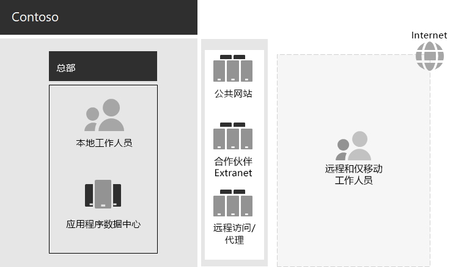

# Contoso IT 基础结构和业务需求

Contoso 正在从本地集中式 IT 基础结构过渡到包含云的安装程序，该设置包含基于云的个人工作效率工作负载和应用程序。

## 现有 Contoso IT 基础结构

Contoso 通过将应用程序数据中心置于巴黎总部，来使用最集中的本地 IT 基础结构。

下面是总部办事处，具有应用程序数据中心、DMZ 和 Internet。

本地应用程序数据中心主机： 

- 使用数据库和其他 Linux 数据库SQL Server业务线应用程序。
- 一组旧版 SharePoint server。
- 用于文件存储的组织级和工作组级服务器。

此外，每个区域中心办事处都支持一组服务器和一组类似的应用程序。 这些服务器受区域 IT 部门的控制。

这些独立的多地理数据中心的应用程序和数据上的可搜索性仍然是一个挑战。

在 Contoso 总部 DMZ 中，不同的服务器集提供：

- 托管 Contoso 公共网站，客户可以从该网站订购产品、部件、供应品和服务。
- 对 Contoso 合作伙伴 Extranet 的托管，用于合作伙伴的通信和协作。
- 巴黎总部的工作人员对 Contoso Intranet 和 Web 代理基于虚拟专用网 (VPN) 的远程访问。

## Contoso 业务需求

Contoso 业务需求分为五个主要类别：

**工作效率**

- 简化协作

  将基于电子邮件和文件共享的协作替换为允许实时更改文档、简化联机会议和捕获的对话线程的联机模型。
- 提高远程和移动工作者的工作效率

  由于许多员工在家工作或现场工作，因此请将瓶颈的 VPN 解决方案替换为对云中的 Contoso 数据和资源的性能访问权限。
- 提高创造力和革新能力

  利用最新的视觉学习和创意开发方法，包括墨迹书写和 3D 可视化。

**安全性**

- 标识和访问管理

  强制执行多重身份验证和其他形式的身份验证，并保护用户和管理员帐户凭据。

- 威胁防护

  防范外部安全威胁，包括电子邮件和基于操作系统的恶意软件。

- 信息保护

  锁定对高价值数字资产（如客户数据、设计和制造规范以及员工信息）的访问并加密。

- 安全管理

  监视安全状况，并实时检测和响应威胁。

**远程和移动访问及业务合作伙伴**

- 提高远程和移动工作人员的安全性

  实施自带设备 (BYOD) 和公司拥有的设备管理，以确保安全访问、正确的应用程序行为和公司数据保护。

- 减少员工远程访问基础结构

  通过将经常访问的资源移动到云中，减少维护和支持成本并提高远程访问解决方案的性能。

- 为 B2B 业务和 B2B 业务之间提供更好的连接 (开销) 开销

  使用使用联合身份验证的基于云的解决方案替换老化且成本高昂的合作伙伴 Extranet。

**合规性**

- 遵守区域法规要求

  确保遵守针对数据存储、加密、数据隐私和个人数据法规的行业和区域法规，如欧盟一般数据保护条例 (GDPR) 。

**管理**

- 减少在客户端电脑和设备上运行的管理软件的 IT 开销

  自动安装对 Windows 操作系统的更新Microsoft 365 企业应用版整个组织。

## 将 Contoso 业务需求映射到Microsoft 365企业

Contoso IT 部门在部署之前确定了以下Microsoft 365 E5功能所需的映射：

| 类别 | 业务需求 | Microsoft 365企业产品或功能 |
|:-------|:-----|:-----|
| 工作效率 |  |  |
|  | 简化协作 | Microsoft Teams、SharePoint、OneDrive |
|  | 提高远程和移动工作者的工作效率 | Microsoft 365 工作负载和基于云的数据 |
|  | 提高创造力和革新能力 | Windows Ink、Cortana at Work、PowerPoint |
| 安全性 |  |  |
|  | 标识和访问管理 | 使用 MFA 身份验证Azure AD MFA 身份验证 (专用全局) Azure AD Privileged Identity Management (PIM)    用于所有用户帐户的 MFA   条件访问   安全信息读取者   Windows Hello   Windows Credential Guard |
|  | 威胁防护 | 高级威胁分析   Windows Defender   Defender for Office 365   Microsoft Defender for Office 365   Microsoft 365威胁调查和响应   |
|  | 信息保护 | Azure 信息保护   数据丢失防护 (DLP)   Windows 信息保护 (WIP)   Microsoft Defender for Cloud Apps   Microsoft Intune |
|  | 安全管理 | Microsoft Defender for Cloud    Windows Defender 安全中心 |
| 远程和移动访问及业务合作伙伴 |  |  |
|  | 提高远程和移动工作者的安全性 | Microsoft Intune |
|  | 减少员工远程访问基础结构 | Microsoft 365 工作负载和基于云的数据 |
|  | 改进连接并降低 B2B 事务的开销 | 联合身份验证和基于云的资源 |
| 合规性 |  |  |
|  | 遵守区域法规要求 | MICROSOFT 365 中的 GDPR 功能 |
| 管理 |  |  |
|  | 减少安装客户端更新的 IT 开销 | Windows 10 企业版更新   Microsoft 365 企业应用版更新 |
||||

## 后续步骤

了解 Contoso [Corporation](contoso-networking.md)本地网络以及如何针对访问和延迟优化网络以Microsoft 365基于云的资源。

## 另请参阅

[Microsoft 365 企业版概述](microsoft-365-overview.md)

[测试实验室指南](m365-enterprise-test-lab-guides.md)
