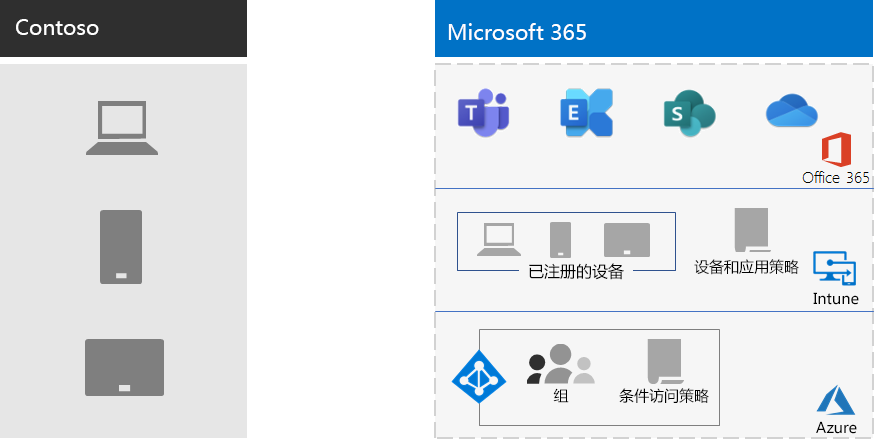

# Contoso 移动设备管理

Microsoft 365企业版包括 Intune 和一组支持移动设备和应用程序管理和安全性的 Azure 服务。

Contoso 有许多支持移动的员工。 一些办事处位于 Contoso 位置，有些则没有办公室。 Contoso 需要一种提高员工工作效率的方法，但需确保设备、存储在这些设备上的 Contoso 数据以及应用程序行为安全。

## 计划

Contoso 标识了以下适用于企业的移动设备管理的 Intune Microsoft 365用例：

- 保护Exchange Online和数据，以便移动设备可以安全地访问它。
- 为 Contoso 员工实施自带设备办公 (BYOD) 计划。
- 向 Contoso 员工发布组织拥有的电话和有限使用的共享平板电脑。

Contoso 不使用 Intune 来：

- 允许员工从非托管Microsoft 365安全访问服务。
- 保护本地电子邮件和数据，以便移动设备可以安全地访问它们，因为没有本地 Microsoft Exchange服务器。

## 部署

以下是 Contoso 设置其移动设备管理基础结构的方式：

- 将 Intune 设置为 MDM (mdm) ，并使用 Azure 上的 Intune 管理内容和管理设备
- 创建Azure Active Directory (Azure AD) 注册的设备组和 Intune 设置以及基于设备的条件访问策略

  有关详细信息，请参阅 [Contoso 条件访问策略](contoso-identity.md#conditional-access-policies-for-zero-trust-identity-and-device-access)。

- 启用 Apple 设备平台以支持员工使用 iPad、iMac 和 iPhone 以及公司拥有的 iPhone
- 创建了特定于 Contoso 的条款和条件策略，在移动设备上安装 Contoso 的公司门户时会看到这些策略
- 对于未注册的设备，实施了一组移动应用程序管理 (MAM) 策略，以要求身份验证以访问 Microsoft 365 服务
- 创建了强制实施以下内容的 Intune 策略：
  - 允许的应用。
  - 设备加密，有助于防止未经授权的访问。
  - 六位数的 PIN 或密码。
  - 不活动超时时段。
  - 防病毒和恶意软件保护以及签名更新Windows Defender设备上Windows 10更新。
  - 在包含Windows 10安全更新的设备上自动更新。
  - 将证书推送到托管设备。
  - 商业与个人数据的明确区分。用户或管理员可以选择性地擦除设备中的公司数据，而将图片、个人电子邮件帐户和个人文件等个人数据保持不变。

Contoso 通过将已部署的电脑和公司拥有的智能手机和平板电脑添加到相应的 Intune 设备组来注册它们。 他们还制定了 BYOD 计划，供员工注册其个人设备。 已注册的设备接收 Intune 策略，这导致设备及其应用程序受到管理和安全保护。 未注册的设备具有移动应用管理 (MAM) 指定允许的应用程序的策略。

下面是 Contoso 移动设备管理部署体系结构。

## 后续步骤

了解 Contoso 如何使用企业Microsoft 365信息保护功能来分类、标识和保护整个组织的关键数字资产。

## 另请参阅

[设备管理Microsoft 365](device-management-roadmap-microsoft-365.md)

[Microsoft 365 企业版概述](microsoft-365-overview.md)

[测试实验室指南](m365-enterprise-test-lab-guides.md)

