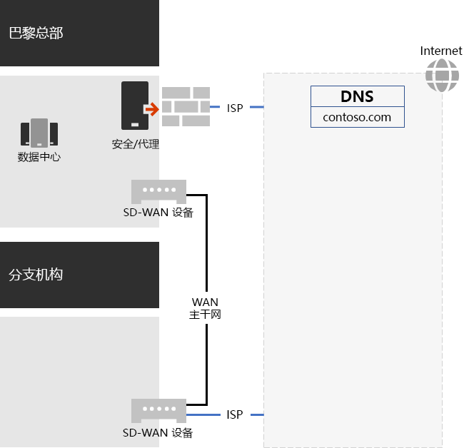
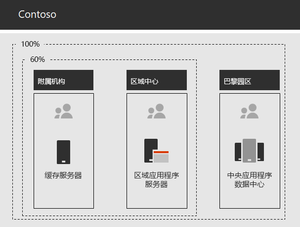

# Contoso Corporation 网络

为了采用包含云的基础结构，Contoso 对网络流量到云服务的传输方式进行根本转变。 它们将用户位置映射到本地 Internet 出口，将本地连接映射到 Internet 上最近的 Microsoft 365 网络位置，而不是侧重于网络连接和流量的内部中心分支模型。

## 网络基础结构

这些网络元素将全球的 Contoso 办事处链接在一起：

- 多协议标签交换 (MPLS) WAN 网络

  MPLS WAN 网络以分支和中心配置将巴黎总部连接到区域办事处，将区域办事处连接到分支办事处。 网络使用户能够访问内部部署服务器，这些服务器是巴黎总部的业务线应用程序。 它还将任何通用 Internet 流量路由到巴黎办事处，网络安全设备将清理请求。 在每个办公室内，路由器将流量路由到使用专用 IP 地址空间的子网上的有线主机或无线接入点。

- 本地直接 Internet 访问Microsoft 365流量

  每个办事处都有一个软件定义的 WAN (SD-WAN) 设备，该设备具有一个或多个本地 Internet ISP 网络线路，通过代理服务器有自己的 Internet 连接。 这通常实现为指向同时提供公共 IP 地址和本地 DNS 服务器的本地 ISP 的 WAN 链接。

- Internet 网站

  Contoso 拥有 contoso \. com 公共域名。 用于订购产品的 Contoso 公共网站是巴黎园区中连接 Internet 的数据中心中的一组服务器。 Contoso 在 Internet 上使用 /24 公用 IP 地址范围。

图 1 显示了 Contoso 网络基础结构及其与 Internet 的连接。

 
**图 1：Contoso 网络**

## 使用 SD-WAN 与 Microsoft 建立最佳网络连接

Contoso 遵循了 [Microsoft 365 网络连接原则](microsoft-365-network-connectivity-principles.md)：

- 标识并区分 Microsoft 365 网络流量
- 实现本地连接出口
- 避免网络发卡
- 绕过重复的网络安全设备

有三种类别的网络通信 *Microsoft 365："优化**"、"允许*"和"*默认"。* "优化"和"允许"流量是受信任的网络流量，这些流量在终结点上经过加密和安全保护，并发往Microsoft 365网络。

Contoso 决定：

- 对"优化"和"允许"类别流量使用直接 Internet 出口，将所有"默认"类别流量转发到巴黎的中央 Internet 连接。

- 在每个办公室部署 SD-WAN 设备是遵循这些原则并实现基于云的服务的最佳网络Microsoft 365一种简单方法。

  SD-WAN 设备具有一个用于本地办事处网络的 LAN 端口和多个 WAN 端口。 一个 WAN 端口连接到其 MPLS 网络。 另一个连接到本地 ISP 线路。 SD-WAN 设备通过 ISP 链接路由“优化”和“允许”类别的网络流量。

## Contoso 业务线应用基础结构

Contoso 针对以下内容构建了业务线应用程序和服务器 Intranet 基础结构：

- 附属办事处使用本地缓存服务器来存储经常访问的文档和内部网站。
- 地区中心对地区办事处和附属办事处使用地区应用程序服务器。这些服务器与巴黎总部的服务器同步。
- 巴黎园区数据中心包含为整个组织服务的集中式应用程序服务器。

图 2 显示通过 Contoso Intranet 访问服务器时所使用的网络流量容量百分比。

 
**图 2：内部应用程序的 Contoso 基础结构**

对于附属办事处或区域中心办事处，员工所需的 60% 的资源都可以由附属办事处和区域中心办事处服务器提供。 其他 40% 的资源请求必须通过 WAN 链接转到巴黎园区。

## 企业版网络分析和Microsoft 365准备

Contoso Microsoft 365企业服务的成功采用取决于与 Internet 或直接到 Microsoft 云服务的高度可用和高效连接。 Contoso 执行以下步骤来规划和实施与企业云服务Microsoft 365优化的连接：

1. 创建公司 WAN 网络图，帮助进行规划

   为了开始网络规划，Contoso 创建了一个图表，显示其办公室位置、现有网络连接、现有网络外围设备以及网络上托管的服务类别。 他们在规划和实现网络连接的每个后续步骤中都使用了此图。

2. 创建企业网络连接Microsoft 365规划

   Contoso 使用Microsoft 365[网络连接](microsoft-365-network-connectivity-principles.md)原则和示例参考网络体系结构，将 SD-WAN 标识为用于实现连接Microsoft 365拓扑。

3. 分析每个办事处的 Internet 连接利用率和 MPLS-WAN 带宽，并根据需要增加带宽

   分析每个办事处的当前使用情况，并增加线路，以便Microsoft 365流量的平均未使用容量为 20%。

4. 优化 Microsoft 网络服务的性能

   Contoso 确定了一组 Office 365、Intune 和 Azure 终结点，并配置了 Internet 路径中的防火墙、安全设备和其他系统以实现最佳性能。 "优化Office 365允许"类别流量的终结点已配置为 SD-WAN 设备，以便通过 ISP 电路进行路由。

5. 配置内部 DNS

   DNS 必须能正常运行，才能查找本地 Microsoft 365 流量。

6. 验证网络终结点和端口连接

   Contoso 运行了 Microsoft 网络连接测试工具，以验证企业云服务Microsoft 365连接性。

7. 优化员工计算机以建立网络连接

   检查了各个计算机以确保已安装最新的操作系统更新，并且终结点安全监视在所有客户端上处于活动状态。

## 后续步骤

了解 Contoso 如何利用云中的本地 [Active Directory 域](contoso-identity.md) 服务为员工和联合身份验证客户和业务合作伙伴。

## 另请参阅

[Microsoft 365](networking-roadmap-microsoft-365.md)

[Microsoft 365 企业版概述](microsoft-365-overview.md)

[测试实验室指南](m365-enterprise-test-lab-guides.md)
