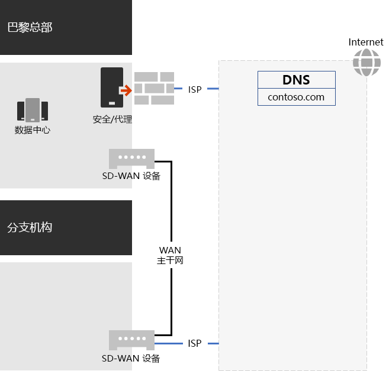
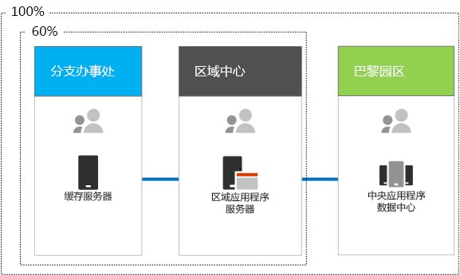

# Contoso Corporation 网络

**摘要：** 了解 Contoso 网络基础结构以及如何使用其 SD-WAN 技术为 Microsoft 365 企业版云服务提供最佳网络性能。

为了采用云包容性基础结构，Contoso 的网络工程师从根本上改变了网络流量流向云服务的方式。他们没有采用内部中心和辐射模型（专注于下一级 Contoso 办事处层次结构的网络连接和流量），而是尽力将用户位置映射到本地 Internet 出口，并将本地连接映射到 Internet 上的最近 Microsoft 365 网络位置。

## Contoso 网络基础结构

关联自己在世界各地办事处的 Contoso 网络包括以下要素：

- 多协议标签交换 (MPLS) WAN 网络

  在中心辐射型配置中，MPLS WAN 网络将巴黎总部连接到地区办事处，并将地区办事处连接到附属办事处。这样便于用户访问构成巴黎办事处业务线应用程序的本地服务器。它还会将任何通用 Internet 流量路由到网络安全设备会擦除请求的巴黎办事处。在每个办事处内，路由器将流量路由到子网上的有线主机或无线接入点（使用专用 IP 地址空间）。

- Microsoft 365 流量的本地直接 Internet 访问

  每个办事处都有内含一条或多条本地 Internet ISP 网络线路的软件定义 WAN (SD-WAN) 设备，可通过代理服务器自行连接 Internet。这通常实现为与本地 ISP 的 WAN 链接，本地 ISP 提供公共 IP 地址和本地 DNS 服务器。

- Internet 网站

  Contoso 拥有 contoso.com 公共域名。用于订购产品的 Contoso 公共网站是一组服务器，位于巴黎园区中连接到 Internet 的数据中心内。Contoso 在 Internet 上使用 /24 公用 IP 地址范围。

图 1 显示 Contoso 的网络基础结构及其 Internet 连接。

 
**图 1：Contoso 网络**

## 使用 SD-WAN 与 Microsoft 建立最佳网络连接

Contoso 遵循了 [Office 365 网络连接原则](https://docs.microsoft.com/office365/enterprise/office-365-network-connectivity-principles)：

1. 标识并区分 Office 365 网络流量
2. 实现本地连接出口
3. 避免网络发卡
4. 绕过重复的网络安全设备

Office 365 的网络流量分为三个类别：优化、允许和默认。 “优化”流量和“允许”流量是受信任的网络流量，其在终结点上加密并得到保护，并发送到 Microsoft 365 网络。

Contoso 决定：

- 对“优化”和“允许”类别流量使用直接 Internet 出口，并将所有“默认”类别流量转发到巴黎总部的中央 Internet 连接。

- 在每个办事处位置都部署 SD-WAN 设备，以轻松遵循这些原则，并实现 Microsoft 365 基于云的服务的最佳网络性能。

  SD-WAN 设备具有一个用于本地办事处网络的 LAN 端口和多个 WAN 端口。 一个 WAN 端口连接到其 MPLS 网络，另一个 WAN 端口连接到本地 ISP 线路。 SD-WAN 设备通过 ISP 链接路由“优化”和“允许”类别的网络流量。

## Contoso 业务线应用程序基础结构

Contoso 针对以下方案构建了业务线应用程序和服务器 Intranet 基础结构：

- 附属办事处使用本地缓存服务器来存储经常访问的文档和内部网站。
- 地区中心对地区办事处和附属办事处使用地区应用程序服务器。这些服务器与巴黎总部的服务器同步。
- 巴黎园区的数据中心包含为整个组织提供服务的集中式应用程序服务器。

图 2 展示了跨 Contoso Intranet 访问服务器时的网络流量百分比。

 
**图 2：Contoso 内部应用程序的基础结构**

对于分支办事处或区域中心办事处的用户，员工所需资源的 60% 可由分支办事处和区域中心办事处服务器提供。其他 40% 的资源请求则必须通过 WAN 链接到巴黎园区。

## Contoso 分析并准备网络以连接到 Microsoft 365 企业版

Contoso 用户能否成功采用 Microsoft 365 企业版服务，取决于与 Internet 或直接与 Microsoft 云服务建立高度可用的高性能连接。Contoso 采取了下面这些步骤，以计划并实现与 Microsoft 365 企业版云服务的优化连接：

1. 绘制了公司 WAN 网络图来协助计划

   Contoso 首先执行了网络计划，具体是绘制了显示办事处位置、现有网络连接、现有网络外围设备和网络上托管的各类服务的网络图。他们在计划和实现网络连接过程中的每个后续步骤都参考了此图。

2. 制定了 Microsoft 365 企业版网络连接计划

   Contoso 根据 [Office 365 网络连接原则](https://docs.microsoft.com/office365/enterprise/office-365-network-connectivity-principles)，提供了参考网络体系结构，将 SD-WAN 确定为 Office 365 连接的首选拓扑。

3. 分析了每个办事处的 Internet 连接利用率和 MPLS WAN 带宽，并根据需要增加了带宽

   Contoso 分析了每个办事处的当前使用情况，并增加了线路，以便预测 Microsoft 365 基于云的流量平均有 20% 未用容量。

4. 优化了 Microsoft 网络服务性能

   Contoso 确定了 Office 365、Intune 和 Azure 终结点的集合，并在 Internet 路径中配置了防火墙、安全设备和其他系统，以实现最佳性能。 Office 365“优化”和“允许”类别流量的终结点已配置到 SD-WAN 设备，以便通过 ISP 线路进行路由。

5. 配置了内部 DNS

   DNS 必须能正常运行，才能查找本地 Office 365 流量。

6. 验证了网络终结点和端口连接

   Contoso 运行了 Microsoft 提供的网络连接测试工具，以验证 Microsoft 365 企业版云服务的连接性。

7. 优化了员工计算机的网络连接

   Contoso 检查了个人计算机，以确保最新操作系统更新已安装，且终结点安全监视在所有客户端上都有效。

## 后续步骤

[了解](contoso-identity.md) Contoso 如何利用云中面向员工的本地 Active Directory 域服务 (AD DS)，以及如何利用面向客户和业务合作伙伴的联合身份验证。

## 另请参阅

[Microsoft 365 企业版网络](networking-infrastructure.md)

[部署指南](deploy-microsoft-365-enterprise.md)

[测试实验室指南](m365-enterprise-test-lab-guides.md)
